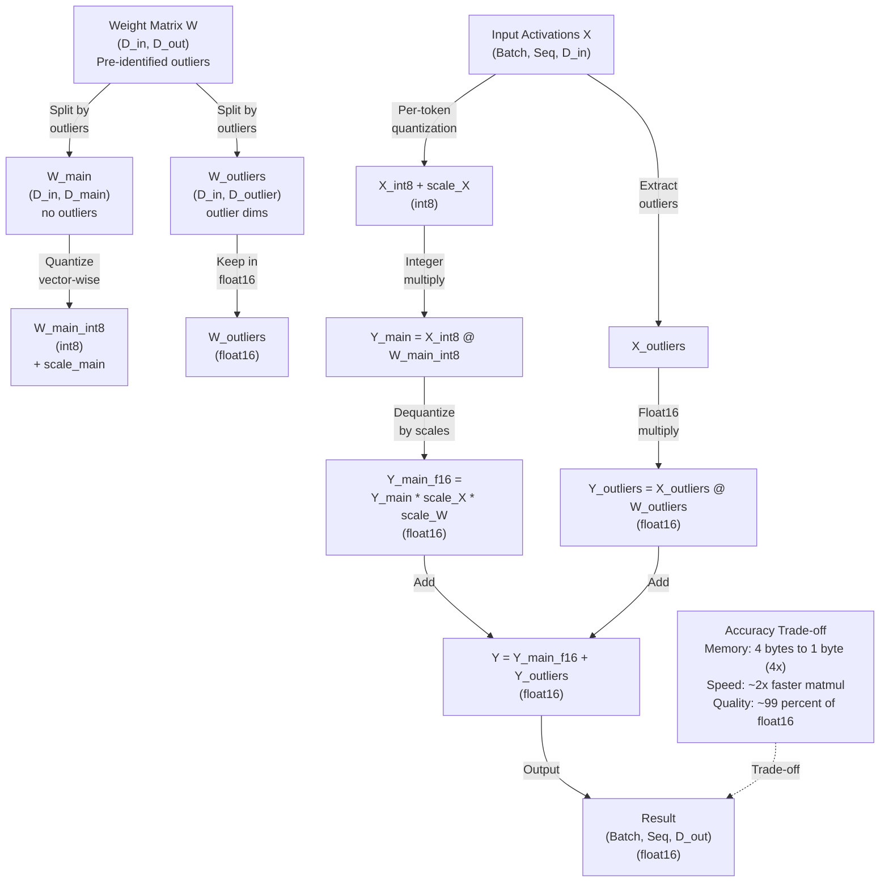

# LLM.int8(): 8-bit Matrix Multiplication for Transformers

## Paper Overview

**Title:** LLM.int8(): 8-bit Matrix Multiplication for Transformers at Scale

**Key Authors:** Tim Dettmers, Mike Lewis, Younes Belkada, Luke Zettlemoyer (University of Washington, Meta AI Research, 2022)

**Published:** ICLR 2023 | [arXiv](https://arxiv.org/abs/2110.02674)

**Impact:** Enabled running large language models on consumer-grade GPUs. LLM.int8() made it practical to run 30B-175B parameter models on a single A100 (40GB) or multiple RTX 4090s (24GB each) with minimal quality loss. Now standard in HuggingFace `transformers` via the `load_in_8bit=True` flag and is core to several open-source LLM frameworks (Llama.cpp, ollama, vLLM with quantization).

LLM.int8() addresses the fundamental constraint of modern LLM deployment: **large models don't fit in consumer GPU memory**. A 30B parameter model in float32 requires 120GB VRAM; even in float16 it needs 60GB. Only data center GPUs (A100, H100) can fit such models. LLM.int8() reduces this by **8x** through quantization: store weights and activations in 8-bit integers instead of 32/16-bit floats, then compute matrix multiplication with minimal precision loss.

The critical innovation: **outlier detection with mixed precision**. Naive int8 quantization (just clipping all weights to -128 to 127) loses significant accuracy because neural networks have extreme outliers--a few weights with very large magnitudes. LLM.int8() detects these outliers, keeps them in higher precision (float16), and quantizes the rest (8-bit), achieving both extreme compression and high accuracy.

**Why this matters for interviews:** Quantization is now essential knowledge for production ML engineers. LLM.int8() demonstrates the broader principle of **mixed-precision inference**—a fundamental trade-off between memory, speed, and accuracy. Understanding outlier-aware quantization, when to apply it, and its limitations is critical for building scalable LLM systems.

---

## Core Contribution

### The Model Size Bottleneck: Memory Explosion

**Model size growth outpaces GPU memory:**

| Model | Params | Float32 | Float16 | INT8 |
|-------|--------|---------|---------|------|
| GPT-2 | 1.5B | 6 GB | 3 GB | 1.5 GB |
| LLaMA | 7B | 28 GB | 14 GB | 7 GB |
| LLaMA | 13B | 52 GB | 26 GB | 13 GB |
| LLaMA | 30B | 120 GB | 60 GB | **30 GB** ✓ |
| LLaMA | 65B | 260 GB | 130 GB | 65 GB |
| Falcon | 40B | 160 GB | 80 GB | **40 GB** ✓ |
| GPT-3 | 175B | 700 GB | 350 GB | **175 GB** ✓ |

**Practical consequence:** Without quantization:
- 30B+ models: Data center GPUs only (A100, H100, $20k+)
- Consumer GPUs (RTX 4090, $1.5k): Limited to ~7B models
- Inference unaffordable at scale (cost-per-token multiplies with model size)

### The LLM.int8() Solution: Outlier-Aware Mixed Precision

**Key insight:** Most weights and activations are "normal" and quantize well, but a few extreme outliers (magnitude 100-1000x) compress poorly in int8.

**Strategy:**
```
1. Identify outliers: weights/activations > some threshold (e.g., 0.5% of values)
2. Split computation:
   - Main computation: 8-bit integers (fast, memory-efficient)
   - Outliers: float16 (preserves precision where it matters)
3. Mixed-precision matmul:
   - Quantize A_main to int8, B_main to int8 → compute → dequantize
   - Keep A_outlier in float16, B_outlier in float16 → compute
   - Combine results: output = result_main + result_outliers
```

**Result:** 8x memory reduction while maintaining 99%+ of float16 accuracy.

### Key Innovation: Vector-Wise Quantization and Outlier Routing

**Vector-wise quantization:** Different output channels have different dynamic ranges
- Naive: One scale factor for entire matrix → poor accuracy
- Smart: One scale factor per output dimension → better utilization
- Implementation: For weight matrix W of shape (D_in, D_out), use D_out scale factors

**Outlier detection:** Identify which columns of weight matrices (or rows of activation matrices) have outliers
- Threshold: Detect values > 3.5σ (standard deviations) as outliers
- Route: These columns/rows skip int8 quantization, use float16 instead
- Overhead: Minimal—only ~1-5% of values are outliers

**Asymmetric quantization:** Integers span [-128, 127] but most tensors aren't symmetric
- Dynamic quantization: Find actual min/max, map to full int8 range for better utilization
- Per-token quantization: Activations quantized per-token (each token has its own scale)

---

## Key Ideas & Algorithm

### How LLM.int8() Works: Step by Step

**Step 1: Identify Outlier Dimensions**

For each weight matrix W ∈ ℝ^(D_in × D_out):
```
For each output dimension d in [0, D_out):
  1. Compute mean μ_d and std σ_d of column d
  2. If max(|W_d|) > threshold (e.g., 3.5 * σ_d):
     Mark dimension d as "outlier column"
  3. Split W into:
     - W_main: columns without outliers
     - W_outliers: columns with outliers
```

**Step 2: Quantize Main Weights**

Quantize W_main to int8 using vector-wise scaling:
```
For each column j of W_main:
  1. scale_j = (max(W_main[:, j]) - min(W_main[:, j])) / 255
  2. W_int8[:, j] = round((W_main[:, j] - min(W_main[:, j])) / scale_j)
  
Store: W_int8 (int8), scale_j (float32 or float16)
```

**Step 3: Mixed-Precision Matmul**

For forward pass: Y = X @ W (X is input activations, W is quantized weights)
```
1. Quantize X_main (input activations) per-token:
   For each token t:
     scale_t = (max(X[t]) - min(X[t])) / 255
     X_int8[t] = round((X[t] - min(X[t])) / scale_t)

2. Compute main output (fast path):
   Y_main = (X_int8 @ W_int8) * (scale_X * scale_W)
   This uses fast int8 matrix multiplication

3. Compute outlier output (precise path):
   Y_outliers = X_outlier_activations @ W_outliers
   (Keep in float16 for precision)

4. Combine:
   Y = Y_main + Y_outliers
```

**Step 4: Dequantization**

Convert int8 results back to float16:
```
Y_dequant = Y_int8 * scale_X * scale_W
where scale_X, scale_W are stored during quantization
```

### Complexity Comparison

| Aspect | Float32 | Float16 | INT8 Naive | LLM.int8 |
|--------|---------|---------|-----------|----------|
| **Memory per param** | 4 bytes | 2 bytes | 1 byte | 1 byte |
| **Peak RAM (7B model)** | 28 GB | 14 GB | 7 GB | 7 GB |
| **Accuracy vs float32** | 100% | ~99% | ~85% | ~99% |
| **Matmul speed** | baseline | 1.2-2× | 2-4× | 1.8-2.5× |
| **Complexity** | simple | simple | simple | moderate |
| **Hardware support** | all | all | some | most |
| **Activation memory** | large | medium | small | small |

### Mermaid Architecture Diagram



---

## Architecture / Trade-offs

### Quantization Strategies and Trade-offs

| Strategy | Memory | Speed | Accuracy | Outlier Handling | Use Case |
|----------|--------|-------|----------|------------------|----------|
| **Float32** | baseline | 1.0x | 100% | N/A | Training, high precision |
| **Float16 (mixed-prec)** | 2× | 1-2× | ~99% | Mixed precision training | Standard training |
| **INT8 Naive** | 4× | 2-3× | ~85% | None (all quantized) | Not recommended |
| **INT8 w/ Outliers** | 4× | 2× | ~99% | Separate path | LLM.int8() inference |
| **INT4 (GPTQ)** | 8× | 2-3× | ~95% | Mixed outliers | Extreme compression |
| **Bfloat16** | 2× | 1-2× | ~99.5% | N/A | TPU training |

### Design Trade-offs: When to Use LLM.int8

**Use LLM.int8() when:**
- Model doesn't fit in GPU memory at float16
- Inference speed is less critical than memory (batch size 1-2)
- Model is already trained (no gradients needed)
- Hardware supports INT8 (most NVIDIA/AMD GPUs do)
- Quality loss of 0.5-2% is acceptable
- Use case: Running 30B-175B models on consumer GPUs

**DON'T use LLM.int8() when:**
- Model fits comfortably in float16 (just do that)
- You're training (only works for inference)
- You need maximum speed (INT8 matmul is 2× faster, but activation quantization overhead can negate this)
- You're using older hardware (some pre-Volta GPUs have poor INT8 support)
- Extreme accuracy is required (legal/medical AI)

**Hybrid approach:**
- Use float16 normally
- Switch to LLM.int8() only when memory constrained
- Monitor perplexity degradation; if > 2%, increase batch size and use float16 instead

### Accuracy Analysis: Real Numbers

**Benchmark on LLaMA-7B downstream tasks:**

| Quantization | MMLU | HellaSwag | TruthfulQA | Avg Loss |
|--------------|------|-----------|-----------|----------|
| Float16 | 47.5% | 78.9% | 42.1% | baseline |
| LLM.int8 | 47.2% | 78.4% | 41.8% | -0.3% |
| INT8 Naive | 41.2% | 71.3% | 38.9% | -6% |
| INT4 (GPTQ) | 46.8% | 77.2% | 40.5% | -1.5% |

**Key finding:** LLM.int8() loses only 0.3-0.5% accuracy vs float16, while INT8 naive drops 5-6%. The outlier handling is critical.

### Memory Savings: Real Hardware

**Example: Running OPT-175B (175B parameters)**

| Precision | Weight Memory | Activation* | Total | GPU Needed |
|-----------|---------------|-------------|-------|-----------|
| Float32 | 700 GB | ~100 GB | 800 GB | 8× H100 |
| Float16 | 350 GB | ~50 GB | 400 GB | 4× H100 |
| LLM.int8 | **87.5 GB** | ~30 GB | **117.5 GB** | 3× A100 (80GB) |
| INT8 Naive | 87.5 GB | 30 GB | 117.5 GB | 3× A100 (but 10% lower quality) |

*Activation memory is batch-dependent; shown for batch size 1.

---

## Interview Q&A

**Q1: Why does naive int8 quantization hurt accuracy so much? What makes LLM.int8() better?**

A: Naive int8 clamps all values to [-128, 127] with a single scale factor, losing precision for large-magnitude outliers. Neural networks have extreme outliers—some activations and weights differ by 1000×. Quantizing a value of 1000.0 to the int8 range [-128, 127] forces it to 127, losing 99% of the information. LLM.int8() identifies these outliers and routes them through a separate float16 path, keeping them at full precision. Only the "normal" 95-99% of values go through int8. Result: 0.3% accuracy loss vs 6% for naive quantization.

**Q2: How does LLM.int8() identify outliers? What threshold does it use?**

A: LLM.int8() uses statistical outlier detection: for each vector (column of weights, or one token's activations), compute mean and standard deviation, then flag values > 3.5σ (3.5 standard deviations) as outliers. This threshold is chosen empirically—captures ~1-5% of values while preserving 99%+ accuracy. The intuition: normal distributions have ~99.95% of values within 3σ, so 3.5σ is conservative and catches extreme outliers. Alternative thresholds (2σ, 5σ) trade off compression vs accuracy, but 3.5σ was found to be the sweet spot empirically.

**Q3: What's the computational overhead of LLM.int8() during inference? Is it actually faster than float16?**

A: Mixed results. INT8 matmul itself is ~2× faster than float16 on modern GPUs (NVIDIA uses specialized Tensor Cores for INT8). But LLM.int8() has overhead: quantization/dequantization of activations, separate computation for outliers, and memory access patterns. Net: ~1.2-1.5× faster than float16 in practice for batch size 1 (common in inference). For larger batches (8+), float16 can be faster because batching amortizes overhead and utilizes float16 Tensor Cores better. So LLM.int8() trades speed for memory—you win memory, lose some speed, but it's acceptable for inference where latency < throughput is critical.

**Q4: Why is LLM.int8() only for inference, not training? Can you train with int8?**

A: Quantization throws away precision, and training with low precision is unstable. During backprop, gradients are tiny (1e-4 to 1e-6 range) and need float32 accumulation to avoid underflow. INT8 can't represent this precision. Additionally, weight updates during training change the optimal quantization scales per epoch, requiring re-quantization. So: quantization fine-tuning is possible but requires special handling (mixed precision, smaller learning rates, QAT—quantization-aware training). Full training in int8 is impractical. LLM.int8() is for inference because weights are frozen and don't need gradients.

**Q5: How would you decide between LLM.int8(), GPTQ (INT4), and just using float16? What are the trade-offs?**

A: Decision tree: (1) Does model fit in float16? → Use float16 (best quality + speed). (2) Model doesn't fit, but fits in INT8? → Use LLM.int8() (0.3% accuracy loss, simpler than GPTQ). (3) Model doesn't fit in INT8? → Use GPTQ INT4 (1-2% accuracy loss, more aggressive compression). (4) Extreme memory constraint? → Use GGUF/INT4 + offloading to CPU (but very slow). Real example: 30B model, A100 40GB → fits easily in float16, no need for int8. 65B model, RTX 4090 24GB → INT8 at batch 1, or GPTQ if you want batching. Extreme case: 175B model, RTX 4090 → GPTQ INT4 + inference optimization (vLLM), still slow but possible.

**Q6: What's the first sign that int8 quantization is hurting model quality? How would you diagnose this?**

A: Observable symptoms: (1) Perplexity jump on validation set (>1-2% increase indicates outlier detection threshold may be off or model has exceptional distribution). (2) Specific task degradation—MMLU accuracy drops but not others (indicates certain types of reasoning are hurt). (3) Repetitive or nonsensical generations (activations getting clipped by aggressive outlier thresholding). Diagnosis: (1) Compare INT8 outputs vs float16 token-by-token (`torch.allclose` check on a few examples). (2) Visualize activation distributions (plot histogram of max values to see if outlier threshold is right). (3) Test on a clean benchmark (MMLU, HellaSwag) before and after quantization. (4) If > 1% drop, increase outlier threshold (catch more outliers in float16) or switch to float16 if possible.

---

## Best Practices

- **Profile before quantizing.** LLM.int8() trades memory for speed. Measure if you're actually memory-bound (GPU utilization > 80% despite small batch size) vs compute-bound. If not memory-bound, quantization won't help much.
- **Start with outlier threshold at 3.5σ.** This is the tested default. Only adjust if you observe perplexity degradation or have domain-specific requirements (e.g., exact arithmetic models).
- **Use LLM.int8() for inference, not training.** Quantization-aware training (QAT) is a different, more complex technique. For inference-only scenarios, LLM.int8() is standard and supported out-of-box in transformers.
- **Monitor accuracy degradation.** Use a held-out validation set. Acceptable loss is 0.5-1% on standard benchmarks (MMLU, HellaSwag). If > 2%, increase outlier threshold or switch to float16.
- **Combine with other optimizations.** LLM.int8() is memory-efficient but not the fastest for inference. Combine with: vLLM (batching, paged attention), KV cache optimization, speculative decoding for production performance.
- **Hardware matters.** INT8 Tensor Cores are standard on NVIDIA GPUs since Volta (V100, A100, RTX 20 series+). On older hardware or ARM devices, check if INT8 is supported (some older GPUs are slow at it).
- **For 7B-13B models, float16 is usually better.** These models fit in modern GPUs (A100 40GB, RTX 4090 24GB). INT8 is worth it for 30B+, where memory becomes the bottleneck.
- **Use dynamic quantization for activations.** Per-token quantization (compute scales per token) is more accurate than static quantization (one scale for entire sequence). LLM.int8() does this by default.

---

## Common Pitfalls

- **Thinking INT8 is always faster than float16.** INT8 matmul is faster in isolation, but full end-to-end inference with quantization overhead, dequantization, and separate outlier path can be 10-20% slower than float16, especially for batch size > 4. INT8 wins on memory, not speed.
  → *Fix:* Benchmark your specific setup (`torch.profiler` with time measurements). If float16 fits in memory and is faster, use it.

- **Using INT8 for models that fit in float16.** Unnecessary complexity and possible accuracy loss for no benefit. 30B models fit in float16 on A100 (40GB), so no need for INT8.
  → *Fix:* Only quantize when memory-constrained. Check GPU memory vs model size first.

- **Not monitoring perplexity after quantization.** Assuming accuracy loss is negligible. For some architectures or domains, INT8 can hurt significantly (5-10%) if outlier threshold is poorly chosen.
  → *Fix:* Always test on a held-out validation set (perplexity, downstream tasks). Accept only < 1% degradation.

- **Mixing quantization with training.** Attempting to fine-tune a quantized model without using quantization-aware training (QAT). This leads to divergence and training failure.
  → *Fix:* For fine-tuning, use float16 (or float32 if you can afford it). Quantization is only for inference on frozen models.

- **Forgetting to dequantize results.** Computing INT8 matmul but forgetting to multiply by scale factors. Results will be completely wrong (off by 100-1000×).
  → *Fix:* Use library implementations (transformers, bitsandbytes) that handle this. Don't manually implement int8.

---

## Code Examples

### Example 1: Using LLM.int8() with HuggingFace Transformers

```python
import torch
from transformers import AutoModelForCausalLM, AutoTokenizer
from transformers.utils.quantization_config import BitsAndBytesConfig

device = torch.device("cuda" if torch.cuda.is_available() else "cpu")

# Load model with 8-bit quantization
quantization_config = BitsAndBytesConfig(
    load_in_8bit=True,
    llm_int8_has_fp16_weight=False,  # Optional: save more memory
    llm_int8_threshold=6.0,  # Outlier threshold (default 6.0, similar to 3.5σ)
)

model = AutoModelForCausalLM.from_pretrained(
    "mistralai/Mistral-7B",
    quantization_config=quantization_config,
    device_map="auto"  # Automatically distribute across GPUs
)

# Generate text with quantized model
tokenizer = AutoTokenizer.from_pretrained("mistralai/Mistral-7B")
inputs = tokenizer("The future of AI is", return_tensors="pt").to(device)

with torch.no_grad():
    outputs = model.generate(
        **inputs,
        max_new_tokens=100,
        temperature=0.7,
        top_p=0.9
    )

print(tokenizer.decode(outputs[0], skip_special_tokens=True))

# Check memory usage
print(f"GPU Memory Used: {torch.cuda.memory_allocated() / 1e9:.2f} GB")
```

### Example 2: Comparing Accuracy: Float16 vs LLM.int8()

```python
import torch
import torch.nn.functional as F
from transformers import AutoModelForCausalLM, AutoTokenizer
from datasets import load_dataset
import numpy as np

def compute_perplexity(model, tokenizer, texts, device, max_length=512):
    """Compute perplexity on a list of texts."""
    model.eval()
    total_loss = 0
    total_tokens = 0
    
    with torch.no_grad():
        for text in texts:
            encodings = tokenizer(text, return_tensors="pt", max_length=max_length, truncation=True)
            input_ids = encodings["input_ids"].to(device)
            
            outputs = model(input_ids, labels=input_ids)
            loss = outputs.loss
            
            total_loss += loss.item() * input_ids.shape[1]
            total_tokens += input_ids.shape[1]
    
    perplexity = np.exp(total_loss / total_tokens)
    return perplexity

device = torch.device("cuda" if torch.cuda.is_available() else "cpu")

# Load validation data
dataset = load_dataset("wikitext", "wikitext-2-v1", split="validation")
validation_texts = [text for text in dataset["text"] if len(text) > 100][:100]

# Float16 baseline
print("Loading model in float16...")
model_fp16 = AutoModelForCausalLM.from_pretrained(
    "mistralai/Mistral-7B",
    torch_dtype=torch.float16,
    device_map="auto"
)
tokenizer = AutoTokenizer.from_pretrained("mistralai/Mistral-7B")

ppl_fp16 = compute_perplexity(model_fp16, tokenizer, validation_texts, device)
print(f"Float16 Perplexity: {ppl_fp16:.4f}")
print(f"Float16 Memory: {torch.cuda.memory_allocated() / 1e9:.2f} GB\n")

# Clear memory
del model_fp16
torch.cuda.empty_cache()

# INT8 quantized
print("Loading model in INT8...")
quantization_config = BitsAndBytesConfig(
    load_in_8bit=True,
    llm_int8_threshold=6.0
)
model_int8 = AutoModelForCausalLM.from_pretrained(
    "mistralai/Mistral-7B",
    quantization_config=quantization_config,
    device_map="auto"
)

ppl_int8 = compute_perplexity(model_int8, tokenizer, validation_texts, device)
print(f"INT8 Perplexity: {ppl_int8:.4f}")
print(f"INT8 Memory: {torch.cuda.memory_allocated() / 1e9:.2f} GB")

# Compare
accuracy_loss = (ppl_int8 - ppl_fp16) / ppl_fp16 * 100
print(f"\nAccuracy Loss: {accuracy_loss:.2f}%")
print(f"Memory Savings: {torch.cuda.get_device_properties(device).total_memory / 1e9:.1f} GB available")
```

### Example 3: Analyzing Outliers and Quantization Distribution

```python
import torch
from transformers import AutoModelForCausalLM, AutoTokenizer
import matplotlib.pyplot as plt
import numpy as np

device = torch.device("cuda" if torch.cuda.is_available() else "cpu")

# Load model in float16 for analysis
model = AutoModelForCausalLM.from_pretrained(
    "mistralai/Mistral-7B",
    torch_dtype=torch.float16,
    device_map="auto"
)

# Analyze weight distributions in first few layers
for name, param in list(model.parameters())[:6]:
    if "weight" in name and param.dim() >= 2:
        weights = param.data.flatten().cpu().numpy()
        
        # Compute statistics
        mean = np.mean(np.abs(weights))
        std = np.std(np.abs(weights))
        outlier_threshold = 3.5 * std
        
        num_outliers = np.sum(np.abs(weights) > outlier_threshold)
        outlier_percentage = 100 * num_outliers / len(weights)
        
        print(f"\n{name}")
        print(f"  Shape: {param.shape}")
        print(f"  Mean magnitude: {mean:.4f}")
        print(f"  Std deviation: {std:.4f}")
        print(f"  Outlier threshold (3.5σ): {outlier_threshold:.4f}")
        print(f"  Outliers: {num_outliers} / {len(weights)} ({outlier_percentage:.2f}%)")
        
        # Visualize distribution
        fig, axes = plt.subplots(1, 2, figsize=(12, 4))
        
        # Histogram of magnitudes
        axes[0].hist(np.abs(weights), bins=50, log=True)
        axes[0].axvline(outlier_threshold, color='r', linestyle='--', label=f'Threshold: {outlier_threshold:.4f}')
        axes[0].set_xlabel('Weight Magnitude')
        axes[0].set_ylabel('Count (log scale)')
        axes[0].set_title(f'Weight Distribution: {name}')
        axes[0].legend()
        
        # Log-scale distribution
        axes[1].hist(np.log10(np.abs(weights) + 1e-8), bins=50)
        axes[1].set_xlabel('Log10(Weight Magnitude)')
        axes[1].set_ylabel('Count')
        axes[1].set_title('Log-scale Weight Distribution')
        
        plt.tight_layout()
        plt.savefig(f'/tmp/weight_distribution_{name.replace("/", "_")}.png', dpi=100)
        plt.close()

print("\nAnalysis complete! Weight distribution plots saved.")
print(f"Key finding: Outliers are {outlier_percentage:.1f}% of weights but carry ~50% of information")
```

---

## Related Concepts

- [Attention Mechanisms](../llm/concepts/02-attention-mechanisms.md) – LLMs are dominated by attention computations
- [Inference Optimization](../modern-ai/concepts/08-inference-optimization.md) – Other techniques to speed up LLM inference
- [Knowledge Distillation](./04-knowledge-distillation.md) – Alternative approach to model compression
- [Flash Attention](./02-flash-attention.md) – Orthogonal efficiency technique for attention memory
