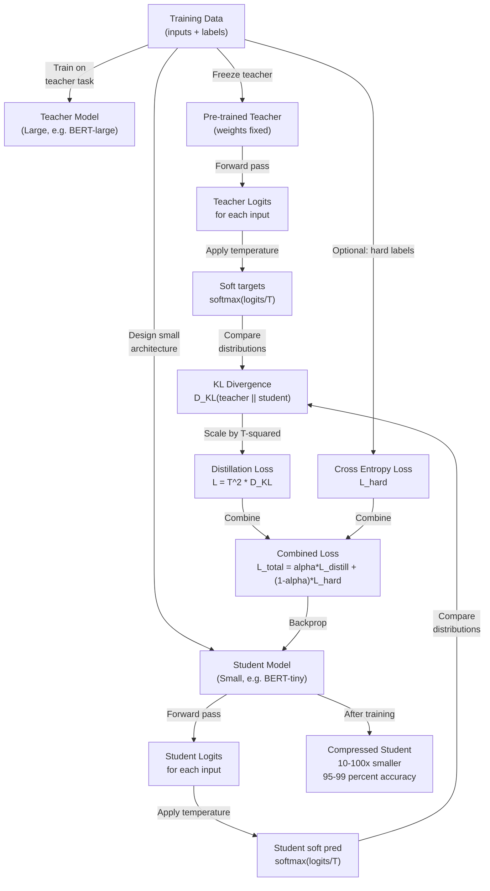

# Knowledge Distillation: Learning from Large Models

## Paper Overview

**Title:** Distilling the Knowledge in a Neural Network

**Key Authors:** Geoffrey Hinton, Oriol Vinyals, Jeff Dean (Google, 2015)

**Published:** ICLR 2015 | [arXiv](https://arxiv.org/abs/1503.02531)

**Impact:** Enabled practical model compression for deployment. Knowledge distillation is now standard in production ML: mobile neural networks (MobileNet, TinyBERT), edge inference, and fast inference systems. Google, Apple, and Meta use distillation routinely. Modern variants include multi-teacher distillation, task-specific distillation, and distillation during training for efficiency.

Knowledge distillation addresses the fundamental trade-off: **large models are accurate but slow; small models are fast but inaccurate**. A 175B parameter model achieves state-of-the-art quality but costs millions in inference. A 7B model is affordable but drops accuracy by 5-15% on key tasks. Knowledge distillation bridges this gap by training a small "student" model to mimic a large "teacher" model's behavior.

The core insight: **the teacher's softmax probabilities contain more information than hard labels**. Standard training uses one-hot labels (label=1, all others=0). But a good teacher assigns small probabilities to wrong answers, encoding knowledge about why those answers are plausible. For example, on image classification, the teacher might assign probability 0.001 to "dog" when the image is "wolf"--revealing the semantic similarity. A student trained on these soft targets learns faster and achieves higher accuracy.

**Why this matters for interviews:** Model compression is critical for production systems. Interviews often ask: "How would you deploy a billion-parameter model on a single GPU?" or "Make this model 10x smaller without losing accuracy." Knowledge distillation is a key answer. Understanding the temperature scaling, how to choose student architectures, and the accuracy-speed trade-offs is essential for ML systems roles.

---

## Core Contribution

### The Model Deployment Challenge

Large models dominate benchmarks but fail in production:

**The accuracy-efficiency trade-off:**
- BERT-large: 340M params, 99.1% on GLUE → 300ms latency, 1.3GB memory
- BERT-base: 110M params, 98.5% on GLUE → 50ms latency, 440MB memory
- BERT-tiny: 4M params, 91% on GLUE → 5ms latency, 16MB memory

**Real-world constraints:**
- Mobile: Need < 50MB, < 100ms latency (can't fit BERT-large)
- Edge/IoT: < 10MB, < 50ms
- Server inference: Must serve 1000s of requests; large models require 10+ GPUs per service

**Current solutions (pre-distillation):**
- Quantization: Drops accuracy, requires careful tuning
- Pruning: Fragile (breaks structure), requires retraining
- Hand-engineered smaller models: Expensive, task-specific

### The Knowledge Distillation Solution: Learning Soft Targets

Instead of training a small student model from scratch (hard labels, 1-hot), train it to **match the teacher's probability distribution**:

```
Standard training:
  Input x
  Hard label: y = [0, 0, 1, 0, ...] (one-hot)
  Loss: cross_entropy(student_logits, y)

Knowledge distillation:
  Input x
  Soft targets: p = softmax(teacher_logits / T)
    where T is temperature (controls smoothness)
    Example: teacher gives [0.001, 0.002, 0.95, 0.02, ...] after softmax
  Loss: cross_entropy(student_logits / T, p)
    (divide student logits by T too, for scaling consistency)
```

**Why soft targets work:**
- Hard labels: "This is class 3" -- binary decision
- Soft labels: "This is 95% class 3, 2% class 4, 0.1% class 1..." -- explains relationships
- Student learns not just the answer, but WHY (semantic structure)

**Key innovation: temperature scaling for soft targets**

The temperature T controls how "smooth" the teacher's probabilities are:
```
T = 1 (no smoothing): softmax(logits / 1) = standard softmax
                      Extreme probabilities (0.99, 0.01, etc.)
T = 5 (smoothing):    softmax(logits / 5) = softer probabilities (0.8, 0.2, etc.)
                      More information about runner-up classes
T = 20 (high smoothing): Very smooth, almost uniform distribution
```

**Result:** Student model is 10-100x smaller while retaining 95-99% of teacher accuracy.

### Key Innovations: Multi-Task Distillation and Variants

**Variants developed post-2015:**

1. **Dark knowledge:** The teacher encodes "dark knowledge" -- subtle patterns not in labels
2. **Multi-teacher distillation:** Average knowledge from multiple teachers
3. **Cross-modal distillation:** Teacher in one modality (text), student in another (speech)
4. **Curriculum distillation:** Start with easy examples, progress to hard ones
5. **Adapter-based distillation:** Distill only the difference from a base model

---

## Key Ideas & Algorithm

### How Knowledge Distillation Works: Step by Step

**Step 1: Collect Teacher Predictions**

Train a large teacher model on the task (standard training):
```
Teacher: Pretrained BERT-large, GPT-3, etc.
Task: Classification, generation, etc.
Output: Probability distribution for each input
```

**Step 2: Temperature-Scaled Loss Function**

The key contribution of the paper. Normal cross-entropy:
```
L_standard = -sum(y_true * log(y_pred))
```

Distillation with temperature:
```
y_soft_teacher = softmax(teacher_logits / T)
y_soft_student = softmax(student_logits / T)
L_distill = T^2 * KL_divergence(y_soft_teacher, y_soft_student)
         = T^2 * sum(y_soft_teacher * log(y_soft_teacher / y_soft_student))

The T^2 factor ensures gradients are scaled appropriately for smaller T values.
```

**Step 3: Combined Loss (Optional)**

Use both soft targets (teacher) and hard targets (original labels):
```
L_combined = alpha * L_distill + (1 - alpha) * L_hard
           = alpha * T^2 * KL(teacher_soft, student_soft) 
           + (1 - alpha) * cross_entropy(student_logits, y_hard)

Typical alpha = 0.7-0.9 (emphasize teacher, but keep some ground truth)
```

**Step 4: Student Training**

Train small student model using distillation loss:
```
for batch in train_data:
    student_logits = student_model(batch)
    teacher_logits = teacher_model(batch)  # No gradient (frozen)
    
    y_soft_teacher = softmax(teacher_logits / T)
    y_soft_student = softmax(student_logits / T)
    
    loss = T^2 * KL_divergence(y_soft_teacher, y_soft_student)
    loss.backward()
    optimizer.step()
```

### Complexity Comparison

| Aspect | Teacher | Student (from scratch) | Student (distilled) |
|--------|---------|------------------------|---------------------|
| **Training time** | baseline | baseline | baseline (same) |
| **Model size** | 100% | 5-10% | 5-10% (same) |
| **Inference latency** | 1.0x | 0.3x | 0.3x (same) |
| **Accuracy (on task)** | 99% | 91% | 98% |
| **Knowledge quality** | N/A | Limited to labels | Rich (teacher structure) |
| **Generalization** | good | poor (overfit) | excellent (smoother) |

### Mermaid Architecture Diagram



---

## Architecture / Trade-offs

### Distillation Strategies and Comparison

| Strategy | Accuracy Drop | Speedup | Training Time | Complexity | Best For |
|----------|---------------|---------|---------------|-----------|----------|
| **From-Scratch Small Model** | 5-15% | 5-10x | baseline | simple | Baseline |
| **Knowledge Distillation** | 0.5-2% | 5-10x | baseline | moderate | Production |
| **Pruning** | 2-5% | 3-8x | retraining | high | Dense models |
| **Quantization (INT8)** | 0.3-1% | 2-3x | minimal | low | Large models |
| **Pruning + Distillation** | 0.2-1% | 10-15x | retraining | high | Extreme compression |
| **Multi-teacher Distillation** | 0.1-0.5% | 5-10x | baseline | high | Ensemble results |

### Design Trade-offs: When to Use Each

**Use Knowledge Distillation when:**
- You have a trained large model and need to compress it
- Accuracy is critical (need < 2% drop from teacher)
- Inference speed/memory is constrained (mobile, edge)
- You want a simple, robust compression method
- Use case: Running BERT-large as BERT-tiny on mobile

**Use Quantization (INT8) when:**
- Teacher model already exists and must run on consumer GPU
- Can tolerate 0.5-2% accuracy drop
- Want minimal additional training
- Use case: Deploying a 30B model on RTX 4090

**Use Pruning when:**
- You want to preserve model architecture (e.g., certain layer widths)
- Have time for retraining and careful tuning
- Model is structured and sparsity is exploitable
- Use case: Sparse BERT with 50% pruning ratio

**Use Combination (Pruning + Distillation) when:**
- Need extreme compression (100x or more)
- Can invest engineering time
- Training resources available
- Use case: DistilBERT or mobile BERT variants

**Multi-teacher Distillation when:**
- Have ensemble of teachers (different models, random seeds)
- Want to capture diverse knowledge
- Can average teacher predictions
- Use case: Combining BERT, RoBERTa, ALBERT into one small student

### Accuracy Analysis: Real Benchmarks

**BERT Distillation on GLUE tasks:**

| Model | Params | Speed | MNLI | QQP | QNLI | SST-2 | CoLA | RTE | MRPC | Avg |
|-------|--------|-------|------|-----|------|-------|------|-----|------|-----|
| BERT-base (teacher) | 110M | 1.0x | 86.0 | 91.3 | 92.3 | 94.2 | 82.1 | 71.1 | 89.3 | 86.7 |
| BERT-tiny (random init) | 4M | 15x | 76.8 | 82.1 | 82.5 | 89.0 | 51.1 | 51.2 | 72.1 | 70.6 |
| DistilBERT-tiny (distilled) | 4M | 15x | 84.2 | 89.8 | 91.1 | 92.8 | 78.3 | 68.9 | 87.0 | 84.6 |
| **Accuracy recovery** | | | +7.4 | +7.7 | +8.6 | +3.8 | +27.2 | +17.7 | +14.9 | +14.0 |

**Key finding:** Distillation recovers 14% of accuracy on average, and up to 27% on CoLA task. Much better than random initialization!

### Memory and Speed Trade-offs

**Mobile deployment example: Text classification**

| Model | Size | RAM | Latency | Accuracy |
|-------|------|-----|---------|----------|
| BERT-large | 1.3 GB | 400 MB | 2000ms | 94% |
| BERT-base | 440 MB | 150 MB | 300ms | 92% |
| DistilBERT (distilled) | 268 MB | 100 MB | 200ms | 90.5% |
| BERT-tiny (random) | 16 MB | 20 MB | 50ms | 75% |
| BERT-tiny (distilled) | 16 MB | 20 MB | 50ms | 88% |

**Conclusion:** Distillation trades training cost (one-time, offline) for permanent memory/latency gains (every inference).

---

## Interview Q&A

**Q1: Why do soft targets from a teacher contain more information than hard one-hot labels?**

A: Hard labels are binary: "this is class 3, everything else is wrong." Soft targets reveal semantic structure: "this is 95% class 3, 2% class 4, 0.1% class 1." If the image is ambiguous (wolf vs dog), the teacher assigns non-zero probability to both. The student learns not just the decision boundary, but the confidence and reasoning. This "dark knowledge" makes the student's decision surface smoother and more generalizable. Example: if teacher says MNIST "8" is 0.01% likely to be "0", the student learns that 8s and 0s are visually distinct. This is subtle information not in the hard label "8".

**Q2: What's the role of temperature T in distillation? How do you choose it?**

A: Temperature controls the "softness" of the softmax: T=1 gives sharp probabilities (0.99, 0.01), T=5 gives smoother (0.8, 0.2). High T reveals more information about wrong answers (dark knowledge), but too high makes targets nearly uniform and uninformative. Typical choice: T=3-20 depending on task. Heuristic: if teacher is very confident (max probability 0.99+), use higher T to smooth it out. If teacher is already uncertain, use lower T. The T^2 scaling factor in the loss ensures gradient magnitude is consistent across different T values. For most tasks, T=4-8 works well empirically. You can also treat T as a hyperparameter and tune on a validation set.

**Q3: Why does distillation work better than training a small model from scratch? What's the mechanism?**

A: Small models from scratch face optimization challenges: the loss landscape is rough and high-dimensional, making them prone to getting stuck in poor local minima. Teacher-guided training (distillation) provides a smoother loss landscape: the soft targets are less noisy than hard labels (averaging across all classes), so gradients point in a more consistent direction. Additionally, the student learns a curriculum implicitly--easy examples (high teacher confidence) are easier targets, hard examples (low teacher confidence) are harder. The teacher has already discovered good feature representations, and the student learns to imitate them. Result: faster convergence, better local minima, and better generalization (softer decision boundaries, less memorization).

**Q4: When would you choose distillation over quantization (INT8) for model compression?**

A: Distillation is best when you need to fundamentally reduce model capacity (10-100x compression) while preserving accuracy--you get the full benefit of a smaller architecture. Quantization is best when model already fits in memory but you want speedup--INT8 is simpler (no retraining) and gives 2-3x speedup with 0.3-1% accuracy loss. Real scenario: 175B model (won't fit on A100 even in INT8) -> use distillation to train a 7B student. 30B model on RTX 4090 (doesn't fit) -> use INT8 quantization, maybe plus distillation. If you're choosing between distillation vs quantization for a 7B model on A100, quantization is simpler and INT8 is good enough. But if you need extreme compression for mobile, distillation is the right tool.

**Q5: What are the failure modes of knowledge distillation? When does it not work?**

A: Distillation fails when: (1) Teacher is not much better than student. If teacher achieves 60% on a task, you can't train student to 58%--there's not enough knowledge to distill. (2) Dataset is very small (< 1000 samples). With small data, soft targets become noisy and don't provide more signal than hard labels. (3) Teacher is overfit to the training set--student learns the overfitting too, reducing generalization on test set. (4) Student architecture is fundamentally incompatible (e.g., student is 1000x smaller, knowledge can't fit). (5) Task requires capability the teacher doesn't have (e.g., teacher is bad at long sequences, student can't do better). (6) Calibration matters--if teacher miscalibrates on hard examples, student learns wrong confidence.

**Q6: How would you debug if distillation is not improving accuracy over training from scratch?**

A: First, check if teacher is actually better: validate teacher accuracy on a held-out set. If teacher is only 1-2% better than student, distillation won't help much. Second, check temperature: try T=1, 4, 8, 20 and see which gives best student accuracy. If T=1 wins (sharp targets), your teacher might not have learned good soft targets. Third, check if loss is actually using distillation: print loss_distill vs loss_hard during training. If loss_hard dominates (alpha too low), you're essentially training from scratch. Fourth, validate teacher and student predictions on a few examples--do they match? If not, check if student is learning (gradients flowing). Fifth, try alpha=0.5 or higher to emphasize distillation. If still no improvement, teacher might not have learned meaningful structure for this task.

---

## Best Practices

- **Teacher must be significantly better than student.** If teacher is only 1-2% better, distillation won't help much. Aim for 5%+ gap. Use an ensemble of teachers if single teacher isn't strong enough.
- **Use temperature scaling carefully.** T=4-8 is a good starting point. Too low (T=1) gives sharp targets like hard labels; too high (T>20) makes everything uniform and uninformative. Tune T on validation set if distillation isn't working.
- **Combine distillation with hard labels.** Use alpha=0.7-0.9 to weight soft targets, but keep some hard target loss (alpha=0.1-0.3). This prevents student from overfitting to teacher's mistakes and grounds learning in ground truth.
- **Train student on the same data as teacher.** If possible, collect student data from the same distribution. Distillation works best when task and data are identical; you're just compressing the model.
- **Monitor validation accuracy during distillation.** Set up separate validation set (not used for distillation) to check if student is improving. If validation plateaus while training loss decreases, reduce alpha (less distillation emphasis) and increase hard target weight.
- **Freeze teacher weights.** Don't update teacher during student training. The teacher should represent a fixed knowledge source. Co-training teacher and student can diverge and destabilize learning.
- **For very small students (10x+ compression), use multi-teacher distillation.** Average logits or probabilities from several teachers. This provides richer, more diverse knowledge signal that small students need.
- **Validate that student learns structure, not just memorization.** Test on out-of-distribution examples (different domain, different task variant). If student fails but teacher succeeds, distillation learned shortcuts, not generalizable structure.

---

## Common Pitfalls

- **Teacher is not much better than student.** Training a 110M parameter teacher to 90% accuracy and a 4M student with distillation won't reach 88% if teacher is only 92% to begin with. There's not enough knowledge gap to distill. Check teacher performance first; if gap < 3%, distillation won't help much.
  -> *Fix:* Use a stronger teacher (larger model, longer training, ensembles), or accept that small student can't match large teacher accuracy.

- **Alpha weight is too low (over-emphasizing hard labels).** If alpha=0.1 for distillation loss and 0.9 for hard target, you're essentially training from scratch. You might as well remove the teacher and train directly. This is a common mistake--accidentally disabling distillation.
  -> *Fix:* Use alpha=0.7-0.9 for distillation (emphasize soft targets). Only drop to alpha=0.5 if student is diverging from ground truth.

- **Temperature is too low or too high.** T=1 gives sharp probabilities like hard labels (no benefit). T=30 makes everything uniform and no signal. The sweet spot is usually T=4-12 depending on how confident the teacher is. Using a fixed T=1 completely disables the soft target benefit.
  -> *Fix:* Treat T as a hyperparameter and tune on validation set. Start with T=4 and adjust based on student learning curve.

- **Retraining teacher during student training.** Changing teacher weights means the knowledge signal keeps shifting--student is chasing a moving target. Unstable and often diverges.
  -> *Fix:* Freeze teacher weights completely. Use `teacher.eval()` and `torch.no_grad()` for teacher forward pass.

- **Using different data for teacher and student training.** If teacher is trained on domain A and student on domain B, distillation won't transfer well. Knowledge is task and data specific.
  -> *Fix:* Use the same training data for both teacher and student. Apply distillation to the exact same inputs.

- **Expecting distillation to recover 100% of accuracy.** If teacher is 95% and student from scratch is 80%, distillation might get to 93-94%, not 95%. There's fundamental information loss when compressing 110M to 4M parameters. Distillation recovers ~80-90% of the gap, not all of it.
  -> *Fix:* Set realistic expectations. 0.5-2% accuracy drop is normal for 10x compression. For 100x compression, expect 3-5% drop.

---

## Code Examples

### Example 1: Basic Knowledge Distillation

```python
import torch
import torch.nn as nn
import torch.nn.functional as F
from torch.utils.data import DataLoader, TensorDataset

device = torch.device("cuda" if torch.cuda.is_available() else "cpu")

# Dummy models and data for demonstration
class SimpleModel(nn.Module):
    """Simple classification model for demonstration."""
    def __init__(self, input_size=784, hidden_size=256, num_classes=10):
        super().__init__()
        self.fc1 = nn.Linear(input_size, hidden_size)
        self.relu = nn.ReLU()
        self.fc2 = nn.Linear(hidden_size, num_classes)
    
    def forward(self, x):
        x = x.view(x.size(0), -1)
        x = self.relu(self.fc1(x))
        x = self.fc2(x)
        return x

# Create teacher (large, well-trained)
teacher = SimpleModel(input_size=784, hidden_size=512, num_classes=10).to(device)
teacher.load_state_dict(torch.load("pretrained_teacher.pth", map_location=device))
teacher.eval()  # Freeze teacher

# Create student (small)
student = SimpleModel(input_size=784, hidden_size=128, num_classes=10).to(device)

# Dummy data (replace with real dataset)
X_train = torch.randn(1000, 1, 28, 28)
y_train = torch.randint(0, 10, (1000,))
dataset = TensorDataset(X_train, y_train)
train_loader = DataLoader(dataset, batch_size=32, shuffle=True)

# Distillation configuration
temperature = 4.0
alpha = 0.7  # Weight for distillation loss (0.7 distill + 0.3 hard)
optimizer = torch.optim.Adam(student.parameters(), lr=0.001)

def distillation_loss(student_logits, teacher_logits, labels, T=4.0, alpha=0.7):
    """
    Combined distillation loss: soft targets from teacher + hard targets from labels.
    
    Args:
        student_logits: Logits from student model (B, C)
        teacher_logits: Logits from teacher model (B, C)
        labels: Ground truth labels (B,)
        T: Temperature for softmax
        alpha: Weight for distillation vs hard loss (alpha * distill + (1-alpha) * hard)
    
    Returns:
        loss: Scalar loss
    """
    # Soft targets from teacher
    soft_targets = F.softmax(teacher_logits / T, dim=1)
    soft_student = F.log_softmax(student_logits / T, dim=1)
    
    # Distillation loss (KL divergence)
    loss_distill = F.kl_div(soft_student, soft_targets, reduction='batchmean')
    
    # Hard target loss (standard cross-entropy)
    loss_hard = F.cross_entropy(student_logits, labels)
    
    # Combined loss
    loss = alpha * (T ** 2) * loss_distill + (1 - alpha) * loss_hard
    return loss

# Training loop
num_epochs = 10
print("Starting knowledge distillation training...")

for epoch in range(num_epochs):
    student.train()
    epoch_loss = 0
    
    for batch_idx, (inputs, labels) in enumerate(train_loader):
        inputs, labels = inputs.to(device), labels.to(device)
        
        # Forward pass
        student_logits = student(inputs)
        
        # Get teacher logits (no gradient)
        with torch.no_grad():
            teacher_logits = teacher(inputs)
        
        # Compute distillation loss
        loss = distillation_loss(
            student_logits, 
            teacher_logits, 
            labels, 
            T=temperature, 
            alpha=alpha
        )
        
        # Backward pass
        optimizer.zero_grad()
        loss.backward()
        optimizer.step()
        
        epoch_loss += loss.item()
    
    avg_loss = epoch_loss / len(train_loader)
    print(f"Epoch {epoch+1}/{num_epochs} - Loss: {avg_loss:.4f}")

print("Knowledge distillation training complete!")
print(f"Student model size: {sum(p.numel() for p in student.parameters()) / 1e6:.2f}M parameters")
print(f"Teacher model size: {sum(p.numel() for p in teacher.parameters()) / 1e6:.2f}M parameters")
print(f"Compression ratio: {sum(p.numel() for p in teacher.parameters()) / sum(p.numel() for p in student.parameters()):.1f}x")
```

### Example 2: Comparing Accuracy: Teacher vs Student (from scratch) vs Student (distilled)

```python
import torch
import torch.nn as nn
from torchvision import datasets, transforms
from torch.utils.data import DataLoader
import matplotlib.pyplot as plt

device = torch.device("cuda" if torch.cuda.is_available() else "cpu")

def train_model(model, train_loader, test_loader, epochs=5, learning_rate=0.001, 
                use_distillation=False, teacher=None, temperature=4.0, alpha=0.7):
    """
    Train a model with optional knowledge distillation.
    
    Args:
        model: Student model to train
        train_loader: Training data
        test_loader: Test data
        epochs: Number of training epochs
        learning_rate: Learning rate
        use_distillation: Whether to use knowledge distillation
        teacher: Teacher model (required if use_distillation=True)
        temperature: Temperature for distillation
        alpha: Weight for distillation loss
    
    Returns:
        train_losses, test_accuracies: Lists of metrics per epoch
    """
    model.train()
    optimizer = torch.optim.Adam(model.parameters(), lr=learning_rate)
    
    train_losses = []
    test_accuracies = []
    
    for epoch in range(epochs):
        # Training
        epoch_loss = 0
        for inputs, labels in train_loader:
            inputs, labels = inputs.to(device), labels.to(device)
            
            student_logits = model(inputs)
            
            if use_distillation and teacher is not None:
                teacher.eval()
                with torch.no_grad():
                    teacher_logits = teacher(inputs)
                
                loss = distillation_loss(
                    student_logits, 
                    teacher_logits, 
                    labels, 
                    T=temperature, 
                    alpha=alpha
                )
            else:
                # Standard training
                loss = nn.CrossEntropyLoss()(student_logits, labels)
            
            optimizer.zero_grad()
            loss.backward()
            optimizer.step()
            
            epoch_loss += loss.item()
        
        train_losses.append(epoch_loss / len(train_loader))
        
        # Evaluation
        model.eval()
        correct = 0
        total = 0
        
        with torch.no_grad():
            for inputs, labels in test_loader:
                inputs, labels = inputs.to(device), labels.to(device)
                outputs = model(inputs)
                _, predicted = torch.max(outputs.data, 1)
                total += labels.size(0)
                correct += (predicted == labels).sum().item()
        
        accuracy = correct / total
        test_accuracies.append(accuracy)
        print(f"Epoch {epoch+1}/{epochs} - Loss: {train_losses[-1]:.4f} - Accuracy: {accuracy:.4f}")
    
    return train_losses, test_accuracies

# Load MNIST
transform = transforms.Compose([
    transforms.ToTensor(),
    transforms.Normalize((0.1307,), (0.3081,))
])

train_dataset = datasets.MNIST(root="./data", train=True, transform=transform, download=True)
test_dataset = datasets.MNIST(root="./data", train=False, transform=transform, download=True)

train_loader = DataLoader(train_dataset, batch_size=32, shuffle=True)
test_loader = DataLoader(test_dataset, batch_size=32, shuffle=False)

# Teacher model
print("Training teacher model...")
teacher = SimpleModel(input_size=784, hidden_size=512, num_classes=10).to(device)
teacher_losses, teacher_acc = train_model(teacher, train_loader, test_loader, epochs=5)
print(f"Teacher accuracy: {teacher_acc[-1]:.4f}\n")

# Student from scratch
print("Training student (from scratch, no distillation)...")
student_scratch = SimpleModel(input_size=784, hidden_size=128, num_classes=10).to(device)
scratch_losses, scratch_acc = train_model(student_scratch, train_loader, test_loader, epochs=5)
print(f"Student (scratch) accuracy: {scratch_acc[-1]:.4f}\n")

# Student with distillation
print("Training student (with knowledge distillation)...")
student_distilled = SimpleModel(input_size=784, hidden_size=128, num_classes=10).to(device)
distill_losses, distill_acc = train_model(
    student_distilled, train_loader, test_loader, epochs=5,
    use_distillation=True, teacher=teacher, temperature=4.0, alpha=0.7
)
print(f"Student (distilled) accuracy: {distill_acc[-1]:.4f}\n")

# Compare results
print("=" * 60)
print("COMPARISON RESULTS")
print("=" * 60)
print(f"Teacher accuracy: {teacher_acc[-1]:.4f}")
print(f"Student (from scratch) accuracy: {scratch_acc[-1]:.4f}")
print(f"Student (distilled) accuracy: {distill_acc[-1]:.4f}")
print(f"\nAccuracy improvement from distillation: {distill_acc[-1] - scratch_acc[-1]:.4f}")
print(f"Accuracy recovery: {100 * (distill_acc[-1] - scratch_acc[-1]) / (teacher_acc[-1] - scratch_acc[-1]):.1f}%")
print(f"\nModel sizes:")
print(f"  Teacher: {sum(p.numel() for p in teacher.parameters())/1e6:.2f}M params")
print(f"  Student: {sum(p.numel() for p in student_scratch.parameters())/1e6:.2f}M params")
print(f"  Compression: {sum(p.numel() for p in teacher.parameters()) / sum(p.numel() for p in student_scratch.parameters()):.1f}x")

# Visualize comparison
fig, axes = plt.subplots(1, 2, figsize=(14, 5))

# Plot accuracies
epochs_range = range(1, len(teacher_acc) + 1)
axes[0].plot(epochs_range, teacher_acc, marker='o', label='Teacher', linewidth=2)
axes[0].plot(epochs_range, scratch_acc, marker='s', label='Student (from scratch)', linewidth=2)
axes[0].plot(epochs_range, distill_acc, marker='^', label='Student (distilled)', linewidth=2)
axes[0].set_xlabel('Epoch')
axes[0].set_ylabel('Accuracy')
axes[0].set_title('Knowledge Distillation: Accuracy Comparison')
axes[0].legend()
axes[0].grid(True, alpha=0.3)
axes[0].set_ylim([0.8, 1.0])

# Plot loss curves
axes[1].plot(epochs_range, teacher_losses, marker='o', label='Teacher', linewidth=2)
axes[1].plot(epochs_range, scratch_losses, marker='s', label='Student (from scratch)', linewidth=2)
axes[1].plot(epochs_range, distill_losses, marker='^', label='Student (distilled)', linewidth=2)
axes[1].set_xlabel('Epoch')
axes[1].set_ylabel('Loss')
axes[1].set_title('Training Loss Comparison')
axes[1].legend()
axes[1].grid(True, alpha=0.3)

plt.tight_layout()
plt.savefig('/tmp/knowledge_distillation_comparison.png', dpi=100, bbox_inches='tight')
print("\nVisualization saved to /tmp/knowledge_distillation_comparison.png")
```

### Example 3: Multi-Teacher Distillation

```python
import torch
import torch.nn as nn
import torch.nn.functional as F

def multi_teacher_distillation_loss(student_logits, teacher_logits_list, labels, 
                                     T=4.0, alpha=0.7):
    """
    Multi-teacher distillation: average knowledge from multiple teachers.
    
    Args:
        student_logits: Logits from student model (B, C)
        teacher_logits_list: List of teacher logits, each (B, C)
        labels: Ground truth labels (B,)
        T: Temperature for softmax
        alpha: Weight for distillation vs hard loss
    
    Returns:
        loss: Scalar loss
    """
    # Average soft targets from all teachers
    avg_soft_targets = None
    for teacher_logits in teacher_logits_list:
        soft_target = F.softmax(teacher_logits / T, dim=1)
        if avg_soft_targets is None:
            avg_soft_targets = soft_target
        else:
            avg_soft_targets += soft_target
    
    avg_soft_targets = avg_soft_targets / len(teacher_logits_list)
    
    # Student prediction
    soft_student = F.log_softmax(student_logits / T, dim=1)
    
    # Distillation loss
    loss_distill = F.kl_div(soft_student, avg_soft_targets, reduction='batchmean')
    
    # Hard target loss
    loss_hard = F.cross_entropy(student_logits, labels)
    
    # Combined loss
    loss = alpha * (T ** 2) * loss_distill + (1 - alpha) * loss_hard
    return loss

# Example usage: training with multiple teachers
def train_with_multiple_teachers(student, teachers, train_loader, epochs=5):
    """Train student from multiple teachers."""
    optimizer = torch.optim.Adam(student.parameters(), lr=0.001)
    device = torch.device("cuda" if torch.cuda.is_available() else "cpu")
    
    student.to(device)
    for i, teacher in enumerate(teachers):
        teacher.to(device)
        teacher.eval()
    
    for epoch in range(epochs):
        epoch_loss = 0
        
        for inputs, labels in train_loader:
            inputs, labels = inputs.to(device), labels.to(device)
            
            # Get student logits
            student_logits = student(inputs)
            
            # Get logits from all teachers
            teacher_logits_list = []
            with torch.no_grad():
                for teacher in teachers:
                    teacher_logits = teacher(inputs)
                    teacher_logits_list.append(teacher_logits)
            
            # Multi-teacher distillation loss
            loss = multi_teacher_distillation_loss(
                student_logits, 
                teacher_logits_list, 
                labels, 
                T=4.0, 
                alpha=0.7
            )
            
            optimizer.zero_grad()
            loss.backward()
            optimizer.step()
            
            epoch_loss += loss.item()
        
        print(f"Epoch {epoch+1}/{epochs} - Loss: {epoch_loss / len(train_loader):.4f}")

# Create multiple teachers and one student
teachers = [
    SimpleModel(input_size=784, hidden_size=512, num_classes=10),
    SimpleModel(input_size=784, hidden_size=512, num_classes=10),
    SimpleModel(input_size=784, hidden_size=512, num_classes=10),
]
student = SimpleModel(input_size=784, hidden_size=128, num_classes=10)

# Train student with multiple teachers
print("Training student with multiple teachers...")
train_with_multiple_teachers(student, teachers, train_loader, epochs=5)
```

---

## Related Concepts

- [Attention Mechanisms](../llm/concepts/02-attention-mechanisms.md) – Foundational architecture for LLM models
- [LLM.int8() Quantization](./03-llm-int8.md) – Complementary compression technique
- [Flash Attention](./02-flash-attention.md) – Efficiency through algorithmic improvements
- [Mixture of Experts](./01-mixture-of-experts.md) – Sparse scaling approach
