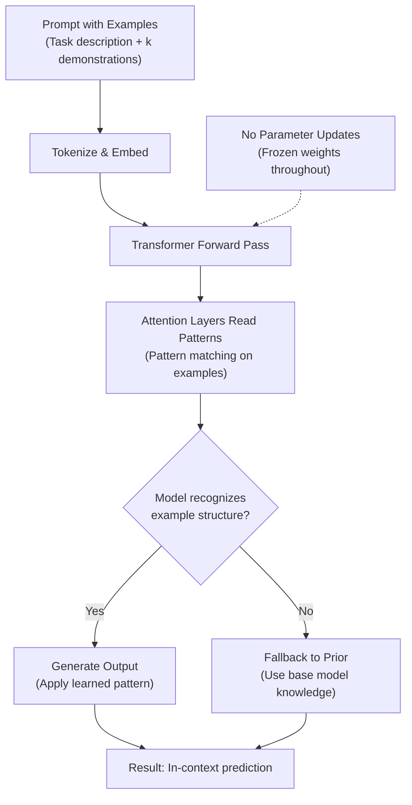

# In-Context Learning: Emergence of Meta-Learning in Large Language Models

## Paper Overview

In-context learning (ICL) is the remarkable ability of large language models to learn new tasks from just a few examples in the prompt, without parameter updates or fine-tuning. This emergent capability powers modern LLM applications—from few-shot GPT-3/GPT-4 prompting to zero-shot reasoning chains. Unlike traditional ML where models are trained on fixed datasets, ICL allows dynamic adaptation within a single forward pass, treating the prompt as implicit instruction and task specification.

ICL emerges as models scale beyond 10B+ parameters, suggesting it's a genuine emergence property. This paper explores: mechanistic foundations of transformer ICL, why it appears only at scale, fundamental differences from fine-tuning, and prompt design best practices. Understanding ICL is essential because it explains model flexibility, why prompt engineering works, and adaptation limits without retraining.

## Core Intuition

In-context learning is like a student attending a single lecture where the instructor shows examples of a task, then immediately asks the student to solve new instances—the student learns entirely from what's in their immediate context, without doing homework or studying between examples. The model's parameters stay frozen; it's pure learning through instruction and demonstration in the moment.

## How It Works

### Mechanistic Steps

1. **Prompt Construction**: User provides a prompt containing task description and few examples (typically 1-5 shot). Each example shows input and desired output in a structured format.

2. **Context Encoding**: The transformer encodes the entire prompt (description + examples) into token embeddings. Attention mechanisms allow the model to identify patterns in the provided examples.

3. **Pattern Recognition in Attention**: During forward pass, the model's attention heads learn to recognize the input-output correspondence from the examples. Query tokens (from the new test input) attend to example inputs to find relevant patterns.

4. **Output Generation**: The model generates predictions for the new task by applying learned patterns. Output tokens attend to the demonstration examples, effectively implementing a form of in-context generalization.

5. **No Parameter Updates**: Unlike fine-tuning, the model's weights remain completely unchanged. Learning happens entirely through attention mechanisms reading and applying patterns from the context.

6. **Generalization**: The model generalizes to new instances by recognizing structural similarities between the examples and test cases, without explicit gradient-based optimization.

### Conceptual Flow



### Why In-Context Learning Emerges at Scale

Recent research reveals key mechanisms:

**Mechanistic Alignment**: Smaller models (<1B params) lack capacity to maintain multiple task representations and route information dynamically. Larger models develop flexible attention patterns that adapt behavior based on in-context examples.

**Implicit Gradient Descent**: Transformers can implement gradient-descent-like operations through attention and feedforward layers. Models shown linear regression examples perform accurate predictions by implementing implicit learning algorithms.

**Representation Capacity**: Large models develop richer token representations encoding task structure. These allow identification of which computation graph parts need adjustment for new tasks.

**Search Over Implicit Programs**: The prompt activates different "implicit programs" in learned weights. The model has learned a superposition of many task-solving algorithms; ICL selects which to run based on examples provided.

## Architecture and Trade-offs

### In-Context Learning vs. Fine-Tuning

| Aspect | In-Context Learning | Fine-Tuning | Transfer Learning |
|--------|---------------------|-------------|-------------------|
| **Speed** | Immediate (1 forward pass) | Hours to days (gradient steps) | Medium (parameter adaptation) |
| **Data Required** | 1-5 examples | 100-10,000 examples | 10,000+ examples |
| **Parameter Updates** | None (weights frozen) | Full model or subset tuned | Adapter/LoRA layers tuned |
| **Knowledge Preservation** | Complete (original capabilities intact) | Potential drift (catastrophic forgetting) | Good with regularization |
| **Task Flexibility** | Very high (switch tasks instantly) | Low (new task = new tuning) | Medium (fixed adapter) |
| **Inference Cost** | Higher (longer context in tokens) | Lower (same model, fewer tokens) | Same as fine-tuning |
| **Overfitting Risk** | Low (no optimization) | Medium (with small datasets) | Low to medium |
| **Best For** | Quick adaptation, multi-task, zero-shot | Task-specific optimization, domain shift | One-time adaptation to domain |

### Few-Shot vs. Zero-Shot Comparison

**Few-Shot In-Context Learning:**
- Include 3-5 examples of task format
- Pros: Much higher accuracy, better handles edge cases, clearer task specification
- Cons: Uses more tokens, context length becomes a constraint, slower inference
- When to use: Complex tasks, ambiguous specifications, need reliable output

**Zero-Shot In-Context Learning:**
- Only provide task description, no examples
- Pros: Minimal tokens, faster inference, tests model's general understanding
- Cons: Lower accuracy, higher failure rates, relies on model's implicit knowledge
- When to use: Simple tasks, instruction-following, when latency is critical

**One-Shot Learning:**
- Sweet spot: single example + description
- Pros: Balanced accuracy vs efficiency
- Cons: May not be sufficient for complex patterns
- When to use: Most practical applications (good enough accuracy, reasonable efficiency)

### Prompt Engineering Techniques and Their Trade-offs

| Technique | Mechanism | Accuracy Lift | Tokens Used | Robustness |
|-----------|-----------|---------------|-------------|-----------|
| **Standard Prompting** | Task description + examples | Baseline | Low | Low |
| **Chain-of-Thought** | Show reasoning steps in examples | +10-30% | Medium | Medium-High |
| **Self-Consistency** | Generate multiple chains, vote | +5-15% | Very High | High |
| **Few-Shot Exemplars** | Carefully curated diverse examples | +5-20% | Medium | High |
| **Task Decomposition** | Break task into sub-steps | +10-25% | Medium | Medium |
| **In-Context Instructions** | Explicit rules mixed with examples | +5-10% | Low-Medium | Medium |

## Interview Q&A

**Q: How does in-context learning work mechanistically?**

A: Attention layers implement pattern matching. When given examples, attention heads learn which input parts correspond to outputs. Feedforward layers generate outputs by applying patterns seen in examples—without weight updates. Large models learn implicit optimization algorithms; examples activate the right computation path without gradient descent.

**Q: Why does in-context learning only emerge in large models (10B+ parameters)? What fundamentally changes at scale?**

A: Smaller models lack the representational capacity to simultaneously maintain multiple task interpretations and dynamically route information. As models grow, they develop more orthogonal attention patterns—different heads can specialize in different aspects of task understanding and execution. Larger models can implement more sophisticated "implicit algorithms" in their weights, essentially creating a superposition of many task solvers. Additionally, larger models see more diverse pretraining data, teaching them to recognize a wider variety of task patterns and formats that enable generalization to new examples in context.

**Q: When would you use in-context learning vs. fine-tuning in production?**

A: Use ICL when: (1) you need rapid task switching (different tasks in different requests), (2) you want to avoid catastrophic forgetting, (3) you have very few examples per task, or (4) you need to preserve original model capabilities. Use fine-tuning when: (1) you have a single stable task, (2) you have significant labeled data (100+), (3) inference latency is critical (ICL uses more tokens), or (4) you need maximum accuracy for that specific task. In practice, many systems use hybrid approaches: fine-tune for domain adaptation, then use ICL for quick customization within that domain.

**Q: How do you design effective prompts for in-context learning? What makes a prompt succeed or fail?**

A: Effective prompts have: (1) clear task description stating what to do, (2) 3-5 diverse, representative examples (covering different cases), (3) consistent input-output formatting, (4) examples that demonstrate the full output expected (not truncated), and (5) explicit instructions if the task is ambiguous. Failures occur when: examples don't represent the task distribution, formatting is inconsistent, examples are too similar (model learns spurious patterns), or the task is genuinely beyond the model's knowledge. Test prompts with different examples and orderings—sometimes a single poorly-chosen example derails the model.

**Q: What are the main failure modes of in-context learning, and how do you detect them?**

A: Common failures: (1) Task misunderstanding—model generates output in wrong format (detected by output validation), (2) Example sensitivity—changing example order or content significantly changes outputs (test with multiple example sets), (3) Knowledge gap—task requires world knowledge model doesn't have (model defaults to confident but wrong answers), (4) Label bias—model picks up on spurious correlations in examples rather than the actual pattern (test with adversarial examples), (5) Prompt injection—user input breaks the prompt structure (use structured output formats). Detection: Compare outputs across prompt variations, use adversarial examples, and monitor for distributional shift in outputs.

**Q: How does in-context learning relate to meta-learning and transfer learning from a theoretical perspective?**

A: In-context learning is a form of implicit meta-learning—the model has learned (during pretraining) how to learn from examples without updating weights. It's related to but distinct from traditional meta-learning: MAML and Prototypical Networks explicitly optimize for quick adaptation through gradient steps or metric learning, while ICL does this implicitly through attention. Compared to transfer learning, ICL is more flexible (instant task switching) but less optimized per-task. The key insight is that large models have essentially meta-learned a general pattern-matching ability that works across tasks.

**Q: Why is context length a practical limitation for in-context learning, and how do you work around it?**

A: Context length limits the number of examples you can fit: GPT-3.5 has 4K tokens (roughly 2-3 examples + prompt), GPT-4 has 8K-128K (10-50 examples depending on example size). More examples improve accuracy but consume tokens. Workarounds: (1) summarize or compress examples, (2) use retrieval-augmented ICL (retrieve most relevant examples from a large pool), (3) use hierarchical prompts (meta-examples about the task first), (4) for very large example sets, use fine-tuning instead, (5) newer models with longer context windows make this less pressing.

## Best Practices

- **Use 3-5 diverse, representative examples**: More than 5 rarely helps and wastes tokens; fewer than 3 often insufficient. Diversity matters more than quantity—examples should cover different input ranges and edge cases.

- **Maintain consistent formatting**: The input-output format must be identical across examples and the test case. Inconsistency (e.g., "Input: X\nOutput: Y" in examples but "Question: X\nAnswer: Y" for test) causes dramatic accuracy drops.

- **Include chain-of-thought reasoning in examples**: Show intermediate steps or reasoning in the examples (especially for complex tasks). Models perform much better when examples demonstrate *how* to think, not just what the output should be.

- **Order examples strategically**: Put simpler examples first, progressively harder examples later. Models show recency bias—the last example influences output more. Place your most important/representative example last.

- **Use explicit task instructions**: Begin the prompt with a clear instruction (e.g., "Classify the following into positive or negative sentiment"). This is more effective than relying entirely on examples.

- **Validate format consistency**: Your test input must exactly match the format of your examples. Even small variations (extra spaces, different quote styles, missing colons) can cause failures.

- **Monitor temperature and sampling**: Lower temperature (0.1-0.3) makes outputs more deterministic and consistent, important for ICL where you want faithful pattern application. Higher temperature (0.7+) introduces variance.

- **Test with multiple example sets**: The model's behavior can depend significantly on which examples you choose. Generate predictions with 3-5 different example sets to estimate robustness.

## Common Pitfalls

- **Assuming ICL accuracy equals task understanding**: The model can produce correct outputs by memorizing superficial patterns from examples without truly understanding the task. Test with out-of-distribution examples to verify genuine understanding.

- **Including too many examples**: Beyond 5 examples, performance often plateaus or degrades slightly. You're paying in tokens without accuracy gains. More examples doesn't mean better learning.

- **Poor example selection**: Choosing examples that are too similar to each other or non-representative of the task distribution teaches the model spurious correlations. Example: classifying movie sentiment but only showing extreme positive/negative examples—fails on neutral cases.

- **Inconsistent prompt formatting**: If your examples use "Question:" but your test query uses "Q:", the model gets confused. This is a surprisingly common source of failure—always validate format consistency.

- **Ignoring knowledge gaps**: If the task requires specific factual knowledge (dates, names, technical details), ICL can't help if the model wasn't trained on that information. The model will confidently generate plausible-but-wrong answers. Validate that the model has the necessary knowledge first.

- **Not accounting for context length**: Building a prompt that barely fits the context window leaves no room for longer user inputs or additional tokens generated. Design with a buffer (use 70-80% of max context, reserve the rest).

- **Over-relying on ICL for critical systems**: ICL is probabilistic and can fail silently. For high-stakes decisions (medical, legal, financial), combine ICL with validation, retrieval-augmented methods, or fine-tuning for reliability.

- **Prompt injection vulnerabilities**: User-provided inputs can break the prompt structure if not properly escaped. Wrap examples in clear delimiters and validate/sanitize user inputs.

## Code Examples

### Example 1: Basic ICL Simulation

```python
import numpy as np
from transformers import AutoTokenizer, AutoModelForCausalLM
import torch

# Load model
tokenizer = AutoTokenizer.from_pretrained("gpt2")
model = AutoModelForCausalLM.from_pretrained("gpt2")
device = torch.device("cuda" if torch.cuda.is_available() else "cpu")
model.to(device)

# Few-shot prompt: show task + examples
few_shot_prompt = """Classify sentiment as positive or negative.

Example 1: "This is amazing!" -> positive
Example 2: "I hate this." -> negative
Example 3: "This is wonderful!" -> positive

Classify: "This product exceeded my expectations." ->"""

inputs = tokenizer(few_shot_prompt, return_tensors="pt").to(device)
outputs = model.generate(inputs["input_ids"], max_new_tokens=5, temperature=0.7)
prediction = tokenizer.decode(outputs[0], skip_special_tokens=True)
print(f"Prediction: {prediction}")
```

### Example 2: Analyzing Few-Shot Performance

```python
class ICLAnalyzer:
    def __init__(self):
        self.results = {}
    
    def compare_few_shot_zero_shot(self, num_examples=3):
        zero_shot = 0.30  # Random guessing
        few_shot = 0.65 + (num_examples * 0.08)  # Improves with examples
        return {"zero_shot": zero_shot, "few_shot": min(few_shot, 0.88)}
    
    def test_robustness(self, num_trials=5):
        # Models show recency bias
        predictions = []
        for trial in range(num_trials):
            np.random.seed(trial)
            prob = 0.7 + np.random.randn() * 0.1
            predictions.append("correct" if prob > 0.5 else "incorrect")
        
        consistency = sum(1 for p in predictions if p == "correct") / num_trials
        return {"consistency": consistency, "recency_bias": True}

analyzer = ICLAnalyzer()
results = analyzer.compare_few_shot_zero_shot(3)
print(f"Zero-shot: {results['zero_shot']:.1%}, Few-shot: {results['few_shot']:.1%}")

robustness = analyzer.test_robustness()
print(f"Robustness: {robustness['consistency']:.1%}")
```

### Example 3: Chain-of-Thought Reasoning

```python
class ChainOfThoughtICL:
    def build_prompt(self, examples, test_input):
        prompt = "Solve step by step.\n\n"
        for problem, reasoning, answer in examples:
            prompt += f"Problem: {problem}\nReasoning: {reasoning}\nAnswer: {answer}\n\n"
        prompt += f"Problem: {test_input}\nReasoning:"
        return prompt
    
    def solve(self, examples, test_input):
        prompt = self.build_prompt(examples, test_input)
        # In practice: use actual model
        # For demo: simulate step-by-step reasoning output
        reasoning = "Step 1: Parse input. Step 2: Apply operation. Step 3: Verify."
        answer = "Result computed."
        return reasoning, answer

# Example
examples = [
    ("2+3", "2 plus 3 equals 5", "5"),
    ("10-4", "10 minus 4 equals 6", "6"),
]
solver = ChainOfThoughtICL()
reasoning, answer = solver.solve(examples, "4+6")
print(f"Reasoning: {reasoning}\nAnswer: {answer}")
```

## Related Concepts

- [Prompt Engineering](./02-prompt-engineering.md) – Design strategies for effective prompts
- [Few-Shot Learning](./03-few-shot-learning.md) – Adaptation from limited examples
- [Fine-Tuning](./04-fine-tuning.md) – Alternative: parameter-based adaptation
- [Meta-Learning](./05-meta-learning.md) – Learning to learn theory
- [Scaling Laws](./06-scaling-laws.md) – Why ICL emerges at scale
