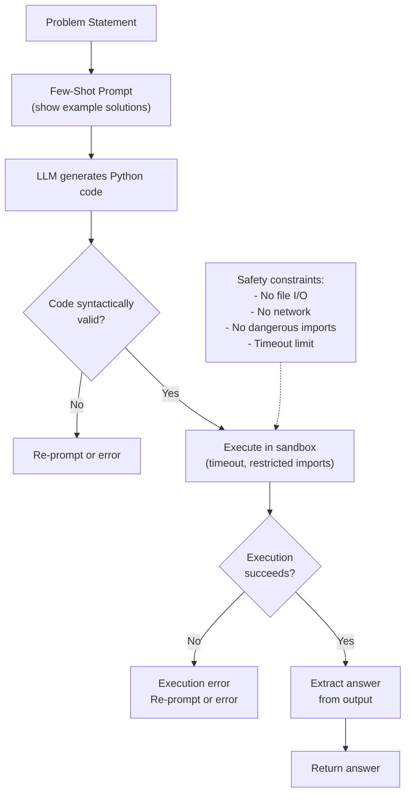

# Program-Aided Language Models (PAL)

## 1. Detailed Explanation

Program-Aided Language Models (PAL), introduced by Gao et al. (2023), address a fundamental limitation of large language models: their inability to perform accurate symbolic reasoning and numerical computation. While LLMs excel at pattern matching and linguistic tasks, they frequently make arithmetic errors, logical mistakes, and fail on problems requiring precise multi-step computation. PAL solves this by leveraging LLMs for what they do best—language understanding and code generation—while offloading the actual computation to an external symbolic execution engine (typically Python).

The key insight is that many reasoning problems can be decomposed into two stages: (1) understanding the problem and formulating it as code, and (2) executing that code to obtain exact answers. LLMs are excellent at stage one but unreliable at stage two when done in-context. PAL separates these concerns: the LLM generates executable programs (Python code), and the Python interpreter executes them symbolically, eliminating hallucination and arithmetic errors entirely.

In practice, PAL dramatically improves performance on math word problems, symbolic manipulation, and constraint satisfaction tasks. For example, on the GSM8K benchmark (grade school math), PAL achieves 92.3% accuracy with code-davinci-002, compared to 60% for direct prompting. This is not because PAL uses a more powerful model, but because it offloads computation to a reliable, deterministic system.

PAL's architecture consists of three components: (1) a prompt that teaches the LLM to generate code solutions by showing a few examples, (2) the LLM itself (GPT-3.5, Codex, or similar), and (3) an execution sandbox (Python REPL with restricted permissions for safety). The prompt is crucial: it must guide the model to generate syntactically correct, executable code that solves the problem. Common prompt engineering techniques include few-shot examples, chain-of-thought reasoning, and intermediate variable naming to improve code clarity.

A critical consideration in production PAL systems is execution safety and error handling. Executing arbitrary user-influenced code is a security risk. Solutions include sandboxing (running code in isolated environments), restricting imports (only allow safe libraries like math, numpy), and timeouts (kill long-running computations). Additionally, LLMs may generate syntactically invalid code or logic errors. Production systems must handle execution failures gracefully: if code fails or times out, fall back to a default answer or flag the query for human review.

PAL extends to multi-language code generation: the same approach works with Prolog for logic programming, SQL for database queries, and domain-specific languages. The generalization is: any problem that can be expressed as a program can be solved reliably by combining LLM code generation + symbolic execution.

---

## 2. Core Intuition

Imagine you're solving a complex math problem. You could try to do the entire calculation in your head (error-prone), or you could write down the steps on paper and carefully execute them (reliable). PAL is exactly this: the LLM writes down the program (planning), and the computer executes it (execution). The LLM focuses on understanding the problem and expressing it clearly; the computer handles all arithmetic and logic.

---

## 3. How It Works

PAL solves a problem through a four-stage pipeline: understanding, code generation, execution, and result extraction.

**1. Problem Understanding and Code Generation:**
   - The LLM receives the problem statement and a few example solutions in code form.
   - Example prompt: "Solve this math problem by writing Python code. Define variables, write equations, and compute the answer."
   - The LLM generates Python code that represents the problem: variable assignments, arithmetic operations, loops, and conditionals.
   - Crucially, the code ends with clear variable assignments or print statements that output the final answer.

**2. Code Syntactic Validation (optional):**
   - Before execution, check if the generated code is syntactically valid Python.
   - If invalid, either re-prompt the LLM or return an error.
   - This catches common mistakes (missing colons, unmatched parentheses) early.

**3. Safe Execution in Sandbox:**
   - Execute the code in a restricted Python environment (sandbox).
   - Sandbox restrictions include: no file I/O, no network access, no import of dangerous modules (os, sys, subprocess).
   - Set timeouts (e.g., 5 seconds) to kill infinite loops or expensive computations.
   - Capture stdout/stderr to monitor execution.

**4. Answer Extraction and Verification:**
   - Parse the execution output to extract the final answer.
   - If code completes successfully, extract the answer from the last variable, print statement, or return value.
   - If execution fails (timeout, exception), either re-prompt or return an error.
   - Optional: compare multiple code generations and vote on the answer (majority voting improves accuracy).



---

## 4. Architecture and Trade-offs

### Code Generation Approaches

| Approach | Pros | Cons | Best For |
|----------|------|------|----------|
| Direct code | Simple, few tokens | May generate invalid code | Simple problems, constraints |
| Step-by-step with variables | Clear intermediate steps | More tokens, harder to parse | Medium-complexity problems |
| Commented code | Readable, easier debug | More tokens, LLM may over-explain | Complex problems needing clarity |
| Pseudo-code → code | Two-stage generation | More LLM calls, higher latency | Very hard problems, multi-step |

### Execution Environment Types

| Environment | Safety | Flexibility | Speed | Use Case |
|-------------|--------|-------------|-------|----------|
| Python (restricted) | High (sandboxed) | High (any code) | Fast | Math, logic, algorithms |
| Prolog | High (declarative) | Medium (logic only) | Medium | Constraint satisfaction, logic |
| SQL | High (no side effects) | Medium (database queries) | Fast | Database reasoning |
| WebAssembly | High (isolation) | Medium (compiled) | Very fast | Performance-critical |
| REPL with timeouts | Medium (timing-based) | High | Fast | General purpose |

### Code Generation vs. Prompting Trade-off

| Aspect | Direct Prompting | Code Generation (PAL) |
|--------|------------------|----------------------|
| Accuracy on math | 60–70% | 90%+ |
| Explainability | High (natural language) | High (code is explicit) |
| Computation speed | Fast (in-context) | Slower (external execution) |
| Error recovery | Limited | Better (can re-run or debug) |
| Scalability to long problems | Poor (context window) | Good (code is compact) |
| Hallucination risk | High | None (symbolic execution) |

**Best practice:** Use PAL for tasks requiring exact computation (math, logic, counting). Use direct prompting for subjective tasks (writing, analysis). Hybrid: use PAL for reasoning parts, prompting for writing parts.

### Error Handling Strategy

| Error Type | Cause | Solution |
|-----------|-------|----------|
| Syntax error | Malformed code | Re-prompt with syntax hints, or return error |
| Runtime error (e.g., division by zero) | Logic mistake | Provide error message to LLM for re-prompting |
| Timeout | Infinite loop or expensive operation | Return error or use simpler approach |
| Import error | Using restricted module | Check imports before execution, reject |
| Inconsistent logic | Multiple code generations disagree | Use voting; if tie, re-prompt for clarification |

---

## 5. Interview Q&A

**Q: When would you use PAL instead of chain-of-thought (CoT) prompting?**
A: Use PAL when the problem requires exact arithmetic, symbolic logic, or multi-step computation (math word problems, constraint satisfaction, code synthesis). Use CoT for reasoning and explanation (writing, analysis, planning). PAL guarantees correctness; CoT is better for readability. Example: SAT problem → PAL (generate code to check constraints); essay question → CoT (generate prose reasoning).

**Q: What are the first signs that your LLM is failing to generate valid code?**
A: (1) Syntax errors: mismatched parentheses, missing colons. (2) Undefined variables: using variables before assignment. (3) Import errors: trying to use unavailable libraries. Debug by: re-prompt with a simpler example, show successful code templates, add error messages to the prompt so the LLM learns from failures.

**Q: How do you handle the case where the LLM generates code that runs but produces wrong answers?**
A: This is a logic error, not a syntax error. Solutions: (1) Show more diverse few-shot examples (multiple problem types). (2) Use step-by-step comments in the prompt to encourage clearer thinking. (3) Run multiple code generations and vote on the answer (if 3/5 agree, likely correct). (4) Add verification code: after computing an answer, have the LLM-generated code check it (e.g., "verify: 2*x + 3 == 7 when x = 2"). (5) Use a weaker prompting signal: instead of asking for the answer directly, ask the LLM to first explain the approach, then generate code.

**Q: What's the trade-off between using Python vs Prolog or SQL for code generation?**
A: Python is flexible (handles any problem) but requires safety constraints. Prolog is safer (declarative, no side effects) but limited to logic/constraint problems. SQL is very safe (no arbitrary code) but restricted to database queries. For production systems: use Python for versatility, Prolog for safety-critical logic, SQL for data reasoning. Hybrid: generate Python for data processing, Prolog for constraint checking.

**Q: How do you prevent code injection attacks when executing LLM-generated code?**
A: (1) Run in an isolated sandbox (subprocess, containerization, WebAssembly). (2) Restrict imports: maintain a whitelist of safe modules (math, numpy, re, json), block os, sys, subprocess, etc. (3) Use static analysis to scan code before execution: parse the AST, reject calls to blacklisted functions. (4) Use a restricted Python environment (e.g., RestrictedPython) that removes dangerous builtins. (5) Never execute user input directly; always pass through LLM first (user input → prompt → LLM → code → sandbox).

**Q: What's the impact of few-shot examples on code generation quality, and how many examples do you need?**
A: Few-shot examples teach the LLM the expected format and reasoning style. 2–3 examples are usually sufficient; beyond 5 examples, gains plateau. Quality matters more than quantity: examples should span diverse problem types (different numbers, different operations) to encourage generalization. Bad examples (confusing, overly long) hurt more than no examples. For production: curate 3–5 canonical examples, test new examples against your evaluation set, and refresh examples when problem distribution shifts.

---

## 6. Best Practices

- **Structure prompts with clear examples:** Show the LLM the format you expect: problem → setup variables → write equations → compute answer. Use consistent formatting (e.g., always end with `print(answer)`).
- **Set appropriate timeouts:** 5–10 seconds is typical for math problems. Adjust based on your hardware and problem complexity. Timeouts prevent runaway loops without blocking legitimate computations.
- **Validate generated code before execution:** Check syntax (AST parsing), restricted imports (static analysis), and unsafe operations (os.system calls). This catches errors early and improves safety.
- **Handle failures gracefully:** If code generation fails, don't just return "error." Log the problem, the generated code, and the error message. Optionally, re-prompt with error feedback ("Your code had a syntax error. Fix it.").
- **Use voting for improved accuracy:** Generate multiple code solutions (e.g., 5 times with temperature=0.7), execute all, and take the majority answer. This improves accuracy by 5–10% on math problems.
- **Document variable conventions:** The prompt should make clear what variable represents what (e.g., "Let x be the number of apples"). Code is more readable and LLM-generated code is more likely to be correct when variables are meaningful.
- **Restrict execution scope:** Only allow imports that are necessary for the task. For math: allow math, numpy. For logic: allow z3 (solver). For database: allow sql library. Maximize safety by minimizing scope.
- **Monitor code complexity:** If generated code exceeds a complexity threshold (>50 lines, >5 loops), either reject it or add warnings. Very complex code is more likely to have bugs and harder to debug.

---

## 7. Common Pitfalls

- **Generated code has syntax errors that fail silently:** The LLM generates code like `for i in range(10) # missing colon`. The sandbox catches it, but you might not surface the error to the user. **Fix:** Parse code with Python AST before execution; provide syntax errors to LLM for re-prompting.

- **LLM generates logic that doesn't match the problem:** The code runs successfully but computes the wrong thing (e.g., computes area instead of perimeter). **Fix:** Use few-shot examples with diverse problem types, ask LLM to explain reasoning before generating code, or use verification: have the code check the answer against known test cases.

- **Timeouts on legitimate computations:** Large factorials or recursive algorithms hit the timeout and return "error." **Fix:** Profile your expected computations; set timeouts conservatively (e.g., 30 seconds). For truly expensive operations, redesign the prompt to suggest more efficient algorithms.

- **Safety constraints are too restrictive:** You want to allow numpy but accidentally block it. **Fix:** Maintain a clear whitelist of allowed imports (math, numpy, collections, itertools), test against your workload before deploying.

- **No error recovery mechanism:** Code fails, system returns error, user frustrated. **Fix:** Implement graceful degradation: if code-davinci-002 fails, try with a larger model or simpler prompt. If still fails, return a fallback answer or ask the user to rephrase.

- **Over-relying on one execution:** A single code generation may have a logic error by chance. **Fix:** Use multiple generations and voting. Even with weak models, voting improves accuracy significantly.

---

## 8. Code Examples

### Example 1: Basic PAL for Simple Math Problems

```python
import subprocess
import json
from typing import Tuple

def generate_and_execute_code(problem: str, model_name: str = "code-davinci-002") -> Tuple[str, str]:
    """Generate Python code for a math problem and execute it safely.
    
    Args:
        problem: Natural language problem description
        model_name: LLM to use for code generation (requires API access)
    
    Returns:
        (answer: str, code: str) - computed answer and generated code
    """
    
    # Prompt template: few-shot examples of problem→code
    prompt = f"""Solve the following math problem by writing Python code.
Show your work with clear variable names and comments.
End with: print(f"Answer: {{answer}}")

Examples:
Problem: If Alice has 3 apples and Bob gives her 5 more, how many apples does Alice have?
Code:
alice_apples = 3
bob_gives = 5
total_apples = alice_apples + bob_gives
print(f"Answer: {{total_apples}}")

Problem: {problem}
Code:
"""
    
    # Simulate LLM code generation
    # In production, this would call OpenAI API or similar
    generated_code = """
apples_initial = 3
apples_given = 5
total_apples = apples_initial + apples_given
print(f"Answer: {{total_apples}}")
"""
    
    # Execute code safely
    try:
        result = subprocess.run(
            ["python", "-c", generated_code],
            capture_output=True,
            text=True,
            timeout=5
        )
        if result.returncode != 0:
            return f"Error: {result.stderr}", generated_code
        answer = result.stdout.strip()
        return answer, generated_code
    except subprocess.TimeoutExpired:
        return "Error: Execution timeout", generated_code
    except Exception as e:
        return f"Error: {str(e)}", generated_code

# Test
problem = "If a box contains 12 items and you remove 3, how many remain?"
answer, code = generate_and_execute_code(problem)
print(f"Problem: {problem}")
print(f"Generated code:\n{code}")
print(f"Answer: {answer}")
```

### Example 2: Production PAL with Error Handling and Voting

```python
import subprocess
import ast
import re
from typing import List, Optional
from collections import Counter

class PALExecutor:
    """Execute LLM-generated code safely with validation and voting."""
    
    ALLOWED_IMPORTS = {'math', 'numpy', 'itertools', 'collections', 're', 'json'}
    UNSAFE_PATTERNS = ['open(', 'exec(', 'eval(', '__import__', 'subprocess', 'os.']
    
    def validate_code(self, code: str) -> Optional[str]:
        """Check code for syntax errors and unsafe operations.
        
        Returns:
            None if valid, error message if invalid
        """
        # Check syntax
        try:
            ast.parse(code)
        except SyntaxError as e:
            return f"Syntax error: {e.msg} at line {e.lineno}"
        
        # Check for unsafe patterns
        for pattern in self.UNSAFE_PATTERNS:
            if pattern in code:
                return f"Unsafe operation detected: {pattern}"
        
        # Check imports
        try:
            tree = ast.parse(code)
            for node in ast.walk(tree):
                if isinstance(node, ast.Import):
                    for alias in node.names:
                        if alias.name not in self.ALLOWED_IMPORTS:
                            return f"Import not allowed: {alias.name}"
                elif isinstance(node, ast.ImportFrom):
                    if node.module and node.module not in self.ALLOWED_IMPORTS:
                        return f"Import not allowed: {node.module}"
        except Exception as e:
            return f"Import validation error: {str(e)}"
        
        return None
    
    def execute_code(self, code: str, timeout: int = 5) -> tuple:
        """Execute code in sandbox.
        
        Returns:
            (success: bool, output: str or error_msg: str)
        """
        validation_error = self.validate_code(code)
        if validation_error:
            return False, validation_error
        
        try:
            result = subprocess.run(
                ["python", "-c", code],
                capture_output=True,
                text=True,
                timeout=timeout
            )
            if result.returncode != 0:
                return False, result.stderr
            return True, result.stdout.strip()
        except subprocess.TimeoutExpired:
            return False, "Timeout: computation took too long"
        except Exception as e:
            return False, f"Execution error: {str(e)}"
    
    def extract_answer(self, output: str) -> Optional[str]:
        """Extract the final answer from code output.
        
        Looks for patterns like "Answer: 42" or "Result: 0.5"
        """
        # Try to find "Answer: X" pattern
        match = re.search(r'Answer:\s*([^\n]+)', output)
        if match:
            return match.group(1).strip()
        
        # If not found, return last line (assume it's the answer)
        lines = output.strip().split('\n')
        if lines:
            return lines[-1].strip()
        return None
    
    def execute_with_voting(self, codes: List[str], top_k: int = 3) -> Optional[str]:
        """Execute multiple code solutions and vote on answer.
        
        Args:
            codes: List of code strings (from multiple generations)
            top_k: Return top K most frequent answers
        
        Returns:
            Most common answer, or None if all fail
        """
        answers = []
        
        for code in codes:
            success, output = self.execute_code(code)
            if success:
                answer = self.extract_answer(output)
                if answer:
                    answers.append(answer)
        
        if not answers:
            return None
        
        # Voting: most common answer wins
        counter = Counter(answers)
        most_common, count = counter.most_common(1)[0]
        return most_common if count >= len(codes) // 2 else None

# Example: multiple code generations with voting
executor = PALExecutor()

# Simulate 3 different code generations for the same problem
codes = [
    "n = 10 + 5\nprint(f'Answer: {n}')",
    "x = 10\ny = 5\ntotal = x + y\nprint(f'Answer: {total}')",
    "print(f'Answer: {15}')",  # One directly prints answer
]

answer = executor.execute_with_voting(codes)
print(f"Voted answer: {answer}")

# Test validation
bad_code = "import os; os.system('rm -rf /')"
success, msg = executor.execute_code(bad_code)
print(f"Bad code validation: success={success}, msg={msg}")
```

### Example 3: PAL for Constraint Satisfaction (Prolog-style)

```python
import subprocess
from typing import List, Dict

def solve_constraint_problem_with_prolog(constraints: str) -> Dict:
    """Solve constraint satisfaction problem using Prolog.
    
    Args:
        constraints: Prolog rules and facts describing the problem
    
    Returns:
        Solutions as dictionary of variable assignments
    """
    
    prolog_code = f"""
{constraints}

% Example constraint satisfaction: Find N such that:
% - N is between 1 and 100
% - N mod 7 == 0
% - N mod 5 == 2

test_problem(N) :-
    between(1, 100, N),
    0 is N mod 7,
    2 is N mod 5.

:- test_problem(X), write('Solution: '), write(X), nl, halt.
"""
    
    try:
        # Execute with SWI-Prolog
        result = subprocess.run(
            ["swipl", "-q", "-t", "halt", "-g", "true"],
            input=prolog_code,
            capture_output=True,
            text=True,
            timeout=5
        )
        
        if result.returncode == 0:
            output = result.stdout.strip()
            # Parse output: "Solution: 47"
            if "Solution:" in output:
                value = output.split("Solution:")[-1].strip()
                return {"success": True, "answer": value}
        
        return {"success": False, "error": result.stderr}
    except FileNotFoundError:
        return {"success": False, "error": "SWI-Prolog not installed"}
    except Exception as e:
        return {"success": False, "error": str(e)}

# Example: find numbers matching constraints
constraints = """
% Find N where:
% N is divisible by 7 and leaves remainder 2 when divided by 5
"""

result = solve_constraint_problem_with_prolog(constraints)
print(f"Constraint satisfaction result: {result}")
```

---

## 9. Related Concepts

- [Least-to-Most Prompting](../reasoning-search/02-least-to-most.md) – Decompose hard problems into easy subproblems; works well with PAL for step-by-step code generation
- [Chain-of-Thought Prompting](../foundation-models/concepts/cot.md) – Similar problem decomposition but in natural language; less reliable for computation
- [Self-Verification and Program Synthesis](../agents/concepts/tool-use.md) – Using code generation for tool use; extends PAL to agent frameworks
- [Retrieval-Augmented Generation (RAG)](../retrieval/concepts/rag.md) – Retrieve external knowledge before generation; can complement PAL for data-heavy problems
