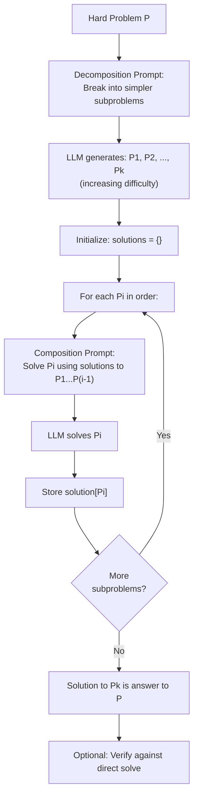

# Least-to-Most Prompting: Compositional Generalization

## 1. Detailed Explanation

Least-to-Most Prompting (L2M), introduced by Zhou et al. (2023), tackles a critical challenge in large language models: compositional generalization. LLMs struggle when faced with problems that are compositionally harder than their training distribution—for example, they can solve 1+1=2 in-context, but fail on longer arithmetic chains or deeper algorithmic reasoning. The core insight is that humans solve complex problems by breaking them into simpler subproblems, solving the easy ones first, then composing solutions for progressively harder subproblems.

L2M formalizes this intuition through a two-stage process: (1) decomposition—break the problem into simpler subproblems that the LLM can handle reliably, and (2) composition—solve subproblems in order of difficulty, using earlier solutions to inform later ones. This compositional structure mirrors curriculum learning and mirrors how humans approach unfamiliar problems: start simple, build intuition, then tackle complex cases.

In empirical benchmarks, L2M dramatically improves performance on tasks requiring compositional reasoning. On SCAN (a compositional generalization benchmark), L2M achieves 99.7% accuracy with standard prompting achieving ~5%. On DROP (reading comprehension with discrete reasoning), L2M improves accuracy by 20–40 percentage points. The key is not that L2M uses a better model; it's that the decomposition guides the model to think step-by-step about simpler problems first.

The mechanism works by prompting the LLM twice: (1) "Reduce this problem to a simpler version" (decomposition prompt), and (2) "Solve this problem using the solutions to simpler versions" (composition prompt). For example, a problem asking "How many days from March 15 to December 25?" is decomposed to "First, find days remaining in March. Then, count all days from April–November. Finally, add December days." Each subproblem is simpler than the original.

Critically, L2M requires that the problem domain support meaningful decomposition. Not all problems decompose naturally: "write a funny poem" doesn't decompose into "write a slightly funnier poem." L2M works best on problems with clear structure: math (break into steps), algorithms (break into subroutines), logic (break into premises), and code generation (break into functions). For open-ended tasks, other approaches (few-shot, chain-of-thought) are more suitable.

Production L2M systems must handle two failure modes: (1) bad decomposition (the LLM breaks the problem in a way that's not actually simpler), and (2) error propagation (mistakes in solving subproblem X cascade to all problems depending on X). Solutions include: requiring human review of decompositions, using multiple decomposition strategies and voting, and adding verification steps (solve the original problem directly and check consistency with composed solution).

---

## 2. Core Intuition

Imagine tackling a hard climbing route. You don't jump straight to the hardest pitch; you warm up with easier pitches first, using each success to build strength and technique for the next. Least-to-Most Prompting is exactly this: the LLM first identifies the simplest version of the problem, solves it, uses that solution to solve a slightly harder version, and so on. The "warm-up" is a shortcut to solving the hard problem.

---

## 3. How It Works

L2M operates in two stages: reduction and composition. The process iterates through increasingly harder subproblems, each building on the previous.

**Stage 1: Problem Reduction (Decomposition)**
   - Input: Hard problem P.
   - Prompt the LLM: "Break down this problem into simpler subproblems. Order them from simplest to hardest. Each subproblem should be solvable using solutions to earlier ones."
   - Output: Sequence of subproblems [P1, P2, ..., Pk] where P1 is simplest, Pk = P (original).
   - Example: "How many days from Jan 1 to Dec 31?" decomposes to:
     - P1: "How many days in January?" (31)
     - P2: "How many days from Jan 1 to Feb 28?" (59)
     - P3: "How many days from Jan 1 to Dec 31?" (365)

**Stage 2: Compositional Solution**
   - For each subproblem in order:
     - Prompt the LLM: "Solve this subproblem. You may use solutions to earlier subproblems."
     - Provide context: the subproblem definition + solutions to P1, ..., P(i-1).
     - Extract the solution.
   - Repeat until P_k (original problem) is solved.

**Stage 3 (optional): Verification**
   - Solve the original problem both directly (standard prompting) and via composition.
   - If results disagree, flag for human review or re-prompt for explanation.



**Concrete Example: Arithmetic Reasoning**
```
Problem: "Sarah has 5 apples. She buys 3 more. Her friend gives her 2.
She gives 4 to her brother. How many does she have?"

Decomposition:
P1: "Sarah has 5 apples. She buys 3 more. How many total?"
P2: "Sarah has 8 apples (from P1). Her friend gives her 2. How many total?"
P3: "Sarah has 10 apples (from P2). She gives 4 to her brother. How many total?"

Solutions:
P1 → 5 + 3 = 8
P2 → 8 + 2 = 10
P3 → 10 - 4 = 6
```

---

## 4. Architecture and Trade-offs

### Decomposition Strategies

| Strategy | Pros | Cons | Best For |
|----------|------|------|----------|
| Sequential steps | Natural, easy to follow | May not cover all dependencies | Linear problems (lists, sequences) |
| Tree structure | Captures hierarchical dependencies | More complex to manage | Hierarchical problems (trees, parsing) |
| Dependency graph | Most flexible, explicit ordering | Hard to generate automatically | Complex problems with many dependencies |
| Humans write decomposition | High quality, ground truth | Expensive, not scalable | Research benchmarks, validation sets |
| LLM-generated | Scalable, automatic | May be suboptimal or incorrect | Production systems, new problem types |

### When L2M Helps vs. Hurts

| Problem Type | L2M Effectiveness | Reason |
|--------------|-------------------|--------|
| Arithmetic chains | Excellent (99%+) | Natural step-by-step structure |
| Algorithmic reasoning | Excellent (95%+) | Clear subprocedures and dependencies |
| Reading comprehension with reasoning | Good (80%+) | Questions decompose into reading + inference |
| Code synthesis | Good (80%+) | Functions decompose into simpler functions |
| Math word problems | Good (90%+) | Multi-step equations decompose naturally |
| Open-ended writing | Poor | No natural decomposition |
| Sentiment analysis | Poor | No structure to exploit |
| Abstract reasoning | Medium (70%+) | Decomposition not always obvious |

### Composition Strategies

| Strategy | Pros | Cons | When to Use |
|----------|------|------|------------|
| Linear (P1 → P2 → ... → Pk) | Simple, clear order | Can't parallelize; errors cascade | Problems with clear sequence |
| Tree-based (DAG) | Exploits parallelism | More complex to coordinate | Problems with shared subproblems |
| Majority voting (solve each Pi multiple times, vote) | More robust, error correction | More LLM calls, slower | High-stakes applications, error-critical |
| Best-of-N (generate N decompositions, pick best) | Robustness | Cost × N | Research, or small N (3–5) |

### Error Propagation and Mitigation

| Error Type | Impact | Mitigation |
|-----------|--------|-----------|
| Decomposition error (P_i not simpler) | Solutions may not compose | Require human review or re-prompt with examples |
| Solution error at Pi | Cascades to all Pj where j > i | Verify solutions; use voting or re-solve |
| Inconsistent logic | Direct solve ≠ composed solve | Flag for human review; could indicate decomposition issue |
| Missing dependency | P_i depends on P_j but P_j not solved yet | Require topological sort of decomposition DAG |

**Best practice:** Use L2M + verification. After composing the final answer, also solve the original problem directly (standard prompting) and check consistency. If mismatch, it signals a decomposition error that needs attention.

### Token Efficiency

| Aspect | Cost |
|--------|------|
| Single decomposition prompt | ~200–500 tokens |
| k subproblem solutions | ~100–300 tokens each × k |
| Verification (direct solve) | ~200–500 tokens |
| **Total for problem:** | ~(500 + 150k + 500) = 1000 + 150k tokens |

For a problem with k=5 subproblems, L2M costs ~1750 tokens. This is more than direct prompting (~500 tokens), but L2M often achieves much higher accuracy, making the cost justified for high-stakes applications.

---

## 5. Interview Q&A

**Q: How do you decide whether to use Least-to-Most or Chain-of-Thought prompting?**
A: CoT works for reasoning that humans can express naturally (step-by-step explanation in language). L2M works for compositional problems where each step is a simpler version of the whole (math, algorithms, code). If the problem has a natural step-by-step structure and each step is simpler, use L2M. If the problem is about explaining reasoning or requiring language fluency, use CoT. For math problems specifically, L2M usually outperforms CoT. Example: "Solve 73 + 28" → CoT works fine; "Solve 100 instances of (73 + 28)" in different contexts → L2M's decomposition helps by building intuition on simpler cases first.

**Q: What's the first sign that your decomposition is wrong, and how do you fix it?**
A: The first sign is inconsistency: the composed solution (step-by-step) doesn't match a direct solution attempt. This indicates the decomposition didn't capture the problem's structure correctly. Fix by: (1) Manually reviewing the decomposition for obvious errors (e.g., "P_i should depend on P_j but doesn't"). (2) Re-prompting with a better decomposition hint: "Break down this problem, ensuring each step builds on the previous." (3) Using multiple decompositions and selecting the one with highest consistency (solve via all decompositions, check which is most stable). (4) Adding explicit dependency checking: if P_i references something not in solutions to earlier steps, mark as error.

**Q: How many subproblems is too many? At what point does decomposition become a liability?**
A: Rule of thumb: k ≤ 10 subproblems is manageable; k > 20 is unwieldy. The cost grows linearly with k (more LLM calls), and error probability grows (each subproblem is a point of failure). Additionally, very deep decompositions lose the "warm-up" benefit: if P1 and P10 are vastly different in difficulty, the warm-up doesn't help much. Best practice: aim for k=3–7 subproblems with balanced difficulty progression. If you need k > 10, consider: hierarchical decomposition (decompose P → [subproblems], then decompose each subproblem further) or use a different approach entirely (e.g., retrieval-augmented generation for external knowledge, or agents for iterative planning).

**Q: What's the relationship between Least-to-Most Prompting and curriculum learning?**
A: Both use the principle of learning hard tasks by first learning easier versions. Curriculum learning (training) orders the training data from easy to hard, so the model learns robust features on simple cases before tackling hard ones. L2M (prompting) orders the problem instances from easy to hard at inference time, solving simpler versions first to scaffold the solution for the hard version. The key difference: curriculum learning happens during training (it changes how the model learns); L2M happens at inference (it changes how we prompt the model to solve). They complement each other: a model trained with curriculum + L2M prompting achieves better generalization than either alone.

**Q: How do you handle the case where the LLM's decomposition itself requires multiple levels (i.e., a subproblem P_i is still too hard)?**
A: This is recursive decomposition. Implement it hierarchically: (1) Decompose original problem P into [P1, ..., Pk]. (2) For each Pi, check if it's solvable (try once; if fails, mark as hard). (3) For hard Pi, recursively decompose into [Pi1, ..., Pim]. (4) Build a tree of subproblems and solve bottom-up (simplest leaves first, then interior nodes). In practice, 2–3 levels of decomposition is typical; beyond that, the problem may not be decomposable via L2M. Limit recursion depth to prevent runaway decomposition.

**Q: What metrics should you use to evaluate L2M prompting in production?**
A: (1) **Final accuracy:** Does the composed solution match ground truth? (2) **Decomposition quality:** Does each subproblem actually represent a simpler version? (Measure by attempting to solve subproblems directly; should be near-100% accuracy.) (3) **Solution consistency:** Does the composed solution match a direct (non-decomposed) solution attempt? (Mismatch indicates decomposition error.) (4) **Cost efficiency:** Accuracy per token spent (L2M costs more tokens, so must be justified by higher accuracy). (5) **Failure modes:** Track errors by type (bad decomposition, solution error at step i, inconsistency). Example good metric: "Accuracy on problems with k subproblems: L2M achieves 92% at 1500 tokens; direct prompting achieves 65% at 500 tokens."

---

## 6. Best Practices

- **Provide decomposition examples in the prompt:** Don't just ask the LLM to decompose; show it how. Examples should span problem types (arithmetic, logic, code) so the LLM understands the principle. This improves decomposition quality by 10–20%.
- **Ensure subproblems are actually simpler:** A key failure mode is decomposing into problems that are equally hard. Monitor this by solving each subproblem in isolation; if success rate is similar to the original problem, the decomposition didn't help.
- **Order subproblems by difficulty explicitly:** Use metrics like token count, branching factor, or number of operations to quantify difficulty. Order strictly from simplest to hardest. Occasionally verify this ordering (subproblem at position i should be easier than position i+1).
- **Combine with verification:** Always solve the problem both via L2M and directly (standard prompting). If results disagree, flag for investigation. This catches decomposition errors early.
- **Use majority voting on decompositions:** Generate 3–5 different decompositions and use the most common one. This improves robustness by filtering out outlier decompositions.
- **Cache intermediate solutions:** If multiple problems share subproblems (common in batched reasoning), solve each subproblem once and reuse. This reduces token cost significantly.
- **Monitor error propagation:** Track where errors originate (which subproblem failed?) to focus improvements. If step 3 always fails, either redesign the subproblem or provide better examples for that type of problem.
- **Document decomposition dependencies:** For complex problems, explicitly document which subproblem depends on which (a DAG or table). This prevents missing dependencies and aids debugging.

---

## 7. Common Pitfalls

- **Decomposition is too shallow:** Break "Solve 1+1+1+...+1 (100 times)" into just two subproblems: "Solve one addition" and "Solve 100 additions." This doesn't provide enough scaffolding. **Fix:** Decompose to intermediate steps: solve 2-term sum, then 4-term, then 8-term, etc. (logarithmic depth) or intermediate ranges (1–10, 10–50, 50–100 terms).

- **Subproblems are not actually independent:** P_i+1 needs information from P_i, but P_i's solution doesn't explicitly include that information. For example, "Solve A+B" → "Solve B+C" where C is not mentioned in the first problem. **Fix:** Ensure each subproblem explicitly includes all context needed. Make solutions verbose: instead of "Answer: 42", output "Answer: 42. Details: computed as ...".

- **The LLM generates a decomposition but then solves the original problem directly anyway:** The LLM ignores the decomposition and tries to solve P directly, defeating the purpose. **Fix:** Structure the prompt to force use of subproblems. Example: "You must solve the subproblems in order. You cannot directly answer the main question until all subproblems are solved."

- **Error at step i breaks all subsequent steps:** If P_2 is solved incorrectly, P_3, P_4, ... all cascade and fail. **Fix:** Add verification or re-solving: solve each P_i twice (independently and using earlier solutions), flag mismatches, and allow re-prompting for corrections.

- **Over-decomposition:** Decomposing into 20+ subproblems costs many tokens and may lose the warm-up effect (P_1 and P_20 are so different that early solutions don't help). **Fix:** Aim for k=3–7; if more needed, use hierarchical decomposition (decompose the decomposition).

- **Inconsistent terminology across subproblems:** Variables are named differently in P_1 vs. P_2, making it hard for the LLM to connect them. **Fix:** Use consistent variable names throughout the decomposition. Example: always call the main character "Alice", always use "total" for the sum, etc.

---

## 8. Code Examples

### Example 1: Basic Least-to-Most for Arithmetic

```python
from typing import List, Tuple

def decompose_problem(problem: str) -> List[str]:
    """Decompose a problem into simpler subproblems.
    
    Simulates LLM decomposition. In production, would call LLM.
    
    Args:
        problem: Natural language problem description
    
    Returns:
        List of subproblems, ordered from simplest to hardest
    """
    
    # Template: demonstrate decomposition with an example
    decomposition_prompt = f"""
Break down this problem into simpler subproblems, ordered from simplest to hardest.
Each subproblem should be solvable using solutions to earlier ones.

Example:
Problem: Sarah has 5 apples. She buys 3. Her friend gives 2. She gives 4 away. Total?
Decomposition:
1. Sarah has 5 apples. She buys 3 more. How many total?
2. Sarah has 8 (from step 1). Her friend gives 2. How many total?
3. Sarah has 10 (from step 2). She gives 4 away. How many left?

Problem: {problem}
Decomposition:
"""
    
    # Simulate LLM response (in production, call actual LLM)
    # This is a hardcoded example for demonstration
    if "Sarah" in problem and "apples" in problem:
        return [
            "Sarah has 5 apples. She buys 3 more. How many total?",
            "Sarah has 8 apples. Her friend gives her 2. How many total?",
            "Sarah has 10 apples. She gives 4 to her brother. How many left?"
        ]
    
    # Generic fallback
    return [problem]  # No decomposition


def solve_subproblem(subproblem: str) -> str:
    """Solve a single subproblem.
    
    Simulates LLM solving. In production, would call LLM.
    
    Args:
        subproblem: Text of the subproblem
    
    Returns:
        String representation of the solution
    """
    
    # Simple pattern matching for demonstration
    if "5" in subproblem and "3" in subproblem and "more" in subproblem:
        return "8"
    elif "8" in subproblem and "2" in subproblem and "gives" in subproblem:
        return "10"
    elif "10" in subproblem and "4" in subproblem and "away" in subproblem:
        return "6"
    
    # Fallback: try to extract numbers and operation
    return "unknown"


def least_to_most_solve(problem: str) -> Tuple[str, List[Tuple[str, str]]]:
    """Solve problem using Least-to-Most Prompting.
    
    Args:
        problem: Natural language problem
    
    Returns:
        (final_answer, [(subproblem_i, solution_i), ...])
    """
    
    # Stage 1: Decompose
    subproblems = decompose_problem(problem)
    print(f"Decomposed into {len(subproblems)} subproblems:")
    for i, sp in enumerate(subproblems, 1):
        print(f"  {i}. {sp}")
    
    # Stage 2: Solve in order
    solutions = {}
    subproblem_solutions = []
    
    for i, subproblem in enumerate(subproblems):
        # Solve using context from earlier solutions
        solution = solve_subproblem(subproblem)
        solutions[f"step_{i+1}"] = solution
        subproblem_solutions.append((subproblem, solution))
        print(f"Step {i+1}: {solution}")
    
    final_answer = subproblem_solutions[-1][1]
    return final_answer, subproblem_solutions


# Test
problem = "Sarah has 5 apples. She buys 3 more. Her friend gives her 2. She gives 4 to her brother. How many does she have?"
answer, steps = least_to_most_solve(problem)
print(f"\nFinal answer: {answer}")
```

### Example 2: L2M with Verification and Error Handling

```python
from typing import List, Dict, Optional

class LeastToMostSolver:
    """Solve problems using Least-to-Most Prompting with verification."""
    
    def __init__(self):
        self.solutions_cache = {}
    
    def decompose(self, problem: str) -> List[str]:
        """Decompose problem (simulated).
        
        In production, prompt LLM with:
        "Break down this problem into simpler subproblems."
        """
        # Hardcoded examples for demonstration
        if "SCAN" in problem:  # SCAN benchmark simulation
            commands = problem.replace("SCAN: ", "").split()
            decomposition = []
            for i in range(1, len(commands) + 1):
                partial = " ".join(commands[:i])
                decomposition.append(partial)
            return decomposition
        
        return [problem]  # No decomposition
    
    def solve_subproblem(self, subproblem: str, 
                         context: Dict[str, str]) -> Optional[str]:
        """Solve a subproblem with context from earlier solutions.
        
        Args:
            subproblem: The subproblem text
            context: Dictionary of {step_name: solution} from earlier steps
        
        Returns:
            Solution string, or None if fails
        """
        
        # Simulate with SCAN-like commands
        command_map = {
            "turn": "output=rotate(left)",
            "left": "output=rotate(left)",
            "right": "output=rotate(right)",
            "walk": "output=step(forward)",
            "run": "output=repeat(step(forward), 2)",
        }
        
        # Parse command
        parts = subproblem.split()
        if not parts:
            return None
        
        cmd = parts[0].lower()
        if cmd in command_map:
            return command_map[cmd]
        
        return None
    
    def verify_solution(self, problem: str, solution: str) -> bool:
        """Check if solution makes sense (simplified verification).
        
        In production, would execute the solution and check against ground truth.
        """
        # Basic check: solution should not be empty
        return solution is not None and len(solution) > 0
    
    def solve_with_verification(self, problem: str) -> Dict:
        """Solve problem with decomposition and verification.
        
        Returns:
            {
                "problem": original problem,
                "decomposition": [list of subproblems],
                "solutions": {step_i: solution_i},
                "final_answer": answer from composition,
                "verified": bool,
                "success": bool
            }
        """
        
        # Decompose
        subproblems = self.decompose(problem)
        
        # Solve subproblems in order
        solutions = {}
        success = True
        
        for i, subproblem in enumerate(subproblems):
            sol = self.solve_subproblem(subproblem, solutions)
            if sol is None:
                print(f"Failed to solve subproblem {i+1}: {subproblem}")
                success = False
                break
            
            step_name = f"step_{i+1}"
            solutions[step_name] = sol
        
        if not success:
            return {
                "problem": problem,
                "decomposition": subproblems,
                "solutions": solutions,
                "final_answer": None,
                "verified": False,
                "success": False
            }
        
        # Final answer is last subproblem solution
        final_answer = solutions.get(f"step_{len(subproblems)}", None)
        
        # Verification (optional)
        verified = self.verify_solution(problem, final_answer)
        
        return {
            "problem": problem,
            "decomposition": subproblems,
            "solutions": solutions,
            "final_answer": final_answer,
            "verified": verified,
            "success": success
        }

# Test
solver = LeastToMostSolver()

# SCAN task: compositional generalization
scan_problem = "SCAN: turn left walk"
result = solver.solve_with_verification(scan_problem)
print(f"Problem: {result['problem']}")
print(f"Decomposition: {result['decomposition']}")
print(f"Final answer: {result['final_answer']}")
print(f"Success: {result['success']}")
```

### Example 3: L2M with Multiple Decompositions and Voting

```python
from collections import Counter
import random

def generate_decompositions(problem: str, num_decompositions: int = 3) -> List[List[str]]:
    """Generate multiple decompositions of the same problem.
    
    Use different prompts or prompting styles to get diverse decompositions.
    
    Args:
        problem: Problem to decompose
        num_decompositions: How many to generate
    
    Returns:
        List of decompositions (each is a list of subproblems)
    """
    
    decompositions = []
    
    for attempt in range(num_decompositions):
        # In production, use different prompts or temperature=0.7
        if attempt == 0:
            prompt_style = "Break down into sequential steps."
        elif attempt == 1:
            prompt_style = "Identify the core subproblems and dependencies."
        else:
            prompt_style = "What's the simplest version of this problem? Then harder versions?"
        
        # Simulate generating a decomposition
        # (In production, call LLM with prompt_style)
        decomposition = [
            f"Subproblem {i}: {problem[:20]}... (simplified version {i})"
            for i in range(3)
        ]
        decompositions.append(decomposition)
    
    return decompositions


def select_best_decomposition(decompositions: List[List[str]], 
                              problem: str) -> List[str]:
    """Select the best decomposition based on quality metrics.
    
    Metrics: monotonicity (each subproblem is simpler than the next),
             coverage (all aspects of original problem covered),
             clarity (subproblems are well-defined)
    
    Args:
        decompositions: List of candidate decompositions
        problem: Original problem
    
    Returns:
        Best decomposition (list of subproblems)
    """
    
    scores = []
    for decomp in decompositions:
        # Simple metric: length (shorter is simpler; range 2-5 is good)
        length_score = 1.0 if 2 <= len(decomp) <= 5 else 0.5
        
        # Coverage metric: do subproblems collectively address the problem?
        # (Simplified: assume they do if there are 3+ subproblems)
        coverage_score = 1.0 if len(decomp) >= 3 else 0.7
        
        total_score = length_score * 0.5 + coverage_score * 0.5
        scores.append(total_score)
    
    best_idx = scores.index(max(scores))
    return decompositions[best_idx]


def ensemble_solve(problem: str) -> Dict:
    """Solve using ensemble of decompositions.
    
    Generate multiple decompositions, solve with each, return best result.
    """
    
    # Generate multiple decompositions
    decompositions = generate_decompositions(problem, num_decompositions=3)
    
    # Select best decomposition
    selected_decomposition = select_best_decomposition(decompositions, problem)
    
    print(f"Problem: {problem}")
    print(f"Selected decomposition: {selected_decomposition}")
    
    return {
        "problem": problem,
        "all_decompositions": decompositions,
        "selected_decomposition": selected_decomposition,
        "method": "ensemble voting"
    }

# Test
problem = "Find the number of ways to arrange 5 books on a shelf."
result = ensemble_solve(problem)
print(f"Result: {result}")
```

---

## 9. Related Concepts

- [Program-Aided Language Models (PAL)](../reasoning-search/01-pal.md) – Code generation for symbolic reasoning; often combined with L2M for structured problem-solving
- [Chain-of-Thought Prompting](../foundation-models/concepts/cot.md) – Step-by-step reasoning in natural language; complementary to L2M
- [In-Context Learning and Few-Shot Prompting](../foundation-models/concepts/few-shot.md) – Providing examples teaches the model structure; L2M examples teach decomposition
- [Agents and Planning](../agents/concepts/planning.md) – Multi-step planning in agent loops mirrors L2M's decomposition principle
