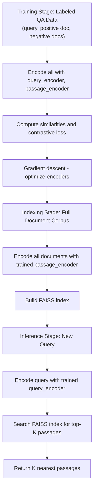

# Neural Search: Dense Passage Retrieval and Modern Retrieval

## 1. Detailed Explanation

Neural Search, pioneered by Karpukhin et al. (2020) with Dense Passage Retrieval (DPR), revolutionizes information retrieval by replacing keyword-based matching with learned dense embeddings. Traditional sparse retrieval (BM25) matches queries and documents based on overlapping terms—a brittle approach that fails when questions use different words than answers ("capital of France" vs. "seat of government"). Dense neural retrievers learn a shared embedding space where semantically similar queries and passages are close together, enabling retrieval based on meaning rather than lexical overlap.

DPR's core contribution is showing that dense retrievers trained on supervised question-passage pairs dramatically outperform sparse methods on retrieval-intensive tasks. On open-domain QA, DPR retrieval (top-20 passages) enables generators to achieve 60%+ end-to-end accuracy, compared to ~50% with BM25. The method learns two encoders: a query encoder and a passage encoder, trained with contrastive loss to pull relevant pairs together and push non-relevant pairs apart.

In production, neural search systems scale to billions of passages using FAISS (Facebook AI Similarity Search), an optimized vector index library. A single query returns the K nearest neighbors in embedding space in milliseconds—enabling real-time retrieval over Wikipedia (21 million passages) or web-scale corpora. This scalability is critical: sparse retrieval on massive corpora is computationally prohibitive; dense retrieval with FAISS makes it practical.

Neural search extends beyond QA to information retrieval generally: semantic search (find documents matching a topic), recommendation systems (find items matching user preferences), and multimodal retrieval (find images matching text queries). The common pattern: embed both queries and documents, build an index, retrieve nearest neighbors at inference.

Key architectural decisions in production systems include: (1) **encoder architecture** (BERT-base, RoBERTa, or larger models for better accuracy but higher cost), (2) **pooling strategy** (mean pooling, CLS token, or learned aggregation), (3) **index type** (exact kNN via brute-force, or approximate methods like IVFADC for speed at scale), and (4) **hard negative mining** during training (sampling challenging non-relevant passages improves encoder robustness).

A critical challenge is maintaining index freshness: as new documents are added, the index must be rebuilt or updated. Exact rebuilds are expensive for large corpora; incremental indexing and approximate methods are practical compromises. Additionally, retrieval alone is insufficient for many applications—retrieved passages are noisy, outdated, or contradictory. Modern systems combine retrieval with ranking (neural re-rankers that score top-100 retrieved passages more carefully) and generation (reading retrieved passages to synthesize answers).

---

## 2. Core Intuition

Imagine finding books in a library. The old way (sparse retrieval) is using the card catalog and keyword matching: look up "apple," find all books with "apple" in the title. The new way (neural search) is asking a librarian who understands meaning: describe what you're looking for, and they find semantically similar books even if the exact words don't match. Dense embeddings are like the librarian's mental model—they capture meaning, not just keywords.

---

## 3. How It Works

Neural search builds two components: (1) learned encoders that map queries and documents to a shared embedding space, and (2) a vector index that enables fast nearest-neighbor search.

**Stage 1: Training Encoders**
   - Collect labeled data: (query, positive_document, negative_documents).
   - Example: (Q: "Who founded Apple?", positive: "Steve Jobs founded Apple...", negatives: "Apple is a fruit...", "Apple acquired BeatsAudio...")
   - Initialize two encoder models: query_encoder = BERT, passage_encoder = BERT (can share or separate).
   - For each training pair:
     - Encode query: `q_embedding = query_encoder(query)`.
     - Encode positive and negatives: `p_emb = passage_encoder(passage)`.
     - Compute similarity: `sim(q, p) = dot_product(q_embedding, p_emb)`.
     - Use contrastive loss (in-batch negatives or hard negative mining):
       ```
       Loss = -log(exp(sim(q, p+)) / (exp(sim(q, p+)) + sum(exp(sim(q, p-)))))
       ```
     - This loss pulls the positive passage close and pushes negatives far.
   - Optimize with SGD/Adam to minimize loss.

**Stage 2: Indexing Documents**
   - Encode all documents in the corpus: `doc_embeddings = [passage_encoder(d) for d in documents]`.
   - Normalize embeddings to unit norm (cosine similarity = dot product after normalization).
   - Build index: use FAISS or similar to organize embeddings for fast search.
   - Index types:
     - **Exact (brute-force):** All pairs comparison, O(N) time but accurate.
     - **IVFADC (Inverted File with Asymmetric Distance Computation):** Cluster embeddings, search within nearest clusters, O(log N) + O(k) time, approximate.
     - **HNSW (Hierarchical Navigable Small World):** Graph-based, balance accuracy and speed.

**Stage 3: Retrieval at Inference**
   - Encode query: `q_embedding = query_encoder(query)`.
   - Search index for top-K nearest neighbors (K=5–20 typical).
   - Return top-K passages with similarity scores.



---

## 4. Architecture and Trade-offs

### Encoder Architectures

| Architecture | Size | Speed | Accuracy | Use Case |
|-------------|------|-------|----------|----------|
| Bi-Encoder (separate) | 2 × BERT-base | Fast retrieval | Good | Real-time, scale to millions |
| Bi-Encoder (shared) | 1 × BERT-base | Fast | Slightly lower | Parameter efficiency |
| Cross-Encoder | BERT-base (single) | Slow (~1s per pair) | Excellent | Re-ranking top-K (not retrieval) |
| Efficient (MiniLM, DistilBERT) | Small | Very fast | Decent | Mobile, edge, cost-sensitive |
| Large (BERT-large, RoBERTa-large) | 2 × large | Slower | Better | High-stakes, offline processing |

**Best practice:** Use bi-encoders for retrieval (separate is standard), cross-encoders only for re-ranking the top-K retrieved passages.

### Index Types and Trade-offs

| Index Type | Accuracy | Latency (millions docs) | Memory | Implementation |
|-----------|----------|------------------------|--------|-----------------|
| Brute-force (exact) | 100% | 10+ ms per search | High (embeds in RAM) | FAISS IndexFlatL2 |
| IVFADC (approx) | 95–98% | < 5 ms | Low (quantization) | FAISS IndexIVFADC |
| HNSW (approx) | 98–99% | 1–10 ms | Medium | FAISS IndexHNSW |
| LSH (approx) | 90–95% | < 1 ms | Low | SimpleHash, external |

**Best practice:** For <10M documents, use IVFADC. For >10M, use HNSW or combine with dimensionality reduction.

### Pooling Strategies for Aggregation

| Strategy | Pros | Cons | When to Use |
|----------|------|------|------------|
| CLS token (BERT [CLS]) | Simple, pre-trained | May not capture full context | Standard baseline |
| Mean pooling | Good context, balanced | Influenced by padding tokens | Default for production |
| Max pooling | Captures extremes | Can be noisy | Rare |
| Learned aggregation (attention) | Most flexible | More parameters, training needed | High-stakes, if data permits |

### Training Data Requirements and Hard Negatives

| Negative Type | Examples | Impact | Cost |
|---------------|----------|--------|------|
| In-batch negatives | Random passages from batch | 40–50 negatives per query (parallel training) | None (free from batching) |
| Random negatives | Random sample from corpus | 1–10 negatives per query | Cheap sampling |
| BM25 hard negatives | Top-K BM25 that aren't correct | More challenging, better signal | Medium (run BM25 once) |
| Mined hard negatives | Passages encoder ranks high but are wrong | Hardest, best generalization | Expensive (iterative mining) |

**Best practice:** Start with in-batch negatives (free). If accuracy plateaus, add BM25 hard negatives (cheap). Only use mined negatives if you have large labeled datasets and can iterate.

### Scaling Considerations

| Scale | Documents | Retrieval Latency Target | Index Strategy |
|-------|-----------|-------------------------|-----------------|
| Small | <100K | Any (<100 ms) | Brute-force or IVFADC |
| Medium | 100K–10M | <50 ms | IVFADC with tuning |
| Large | 10M–1B | <10 ms | HNSW + caching |
| Web-scale | >1B | <5 ms | Distributed FAISS + approximation |

---

## 5. Interview Q&A

**Q: When would you use Dense Passage Retrieval instead of BM25 or hybrid retrieval?**
A: Use DPR when: (1) Your corpus has semantic ambiguity (synonyms, paraphrases); (2) You have labeled QA data to train a retriever; (3) Latency allows (<100 ms per query okay; if <10 ms required, hybrid or DPR with caching). Use BM25 if: (1) Exact keyword match is important; (2) No training data; (3) Real-time constraints are strict. Use hybrid (BM25 + DPR with fusion) for robustness and semantic coverage. Example: customer support queries → DPR (users phrase questions differently). Exact product codes → BM25 (must match exactly).

**Q: What's the first sign your DPR model is not generalizing well, and how do you fix it?**
A: First sign: validation retrieval recall is much lower than training recall (>10% gap), or dev set accuracy is low even with oracle passages. This indicates overfitting or domain mismatch. Fix by: (1) Evaluate on held-out data with different question phrasings. (2) Check if negatives in training are truly informative (if all negatives are obviously wrong, the task is too easy). (3) Add hard negatives: sample challenging passages that are semantically close but not correct. (4) Data augmentation: paraphrase questions, create synthetic negatives. (5) Regularization: add dropout, reduce model size, early stopping. (6) Domain alignment: if training on Wikipedia QA but deploying on customer support, fine-tune on target domain even with limited data.

**Q: How do you handle the case where new documents are added to your corpus after indexing?**
A: Three approaches: (1) **Batch reindexing (simplest):** Periodically stop serving, re-encode all documents (new + old), rebuild index. Works for static corpora or infrequent updates. (2) **Incremental indexing:** Encode new documents, append embeddings to index (FAISS supports incremental add). Works for frequent but small batches. (3) **Dual indexing (production):** Maintain two indices (old and new), search both, merge results by deduplication and scoring. Allows continuous updates without downtime. For very large corpora, use distributed FAISS with document partitioning: each shard adds new docs locally, periodic global rebalancing.

**Q: What's the trade-off between using a larger encoder (e.g., BERT-large) vs. a smaller one (e.g., DistilBERT)?**
A: Larger encoders (BERT-large): higher accuracy (+3–5%), slower inference (5–10x), more memory. Smaller encoders (DistilBERT): 85–90% of accuracy, much faster, lower cost. Decision framework: If latency is critical (<10 ms) and you have budget/scale to serve many queries, use smaller encoders. If accuracy is paramount and latency allows, use larger encoders. In practice, hybrid: use small encoder for fast first-pass retrieval (top-100), large encoder as re-ranker on top-100 (expensive but only on few candidates).

**Q: How do you evaluate retrieval quality when you don't have ground truth passages, only question-answer pairs?**
A: Use proxy metrics: (1) **Passage Recall@K:** Does the gold passage appear in top-K retrieved? (Requires annotating one relevant passage per question; achievable at scale.) (2) **Answer coverage:** Given top-K passages, can a generator produce the correct answer? (Requires running generation on retrieved passages; proxy for end-to-end performance.) (3) **Consistency:** Retrieve multiple times with slight variations (dropout, sampling); do the top-K overlap? (No labels needed; signals model confidence.) (4) **Human evaluation:** Sample 100 queries, manually check if retrieved passages are useful. (100 queries is often enough for statistical significance.) Best practice: use Recall@20 on held-out questions as your primary metric, supplemented by end-to-end QA accuracy.

**Q: What's the relationship between embedding dimension and retrieval quality/speed?**
A: Larger dimension (768 for BERT-base, 1024 for larger models) captures more information, improving retrieval accuracy but increasing storage (8 bytes per dimension per document) and search time. For 100M documents and 768-dim embeddings, you need 768 × 8 × 100M = 600 GB of disk space (and ~200 GB in memory with quantization). Retrieval time also scales with dimension. Options: (1) Use encoder's native dimension; (2) Add dimensionality reduction (PCA) post-encoding (drop to 200–300 dims, lose 2–5% accuracy, gain 2–3x speedup); (3) Quantization (compress to int8, lose <2%, gain 4x speedup). Best practice: Use native dimension if you have the budget; quantize if memory/latency is critical.

**Q: How do you prevent retrieval bias (e.g., the model always retrieves passages from certain sources or about certain topics)?**
A: Retrieval bias happens when the model learns spurious correlations (e.g., always rank Wikipedia passages highly, even if less relevant). Detect by: computing retrieved passage distribution (by source, topic, author) and comparing to what's expected. Fix by: (1) **Data balancing during training:** ensure negative examples span diverse sources/topics. (2) **Re-weighting loss:** down-weight passages from over-represented sources. (3) **Diversity constraints:** enforce that top-K retrieved passages come from diverse sources. (4) **Explicit fairness metrics:** measure retrieval recall by source; penalize if disparate. Production best practice: log retrieved passage sources; monitor for skew; trigger retraining if distribution shifts.

---

## 6. Best Practices

- **Use contrastive training with hard negatives:** In-batch negatives are free but easy. BM25 hard negatives cost little and significantly improve accuracy (5–10%). Mined hard negatives give best results but require iteration. Start with BM25, move to mined only if accuracy plateaus.
- **Normalize embeddings to unit norm:** Always L2-normalize embeddings before indexing. This makes dot product equivalent to cosine similarity, which is standard in retrieval. Most libraries do this automatically, but verify.
- **Set K conservatively:** Retrieve more passages than you think you need. For generators, K=5 is the minimum (captures answer 90% of the time); K=20 is safer (95%+). For re-rankers, K=100 is common (cheap to rank, high recall). Measure your Recall@K on dev data.
- **Validate on held-out test set:** Train on one domain (e.g., Wikipedia), validate on another (e.g., MS MARCO). This catches overfitting and domain bias early. If test performance is much worse, the model hasn't generalized.
- **Monitor index staleness:** If documents are added post-indexing, track how often you rebuild. For production systems with frequent updates, consider incremental indexing or dual indexing to avoid serving stale results.
- **Use FAISS for indexing:** It's the standard library, well-optimized, and actively maintained. Choose index type (IVFADC for most cases, HNSW if you have money/time for tuning). Document your index configuration and parameters for reproducibility.
- **Cache frequent queries:** If your traffic pattern shows repeated queries, cache the top-K results. This can reduce latency from 50 ms to <5 ms for cache hits (common in customer service, internal search).
- **Combine retrieval with ranking:** Dense retrieval is recall-oriented (get the right passages in top-K). But K=20 is still noisy; use a neural re-ranker (cross-encoder or bi-encoder with longer encoding) to rank top-20 down to top-5 carefully. This two-stage approach balances speed and accuracy.

---

## 7. Common Pitfalls

- **Encoder overfits to training domain:** Model trained on Wikipedia QA but deployed on customer support corpus performs poorly. Retrieved passages don't match the support domain. **Fix:** Fine-tune on target domain with even a few hundred labeled examples. Or use domain adaptation techniques (intermediate pretraining on target domain, then fine-tune).

- **Index is not updated with new documents:** System indexing runs once a month, but new documents are added daily. Users ask about recent events and retrieval fails. **Fix:** Implement incremental indexing or dual-index strategy. Add monitoring to flag if index age exceeds threshold (e.g., documents older than 1 day).

- **Retrieval recall is good, but generator can't use retrieved passages:** Dense retriever retrieves relevant passages, but they're fragmented or contradictory. Generator struggles. **Fix:** Include passage quality metrics in training (penalize contradictory passages in negatives). Add passage ranking/filtering before generating. Consider longer context windows for generator if passages are distributed.

- **K is too small:** Only retrieve K=3 passages to save compute, but this misses the answer 20% of the time. **Fix:** Measure Recall@K on dev data. Use K=20 as default; only reduce if latency is critical and you've validated the trade-off.

- **Embeddings are not normalized:** Forgot to normalize embeddings before indexing. Similarity scores are unbounded and FAISS index building may fail. **Fix:** Always L2-normalize. Most libraries do this, but verify with `assert np.allclose(np.linalg.norm(emb, axis=1), 1.0)`.

- **Hard negatives are too easy:** Training negatives are random samples, so the model never learns to distinguish semantically close wrong passages. **Fix:** Use BM25 to find high-ranked passages that aren't correct. Include them as hard negatives. This is the most important training step for generalizing to new questions.

---

## 8. Code Examples

### Example 1: Basic Dense Retrieval with Sentence Embeddings

```python
import numpy as np
from typing import List, Tuple
import torch

class SimpleDenseRetriever:
    """Simple dense retriever using pre-trained sentence embeddings.
    
    Uses sentence-transformers for encoding, FAISS for indexing.
    """
    
    def __init__(self, model_name: str = "all-MiniLM-L6-v2"):
        """Initialize with a pre-trained model.
        
        Args:
            model_name: HuggingFace model ID for encoding
        """
        try:
            from sentence_transformers import SentenceTransformer
        except ImportError:
            raise ImportError("pip install sentence-transformers")
        
        self.model = SentenceTransformer(model_name)
        self.passages = []
        self.embeddings = None
        self.index = None
    
    def index_passages(self, passages: List[str]):
        """Encode and index all passages.
        
        Args:
            passages: List of text passages to index
        """
        self.passages = passages
        
        # Encode all passages
        print(f"Encoding {len(passages)} passages...")
        self.embeddings = self.model.encode(passages, convert_to_tensor=True)
        
        # L2 normalize
        self.embeddings = torch.nn.functional.normalize(self.embeddings, p=2, dim=1)
        
        print(f"Built index: {self.embeddings.shape[0]} passages, {self.embeddings.shape[1]} dims")
    
    def retrieve(self, query: str, top_k: int = 5) -> Tuple[List[str], List[float]]:
        """Retrieve top-K passages for a query.
        
        Args:
            query: Query text
            top_k: Number of passages to retrieve
        
        Returns:
            (passages, scores) - top-K passages and their similarity scores
        """
        if self.embeddings is None:
            raise ValueError("Call index_passages() first")
        
        # Encode query
        q_emb = self.model.encode(query, convert_to_tensor=True)
        q_emb = torch.nn.functional.normalize(q_emb, p=2, dim=0)
        
        # Cosine similarity (dot product after L2 norm)
        scores = torch.matmul(self.embeddings, q_emb)  # (N,)
        
        # Top-K
        top_k_scores, top_k_idx = torch.topk(scores, min(top_k, len(self.passages)))
        
        retrieved = [self.passages[i] for i in top_k_idx.cpu().numpy()]
        scores = top_k_scores.cpu().numpy()
        
        return retrieved, scores

# Test
retriever = SimpleDenseRetriever()

# Index a small corpus
corpus = [
    "Paris is the capital of France.",
    "The Eiffel Tower is in Paris.",
    "France is in Western Europe.",
    "Tokyo is the capital of Japan.",
    "Japan is an island nation.",
]

retriever.index_passages(corpus)

# Query
query = "What is the capital of France?"
passages, scores = retriever.retrieve(query, top_k=3)

print(f"\nQuery: {query}")
for i, (p, s) in enumerate(zip(passages, scores), 1):
    print(f"{i}. (score={s:.3f}) {p}")
```

### Example 2: DPR-style Training with Contrastive Loss

```python
import torch
import torch.nn as nn
from torch.optim import Adam
from typing import List, Tuple

class DPREncoder(nn.Module):
    """Dual-encoder for Dense Passage Retrieval.
    
    Encodes queries and passages separately (but with same model architecture).
    """
    
    def __init__(self, model_name: str = "bert-base-uncased", embedding_dim: int = 768):
        super().__init__()
        from transformers import AutoModel
        
        self.encoder = AutoModel.from_pretrained(model_name)
        self.embedding_dim = embedding_dim
        self.output_projection = nn.Linear(self.encoder.config.hidden_size, embedding_dim)
    
    def forward(self, input_ids: torch.Tensor, attention_mask: torch.Tensor) -> torch.Tensor:
        """Encode text to embedding.
        
        Args:
            input_ids: Token IDs (batch_size, seq_len)
            attention_mask: Attention mask (batch_size, seq_len)
        
        Returns:
            Embeddings (batch_size, embedding_dim)
        """
        outputs = self.encoder(input_ids, attention_mask=attention_mask)
        # Mean pooling
        token_emb = outputs.last_hidden_state  # (batch, seq_len, hidden_size)
        mask = attention_mask.unsqueeze(-1).float()  # (batch, seq_len, 1)
        masked_emb = token_emb * mask  # (batch, seq_len, hidden_size)
        pooled = masked_emb.sum(dim=1) / mask.sum(dim=1)  # (batch, hidden_size)
        
        # Project to embedding space
        embeddings = self.output_projection(pooled)  # (batch, embedding_dim)
        
        # L2 normalize
        embeddings = torch.nn.functional.normalize(embeddings, p=2, dim=1)
        
        return embeddings


class DPRTrainer:
    """Train DPR with in-batch negatives."""
    
    def __init__(self, model_name: str = "bert-base-uncased", device: str = "cuda"):
        self.device = torch.device(device)
        self.encoder = DPREncoder(model_name).to(self.device)
        self.optimizer = Adam(self.encoder.parameters(), lr=2e-5)
    
    def compute_loss(self, q_emb: torch.Tensor, p_emb: torch.Tensor) -> torch.Tensor:
        """Compute in-batch contrastive loss.
        
        Treat other passages in batch as negatives.
        
        Args:
            q_emb: Query embeddings (batch_size, emb_dim)
            p_emb: Passage embeddings (batch_size, emb_dim)
        
        Returns:
            Scalar loss
        """
        # Similarity matrix: (batch_size, batch_size)
        scores = torch.matmul(q_emb, p_emb.t())  # (B, B)
        
        # Labels: diagonal (query i matched with passage i)
        batch_size = q_emb.shape[0]
        labels = torch.arange(batch_size, device=self.device)
        
        # CrossEntropy loss: treat as classification
        loss = nn.CrossEntropyLoss()(scores / 0.07, labels)  # 0.07 is temperature
        
        return loss
    
    def train_step(self, queries: List[str], passages: List[str]) -> float:
        """One training step with a batch.
        
        Args:
            queries: List of query texts
            passages: List of positive passage texts (matched with queries)
        
        Returns:
            Loss value
        """
        # Tokenize
        from transformers import AutoTokenizer
        tokenizer = AutoTokenizer.from_pretrained("bert-base-uncased")
        
        q_tokens = tokenizer(queries, padding=True, truncation=True,
                             max_length=128, return_tensors="pt")
        p_tokens = tokenizer(passages, padding=True, truncation=True,
                             max_length=256, return_tensors="pt")
        
        q_tokens = {k: v.to(self.device) for k, v in q_tokens.items()}
        p_tokens = {k: v.to(self.device) for k, v in p_tokens.items()}
        
        # Forward pass
        self.optimizer.zero_grad()
        q_emb = self.encoder(q_tokens["input_ids"], q_tokens["attention_mask"])
        p_emb = self.encoder(p_tokens["input_ids"], p_tokens["attention_mask"])
        
        # Loss
        loss = self.compute_loss(q_emb, p_emb)
        
        # Backward
        loss.backward()
        self.optimizer.step()
        
        return loss.item()

# Example: train for one step
trainer = DPRTrainer(device="cpu")  # Use CPU for demo
queries = ["What is the capital of France?", "How tall is Mount Fuji?"]
passages = ["Paris is the capital of France.", "Mount Fuji is 3,776 meters tall."]

loss = trainer.train_step(queries, passages)
print(f"Training loss: {loss:.4f}")
```

### Example 3: FAISS Indexing and Retrieval at Scale

```python
import numpy as np
from typing import List, Tuple
import faiss

class FAISSRetriever:
    """Dense retriever using FAISS for scalable indexing.
    
    Supports IVFADC index for millions of passages.
    """
    
    def __init__(self, embedding_dim: int = 768, use_gpu: bool = False):
        self.embedding_dim = embedding_dim
        self.use_gpu = use_gpu
        self.passages = []
        self.index = None
    
    def build_index(self, embeddings: np.ndarray, nlist: int = 100):
        """Build IVFADC index for approximate search.
        
        Args:
            embeddings: (N, embedding_dim) array of embeddings
            nlist: Number of clusters for IVFADC
        """
        n, d = embeddings.shape
        
        # Ensure L2 norm
        faiss.normalize_L2(embeddings)
        
        # IVFADC: Inverted File with Asymmetric Distance Computation
        # First: cluster embeddings into nlist clusters
        # Then: search only nearby clusters for speed
        quantizer = faiss.IndexFlatL2(d)  # Clusters
        index = faiss.IndexIVFFlat(quantizer, d, nlist)  # IVF index
        
        # Train index on 10% of data (for clustering)
        if n > 10000:
            index.train(embeddings[::10])
        else:
            index.train(embeddings)
        
        # Add all embeddings
        index.add(embeddings)
        
        # Optionally move to GPU
        if self.use_gpu:
            try:
                res = faiss.StandardGpuResources()
                index = faiss.index_cpu_to_gpu(res, 0, index)
            except Exception as e:
                print(f"GPU not available: {e}")
        
        self.index = index
        print(f"Built IVFADC index: {n} passages, {d} dims, {nlist} clusters")
    
    def add_passages(self, passages: List[str], embeddings: np.ndarray):
        """Store passages for later retrieval.
        
        Args:
            passages: List of passage texts
            embeddings: (len(passages), embedding_dim) embeddings
        """
        self.passages = passages
        self.build_index(embeddings)
    
    def retrieve(self, query_embedding: np.ndarray, top_k: int = 10) -> Tuple[List[str], List[float]]:
        """Retrieve top-K passages for a query.
        
        Args:
            query_embedding: (1, embedding_dim) query embedding
            top_k: Number of passages to retrieve
        
        Returns:
            (passages, scores) - top-K passages and L2 distances
        """
        if self.index is None:
            raise ValueError("Call add_passages() first")
        
        # Normalize query
        query_embedding = query_embedding.astype(np.float32)
        faiss.normalize_L2(query_embedding)
        
        # Search (returns distances and indices)
        distances, indices = self.index.search(query_embedding, top_k)
        
        # Convert L2 distances back to similarities
        # For L2 distance d, similarity ~= 1 / (1 + d)
        distances = distances[0]  # Shape (top_k,)
        indices = indices[0]  # Shape (top_k,)
        
        retrieved = [self.passages[i] for i in indices if i >= 0]
        scores = [float(1.0 / (1.0 + d)) for d in distances if i >= 0]
        
        return retrieved, scores

# Example: index 100K synthetic embeddings
n_passages = 100_000
embedding_dim = 768

# Simulate embeddings (random for demo)
embeddings = np.random.randn(n_passages, embedding_dim).astype(np.float32)

# Create passages
passages = [f"Passage {i}: This is example text number {i}." for i in range(n_passages)]

# Build retriever
retriever = FAISSRetriever(embedding_dim=embedding_dim)
retriever.add_passages(passages, embeddings)

# Query
query_emb = np.random.randn(1, embedding_dim).astype(np.float32)
retrieved, scores = retriever.retrieve(query_emb, top_k=5)

print("Retrieved passages:")
for i, (p, s) in enumerate(zip(retrieved, scores), 1):
    print(f"{i}. (score={s:.3f}) {p[:50]}...")
```

---

## 9. Related Concepts

- [Retrieval-Augmented Generation (RAG)](../retrieval/concepts/rag.md) – Combines dense retrieval with generation; DPR is the "R" in RAG
- [Sentence Embeddings and Semantic Similarity](../foundation-models/concepts/embeddings.md) – Dense embeddings are the foundation of neural search; understand representation learning
- [Cross-Encoders and Re-ranking](../foundation-models/concepts/ranking.md) – Two-stage retrieval: dense retrieval (recall) + re-ranking (precision)
- [Least-to-Most Prompting](../reasoning-search/02-least-to-most.md) – Compositional retrieval: decompose hard retrieval tasks into simpler sub-retrievals
