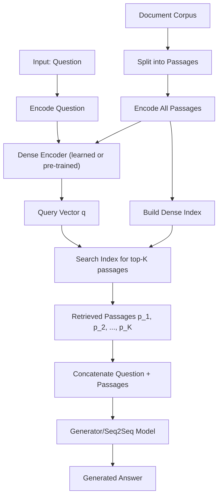

# Retrieval-Augmented Generation (RAG)

## 1. Detailed Explanation

Retrieval-Augmented Generation (RAG) is a hybrid architecture that combines a dense retriever and a sequence-to-sequence generator to answer questions by first retrieving relevant documents and then generating answers conditioned on those documents. Introduced by Lewis et al. (2020), RAG addresses a critical problem in large language models: hallucination and factual incorrectness when the model lacks relevant knowledge.

In production systems, RAG enables knowledge-intensive NLP tasks like open-domain question-answering, fact verification, and cited answer generation. Rather than storing all knowledge in model parameters (which is inefficient and inflexible), RAG maintains an external knowledge base (documents, passages, or paragraphs) and retrieves relevant passages at inference time. The retriever learns a dense representation of documents and questions in a shared space, while the generator (typically a pre-trained sequence-to-sequence model) reads the question and retrieved passages to generate an answer.

The key insight is that separation of concerns—retrieval and generation—enables scaling. A well-tuned retriever (using BM25, dense embeddings, or learned retrieval) can search millions of documents in milliseconds, while the generator focuses on language understanding and answer synthesis. This modularity also makes RAG systems more transparent and updatable than purely parametric models: you can swap retrievers, add new documents without retraining, and track which documents influenced each answer.

RAG's effectiveness depends critically on retriever quality, document chunking strategy, and joint training. Poor retriever decisions (missing relevant documents or retrieving irrelevant ones) directly harm generation. Training both components end-to-end amplifies this: the generator learns to ignore noisy or contradictory retrieved passages, while the retriever learns to optimize for the downstream generation task—not just document relevance in isolation.

---

## 2. Core Intuition

Imagine researching a question without internet access (you'd rely on your pre-trained memory and hallucinate or generalize poorly). Now give yourself a search engine and library access: you search first, skim relevant sources, then synthesize your answer. RAG is exactly this: retrieve first, then reason. The retriever is your search engine (fast, lossy, approximate), and the generator is your synthesis engine (slow, careful, accurate).

---

## 3. How It Works

RAG architecture consists of three key components: retriever, documents, and generator.

**1. Encode all documents into a dense index:**
   - Split documents into passages (typically 100–300 tokens per passage to balance granularity and context).
   - Encode each passage into a fixed-size vector using a dense retriever encoder: `p_vec = encoder(passage)`.
   - Store vectors in an index (e.g., FAISS, Annoy, or DPR-style retriever).

**2. At inference, retrieve documents for a query:**
   - Encode the query: `q_vec = encoder(question)`.
   - Search the index for top-K passages most similar to the query (using cosine similarity, inner product, or learned ranking).
   - Return the K passages with highest similarity scores.

**3. Generate answer from question + retrieved passages:**
   - Concatenate retrieved passages into a context window: `context = passage_1 + passage_2 + ... + passage_K`.
   - Feed to generator: `answer = generator(question, context)`.
   - Generator attends to all three: position embeddings distinguish question from context, cross-attention layers fuse them.

**4. Optional: end-to-end training.**
   - Jointly optimize retriever and generator on downstream tasks (e.g., question-answering).
   - Generator loss backpropagates through retriever scores: the retriever learns to rank documents that lead to correct answers, not just relevance in isolation.



---

## 4. Architecture and Trade-offs

### Retriever Types

| Retriever | Speed | Flexibility | End-to-End Training | Best For |
|-----------|-------|-------------|---------------------|----------|
| BM25 (lexical) | Very fast | High (rule-based) | No | Lexical overlap, small corpora |
| Dense (DPR style) | Fast | Medium (requires re-index) | Yes | Large corpora, semantic mismatch |
| Hybrid (BM25 + dense) | Medium | Medium | Partial | Robustness, best of both worlds |
| Learned-to-rank | Slow | Low (requires model) | Yes | Production ranking, re-ranking |

### Document Chunking Strategy

| Strategy | Pros | Cons | When to Use |
|----------|------|------|------------|
| Fixed size (100-300 tok) | Simple, uniform | May split mid-sentence | Most cases; 256 tokens common |
| Sentence-aware | Preserves structure | Variable sizes | Knowledge bases with long documents |
| Sliding window | Captures context overlap | More passages to index | Dense retrieval for fine-grained retrieval |
| Hierarchical (doc→sect→para) | Levels of granularity | Complex indexing | Multi-scale retrieval (e.g., first retrieve docs, then sections) |

### Ranking vs Generation Trade-off

| Aspect | Top-1 Retrieval | Top-K Retrieval |
|--------|-----------------|-----------------|
| Latency | Low (< 5 ms search) | Higher (need to rank K) |
| Accuracy | Risky (single failure point) | Robust (K chances to include answer) |
| Memory | Small (fewer passages in context) | Large (full K passages in generator) |
| Generator burden | Easier (less noise) | Harder (may need to filter contradictions) |

**Best practice:** Use K=3–5 for most tasks. Larger K (10–20) helps when retriever is weak or documents are short; smaller K saves latency and memory.

### Joint vs Separate Training

| Approach | Pros | Cons | When to Use |
|----------|------|------|------------|
| Separate (pre-trained retriever + generator) | Fast, modular | Retriever may not optimize for generation task | Prototyping, no labeled QA data |
| End-to-end (joint fine-tuning) | Optimal (task-specific) | Slower, requires supervised QA labels | Production, high accuracy required |
| Multi-task (retrieval + generation + ranking) | Maximum signal | Most complex | Scaling to production with rich supervision |

---

## 5. Interview Q&A

**Q: Why is retrieval better than just fine-tuning a large language model on domain knowledge?**
A: Because fine-tuning stores knowledge in parameters (static, requires retraining to update), while retrieval accesses knowledge dynamically. For a 1M document corpus, fine-tuning is infeasible (explodes model size and training cost), but retrieval fetches relevant documents in milliseconds. RAG is also more transparent: you can see which documents influenced the answer and update knowledge without retraining.

**Q: How do you handle retriever errors—when the retriever misses the relevant document?**
A: Three strategies: (1) **Retriever ensemble:** combine BM25 and dense retrieval—if one fails, the other may succeed. (2) **Larger K:** increase top-K passages; if the answer is in top-5, you're more likely to get it. (3) **Generator robustness:** train the generator to recognize when retrieved passages don't contain the answer and abstain gracefully instead of hallucinating. (4) **Re-ranking:** use a learned cross-encoder to re-rank the K passages before feeding to generator.

**Q: How do you choose the right document chunking size?**
A: Start with 256 tokens (roughly one paragraph). If the generator's context window allows it, try 512 tokens—more context often helps. If retrieval accuracy is poor (missing relevant info due to chunking), try sentence-aware chunking or overlapping windows. If latency is a bottleneck, reduce to 128 tokens. Profile with your actual data: measure retrieval precision and end-to-end accuracy vs latency.

**Q: What are failure modes in RAG systems?**
A: (1) **Retriever mismatch:** training on Wikipedia, testing on medical papers—encoders don't transfer. Fix: fine-tune retriever on target domain. (2) **Chunk boundary problems:** answer spans two chunks, retriever returns only one. Fix: use overlap or hierarchical retrieval. (3) **Stale index:** added documents but forgot to re-index. Fix: automate index refresh. (4) **Context window overflow:** K passages + question exceeds max length. Fix: compress passages or truncate carefully.

**Q: How do you scale RAG to millions of documents?**
A: Use approximate nearest neighbor search (FAISS, HNSW). FAISS can handle 1B+ vectors on a single GPU. For billions, shard the index across machines. Latency is crucial: retrievers must return top-K in < 100 ms. Use quantization (int8 embeddings) to reduce memory. Trade-off: denser embeddings (higher quality) vs sparser representations (faster search).

**Q: When would you use sparse (BM25) vs dense retrieval?**
A: BM25 if documents are short with distinct keywords, or if dense encoders haven't been fine-tuned on your domain. Dense if documents are long, require semantic understanding, or you have labeled question-document pairs to fine-tune the encoder. Best: use both (hybrid search) and ensemble scores.

**Q: How do you evaluate RAG system quality?**
A: Measure at two levels: (1) **Retriever:** top-K recall (did the correct document make it to top-K?), precision (are retrieved documents relevant?). (2) **Generator:** answer exact match, BLEU/ROUGE vs ground truth, or human evaluation (factuality, relevance). Report end-to-end metrics: how many questions get a correct, cited answer? This catches the case where retriever works but generator fails.

---

## 6. Best Practices

- **Start with dense retrieval over BM25 for semantic search tasks.** Dense embeddings (BERT-based, contrastive-learned) outperform lexical search for question-answering and semantic matching. BM25 is a good fallback or hybrid partner.

- **Use a pre-trained dense retriever (e.g., DPR, BGE, Sentence-Transformers) and fine-tune on your domain if possible.** Pre-trained encoders have seen diverse text; domain fine-tuning adapts them to your retrieval task. Fine-tune on pairs of (question, relevant_passage) with in-batch negatives.

- **Choose K (top-K passages) based on latency budget, not accuracy alone.** K=3 is often sufficient; K=5–10 adds accuracy but increases latency and token consumption. Measure end-to-end latency at production scale.

- **Implement caching at two levels: (a) embedding cache—cache encoded passages so you don't re-encode them, (b) retrieval result cache—cache queries and their top-K results (for repeated queries).** This reduces latency to < 10 ms for cached queries.

- **Monitor retriever performance in production.** Log which documents were retrieved for each query. Periodically sample queries and manually verify retrieval quality. A degraded retriever can silently hurt generation quality.

- **Use passage-level retrieval, not document-level.** Entire documents (10+ KB) are too noisy for generators; passage-level (200–300 tokens) provides the right granularity. Within large documents, retrieve specific passages.

- **Handle out-of-domain queries gracefully.** If the retriever returns no relevant passages (low similarity scores), the generator should recognize this and return "I don't know" rather than hallucinate. Train the generator with negative examples (questions with no answer in the knowledge base).

- **Re-rank retrieved passages before feeding to the generator if accuracy is critical.** Use a cross-encoder (BERT-style model that scores a question-passage pair) to re-rank. This costs more computation but significantly improves precision.

---

## 7. Common Pitfalls

- **Retriever-generator distribution mismatch:** Pre-trained retriever trained on Wikipedia, generator fine-tuned on biomedical QA. The retriever's embeddings don't align with the generator's needs. Fix: fine-tune the retriever end-to-end on your task or use domain-specific pre-trained models.

- **Concatenating too many passages into context.** If you retrieve K=10 passages of 256 tokens each, you have 2.5K tokens of context plus the question. Some generators (especially small ones like BART-base) have limited context windows (1024 tokens). Truncation or compression is necessary. Fix: measure effective context usage; drop irrelevant passages early.

- **Index staleness:** Documents added to your knowledge base but not re-indexed. Queries return outdated information. Fix: automate index refresh (e.g., daily re-indexing, or use dynamic indexing for new docs).

- **Poor passage boundaries:** A question's answer spans two passages, but the retriever returns only one. E.g., passage 1 says "The capital of France is" and passage 2 says "Paris is in Western Europe." Neither alone is sufficient. Fix: use overlapping passages or retrieve more context around the boundary.

- **Overfitting retriever to training data distribution:** If training questions come from Wikipedia articles, but test questions ask about recent events, the retriever fails (embeddings don't match). Fix: evaluate on held-out domains; augment training with diverse question paraphrases and out-of-domain data.

---

## 8. Code Examples

### Example 1: Basic RAG with Sentence-Transformers and HuggingFace

```python
from sentence_transformers import SentenceTransformer
from transformers import pipeline
import torch

# 1. Encode documents
documents = [
    "Paris is the capital of France, known for the Eiffel Tower.",
    "The Eiffel Tower is 330 meters tall, built in 1889.",
    "France has a population of about 67 million people.",
]
retriever = SentenceTransformer('all-MiniLM-L6-v2')
doc_embeddings = retriever.encode(documents, convert_to_tensor=True)

# 2. Query
question = "What is the capital of France?"
q_embedding = retriever.encode(question, convert_to_tensor=True)

# 3. Retrieve top-K
import torch.nn.functional as F
scores = F.cosine_similarity(q_embedding, doc_embeddings)
top_k_idx = scores.topk(2).indices
retrieved = [documents[i] for i in top_k_idx]

# 4. Generate
generator = pipeline("text2text-generation", model="google/flan-t5-base")
context = " ".join(retrieved)
prompt = f"Question: {question}\nContext: {context}\nAnswer:"
answer = generator(prompt, max_length=50)
print(answer[0]['generated_text'])
```

### Example 2: RAG with Learned Retriever and End-to-End Training

```python
import torch
import torch.nn as nn
import torch.nn.functional as F
from torch.utils.data import DataLoader
from transformers import AutoTokenizer, AutoModel

class RAGRetriever(nn.Module):
    """Dense retriever: encodes question and passages into shared space."""
    def __init__(self, model_name="bert-base-uncased"):
        super().__init__()
        self.encoder = AutoModel.from_pretrained(model_name)
        self.embedding_dim = self.encoder.config.hidden_size

    def forward(self, input_ids, attention_mask):
        outputs = self.encoder(input_ids, attention_mask)
        # Mean pooling over sequence
        embeddings = (outputs.last_hidden_state * 
                     attention_mask.unsqueeze(-1)).sum(1) / attention_mask.sum(-1, keepdim=True)
        # L2 normalize
        return F.normalize(embeddings, dim=-1)

class RAGSystem(nn.Module):
    """Retriever + Generator (simplified)."""
    def __init__(self, retriever, generator, num_passages=5):
        super().__init__()
        self.retriever = retriever
        self.generator = generator
        self.num_passages = num_passages

    def forward(self, question_ids, question_mask, doc_embeddings, doc_ids, doc_mask):
        # Retrieve
        q_emb = self.retriever(question_ids, question_mask)  # (B, D)
        scores = torch.einsum('bd,nd->bn', q_emb, doc_embeddings)  # (B, N)
        top_k_scores, top_k_idx = scores.topk(self.num_passages)  # (B, K)
        
        # Select top-K doc embeddings and tokens (simplified: assume concatenated)
        # In practice, retrieve actual doc tokens and concatenate
        retrieved_logits = self.generator(doc_ids[top_k_idx], doc_mask[top_k_idx])
        return retrieved_logits, top_k_idx

# Usage (pseudo-code for illustration)
tokenizer = AutoTokenizer.from_pretrained("bert-base-uncased")
retriever = RAGRetriever()
generator = AutoModel.from_pretrained("google/flan-t5-base")
rag = RAGSystem(retriever, generator, num_passages=5)

# Training loop: optimize both retriever and generator end-to-end
optimizer = torch.optim.Adam(rag.parameters(), lr=1e-5)
for batch in train_loader:
    logits, top_k_idx = rag(...)
    loss = compute_loss(logits, ground_truth_answers)
    loss.backward()  # Backprop through both retriever and generator
    optimizer.step()
```

### Example 3: RAG with FAISS Index for Scaling

```python
import faiss
import numpy as np
from sentence_transformers import SentenceTransformer

# Encode all documents (offline, pre-computed)
documents = ["doc1 text", "doc2 text", ..., "doc_N text"]
encoder = SentenceTransformer('all-mpnet-base-v2')
doc_embeddings = encoder.encode(documents, convert_to_tensor=False)
doc_embeddings = doc_embeddings.astype('float32')

# Build FAISS index (GPU or CPU)
d = doc_embeddings.shape[1]
index = faiss.IndexFlatL2(d)  # L2 distance
index = faiss.index_factory(d, "IVF1024,Flat")  # Approximate: 1024 clusters
index.train(doc_embeddings)
index.add(doc_embeddings)

# Save index
faiss.write_index(index, "doc_index.faiss")

# At inference: retrieve from index
question = "What is RAG?"
q_emb = encoder.encode(question, convert_to_tensor=False).astype('float32')
k = 5
distances, indices = index.search(q_emb.reshape(1, -1), k)

# Top-K documents
retrieved_docs = [documents[i] for i in indices[0]]
print(f"Retrieved documents: {retrieved_docs}")

# Feed to generator
from transformers import pipeline
gen = pipeline("text2text-generation", model="google/flan-t5-large")
context = " ".join(retrieved_docs)
prompt = f"Question: {question}\nContext: {context}\nAnswer:"
answer = gen(prompt, max_length=100)
print(answer)
```

---

## Related Concepts

- [CLIP: Learning Transferable Visual Models from Natural Language Supervision](./02-clip.md) – Multi-modal retrieval using joint vision-language embeddings
- [Fine-tuning with LoRA](../../../llm/concepts/08-lora.md) – Efficient retriever fine-tuning on domain data
- [Dense Passage Retrieval (DPR)](../../../nlp/concepts/08-information-retrieval.md) – Foundational dense retriever architecture
- [Vector Databases and FAISS](../../../ml/concepts/feature-engineering.md) – Scalable indexing for semantic search
