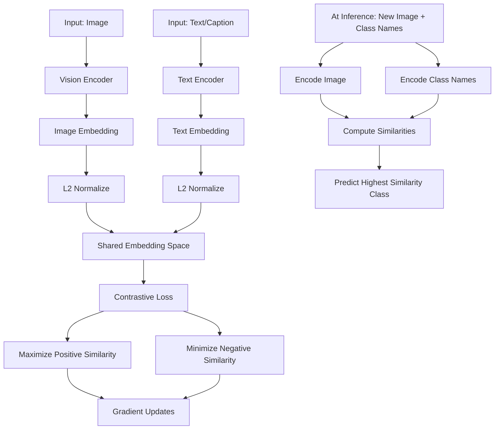

# CLIP: Learning Transferable Visual Models from Natural Language Supervision

## 1. Detailed Explanation

CLIP (Contrastive Language-Image Pre-training), introduced by Radford et al. (2021), learns jointly aligned image and text representations using a simple contrastive loss on web-scale data. Unlike traditional computer vision that trains on labeled datasets with fixed class vocabularies, CLIP learns a shared embedding space where images and natural language descriptions are close when they describe the same concept, far when they don't.

The key innovation is leveraging the web's naturally paired image-text data (image + caption, title, or alt-text) without requiring expensive manual labels. This approach scales to billions of image-text pairs and enables remarkable zero-shot transfer: CLIP can classify images into arbitrary categories by encoding the class name as text and finding the nearest image embedding—no training data or fine-tuning needed for new tasks.

In production systems, CLIP powers image search (encode image, encode query text, find nearest neighbors), content moderation (image understanding without task-specific labels), and zero-shot classification for new categories. The learned representations are so general that simple downstream tasks like linear probing (fitting a classifier on top of frozen CLIP embeddings) often match or exceed task-specific supervised models trained from scratch.

CLIP's effectiveness stems from three factors: (1) **scale of data** (400M image-text pairs from web), (2) **contrastive learning objective** (InfoNCE loss rewards matching pairs, penalizes mismatches), and (3) **architecture simplicity** (standard vision + language encoders with minimal inductive bias). The contrastive approach is more data-efficient than supervised learning because each image-text pair generates a rich signal for what should/shouldn't be similar, compared to a single class label.

---

## 2. Core Intuition

Imagine learning to recognize objects by reading lots of captioned photos. You learn that "a golden dog running on grass" should look like certain visual patterns, while "a blue car driving fast" should look different. Over time, you develop intuitions about what images and text descriptions should "go together"—not by memorizing categories, but by building a mental space where similar concepts (images and their descriptions) are close. CLIP is exactly this: learn a shared mental space for images and text by contrasting what matches against what doesn't.

---

## 3. How It Works

CLIP architecture has two encoders that project images and text into a shared embedding space, optimized via contrastive loss.

**1. Image and Text Encoders:**
   - **Vision encoder:** Standard CNN (ResNet) or Vision Transformer (ViT) encodes images into fixed-size vectors: `img_vec = vision_encoder(image)`.
   - **Text encoder:** Transformer encodes text into fixed-size vectors: `text_vec = text_encoder(caption)`.
   - Both encoders project to the same embedding dimension (e.g., 512D), then L2-normalize to the unit sphere.

**2. Contrastive Learning (InfoNCE Loss):**
   - For a batch of N image-text pairs, create an N×N matrix of similarity scores.
   - Positive pair (i, i): image and its own caption should have high similarity.
   - Negative pairs (i, j where i≠j): image and mismatched captions should have low similarity.
   - Loss: for each anchor (image or text), maximize log-probability of its match among all N possibilities.
   - Formula: L_i = -log [ exp(sim(img_i, text_i) / tau) / Σ_j exp(sim(img_i, text_j) / tau) ]

**3. Zero-Shot Classification at Inference:**
   - Given a new image and class names (e.g., "dog", "cat", "bird"), encode all class names as text.
   - Encode the image.
   - Compute similarity between image and each class text embedding.
   - Predict the class with highest similarity (no training on labeled examples).

**4. Fine-grained Prompting:**
   - Text encoder is sensitive to prompt phrasing. "a photo of a dog" has different embedding than just "dog".
   - At inference, wrap class names in templates: "a photo of a {class_name}" improves accuracy.
   - Ensemble multiple prompts: take average embeddings across templates.



---

## 4. Architecture and Trade-offs

### Vision Backbone Comparison

| Backbone | Speed | Accuracy | Robustness | Best For |
|----------|-------|----------|------------|----------|
| ResNet-50 | Very fast | Good | Moderate | Real-time applications, edge devices |
| ResNet-200 (3x larger) | 3x slower | Excellent | Good | High-accuracy offline tasks |
| ViT-Base | Fast | Good | Better (more robust to distribution shift) | Fine-grained recognition, transfer learning |
| ViT-Large | Slower | Excellent | Excellent | Production systems where accuracy matters |

### Text Encoder Impact

| Text Encoder | Vocabulary | Sensitivity | Compute Cost | Notes |
|--------------|-----------|------------|--------------|-------|
| CLIP with 77 tokens | Large (50K) | High (prompt sensitive) | Moderate | Standard CLIP; requires prompt engineering |
| Longer context (e.g., 256 tokens) | Same | Slightly lower (can use more context) | Higher | Allows longer descriptions but slower at inference |
| Simplified prompts | Same | Lower (prompt-agnostic) | Same | Trade-off: lose some task-specific gains |

### Batch Size and Negative Sampling

| Batch Size | Quality | Convergence | Memory | Comments |
|------------|---------|-------------|--------|----------|
| 32 | Poor (few hard negatives) | Slow | Low | Not recommended for web-scale training |
| 256 | Good | Fast | Medium | Common starting point for fine-tuning |
| 32,768 (CLIP original) | Excellent (all negatives are hard) | Very fast | Very high (requires 8–256 GPUs) | Only feasible with distributed training |

**Key insight:** Larger batches provide stronger negatives (more mismatched pairs to learn from), dramatically improving convergence. CLIP's 32K batch is essential to its performance.

### Contrastive Loss Variants

| Loss Variant | Temperature τ | Pros | Cons | Use Case |
|--------------|---------------|------|------|----------|
| Standard InfoNCE | 0.07 | Sharp similarity distribution | Sensitive to initialization | Pre-training on large-scale data |
| Cosine similarity | Learnable τ | Stable | Slower training | Domain-specific fine-tuning |
| Hard negative mining | 0.07 | Focuses on difficult pairs | Requires mining | When pre-training data is imbalanced |

---

## 5. Interview Q&A

**Q: How does contrastive learning in CLIP differ from supervised classification?**
A: Supervised learning assigns each image one label (categorical cross-entropy). CLIP learns from image-text pairs without explicit category labels—it learns to align modalities. This is more data-efficient (web has billions of image-text pairs, but labeled datasets are millions) and generalizes better (learns general visual concepts, not category-specific). The trade-off is that CLIP requires paired data; supervised learning only needs labels.

**Q: Why is zero-shot transfer in CLIP so effective?**
A: Because CLIP learns a **semantic embedding space** where concepts are represented relationally. "A dog running" and "a dog sitting" are close to the embedding for "dog," but far from "cat." At test time, encoding new class names as text projects them into this space, and you can classify by proximity without seeing training examples. This works because language and vision explore the same semantic concepts.

**Q: How does prompt engineering affect CLIP performance, and why?**
A: Text encoder embeddings are sensitive to phrasing. "dog" ≠ "a photo of a dog" ≠ "a furry dog." The text encoder's attention layers weight tokens differently depending on context. Prompts matter because they disambiguate (e.g., "a photo of" signals this is describing an image), and they can include domain knowledge ("a histopathology image of cancer"). Prompt ensembling (averaging over multiple templates) often yields 2–5% accuracy improvements and reduces prompt sensitivity.

**Q: What breaks CLIP's zero-shot transfer, and how would you fix it?**
A: (1) **Domain shift:** CLIP trained on internet images (diverse, well-lit); test images are medical scans (monochrome, specific anatomy). → Fix: fine-tune on small labeled medical set. (2) **Subtle visual differences:** Distinguishing cancer vs benign tissue requires fine-grained features CLIP may not emphasize. → Fix: add in-domain fine-tuning or expert prompts ("a biopsy showing nuclear abnormalities"). (3) **Missing context:** Image alone isn't sufficient; metadata (patient age, location) helps. → Fix: use multi-modal input (image + metadata).

**Q: How does batch size affect CLIP training, and what's the minimum viable size?**
A: Larger batches provide more negative pairs, sharpening the contrastive signal. CLIP uses 32K (32 images/captions × 1024 GPUs); smaller batches converge slower. **Minimum viable:** experiments suggest 256–512 is acceptable for fine-tuning; pre-training needs 4K–32K. Trade-off: large batches need distributed training (complex) but converge faster; small batches are simple but slow.

**Q: Compare CLIP to a fine-tuned ResNet on ImageNet for a downstream task.**
A: **ResNet:** Higher accuracy on ImageNet (95%+) because it's directly optimized for it. But poor transfer—accuracy drops 20–30% on new domains. **CLIP:** Slightly lower on ImageNet (~88%) but **much** better transfer—only 5–10% drop on new domains because it learned general concepts. Winner depends on task: if you have large labeled data in your domain → fine-tuned ResNet. If data is limited or domain is diverse → CLIP is better.

**Q: Why is CLIP more robust to distribution shift than supervised models?**
A: CLIP's objective (align image and text embeddings) is less sensitive to spurious correlations. Supervised models overfit to dataset biases (e.g., "husky in snow" → husky). CLIP sees "A husky in desert," "A husky in summer," etc., so it learns genuine husky features. Empirically, CLIP maintains 70–80% accuracy on ImageNet-style-shift and ImageNet-sketch (sketches instead of photos), while supervised ResNet drops to ~50%.

---

## 6. Best Practices

- **Start with CLIP embeddings for any vision-language task before building from scratch.** CLIP's pre-trained embeddings are zero-shot competitive and serve as a strong baseline. Linear probing (fit logistic regression on frozen embeddings) often matches supervised baselines.

- **Use prompt ensembling for zero-shot classification.** Encode multiple templates: `["a photo of a {class}", "a {class}", "the {class}"]` and average embeddings. This reduces prompt sensitivity and improves accuracy by 2–5%.

- **Fine-tune image encoder, freeze text encoder for domain adaptation.** The vision model is more task-specific; text encoder generalizes better (it's a transformer that's learned language understanding). Unfreezing both requires more data and regularization.

- **For image search, use approximate nearest neighbor indexing (FAISS, HNSW) on pre-computed embeddings.** CLIP embeddings are fixed-size (512D), so you can pre-compute and index all images once, then search in milliseconds. Don't compute embeddings per query.

- **Monitor and address dataset biases explicitly.** CLIP can amplify biases (e.g., encoding "CEO" with male faces if web data is imbalanced). Audit downstream applications with fairness metrics. Use diverse captions and data sources.

- **Use CLIP for multimodal tasks: image search, zero-shot classification, clustering, and retrieval.** CLIP's strength is connecting modalities; use it when you need to reason across images and text. For single-modality tasks (e.g., pure image classification), supervised models may be faster.

- **Cache embeddings to save compute.** Pre-compute and store image embeddings; at inference, only encode the query (text or image) and do similarity search. Reduces latency from 100s of ms to 10s of ms.

- **Regularize fine-tuning with careful learning rate tuning and early stopping.** Pre-trained embeddings are fragile; aggressive fine-tuning can degrade zero-shot performance. Start with 10x smaller learning rate than supervised models (e.g., 1e-6 instead of 1e-4).

---

## 7. Common Pitfalls

- **Overfitting to downstream task during fine-tuning.** CLIP's strength is generalization; aggressive fine-tuning (high learning rate, many epochs) can reduce zero-shot transfer to new tasks. Monitor zero-shot performance on held-out classes while fine-tuning. Use early stopping based on validation set from original task, not just training loss.

- **Ignoring prompt design.** Using bare class names ("dog") instead of natural prompts ("a photo of a dog") costs 2–10% accuracy. Spend time on prompt engineering; it's the easiest win. Use domain knowledge: "a histology image of cancer" beats "cancer."

- **Applying CLIP without fine-tuning on highly specialized domains.** CLIP trained on web images (natural, photos). For medical imaging, satellite imagery, or domain-specific data, accuracy drops significantly. Always fine-tune on in-domain labeled data, even if small (hundreds of examples).

- **Using small batch sizes for fine-tuning.** CLIP's learning is sensitive to batch composition. If you have limited GPU memory and must use small batches (e.g., 32), accumulate gradients over multiple batches (effective batch size = 32 × 8 = 256).

- **Forgetting to normalize embeddings.** CLIP embeddings should be L2-normalized before similarity computation. Without normalization, magnitudes can dominate distance. Always: `embedding = F.normalize(embedding, dim=-1)` before cosine similarity.

- **Misaligned precomputation.** Encoding images with one encoder checkpoint and text with a different checkpoint (different versions or fine-tuning levels) can fail silently. Always use the **same encoder** for both modalities; consider freezing weights during fine-tuning or carefully managing version control.

- **Hallucinating on out-of-distribution data.** CLIP returns the closest match even for images far from training distribution. If you classify a random noise image, it'll pick a class; it won't abstain. Add a confidence threshold: if max similarity < threshold, return "unknown" instead of forcing a prediction.

---

## 8. Code Examples

### Example 1: Zero-Shot Classification with Pre-trained CLIP

```python
import torch
from transformers import CLIPProcessor, CLIPModel
from PIL import Image
import requests

# Load pre-trained CLIP
model = CLIPModel.from_pretrained("openai/clip-vit-base-patch32")
processor = CLIPProcessor.from_pretrained("openai/clip-vit-base-patch32")

# Load an image from URL
url = "http://images.cocodataset.org/val2017/000000039769.jpg"
image = Image.open(requests.get(url, stream=True).raw)

# Define class labels with prompts
classes = ["a dog", "a cat", "a bird"]
prompts = [f"a photo of {cls}" for cls in classes]

# Encode image and prompts
inputs = processor(text=prompts, images=image, return_tensors="pt", padding=True)
outputs = model(**inputs)

# Compute logits
logits_per_image = outputs.logits_per_image
probabilities = logits_per_image.softmax(dim=1)

# Predict
predicted_class_idx = probabilities.argmax().item()
print(f"Predicted class: {classes[predicted_class_idx]}")
print(f"Confidence: {probabilities[0][predicted_class_idx]:.2%}")
```

### Example 2: Fine-tuning CLIP for Domain-Specific Tasks

```python
import torch
import torch.nn.functional as F
from transformers import CLIPModel, CLIPProcessor
from torch.utils.data import DataLoader, Dataset

class ImageTextDataset(Dataset):
    """Custom dataset of images and captions."""
    def __init__(self, image_paths, captions):
        self.image_paths = image_paths
        self.captions = captions

    def __len__(self):
        return len(self.image_paths)

    def __getitem__(self, idx):
        return {
            'image_path': self.image_paths[idx],
            'caption': self.captions[idx]
        }

# Load model and processor
model = CLIPModel.from_pretrained("openai/clip-vit-base-patch32")
processor = CLIPProcessor.from_pretrained("openai/clip-vit-base-patch32")
device = torch.device("cuda" if torch.cuda.is_available() else "cpu")
model.to(device)

# Freeze text encoder, fine-tune vision encoder
for param in model.text_model.parameters():
    param.requires_grad = False
for param in model.vision_model.parameters():
    param.requires_grad = True

# Optimizer: only vision encoder
optimizer = torch.optim.Adam(model.vision_model.parameters(), lr=1e-6)

# Training loop (simplified)
dataset = ImageTextDataset(image_paths=["img1.jpg"], captions=["a dog"])
dataloader = DataLoader(dataset, batch_size=32)

for epoch in range(10):
    for batch in dataloader:
        # Load images and process
        from PIL import Image
        images = [Image.open(p) for p in batch['image_path']]
        texts = batch['caption']
        
        inputs = processor(text=texts, images=images, return_tensors="pt", 
                          padding=True, truncation=True)
        inputs = {k: v.to(device) for k, v in inputs.items()}
        
        outputs = model(**inputs)
        
        # InfoNCE loss: maximize logits for matching pairs
        logits = outputs.logits_per_image
        labels = torch.arange(len(texts), device=device)
        loss = F.cross_entropy(logits, labels)
        
        loss.backward()
        optimizer.step()
        optimizer.zero_grad()
        
        print(f"Epoch {epoch+1}, Loss: {loss.item():.4f}")
```

### Example 3: CLIP for Image-Text Retrieval (Semantic Search)

```python
import torch
import numpy as np
import faiss
from transformers import CLIPModel, CLIPProcessor
from PIL import Image

# Pre-compute embeddings for a corpus of images
model = CLIPModel.from_pretrained("openai/clip-vit-base-patch32")
processor = CLIPProcessor.from_pretrained("openai/clip-vit-base-patch32")
device = torch.device("cuda")
model.to(device).eval()

# Encode all images in corpus (offline)
corpus_images = ["image1.jpg", "image2.jpg", "image3.jpg"]  # Your image paths
image_embeddings = []

with torch.no_grad():
    for img_path in corpus_images:
        image = Image.open(img_path)
        inputs = processor(images=image, return_tensors="pt").to(device)
        embedding = model.get_image_features(**inputs)
        embedding = embedding / embedding.norm(dim=-1, keepdim=True)
        image_embeddings.append(embedding.cpu().numpy())

image_embeddings = np.vstack(image_embeddings)  # (N, 512)

# Build FAISS index
d = image_embeddings.shape[1]
index = faiss.IndexFlatIP(d)  # Inner product (works with L2-norm)
index.add(image_embeddings)

# At inference: search by text query
query_text = "a dog playing in the park"
with torch.no_grad():
    inputs = processor(text=query_text, return_tensors="pt").to(device)
    query_embedding = model.get_text_features(**inputs)
    query_embedding = query_embedding / query_embedding.norm(dim=-1, keepdim=True)

# Search
k = 5  # Return top-5 images
scores, indices = index.search(query_embedding.cpu().numpy(), k)
print(f"Top-{k} images for query '{query_text}':")
for rank, idx in enumerate(indices[0], 1):
    print(f"  {rank}. {corpus_images[idx]} (score={scores[0][rank-1]:.3f})")
```

---

## Related Concepts

- [Contrastive Learning Fundamentals](../../../ai/concepts/xx-contrastive-learning.md) – NT-Xent loss, positive/negative pairs, temperature
- [Multimodal Transformers](../../../llm/concepts/xx-multimodal-transformers.md) – Architectures for vision + language fusion
- [Vision Transformers (ViT)](../../../cv/concepts/xx-vision-transformers.md) – Alternative to CNNs for image encoding
- [Zero-Shot Learning](../../../ml/concepts/xx-zero-shot-learning.md) – Generalizing to unseen categories without training
