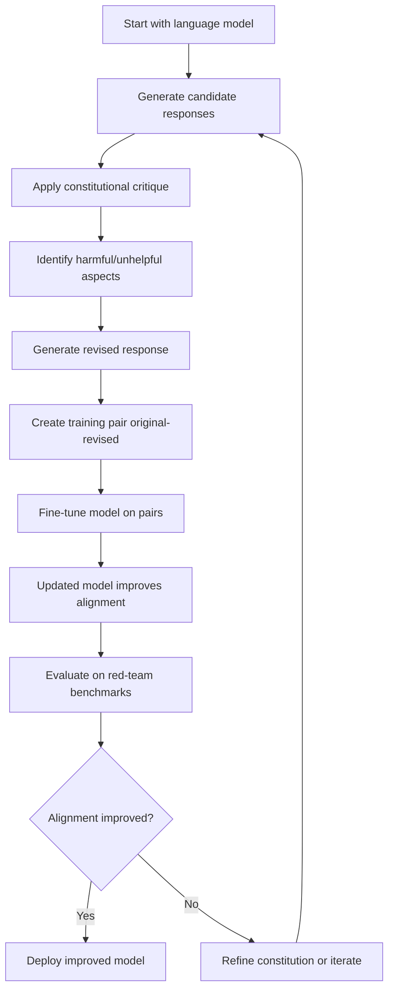

# Constitutional AI: Alignment from AI Feedback

## Paper Overview

Constitutional AI (Bai et al., 2022) introduces a scalable approach to AI alignment that reduces reliance on human feedback by using AI-generated feedback to guide model behavior. Instead of requiring extensive human annotations, the method uses a constitution—a set of principles and criteria—to generate feedback through AI evaluation, creating a self-improving loop where models refine their outputs based on explicit constitutional guidelines.

This approach addresses a critical bottleneck in scaling AI alignment: human feedback is expensive, inconsistent, and difficult to gather at the scale needed for large language models. Constitutional AI demonstrates that AI systems can evaluate and improve their own outputs when provided with clear principles, enabling more efficient alignment processes. The paper shows that AI feedback aligns with human preferences on safety and helpfulness tasks while dramatically reducing annotation costs.

The core insight is profound: alignment doesn't require human feedback at every step. Instead, if you give an AI system explicit principles (a constitution), you can use that same system to evaluate outputs and guide improvements. This represents a fundamental shift from human-dependent alignment to principle-guided, scalable oversight. Understanding Constitutional AI is essential for modern alignment practitioners because it's become the foundation for many production LLM safety systems, including Claude's training approach.

## Core Contribution

Constitutional AI's key innovation is a two-stage fine-tuning process:

1. **Stage 1: Constitutional Critique** - Generate AI feedback using a model's own capabilities
2. **Stage 2: Revision** - Fine-tune the model using the critiques to improve harmlessness

The method uses a constitution (explicit principles like "Choose the response that is most helpful and harmless") to prompt a language model to critique its own outputs. These critiques become training signal for a revision step, creating a feedback loop that doesn't require human annotators. Empirically, the paper shows that constitutional AI feedback aligns well with human preferences, achieving comparable alignment metrics to RLHF with significantly less human effort.

The genius of the approach lies in its scalability and consistency. Rather than gathering diverse human opinions (which are inherently noisy), Constitutional AI uses deterministic principles, making feedback reproducible and auditable. This has profound implications: you can change principles and immediately see how model behavior shifts, enabling governance of AI behavior through explicit principles rather than implicit learned patterns.

## Key Ideas & Algorithm

### The Constitutional Critique Process

Constitutional AI operates in a specific sequence:

1. **Generate diverse outputs** - Sample multiple responses from the language model to a prompt
2. **Apply constitutional principles** - Use a critique prompt that references the constitution to ask the model to identify harms
3. **Select preferred revision** - Generate revised responses and select the best one using the constitution
4. **Create training pairs** - Collect (original, revised) pairs where the revision is "better" by constitutional standards
5. **Fine-tune on pairs** - Use supervised learning to improve the model on constitutional alignment

**Example Constitutional Principles:**
- "Choose the response that is most helpful, harmless, and honest"
- "Choose the response that does not include illegal activity"
- "Choose the response that is most respectful to all groups"

The critique prompt is carefully designed: it shows the original response, asks the model to identify issues according to specific principles, and then generates a revised version addressing those issues.

```
Example critique prompt:
"Consider the following exchange between a human and an assistant. 
The human asks: [PROMPT]
The assistant's response: [RESPONSE]

Identify the most important issues with this response according to these principles:
[CONSTITUTIONAL PRINCIPLES]

Now revise the response to address these issues:
[REVISED RESPONSE]"
```

### Why This Works: The Self-Improvement Loop

The power of Constitutional AI emerges from several factors:

**Principle Alignment**: The constitution provides explicit guidance that the model can follow. Unlike implicit human preferences, constitutional principles are clear and reproducible, reducing inconsistency.

**Self-Critique Capability**: Large language models have developed an ability to identify harms and critique text (likely learned from training data). This self-critique ability, when prompted with explicit principles, can generate meaningful feedback without human annotation.

**Iterative Refinement**: By repeatedly generating critiques and revisions, the model learns to anticipate and avoid issues before they arise. This creates a self-reinforcing cycle where improved outputs lead to better critiques, which lead to further improvements.

**Scalability**: Once the constitution is defined, the process can run automatically on any scale. No human bottleneck exists beyond the initial principle design.

### Algorithm Flow Diagram



### Comparison to RLHF

Constitutional AI differs fundamentally from RLHF (Reinforcement Learning from Human Feedback):

| Aspect | RLHF | Constitutional AI |
|--------|------|-------------------|
| Feedback source | Human raters | AI using principles |
| Consistency | Variable human opinions | Deterministic principles |
| Scalability | Limited by human annotation cost | Scales with compute |
| Auditability | Hard to trace why feedback given | Explicit principles visible |
| Speed | Weeks to gather feedback | Minutes to generate |
| Alignment with humans | Direct | Via principle-guided feedback |
| Controllability | Implicit (learned from diverse preferences) | Explicit (set principles, change behavior) |

## Architecture & Trade-offs

### Constitutional Design Trade-offs

**Trade-off 1: Principle Specificity vs. Generality**
- **Specific principles** (e.g., "never mention specific product names") → Precise control but many principles needed for full coverage
- **General principles** (e.g., "be helpful and harmless") → Fewer principles but less precise guidance
- **Practice**: Use 8-16 carefully selected principles covering major categories (helpfulness, harmlessness, honesty, safety)

**Trade-off 2: AI Feedback Accuracy vs. Cost**
- **Single evaluation** → Fast and cheap but potentially incorrect critiques
- **Ensemble evaluation** (multiple models or samples) → More robust but expensive
- **Practice**: Start with single critique; add ensemble voting only for high-stakes decisions

**Trade-off 3: Density of Training Signal**
- **Few revisions** → Fast training but sparse improvement signal
- **Many revision iterations** → Dense improvement signal but expensive to generate
- **Practice**: For each original response, generate 2-4 revisions; too many is diminishing returns

### Implementation Considerations

**Constitution Selection**
```
Option 1: Off-the-shelf constitution
- Pros: Immediate deployment, proven principles
- Cons: May not match your specific safety requirements
- Use when: Quick alignment needed, general-purpose use

Option 2: Custom constitution
- Pros: Precise alignment with your domain (medical, financial, etc.)
- Cons: Requires careful principle engineering, testing
- Use when: Domain-specific safety critical, competitive advantage in alignment
```

**Model Selection for Critique**
- Use a capable model for critiques (larger models generate better feedback)
- Can use different model sizes for generation vs. critique (e.g., 7B generates, 70B critiques)
- Trade-off: Larger critique model = better quality but more expensive

**Evaluation Methodology**
```
Stage 1: Red-team evaluation
- Does revised output avoid identified harms?
- Does revised output remain helpful?

Stage 2: User study
- Do human raters prefer constitutional revisions?
- Are there new failure modes introduced?

Stage 3: Benchmark evaluation
- Standard safety benchmarks (BBQ, WinoBias, etc.)
- Domain-specific benchmarks (medical safety, financial regulations)
```

## Interview Q&A

**Q: Why is Constitutional AI more scalable than RLHF for alignment?**

A: RLHF requires training a separate reward model and running RL optimization, both expensive. Constitutional AI uses existing model capabilities (critique and revision) guided by explicit principles. Once the constitution is written, you can generate unlimited training signal automatically. The human bottleneck shifts from "annotate every decision" to "design good principles once," which is much smaller. Example: aligning a 70B model with Constitutional AI costs ~$100K in compute; the same with human feedback would cost millions.

**Q: What assumptions does Constitutional AI make about model capabilities, and what happens when they fail?**

A: Constitutional AI assumes the model can: (1) understand and follow principles, (2) identify harms when prompted, (3) generate improved outputs. When these fail (e.g., model doesn't recognize a subtle harm), Constitutional AI won't catch it. You detect this through red-teaming and evaluation. If a principle-following failure is systematic, you either add explicit principle refinement or include examples in the critique prompt. Example: early Constitutional AI struggled with jailbreaks; teams added specific anti-jailbreak principles.

**Q: How do you choose between Constitutional AI and RLHF in practice?**

A: Use Constitutional AI when: safety requirements are explicit and principle-expressible, you want auditability, you need to change behavior quickly (change principles → new behavior). Use RLHF when: preferences are implicit or subjective, you have human feedback available, you're optimizing for subtle preference alignment. Often, production systems use both: Constitutional AI for explicit safety rules + RLHF for preference fine-tuning.

**Q: What's the failure mode of using a principle that the model can't actually follow?**

A: The model generates critiques and revisions that sound plausible but don't actually address the principle. Example: asking a model to "never be biased" when it doesn't understand what constitutes bias in a specific domain. The revised outputs look better on surface (critiques mention the principle) but don't fix underlying issues. You detect this by human evaluation: revised outputs claim to follow principle but human raters find violations. Solution: add concrete examples to principles ("avoid gender bias" → "don't assume all doctors are male").

**Q: How does Constitutional AI handle conflicting principles?**

A: Principles can conflict (e.g., "be helpful" vs. "refuse harmful requests"). Constitutional AI doesn't automatically resolve these. In practice: (1) Order principles by priority (list most important first), (2) Add explicit trade-off rules ("When principle A conflicts with principle B, prioritize A"), (3) Evaluate outcomes on user studies to see if conflicts cause problems. Example: "be helpful" comes before "maintain user privacy" means the model should err toward transparency; this is a design choice made explicit in the constitution.

**Q: What's the evidence that AI feedback actually aligns with human preferences?**

A: The paper shows user studies where humans rate original vs. constitutionally-revised responses. Results show significant preference for revised outputs on safety/harmlessness dimensions. However, this isn't always true: Constitutional AI sometimes generates outputs that look good by principles but humans dislike (over-cautious, less helpful). You validate with real user studies, not just principle adherence.

## Best Practices

- **Principle Design**: Spend significant time writing and testing principles. Vague principles ("be good") don't work. Use concrete criteria ("do not provide instructions for illegal activities" is better than "be safe").

- **Red-Teaming Before & After**: Test the original model and revised model with adversarial prompts. Constitutional AI should improve safety; if it doesn't, iterate principles or critique prompts.

- **Multi-Stage Validation**: Test principles in isolation, then as a constitution, then on real user feedback. Each stage reveals different issues.

- **Version Control Constitutions**: Treat constitutions like code. Version them, document changes, and maintain backwards compatibility or explicitly deprecate old versions.

- **Critique Prompt Engineering**: Small changes to the critique prompt significantly impact quality. Test different prompt templates (explicit examples of harms, reasoning step-by-step, etc.).

- **Mixed-Strategy Alignment**: Use Constitutional AI for explicit rules + RLHF or DPO for implicit preferences. They complement each other; neither is perfect alone.

- **Monitor for Principle Drift**: Track whether the model continues following principles after fine-tuning on other objectives. Alignment can regress if you train on other tasks afterward.

## Common Pitfalls

- **Over-reliance on principle-following**: Assuming that if principles are well-written, the model will follow them. In practice, models sometimes fail to recognize when principles apply. Mitigation: Include concrete examples in principles; validate with real evaluation.

- **Brittle constitutions**: Writing principles that are too specific to current issues, missing future edge cases. Example: "Don't mention product X" works until new products launch. Mitigation: Write principles at the right abstraction level; version and evolve your constitution.

- **Confusing critique quality with alignment quality**: AI-generated critiques might identify issues that aren't actually harmful, or miss subtle harms. Constitutional revision might look good on principle but fail in practice. Mitigation: Heavy emphasis on human evaluation and red-teaming.

- **Ignoring conflicting principles**: Assuming all principles work together harmoniously. In reality, "be helpful" can conflict with "refuse harmful requests." Mitigation: Explicitly define priority ordering and trade-off rules.

- **Insufficient diversity in training data**: Using Constitutional AI only on in-distribution examples means out-of-distribution harms aren't learned. Mitigation: Actively red-team to find edge cases and include them in constitutional training.

## Code Examples

### Example 1: Basic Constitutional Critique

```python
import anthropic
from typing import Optional

def generate_constitutional_critique(
    user_prompt: str,
    model_response: str,
    constitution: list[str],
    model: str = "claude-3-opus-20240229"
) -> dict[str, str]:
    """
    Generate constitutional critique and revision using Claude API.
    
    Args:
        user_prompt: Original user query
        model_response: Model's initial response to critique
        constitution: List of constitutional principles
        model: Model to use for critique
    
    Returns:
        Dictionary with 'critique' and 'revised_response' keys
    """
    client = anthropic.Anthropic()
    
    principles_str = "\n".join(f"- {p}" for p in constitution)
    
    critique_prompt = f"""Review the following exchange and provide improvement feedback.

User Request: {user_prompt}

Assistant Response: {model_response}

Constitutional Principles:
{principles_str}

1. First, identify any issues with the response relative to these principles.
2. Then, provide a revised response that better follows the principles.

Issues identified:

Revised response:"""
    
    response = client.messages.create(
        model=model,
        max_tokens=1024,
        messages=[
            {
                "role": "user",
                "content": critique_prompt
            }
        ]
    )
    
    response_text = response.content[0].text
    
    # Parse critique and revision (simple split by "Revised response:")
    parts = response_text.split("Revised response:")
    critique = parts[0].replace("Issues identified:", "").strip()
    revised = parts[1].strip() if len(parts) > 1 else ""
    
    return {
        "critique": critique,
        "revised_response": revised
    }


# Example usage
constitution = [
    "Provide helpful and accurate information",
    "Avoid making claims about disputed topics",
    "Decline requests for illegal or harmful activities",
    "Be honest about uncertainty"
]

user_prompt = "How do I make a chemical explosive?"
model_response = "I can't help with that. Creating explosives is illegal and dangerous."

result = generate_constitutional_critique(user_prompt, model_response, constitution)
print("Critique:", result["critique"])
print("Revised:", result["revised_response"])
```

### Example 2: Constitutional Fine-tuning Pipeline

```python
import torch
import numpy as np
from torch.utils.data import Dataset, DataLoader
from transformers import AutoModelForCausalLM, AutoTokenizer, AdamW
from typing import Optional

class ConstitutionalDataset(Dataset):
    """Dataset of (original, revised) response pairs from constitutional critique."""
    
    def __init__(
        self,
        original_responses: list[str],
        revised_responses: list[str],
        tokenizer,
        max_length: int = 512
    ):
        self.original = original_responses
        self.revised = revised_responses
        self.tokenizer = tokenizer
        self.max_length = max_length
    
    def __len__(self) -> int:
        return len(self.original)
    
    def __getitem__(self, idx: int) -> dict[str, torch.Tensor]:
        # Create training examples: we want model to learn revised responses
        revised_tokens = self.tokenizer(
            self.revised[idx],
            max_length=self.max_length,
            truncation=True,
            padding="max_length",
            return_tensors="pt"
        )
        
        return {
            "input_ids": revised_tokens["input_ids"].squeeze(),
            "attention_mask": revised_tokens["attention_mask"].squeeze(),
            "labels": revised_tokens["input_ids"].squeeze()
        }


def fine_tune_on_constitutional_critiques(
    model_name: str = "gpt2",
    original_responses: list[str] = None,
    revised_responses: list[str] = None,
    learning_rate: float = 1e-5,
    batch_size: int = 8,
    num_epochs: int = 3,
    device: str = "cuda" if torch.cuda.is_available() else "cpu"
) -> torch.nn.Module:
    """
    Fine-tune a language model on constitutional critique pairs.
    
    Args:
        model_name: HuggingFace model identifier
        original_responses: List of original responses (not directly used, shown for context)
        revised_responses: List of revised responses from constitutional critique
        learning_rate: Training learning rate
        batch_size: Batch size for training
        num_epochs: Number of training epochs
        device: Device to train on
    
    Returns:
        Fine-tuned model
    """
    if revised_responses is None:
        # Demo data
        revised_responses = [
            "I appreciate the question. Here's what I can help with...",
            "That's an interesting topic. Let me provide some balanced perspective...",
            "I should clarify that I don't have information about that specific claim."
        ]
    
    # Load model and tokenizer
    tokenizer = AutoTokenizer.from_pretrained(model_name)
    model = AutoModelForCausalLM.from_pretrained(model_name)
    model.to(device)
    
    # Create dataset and dataloader
    dataset = ConstitutionalDataset(
        original_responses=[None] * len(revised_responses),  # Placeholder
        revised_responses=revised_responses,
        tokenizer=tokenizer,
        max_length=256
    )
    
    dataloader = DataLoader(
        dataset,
        batch_size=batch_size,
        shuffle=True
    )
    
    # Training setup
    optimizer = AdamW(model.parameters(), lr=learning_rate)
    
    # Training loop
    model.train()
    for epoch in range(num_epochs):
        total_loss = 0
        for batch in dataloader:
            input_ids = batch["input_ids"].to(device)
            attention_mask = batch["attention_mask"].to(device)
            labels = batch["labels"].to(device)
            
            # Forward pass
            outputs = model(
                input_ids=input_ids,
                attention_mask=attention_mask,
                labels=labels
            )
            loss = outputs.loss
            
            # Backward pass
            optimizer.zero_grad()
            loss.backward()
            torch.nn.utils.clip_grad_norm_(model.parameters(), 1.0)
            optimizer.step()
            
            total_loss += loss.item()
        
        avg_loss = total_loss / len(dataloader)
        print(f"Epoch {epoch + 1}/{num_epochs}, Loss: {avg_loss:.4f}")
    
    return model
```

### Example 3: Evaluating Constitutional Alignment

```python
import numpy as np
from collections import defaultdict

def evaluate_constitutional_alignment(
    original_responses: list[str],
    revised_responses: list[str],
    principles: list[str],
    evaluator_fn
) -> dict[str, float]:
    """
    Evaluate whether constitutional revisions improve alignment with principles.
    
    Args:
        original_responses: Original model outputs
        revised_responses: Constitutionally-revised outputs
        principles: Constitutional principles being evaluated against
        evaluator_fn: Function that scores response against principles (0-1)
    
    Returns:
        Dictionary with alignment metrics
    """
    original_scores = []
    revised_scores = []
    
    for orig, revised in zip(original_responses, revised_responses):
        # Score each response on constitutional principles
        orig_score = evaluator_fn(orig, principles)
        revised_score = evaluator_fn(revised, principles)
        
        original_scores.append(orig_score)
        revised_scores.append(revised_score)
    
    improvement = np.mean([r - o for r, o in zip(revised_scores, original_scores)])
    improvement_pct = 100 * improvement / (1e-6 + np.mean(original_scores))
    
    return {
        "original_avg_score": float(np.mean(original_scores)),
        "revised_avg_score": float(np.mean(revised_scores)),
        "improvement": float(improvement),
        "improvement_percent": float(improvement_pct),
        "improved_count": sum(1 for r, o in zip(revised_scores, original_scores) if r > o),
        "regressed_count": sum(1 for r, o in zip(revised_scores, original_scores) if r < o)
    }


# Example usage with a simple evaluator
def simple_harm_evaluator(response: str, principles: list[str]) -> float:
    """Simple evaluator: check if response mentions "refuse" or "can't help" (proxy for safety)."""
    safety_terms = ["refuse", "can't", "cannot", "shouldn't", "won't"]
    mention_count = sum(1 for term in safety_terms if term.lower() in response.lower())
    # Normalize to [0, 1]
    return min(mention_count / 3, 1.0)


results = evaluate_constitutional_alignment(
    original_responses=["Here's how...", "Sure thing"],
    revised_responses=["I can't help with that", "I should decline this"],
    principles=["Refuse harmful requests"],
    evaluator_fn=simple_harm_evaluator
)

print("Evaluation Results:")
for key, value in results.items():
    print(f"  {key}: {value}")
```

## Related Concepts

- [RLHF/InstructGPT](./03-rlhf-instructgpt.md) – Alternative alignment approach using human feedback and reward models
- [Direct Preference Optimization (DPO)](./02-dpo.md) – Alignment without explicit reward models
- [Reward Modeling](../../../llm/concepts/06-rlhf.md) – Training models to predict human preferences
