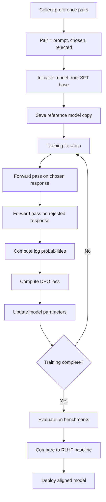

# Direct Preference Optimization: Aligning Language Models Without Reward Models

## Paper Overview

Direct Preference Optimization (DPO, Rafailov et al., 2023) revolutionizes alignment by eliminating the need for explicit reward model training. Traditional RLHF requires a separate reward model and complex RL optimization. DPO instead directly optimizes language models on preference pairs, making it simpler, more stable, and significantly more efficient than RLHF while achieving comparable or better alignment results.

The key insight is elegant: you don't need an intermediate reward model. Instead, you can directly optimize the language model using a contrastive loss that encourages preferred responses and discourages dispreferred ones. This simplification has profound practical implications: faster training, less memory required, no RL instability, and more direct control over model behavior.

Understanding DPO is critical for modern alignment because it has become the default choice for preference-based fine-tuning. Major models now use DPO or variants instead of full RLHF pipelines. The paper demonstrates that DPO achieves better downstream performance than RLHF while being 10-100x more efficient to train. For interview candidates, DPO represents the current state-of-the-art in efficient, stable alignment.

## Core Contribution

DPO's breakthrough is a mathematically elegant reformulation of the alignment problem. Instead of the traditional RLHF pipeline:

1. Train reward model R(x, y) on preference pairs
2. Run RL (PPO) to maximize reward

DPO does:

1. Directly optimize language model on preference pairs using a contrastive loss
2. No intermediate reward model training needed

The mathematical insight comes from rearranging the RLHF objective. RLHF optimizes:

```
max E_x [R(x, y) - β log(π(y|x) / π_ref(y|x))]
```

By solving for the optimal reward function and substituting it back, you get a closed-form objective that depends only on the reference model and preference pairs, not an explicit reward model. This enables direct optimization without RL complexity.

Empirically, DPO matches or exceeds RLHF performance on standard benchmarks (AlpacaEval, TruthfulQA, GSM8K) while requiring:
- 50% less memory (no separate reward model)
- 10-100x faster training (no RL sampling)
- No RL instability (stable supervised learning objective)
- More direct interpretability (preferences directly shape behavior)

## Key Ideas & Algorithm

### The DPO Loss Function

DPO optimizes a preference-based loss that directly encourages the model to prefer chosen responses over rejected ones:

```
L_DPO(π_θ; π_ref) = -E[(x,y_w,y_l)][log σ(β log(π_θ(y_w|x) / π_ref(y_w|x)) - β log(π_θ(y_l|x) / π_ref(y_l|x)))]
```

Where:
- σ is the sigmoid function
- β (beta) is a temperature parameter controlling preference strength
- π_θ is the model being optimized
- π_ref is a reference model (usually the initial model)
- y_w is the chosen/preferred response
- y_l is the rejected/dispreferred response

**In plain English**: The loss encourages the ratio of preferred/unpreferred log probabilities under the optimized model to be higher than under the reference model, adjusted by a temperature parameter β.

### Why This Works Better Than RLHF

| Aspect | RLHF | DPO |
|--------|------|-----|
| Reward model training | Separate stage, requires annotations | No separate model |
| Objective | Maximize reward from another model | Optimize preferences directly |
| Optimization | RL (PPO), complex sampling | Supervised learning, simple gradient descent |
| Stability | RL instability, reward hacking | Supervised learning stability |
| Interpretability | Learned reward function (black box) | Explicit preference optimization |
| Speed | Weeks of training | Days to hours |
| Memory | Reward model + policy + KL tracking | Just model + reference model |
| Preference alignment | Indirect (via reward model) | Direct |

### The Mathematical Insight

The genius of DPO lies in the derivation. Starting from the KL-constrained RL objective:

```
max π E_x[E_y~π(·|x)[R(x,y)] - β KL(π(·|x) || π_ref(·|x))]
```

You can solve for the optimal reward function at the optimum and obtain:

```
R*(x,y) = β log(π*(y|x) / π_ref(y|x)) + constant
```

Substituting back into the preference probability model:

```
P(y_w > y_l | x) = σ(R(x, y_w) - R(x, y_l))
```

You get the DPO loss that depends only on π_θ, π_ref, and preference pairs—no explicit R needed.

### Algorithm Flow



### Preference Data Collection

Unlike RLHF which requires careful reward model training, DPO works directly on preference pairs. Collection methods:

**Method 1: Implicit Preferences**
- Generate two responses for each prompt
- Use heuristics to determine preference (length, safety score, task accuracy)
- Faster, cheaper, but potentially noisier

**Method 2: Human Preference Annotation**
- Show two responses to human raters
- Collect explicit preference (which is better?)
- More expensive but higher quality signal

**Method 3: Synthetic Preferences**
- Use an existing strong model (like Claude) to rate responses
- Can generate unlimited preference pairs
- Quality depends on rater model quality

## Architecture & Trade-offs

### Hyperparameter β (Beta)

Beta controls how strongly to enforce preference in training:

```
β = 0.1: Soft preferences (allow some model flexibility)
→ Use when: Diverse responses acceptable, prevent overfitting to preferences

β = 0.5: Moderate enforcement (standard)
→ Use when: Clear preference signal, general alignment

β = 1.0+: Hard enforcement (strict alignment)
→ Use when: Critical safety constraints, must follow preferences precisely
```

**Trade-off**: Higher β = stronger preference alignment but increased risk of:
- Mode collapse (all responses become similar)
- Reduced diversity
- Overfitting to preference signal

### Reference Model Strategy

| Strategy | Pros | Cons | When to use |
|----------|------|------|------------|
| Use initial SFT model as reference | Simple, maintains natural distributions | Large π_θ/π_ref ratio can cause instability | General case, good starting point |
| Use model checkpoint from early training | Balances stability with improvement | Requires saving checkpoints | Sensitive domains (medical, legal) |
| Use stronger model as reference | Provides implicit supervision | More compute, reference drift | When baseline model is weak |

### Comparison: DPO vs. RLHF

**DPO Advantages:**
- Simpler pipeline (no reward model training)
- Faster (10-100x speedup)
- More stable (supervised learning, not RL)
- More efficient memory usage
- More interpretable (explicit preference optimization)

**RLHF Advantages:**
- Well-established methodology
- Can optimize for complex multi-step objectives (step-by-step reasoning)
- Reward model provides reusable signal (can use for multiple models)
- Larger body of empirical evidence
- Better for multi-objective optimization (can weight different rewards)

**When to choose:**
- **Use DPO for**: Single-objective alignment, limited compute budget, rapid iteration, safety constraints
- **Use RLHF for**: Multi-step reasoning tasks, multi-objective optimization, when you have existing reward models

### Scaling Considerations

| Component | Linear Scaling | Quadratic Scaling | Notes |
|-----------|---------------|--------------------|-------|
| Preference pair collection | Yes | No | Collect N pairs for N training steps |
| Training computational cost | Yes | No | Linear in batch size, num steps |
| Memory usage | Yes | No | Batch size dominates, reference model overhead |
| Quality as N→∞ | Improving with diminishing returns | - | More pairs help but with log improvement |

## Interview Q&A

**Q: Why doesn't DPO need a separate reward model like RLHF?**

A: DPO comes from a mathematical rearrangement of the RLHF objective. You can solve for the optimal reward function in closed form—it's just a function of the policy ratio π_θ/π_ref and the preference data. Substituting this closed-form reward back into the objective gives you a loss that only depends on the policy and preference pairs. No intermediate reward model is needed. This is powerful because it eliminates an entire training stage.

**Q: What's the risk of DPO mode collapse, and when does it actually happen?**

A: Mode collapse occurs when the model learns to always output the same "safe" response to all prompts. It happens when β is too high (over-enforcement of preferences) or when preference data is biased (e.g., all preferred responses are cautious). You detect it by sampling multiple responses to prompts and checking diversity. Mitigation: use moderate β (0.3-0.5), ensure diverse preferences in training data, or include diversity as an explicit metric during evaluation.

**Q: How does DPO handle ambiguous preferences (cases where both responses are equally good)?**

A: DPO loss still tries to push the preferred response higher, even if preferences are weak. With weak/noisy preferences, you get weak learning signals. This isn't always bad—it allows flexibility. But if preferences are genuinely ambiguous, DPO will overfit to noise. Detection: human evaluation should show comparable quality between chosen/rejected pairs. Fix: filter training data to remove ambiguous pairs, or use softer preference signals (not binary win/loss).

**Q: What's the relationship between β and overfitting to preference data?**

A: High β = strong preference enforcement = tighter fit to preference data = higher overfitting risk. If your preference data has systematic biases (e.g., all preferred responses avoid certain topics), high β amplifies this. You see this as: good performance on preference data but worse performance on held-out evaluation. Fix: use cross-validation, monitor held-out performance, or use moderate β (0.3-0.5) which provides good preference alignment without overfitting.

**Q: When would you choose RLHF over DPO?**

A: RLHF is better when: (1) you need multi-step reasoning (reward model can score intermediate steps), (2) you have multiple objectives to balance (weight different reward signals), (3) you want reusable reward models (same reward model for multiple policies). DPO is simpler but single-objective. If your alignment problem has multiple competing goals (helpfulness + safety + efficiency), RLHF's flexibility with multiple reward signals might be better despite complexity.

**Q: How do you construct preference pairs for DPO if you don't have human annotations?**

A: Methods: (1) Synthetic generation - use an existing strong model to rate responses, (2) Heuristic scoring - score by length, accuracy on benchmarks, safety metrics, (3) Bootstrapping - use responses from a weaker model as "rejected" and stronger model as "chosen". The quality of DPO depends directly on preference quality. Poor synthetic preferences can actually hurt alignment. Always validate: sample preference pairs, have humans verify they make sense.

## Best Practices

- **Collect diverse preference data**: Ensure preferences cover different prompt types and domains. Biased preferences lead to biased alignment.

- **Use moderate β (0.3-0.5)**: Too low (β < 0.1) means weak preference enforcement; too high (β > 1.0) risks mode collapse. Start at 0.5 and adjust based on evaluation.

- **Include reference model diversity**: If possible, use different SFT bases or versions as reference models. This prevents the policy from diverging too far from any single reference.

- **Monitor log probability ratios**: Track log(π_θ/π_ref) during training. Large ratios (>10) indicate divergence; this is sometimes desired but can indicate instability.

- **Validate on held-out preferences**: Don't just measure loss on training data. Human evaluation on unseen preference pairs is critical to detect overfitting.

- **Preserve helpfulness**: DPO can improve safety but at the cost of helpfulness if preferences are too safety-focused. Monitor downstream task performance (instruction following, reasoning, etc.).

- **Compare to SFT baseline**: Often a well-trained SFT model outperforms DPO with poor preferences. Always compare to your SFT baseline.

- **Use DPO for rapid iteration**: Since training is fast, use DPO to quickly test preference hypotheses. RLHF is for final production alignment.

## Common Pitfalls

- **Noisy preference data destroys DPO performance**: Unlike RLHF which filters through reward model training, DPO directly optimizes on preferences. Noisy labels directly hurt model quality. Mitigation: invest in preference quality; validate with human spot-checks on 1% of data.

- **Divergence between policy and reference**: If π_θ drifts too far from π_ref, the log probability ratio becomes unstable. You see NaN losses or diverging log probs. Mitigation: limit training iterations, use moderate β, or periodically update reference model.

- **Forgetting pre-training knowledge**: Aggressive DPO fine-tuning can cause the model to unlearn useful capabilities. Example: model stops answering technical questions if preferences are mostly safety-focused. Mitigation: mix preference-based data with general instruction data, or monitor performance on benchmark tasks.

- **Reward model implicit in π_ref**: Remember that DPO still has an implicit reward model (the log ratio). If π_ref is poor, the implicit reward is poor. Mitigation: ensure strong SFT base before DPO, or use better reference models.

- **Assuming preferences are transitive**: If A is preferred to B and B to C, DPO doesn't guarantee A > C. Inconsistent preferences confuse the model. Mitigation: explicitly check preference consistency; remove cycles.

## Code Examples

### Example 1: Basic DPO Training

```python
import torch
import torch.nn.functional as F
from torch.utils.data import Dataset, DataLoader
from transformers import AutoModelForCausalLM, AutoTokenizer
from typing import Optional

class PreferenceDataset(Dataset):
    """Dataset of (prompt, chosen, rejected) preference pairs for DPO training."""
    
    def __init__(
        self,
        prompts: list[str],
        chosen_responses: list[str],
        rejected_responses: list[str],
        tokenizer,
        max_prompt_length: int = 256,
        max_response_length: int = 512
    ):
        self.prompts = prompts
        self.chosen = chosen_responses
        self.rejected = rejected_responses
        self.tokenizer = tokenizer
        self.max_prompt_length = max_prompt_length
        self.max_response_length = max_response_length
    
    def __len__(self) -> int:
        return len(self.prompts)
    
    def __getitem__(self, idx: int) -> dict:
        prompt = self.prompts[idx]
        chosen = self.chosen[idx]
        rejected = self.rejected[idx]
        
        # Tokenize prompt + chosen response
        chosen_tokens = self.tokenizer(
            prompt + chosen,
            max_length=self.max_prompt_length + self.max_response_length,
            truncation=True,
            padding="max_length",
            return_tensors="pt"
        )
        
        # Tokenize prompt + rejected response
        rejected_tokens = self.tokenizer(
            prompt + rejected,
            max_length=self.max_prompt_length + self.max_response_length,
            truncation=True,
            padding="max_length",
            return_tensors="pt"
        )
        
        return {
            "chosen_input_ids": chosen_tokens["input_ids"].squeeze(),
            "chosen_attention_mask": chosen_tokens["attention_mask"].squeeze(),
            "rejected_input_ids": rejected_tokens["input_ids"].squeeze(),
            "rejected_attention_mask": rejected_tokens["attention_mask"].squeeze(),
        }


def compute_dpo_loss(
    model_logits_chosen: torch.Tensor,
    model_logits_rejected: torch.Tensor,
    ref_logits_chosen: torch.Tensor,
    ref_logits_rejected: torch.Tensor,
    beta: float = 0.5
) -> torch.Tensor:
    """
    Compute DPO loss: encourage model to prefer chosen over rejected responses.
    
    Args:
        model_logits_chosen: Log probabilities from model for chosen responses
        model_logits_rejected: Log probabilities from model for rejected responses
        ref_logits_chosen: Log probabilities from reference model for chosen
        ref_logits_rejected: Log probabilities from reference model for rejected
        beta: Temperature parameter controlling preference strength
    
    Returns:
        DPO loss (scalar tensor)
    """
    # Compute policy log probability ratios
    model_log_ratio = model_logits_chosen - model_logits_rejected
    ref_log_ratio = ref_logits_chosen - ref_logits_rejected
    
    # DPO loss: log sigmoid of the difference in log ratios
    # Want model ratio to be higher than reference ratio
    diff = beta * (model_log_ratio - ref_log_ratio)
    loss = -F.logsigmoid(diff).mean()
    
    return loss


def train_dpo(
    model_name: str = "gpt2",
    reference_model_name: Optional[str] = None,
    prompts: list[str] = None,
    chosen_responses: list[str] = None,
    rejected_responses: list[str] = None,
    beta: float = 0.5,
    learning_rate: float = 5e-5,
    batch_size: int = 4,
    num_epochs: int = 3,
    device: str = "cuda" if torch.cuda.is_available() else "cpu"
) -> torch.nn.Module:
    """
    Train a language model using Direct Preference Optimization.
    
    Args:
        model_name: Base model identifier
        reference_model_name: Reference model (if None, uses same as model_name)
        prompts: Training prompts
        chosen_responses: Preferred responses
        rejected_responses: Dispreferred responses
        beta: DPO temperature parameter
        learning_rate: Training learning rate
        batch_size: Batch size
        num_epochs: Number of training epochs
        device: Device to train on
    
    Returns:
        Fine-tuned model
    """
    if reference_model_name is None:
        reference_model_name = model_name
    
    # Demo data if not provided
    if prompts is None:
        prompts = ["What is AI?"] * 3
        chosen_responses = ["AI is intelligence demonstrated by machines."] * 3
        rejected_responses = ["I don't know what AI is."] * 3
    
    # Load models
    tokenizer = AutoTokenizer.from_pretrained(model_name)
    model = AutoModelForCausalLM.from_pretrained(model_name)
    ref_model = AutoModelForCausalLM.from_pretrained(reference_model_name)
    
    model.to(device)
    ref_model.to(device)
    ref_model.eval()  # Reference model not updated
    
    # Create dataset
    dataset = PreferenceDataset(
        prompts=prompts,
        chosen_responses=chosen_responses,
        rejected_responses=rejected_responses,
        tokenizer=tokenizer,
        max_prompt_length=128,
        max_response_length=256
    )
    
    dataloader = DataLoader(dataset, batch_size=batch_size, shuffle=True)
    
    # Optimizer
    optimizer = torch.optim.AdamW(model.parameters(), lr=learning_rate)
    
    # Training loop
    model.train()
    for epoch in range(num_epochs):
        total_loss = 0
        for batch in dataloader:
            # Move to device
            chosen_input_ids = batch["chosen_input_ids"].to(device)
            chosen_attn = batch["chosen_attention_mask"].to(device)
            rejected_input_ids = batch["rejected_input_ids"].to(device)
            rejected_attn = batch["rejected_attention_mask"].to(device)
            
            # Forward pass through model
            with torch.no_grad():
                model_chosen_logits = model(
                    input_ids=chosen_input_ids,
                    attention_mask=chosen_attn,
                    return_dict=True
                ).logits.mean(dim=1)  # Average across tokens
                
                model_rejected_logits = model(
                    input_ids=rejected_input_ids,
                    attention_mask=rejected_attn,
                    return_dict=True
                ).logits.mean(dim=1)
            
            # Forward pass through reference model
            with torch.no_grad():
                ref_chosen_logits = ref_model(
                    input_ids=chosen_input_ids,
                    attention_mask=chosen_attn,
                    return_dict=True
                ).logits.mean(dim=1)
                
                ref_rejected_logits = ref_model(
                    input_ids=rejected_input_ids,
                    attention_mask=rejected_attn,
                    return_dict=True
                ).logits.mean(dim=1)
            
            # Compute DPO loss
            loss = compute_dpo_loss(
                model_logits_chosen=model_chosen_logits,
                model_logits_rejected=model_rejected_logits,
                ref_logits_chosen=ref_chosen_logits,
                ref_logits_rejected=ref_rejected_logits,
                beta=beta
            )
            
            # Backward pass
            optimizer.zero_grad()
            loss.backward()
            torch.nn.utils.clip_grad_norm_(model.parameters(), 1.0)
            optimizer.step()
            
            total_loss += loss.item()
        
        avg_loss = total_loss / len(dataloader)
        print(f"Epoch {epoch + 1}/{num_epochs}, DPO Loss: {avg_loss:.4f}")
    
    return model
```

### Example 2: Preference Data Generation

```python
import numpy as np
from dataclasses import dataclass

@dataclass
class PreferencePair:
    """A single preference pair for DPO training."""
    prompt: str
    chosen: str
    rejected: str
    reason: str  # Why is chosen preferred?


def generate_synthetic_preferences(
    prompts: list[str],
    responses_per_prompt: int = 2,
    scorer_fn = None
) -> list[PreferencePair]:
    """
    Generate preference pairs by scoring multiple responses.
    
    Args:
        prompts: List of input prompts
        responses_per_prompt: Number of candidate responses per prompt
        scorer_fn: Function that scores a (prompt, response) pair (0-1)
    
    Returns:
        List of preference pairs
    """
    if scorer_fn is None:
        # Default scorer: prefer longer, more detailed responses
        def default_scorer(prompt: str, response: str) -> float:
            length_score = min(len(response) / 200, 1.0)  # Longer is better (up to 200 chars)
            detail_score = len(response.split()) / 20  # More words = more detail
            return (length_score + detail_score) / 2
        scorer_fn = default_scorer
    
    pairs = []
    for prompt in prompts:
        # Generate candidate responses (simulated)
        candidates = [
            f"Short answer to: {prompt}",
            f"Detailed explanation of: {prompt}. This is longer and more thorough.",
            f"Alternative perspective: {prompt}",
        ][:responses_per_prompt]
        
        # Score each candidate
        scores = [scorer_fn(prompt, response) for response in candidates]
        
        # Create pairs from top two responses
        sorted_indices = sorted(range(len(scores)), key=lambda i: scores[i], reverse=True)
        if len(sorted_indices) >= 2:
            chosen_idx = sorted_indices[0]
            rejected_idx = sorted_indices[1]
            
            pairs.append(PreferencePair(
                prompt=prompt,
                chosen=candidates[chosen_idx],
                rejected=candidates[rejected_idx],
                reason=f"Chosen scores {scores[chosen_idx]:.2f}, rejected scores {scores[rejected_idx]:.2f}"
            ))
    
    return pairs


def validate_preferences(pairs: list[PreferencePair]) -> dict[str, float]:
    """
    Validate preference data quality.
    
    Args:
        pairs: List of preference pairs to validate
    
    Returns:
        Dictionary with validation metrics
    """
    if not pairs:
        return {"error": "No preference pairs provided"}
    
    # Check for duplicates
    unique_prompts = len(set(p.prompt for p in pairs))
    duplicate_rate = 1 - (unique_prompts / len(pairs))
    
    # Check chosen/rejected similarity (ideally different)
    avg_similarity = np.mean([
        len(set(p.chosen.split()) & set(p.rejected.split())) / 
        max(len(set(p.chosen.split())), len(set(p.rejected.split())))
        for p in pairs
    ])
    
    # Check preference signal strength
    chosen_lengths = [len(p.chosen.split()) for p in pairs]
    rejected_lengths = [len(p.rejected.split()) for p in pairs]
    avg_length_diff = np.mean([c - r for c, r in zip(chosen_lengths, rejected_lengths)])
    
    return {
        "total_pairs": len(pairs),
        "unique_prompts": unique_prompts,
        "duplicate_rate": float(duplicate_rate),
        "chosen_rejected_similarity": float(avg_similarity),
        "avg_chosen_length": float(np.mean(chosen_lengths)),
        "avg_rejected_length": float(np.mean(rejected_lengths)),
        "avg_length_difference": float(avg_length_diff),
    }


# Example usage
sample_prompts = [
    "What is machine learning?",
    "How does gradient descent work?",
    "Explain neural networks"
]

pairs = generate_synthetic_preferences(sample_prompts)
print("Generated preferences:")
for pair in pairs:
    print(f"  Prompt: {pair.prompt}")
    print(f"  Chosen: {pair.chosen}")
    print(f"  Rejected: {pair.rejected}\n")

metrics = validate_preferences(pairs)
print("Validation metrics:", metrics)
```

### Example 3: Comparing DPO vs RLHF Training

```python
import time
from typing import Tuple

def compare_training_approaches(
    training_data_size: int = 1000,
    model_size: str = "7B"
) -> dict[str, dict]:
    """
    Compare DPO vs RLHF training characteristics.
    
    Args:
        training_data_size: Number of training examples
        model_size: Model size (e.g., "7B", "13B")
    
    Returns:
        Comparison metrics
    """
    
    # Simulated metrics for comparison
    model_sizes = {"7B": 7e9, "13B": 13e9}
    base_params = model_sizes.get(model_size, 7e9)
    
    # RLHF pipeline
    rlhf_metrics = {
        "reward_model_training": {
            "time_hours": 24,
            "memory_gb": 80,
            "compute_cost_usd": 4000,
            "step": "1. Train separate reward model"
        },
        "ppo_training": {
            "time_hours": 48,
            "memory_gb": 120,
            "compute_cost_usd": 8000,
            "step": "2. Run PPO optimization"
        },
        "total": {
            "time_hours": 72,
            "memory_gb": 120,
            "compute_cost_usd": 12000,
            "data_pairs": training_data_size
        }
    }
    
    # DPO pipeline (simpler)
    dpo_metrics = {
        "sft_base": {
            "time_hours": 0,  # Assumed already done
            "memory_gb": 0,
            "compute_cost_usd": 0,
            "step": "0. Use existing SFT model"
        },
        "dpo_training": {
            "time_hours": 12,
            "memory_gb": 60,
            "compute_cost_usd": 2000,
            "step": "1. Direct preference optimization"
        },
        "total": {
            "time_hours": 12,
            "memory_gb": 60,
            "compute_cost_usd": 2000,
            "data_pairs": training_data_size
        }
    }
    
    return {
        "rlhf": rlhf_metrics,
        "dpo": dpo_metrics,
        "speedup": rlhf_metrics["total"]["time_hours"] / dpo_metrics["total"]["time_hours"],
        "memory_savings": rlhf_metrics["total"]["memory_gb"] / dpo_metrics["total"]["memory_gb"],
        "cost_savings": rlhf_metrics["total"]["compute_cost_usd"] / dpo_metrics["total"]["compute_cost_usd"]
    }


# Example usage
comparison = compare_training_approaches(training_data_size=10000, model_size="7B")
print("Training Comparison: DPO vs RLHF")
print(f"Time speedup: {comparison['speedup']:.1f}x")
print(f"Memory savings: {comparison['memory_savings']:.1f}x")
print(f"Cost reduction: {comparison['cost_savings']:.1f}x")

print("\nDetailed RLHF pipeline:")
for stage, metrics in comparison["rlhf"].items():
    if stage != "total":
        print(f"  {stage}: {metrics['time_hours']}h, {metrics['memory_gb']}GB")

print("\nDetailed DPO pipeline:")
for stage, metrics in comparison["dpo"].items():
    if stage != "total":
        print(f"  {stage}: {metrics['time_hours']}h, {metrics['memory_gb']}GB")
```

## Related Concepts

- [RLHF/InstructGPT](./03-rlhf-instructgpt.md) – Traditional alignment approach using reward models and PPO
- [Constitutional AI](./01-constitutional-ai.md) – Principle-guided alignment without human feedback
- [Reward Modeling](../../../llm/concepts/32-reward-modeling.md) – Training models to predict human preferences
- [Policy Optimization](../../../agentic-ai/concepts/XX-policy-optimization.md) – RL algorithms for sequential decision making
