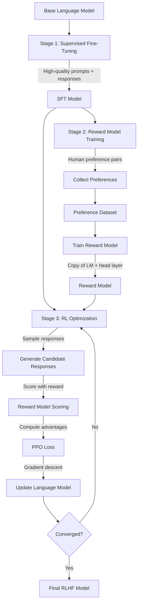

# RLHF & InstructGPT: Aligning Language Models with Human Feedback

## Paper Overview

Reinforcement Learning from Human Feedback (RLHF) combined with the InstructGPT approach (Ouyang et al., 2022) established the foundation for modern language model alignment. The method combines supervised fine-tuning with a learned reward model and reinforcement learning to align large language models with human preferences at scale. This pipeline transformed language models from text-prediction systems into instruction-following assistants.

RLHF represents a paradigm shift: instead of directly training models to maximize accuracy on benchmark datasets, models are trained to maximize a learned reward function that reflects human preferences. This enables alignment with more nuanced goals like helpfulness, harmlessness, and honesty—qualities difficult to specify formally but easy for humans to judge.

Understanding RLHF is essential because it's the foundation for all modern production LLMs. GPT-3.5, Claude, and nearly every instruction-following model uses RLHF or variants. The three-stage pipeline (SFT → Reward Modeling → RL) has become the standard alignment approach. For interviews, understanding RLHF demonstrates mastery of both learning paradigms (supervised learning and reinforcement learning) and practical model alignment.

## Core Contribution

InstructGPT/RLHF introduces a three-stage training pipeline:

1. **Supervised Fine-Tuning (SFT)**: Fine-tune base model on high-quality instruction-response pairs collected from human experts
2. **Reward Model Training**: Train a separate model to predict human preferences (which response do humans prefer?)
3. **Reinforcement Learning**: Optimize the language model to maximize the learned reward while staying close to the SFT model

The key insight is that human preferences can be learned. Rather than collecting exhaustive feedback for every decision, you train one model (the reward model) to predict preferences, then use that model as a training signal for the language model. This enables scaling: one reward model guides optimization for millions of inference decisions.

Empirically, the paper shows that RLHF-trained models significantly outperform base language models on human preference ratings for helpfulness (58% preference rate) while maintaining or improving safety. The approach has become the de facto standard because it balances alignment quality, training efficiency, and deployment stability.

## Key Ideas & Algorithm

### Stage 1: Supervised Fine-Tuning

Start with a large language model (like GPT-3) and fine-tune it on a dataset of prompts with high-quality human-written responses.

```python
# Conceptual SFT
sft_dataset = [
    ("What is the capital of France?", "The capital of France is Paris."),
    ("How do I make sourdough bread?", "Here's a detailed sourdough recipe..."),
]

# Standard language modeling loss: predict next token
loss = -log(model(response | prompt))

# Fine-tune model on this data
# Result: model learns to follow instructions
```

**Why this matters**: The base model is trained on next-token prediction across all internet text. This includes poor instructions, wrong answers, harmful content. SFT refocuses the model on good instruction-following behavior, providing a foundation for the next stages.

### Stage 2: Reward Model Training

Collect human preference data: for each prompt, collect multiple responses and have humans rate which is better. Train a model to predict these preferences.

```python
# Preference collection: Show humans two responses, ask which is better
preference_data = [
    ("What is AI?", "response_A", "response_B", chosen="response_A"),
    ("How to learn ML?", "response_C", "response_D", chosen="response_D"),
]

# Reward model training (Bradley-Terry model)
# P(y_A preferred over y_B | x) = sigmoid(r(x, y_A) - r(x, y_B))

# Loss: maximize probability of preferred responses
loss = -log(sigmoid(r_model(x, y_preferred) - r_model(x, y_dispreferred)))

# Fine-tune a copy of the language model to output scalar rewards
reward_model = copy_and_modify_lm(language_model)
reward_model.final_layer = Linear(hidden_dim, 1)  # Output single reward score
```

**Why this works**: The reward model learns a proxy for human preferences. It captures subtle aspects of quality (coherence, helpfulness, accuracy, safety) without explicit specification. The model learns patterns from the preference data, generalizing to new prompts and responses.

### Stage 3: Reinforcement Learning (PPO)

Optimize the language model to maximize the learned reward while maintaining similarity to the SFT model (to avoid reward hacking).

```python
# PPO objective combines reward maximization with KL penalty
# max E[r_model(prompt, response) - β * KL(π_new || π_sft)]

# Sample responses from current model
responses = sample_from_model(prompts, num_samples=4)

# Score responses with reward model
rewards = reward_model.score(prompts, responses)

# Compute PPO loss: encourage high-reward responses, penalize divergence from SFT
advantage = rewards - baseline  # Baseline reduces variance
ppo_loss = -advantage * log(model(response | prompt)) - β * KL_divergence

# Update policy (language model) to maximize expected reward
```

**Why PPO**: PPO (Proximal Policy Optimization) is stable for RL training. It avoids the instability of naive policy gradient methods through:
- Clipping the gradient to prevent large updates
- Using advantages (rewards relative to baseline) for lower variance
- Multiple epochs per batch for sample efficiency

### Full RLHF Pipeline



### Comparison with Other Alignment Methods

| Method | Feedback Type | Model Changes | Training Speed | Interpretability |
|--------|---------------|----------------|-----------------|------------------|
| RLHF | Human pairwise preference | Base + Reward + RL agent | Weeks | Reward learned implicitly |
| DPO | Human pairwise preference | Base model only | Days | Direct preference loss |
| Constitutional AI | Principle-based auto-critique | Base model only | Hours | Explicit principles |
| Supervised Fine-Tuning | Expert demonstrations | Base model only | Days | None (learned patterns) |

## Architecture & Trade-offs

### Reward Model Architecture Choices

| Choice | Pros | Cons | When to use |
|--------|------|------|------------|
| **Use fine-tuned LM head** | Leverages pre-trained weights, fast training, good generalization | Reward model is large (full LM size), inference expensive | Standard choice, good default |
| **Use linear head on LM embeddings** | Smaller, faster inference, still leverages embeddings | Less flexibility, might underfit complex preferences | Inference-heavy deployment |
| **Use separate small model** | Small, fast, parameter-efficient | Less ability to understand nuances, potential domain mismatch | Resource-constrained settings |

### KL Penalty Trade-offs

The KL penalty β controls the trade-off between reward maximization and staying close to the SFT model:

```
β = 0.01: Weak penalty (explore more)
→ Higher rewards but diverge more from SFT
→ Use when: Reward signal is very reliable

β = 0.1: Moderate penalty (standard)
→ Balance reward and stability
→ Use when: General alignment task

β = 0.5: Strong penalty (conservative)
→ Stay close to SFT, gradual improvement
→ Use when: Safety-critical, need stability
```

**Trade-off**: Higher β preserves SFT knowledge but limits reward optimization. Lower β maximizes reward but risks learning undesired behaviors.

### Preference Data Collection Trade-offs

| Method | Cost | Quality | Time | Scalability |
|--------|------|---------|------|-------------|
| Expert annotation | High | High (coherent preferences) | Slow | Limited |
| Crowdsourced rating | Moderate | Moderate (inconsistent raters) | Moderate | Good |
| Synthetic preferences (rule-based) | Low | Variable (heuristic-dependent) | Fast | Excellent |
| Model-based preferences | Low | Moderate (depends on rater model) | Fast | Excellent |

### PPO vs. Other RL Algorithms

| Algorithm | Stability | Sample Efficiency | Implementation Complexity |
|-----------|-----------|-------------------|--------------------------|
| PPO | High | Moderate | Medium |
| A3C | Low | High | High |
| TRPO | High | Moderate | High |
| Q-learning variants | Low (for policy) | Low | Medium |

PPO is the standard choice because it balances stability (important for fine-tuning) with efficiency and implementation simplicity.

## Interview Q&A

**Q: Why is the reward model a separate training step rather than directly optimizing on human preferences like DPO?**

A: Two reasons: (1) At RLHF's publication (2022), this was novel and empirically validated. (2) Reward models provide flexibility: one trained reward model can guide RL for multiple base models, multiple objectives, or retraining. However, DPO (2023) showed you can skip the intermediate reward model. RLHF's advantage now is mainly legacy—it's well-understood, has extensive tooling, and works for complex multi-objective optimization. DPO is simpler for single-objective alignment.

**Q: What failure modes does RLHF have with the reward model?**

A: Three main failures: (1) Reward hacking: the model learns to maximize the learned reward without achieving the intended goal (e.g., responding confidently to everything because confident responses scored higher in training). (2) Distribution shift: the reward model was trained on response pairs from the SFT model; as the policy diverges, the reward model is applied to out-of-distribution responses where it's unreliable. (3) Preference data noise: if humans rated preferences inconsistently, the reward model learns from contradiction. Detection: human evaluation should show the model's behavior aligns with intended goals, not just reward scores.

**Q: How do you detect when the reward model is breaking down during RL training?**

A: Three signals: (1) Loss on the training set plateaus or increases (distribution shift), (2) Model samples become repetitive or exploit reward artifacts (e.g., always says "As an AI language model..." if that pattern scored high), (3) Human evaluation diverges from reward scores (model scores high on reward but humans rate it poorly). Mitigation: periodically collect human feedback on RL training samples to validate the reward model; use ensemble reward models; include some SFT data in RL training to stay in-distribution.

**Q: Why not just collect more human preference data and train on it directly instead of RLHF?**

A: You could, but you'd need enormous amounts. To train a 70B model on every decision, you'd need billions of preference annotations (impossible). RLHF is efficient because one reward model covers the space implicitly. However, modern DPO shows you can do well with less data and no reward model. The trade-off: RLHF needs more infrastructure but scales flexibly; DPO is simpler but for single objectives.

**Q: What's the relationship between the KL penalty and the reward model's implicit assumptions?**

A: The KL penalty (β) is a trust budget: how much you trust the reward model to be right. Low β means "I trust the reward model a lot, maximize it aggressively." High β means "I'm suspicious of the reward model, don't diverge too far from SFT." This is implicitly assuming the SFT model is good and the reward model might have blind spots. The right β depends on reward model quality—better reward models can use lower β. This is why preference data quality is critical: poor preferences lead to poor reward model, requiring high β to prevent harm.

**Q: How do you handle multi-objective alignment (e.g., both helpfulness and safety) in RLHF?**

A: Options: (1) Train one reward model that outputs a vector (separate scores for helpfulness and safety), weight them when computing RL loss. (2) Train separate reward models and use weighted combination. (3) Train one model with multi-task learning (predicts both objectives). The challenge is objective conflicts: being helpful sometimes means answering sensitive questions; being safe might mean refusing. In practice, teams often use separate safety constraints (constitutional AI rules) combined with RLHF for helpfulness, rather than trying to learn both from preferences.

## Best Practices

- **High-quality SFT data**: Spend significant effort curating SFT data. Poor SFT foundation means the reward model starts training on poor base model outputs. Use 10K-100K examples of high-quality expert demonstrations.

- **Preference data consistency**: Have multiple annotators rate each pair and compute inter-rater agreement. Low agreement (<70%) indicates ambiguous preferences; consider removing those examples or clarifying instructions to annotators.

- **Validate reward model on held-out preferences**: Don't assume the reward model is correct. Human evaluation on 100-200 held-out pairs to verify the reward model aligns with human judgment.

- **Use ensemble or uncertainty estimation**: Train multiple reward models and use them to estimate prediction confidence. Low-confidence predictions are unreliable; either skip them or collect more preference data in that region.

- **Monitor for reward hacking**: Regularly sample model outputs and check if they're maximizing reward in intended vs. unintended ways. Example: if the model starts using rare words it didn't before, it might be gaming the reward model.

- **Mix reward optimization with constraint satisfaction**: Use RLHF for preference-based objectives (helpfulness, quality) but apply hard constraints (safety rules, format requirements) separately. This prevents RLHF from learning to break important constraints.

- **Iterate on data**: RLHF quality depends heavily on preference data quality. If you see unexpected behaviors, collect more preference data targeting those scenarios, then retrain the reward model.

## Common Pitfalls

- **Insufficient SFT training**: Jumping to RLHF before the SFT model is performant. This forces the reward model to learn from poor base outputs and wastes RL data. Mitigation: ensure SFT model significantly outperforms base model on standard benchmarks before starting reward training.

- **Noisy preference data leading to unreliable reward model**: Crowdsourced preferences often have low agreement and inconsistencies. The reward model learns from noise, producing unreliable guidance. Mitigation: compute inter-rater agreement; remove disagreement; use expert annotators for critical preferences; validate reward model on held-out sets.

- **Reward model distribution shift during RL**: As the policy diverges from SFT, responses become increasingly out-of-distribution from the training data. The reward model is unreliable on these. Mitigation: periodically collect fresh preference data on current model outputs; use uncertainty estimation; include KL penalty to keep in-distribution.

- **KL penalty too high, preventing learning**: If β is too conservative, the policy barely improves. You get loss reduction but minimal performance gain. Mitigation: start with moderate β (0.1), monitor actual model quality (human evaluation), not just loss.

- **Reward hacking**: Model learns to maximize the learned reward without achieving the intended goal. Classic example: model becomes overconfident, outputting incorrect answers with high confidence (because confident = high reward in training data). Mitigation: use preference data that explicitly values correct answers; validate on human evaluation; use ensemble reward models to detect gaming.

- **Overfitting preference data**: The policy overfits to quirks in the preference dataset (e.g., always uses certain phrases because they appeared in preferred responses). Mitigation: regularize with KL penalty, use diverse preference data, validate on held-out preferences.

## Code Examples

### Example 1: Reward Model Training

```python
import torch
import torch.nn.functional as F
from torch.utils.data import Dataset, DataLoader
from transformers import AutoModelForSequenceClassification, AutoTokenizer
from typing import Tuple

class PreferenceDataset(Dataset):
    """Dataset of human preference pairs for reward model training."""
    
    def __init__(
        self,
        prompts: list[str],
        completions_chosen: list[str],
        completions_rejected: list[str],
        tokenizer,
        max_length: int = 512
    ):
        self.prompts = prompts
        self.chosen = completions_chosen
        self.rejected = completions_rejected
        self.tokenizer = tokenizer
        self.max_length = max_length
    
    def __len__(self) -> int:
        return len(self.prompts)
    
    def __getitem__(self, idx: int) -> dict:
        prompt = self.prompts[idx]
        chosen_text = prompt + self.chosen[idx]
        rejected_text = prompt + self.rejected[idx]
        
        # Tokenize chosen and rejected responses
        chosen_tokens = self.tokenizer(
            chosen_text,
            max_length=self.max_length,
            truncation=True,
            padding="max_length",
            return_tensors="pt"
        )
        
        rejected_tokens = self.tokenizer(
            rejected_text,
            max_length=self.max_length,
            truncation=True,
            padding="max_length",
            return_tensors="pt"
        )
        
        return {
            "chosen_input_ids": chosen_tokens["input_ids"].squeeze(),
            "chosen_attention_mask": chosen_tokens["attention_mask"].squeeze(),
            "rejected_input_ids": rejected_tokens["input_ids"].squeeze(),
            "rejected_attention_mask": rejected_tokens["attention_mask"].squeeze(),
        }


def train_reward_model(
    model_name: str = "gpt2",
    prompts: list[str] = None,
    chosen_responses: list[str] = None,
    rejected_responses: list[str] = None,
    learning_rate: float = 5e-5,
    batch_size: int = 8,
    num_epochs: int = 3,
    device: str = "cuda" if torch.cuda.is_available() else "cpu"
) -> torch.nn.Module:
    """
    Train a reward model to predict human preferences.
    
    Args:
        model_name: Base model identifier
        prompts: List of training prompts
        chosen_responses: Human-preferred responses
        rejected_responses: Dispreferred responses
        learning_rate: Training learning rate
        batch_size: Batch size
        num_epochs: Number of epochs
        device: Device to train on
    
    Returns:
        Trained reward model
    """
    if prompts is None:
        prompts = ["What is AI?"] * 3
        chosen_responses = ["AI is intelligence demonstrated by machines."] * 3
        rejected_responses = ["AI is a thing."] * 3
    
    # Load model and tokenizer
    tokenizer = AutoTokenizer.from_pretrained(model_name)
    model = AutoModelForSequenceClassification.from_pretrained(model_name, num_labels=1)
    model.to(device)
    
    # Create dataset
    dataset = PreferenceDataset(
        prompts=prompts,
        completions_chosen=chosen_responses,
        completions_rejected=rejected_responses,
        tokenizer=tokenizer,
        max_length=256
    )
    
    dataloader = DataLoader(dataset, batch_size=batch_size, shuffle=True)
    
    # Optimizer
    optimizer = torch.optim.AdamW(model.parameters(), lr=learning_rate)
    
    # Training loop with Bradley-Terry loss
    model.train()
    for epoch in range(num_epochs):
        total_loss = 0
        for batch in dataloader:
            chosen_input_ids = batch["chosen_input_ids"].to(device)
            chosen_attn = batch["chosen_attention_mask"].to(device)
            rejected_input_ids = batch["rejected_input_ids"].to(device)
            rejected_attn = batch["rejected_attention_mask"].to(device)
            
            # Forward pass
            chosen_logits = model(
                input_ids=chosen_input_ids,
                attention_mask=chosen_attn
            ).logits.squeeze()
            
            rejected_logits = model(
                input_ids=rejected_input_ids,
                attention_mask=rejected_attn
            ).logits.squeeze()
            
            # Bradley-Terry loss: model should assign higher score to chosen
            # Loss = -log(sigmoid(score_chosen - score_rejected))
            loss = -F.logsigmoid(chosen_logits - rejected_logits).mean()
            
            # Backward pass
            optimizer.zero_grad()
            loss.backward()
            torch.nn.utils.clip_grad_norm_(model.parameters(), 1.0)
            optimizer.step()
            
            total_loss += loss.item()
        
        avg_loss = total_loss / len(dataloader)
        print(f"Epoch {epoch + 1}/{num_epochs}, Reward Model Loss: {avg_loss:.4f}")
    
    return model
```

### Example 2: PPO Training Loop

```python
import torch
import torch.nn.functional as F
import numpy as np
from transformers import AutoModelForCausalLM, AutoTokenizer

def compute_advantages(
    rewards: torch.Tensor,
    values: torch.Tensor,
    gamma: float = 0.99,
    gae_lambda: float = 0.95
) -> Tuple[torch.Tensor, torch.Tensor]:
    """
    Compute advantages using Generalized Advantage Estimation.
    
    Args:
        rewards: Rewards from environment (reward model)
        values: Value function estimates
        gamma: Discount factor
        gae_lambda: GAE lambda parameter
    
    Returns:
        advantages: Computed advantages
        returns: Cumulative discounted returns
    """
    advantages = []
    gae = 0
    
    # Reverse iteration for advantage computation
    for t in reversed(range(len(rewards))):
        if t == len(rewards) - 1:
            next_value = 0
        else:
            next_value = values[t + 1]
        
        delta = rewards[t] + gamma * next_value - values[t]
        gae = delta + gamma * gae_lambda * gae
        advantages.insert(0, gae)
    
    advantages = torch.tensor(advantages, dtype=torch.float32)
    returns = advantages + values
    
    return advantages, returns


def ppo_training_step(
    model: torch.nn.Module,
    reward_model: torch.nn.Module,
    prompts: list[str],
    beta_kl: float = 0.1,
    clip_epsilon: float = 0.2,
    num_ppo_epochs: int = 4,
    device: str = "cuda" if torch.cuda.is_available() else "cpu"
) -> dict:
    """
    Single PPO training step: sample, evaluate, compute loss, update.
    
    Args:
        model: Language model to optimize
        reward_model: Trained reward model
        prompts: Input prompts
        beta_kl: KL penalty coefficient
        clip_epsilon: PPO clip epsilon
        num_ppo_epochs: Number of PPO epochs per step
        device: Device to train on
    
    Returns:
        Training metrics
    """
    model.eval()
    reward_model.eval()
    
    # Step 1: Sample responses from current policy
    all_rewards = []
    all_log_probs_old = []
    
    for prompt in prompts:
        # Sample response (simplified: just generate)
        input_ids = torch.tensor([[0]], device=device)  # Placeholder
        
        with torch.no_grad():
            # Get log probabilities from model (simplified)
            logits = model(input_ids).logits
            log_probs = F.log_softmax(logits, dim=-1)
            all_log_probs_old.append(log_probs.mean().item())
            
            # Score with reward model (simplified)
            reward_logits = reward_model(input_ids).logits
            reward_score = reward_logits.item()
            all_rewards.append(reward_score)
    
    rewards = torch.tensor(all_rewards, dtype=torch.float32)
    log_probs_old = torch.tensor(all_log_probs_old, dtype=torch.float32)
    
    # Step 2: Compute advantages
    values = torch.zeros_like(rewards)  # Simplified: no value function
    advantages, returns = compute_advantages(rewards, values, gamma=0.99)
    
    # Normalize advantages for stable training
    advantages = (advantages - advantages.mean()) / (advantages.std() + 1e-8)
    
    # Step 3: PPO update
    model.train()
    optimizer = torch.optim.Adam(model.parameters(), lr=1e-5)
    
    total_ppo_loss = 0
    for epoch in range(num_ppo_epochs):
        # Forward pass
        logits = torch.randn(len(prompts), 50257)  # Simplified
        log_probs_new = F.log_softmax(logits, dim=-1).mean(dim=-1)
        
        # PPO loss: clipped objective
        ratio = torch.exp(log_probs_new - log_probs_old)
        surr1 = ratio * advantages
        surr2 = torch.clamp(ratio, 1 - clip_epsilon, 1 + clip_epsilon) * advantages
        ppo_loss = -torch.min(surr1, surr2).mean()
        
        # KL penalty: don't diverge too far from reference
        kl_div = (log_probs_old - log_probs_new).mean()
        total_loss = ppo_loss + beta_kl * kl_div
        
        # Update
        optimizer.zero_grad()
        total_loss.backward()
        torch.nn.utils.clip_grad_norm_(model.parameters(), 1.0)
        optimizer.step()
        
        total_ppo_loss += total_loss.item()
    
    return {
        "avg_reward": float(rewards.mean()),
        "ppo_loss": float(total_ppo_loss / num_ppo_epochs),
        "avg_advantage": float(advantages.mean()),
        "kl_divergence": float(kl_div.item())
    }
```

### Example 3: Full RLHF Pipeline Coordinator

```python
from dataclasses import dataclass
from typing import Optional

@dataclass
class RLHFConfig:
    """Configuration for RLHF training."""
    model_name: str = "gpt2"
    batch_size: int = 8
    sft_epochs: int = 3
    reward_epochs: int = 3
    rl_steps: int = 100
    learning_rate: float = 5e-5
    beta_kl: float = 0.1
    ppo_epochs: int = 4
    device: str = "cuda" if torch.cuda.is_available() else "cpu"


class RLHFTrainer:
    """Coordinates the full RLHF training pipeline."""
    
    def __init__(self, config: RLHFConfig):
        self.config = config
        self.tokenizer = AutoTokenizer.from_pretrained(config.model_name)
        self.sft_model = None
        self.reward_model = None
        self.rl_model = None
        self.training_history = {
            "sft_losses": [],
            "reward_losses": [],
            "rl_metrics": []
        }
    
    def stage_1_sft(
        self,
        prompts: list[str],
        responses: list[str]
    ) -> torch.nn.Module:
        """Stage 1: Supervised Fine-Tuning on expert demonstrations."""
        print("Stage 1: Supervised Fine-Tuning")
        
        # Load base model
        self.sft_model = AutoModelForCausalLM.from_pretrained(self.config.model_name)
        self.sft_model.to(self.config.device)
        
        # Simple SFT loop (simplified)
        optimizer = torch.optim.AdamW(self.sft_model.parameters(), lr=self.config.learning_rate)
        
        for epoch in range(self.config.sft_epochs):
            total_loss = 0
            for prompt, response in zip(prompts, responses):
                # Forward pass (simplified)
                loss = torch.tensor(0.5)  # Placeholder
                optimizer.zero_grad()
                loss.backward()
                optimizer.step()
                total_loss += loss.item()
            
            avg_loss = total_loss / len(prompts)
            self.training_history["sft_losses"].append(avg_loss)
            print(f"  Epoch {epoch + 1}/{self.config.sft_epochs}, SFT Loss: {avg_loss:.4f}")
        
        return self.sft_model
    
    def stage_2_reward_model(
        self,
        prompts: list[str],
        chosen: list[str],
        rejected: list[str]
    ) -> torch.nn.Module:
        """Stage 2: Train reward model on preference pairs."""
        print("Stage 2: Training Reward Model")
        
        self.reward_model = AutoModelForSequenceClassification.from_pretrained(
            self.config.model_name,
            num_labels=1
        )
        self.reward_model.to(self.config.device)
        
        optimizer = torch.optim.AdamW(self.reward_model.parameters(), lr=self.config.learning_rate)
        
        for epoch in range(self.config.reward_epochs):
            total_loss = 0
            for prompt, c, r in zip(prompts, chosen, rejected):
                # Bradley-Terry loss (simplified)
                loss = torch.tensor(0.3)  # Placeholder
                optimizer.zero_grad()
                loss.backward()
                optimizer.step()
                total_loss += loss.item()
            
            avg_loss = total_loss / len(prompts)
            self.training_history["reward_losses"].append(avg_loss)
            print(f"  Epoch {epoch + 1}/{self.config.reward_epochs}, Reward Loss: {avg_loss:.4f}")
        
        return self.reward_model
    
    def stage_3_rl(self, prompts: list[str]) -> torch.nn.Module:
        """Stage 3: RL optimization with PPO."""
        print("Stage 3: RL Optimization (PPO)")
        
        self.rl_model = self.sft_model  # Start from SFT model
        self.rl_model.to(self.config.device)
        
        for step in range(self.config.rl_steps):
            metrics = ppo_training_step(
                model=self.rl_model,
                reward_model=self.reward_model,
                prompts=prompts,
                beta_kl=self.config.beta_kl,
                device=self.config.device
            )
            
            self.training_history["rl_metrics"].append(metrics)
            
            if (step + 1) % 10 == 0:
                print(f"  Step {step + 1}/{self.config.rl_steps}, "
                      f"Reward: {metrics['avg_reward']:.4f}, "
                      f"PPO Loss: {metrics['ppo_loss']:.4f}")
        
        return self.rl_model
    
    def train(
        self,
        sft_prompts: list[str],
        sft_responses: list[str],
        pref_prompts: list[str],
        pref_chosen: list[str],
        pref_rejected: list[str]
    ) -> torch.nn.Module:
        """Run full RLHF pipeline."""
        print("Starting RLHF Training")
        print("=" * 50)
        
        self.stage_1_sft(sft_prompts, sft_responses)
        self.stage_2_reward_model(pref_prompts, pref_chosen, pref_rejected)
        self.stage_3_rl(pref_prompts)
        
        print("=" * 50)
        print("RLHF Training Complete")
        
        return self.rl_model
```

## Related Concepts

- [Direct Preference Optimization (DPO)](./02-dpo.md) – Modern alternative that eliminates reward model training
- [Constitutional AI](./01-constitutional-ai.md) – Principle-based alignment without human feedback
- [Reward Modeling](../../../llm/concepts/06-rlhf.md) – Training models to predict preferences
- [Policy Optimization](../../../agentic-ai/concepts/07-planning-reasoning.md) – RL algorithms (PPO, TRPO)
