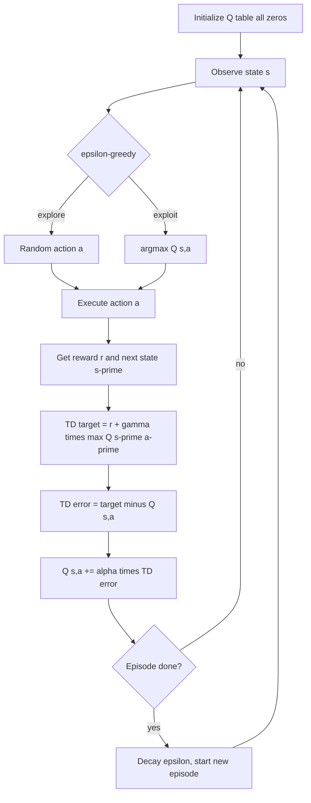

# Q-Learning

## 1. Detailed Explanation

Q-learning is a model-free, off-policy temporal difference (TD) algorithm that learns the optimal action-value function Q*(s,a) directly, regardless of the policy being followed during exploration. Introduced by Watkins (1989), it became one of the foundational algorithms in reinforcement learning because it guarantees convergence to the optimal policy under mild conditions.

The core insight is that Q-learning separates the behavior policy (how the agent acts, typically ε-greedy) from the target policy (always greedy over Q). This off-policy property means you can reuse experience collected under any policy — a critical advantage for data efficiency and experience replay.

In production systems, tabular Q-learning underpins decision-making in discrete action spaces: routing optimizations, inventory management, game-playing bots, and simple robotic navigation. When state/action spaces grow large, Q-learning extends naturally to Deep Q-Networks (DQN) by approximating Q(s,a) with neural networks. Understanding the tabular case is essential before applying DQN because every instability in deep RL traces back to violations of Q-learning's convergence conditions.

Q-learning converges to Q* when every (s,a) pair is visited infinitely often and learning rates satisfy the Robbins-Monro conditions: Σα_t = ∞ and Σα_t² < ∞. In practice, constant small learning rates (α ≈ 0.01–0.1) work well with sufficient experience.

---

## 2. Core Intuition

Think of Q-learning as a GPS that updates its estimated travel times based on what it actually experiences, not what its current route-plan assumes. Each time you take a turn, you compare your actual arrival time to the GPS's previous estimate and nudge the estimate toward reality. Because it always aims for the "fastest possible route from here" regardless of how you currently drive, it converges to optimal travel times even while you're still exploring side streets.

---

## 3. How It Works

**Update rule:** Q(s,a) ← Q(s,a) + α[r + γ·max_{a'} Q(s',a') - Q(s,a)]

1. **Initialize** Q(s,a) = 0 for all state-action pairs.
2. **Observe** current state s from the environment.
3. **Select action** a using ε-greedy: with probability ε pick random action, else pick argmax_a Q(s,a).
4. **Execute action** a, receive reward r, transition to s'.
5. **Compute TD target:** y = r + γ·max_{a'} Q(s',a') (uses greedy over Q, not the behavior policy).
6. **Update:** Q(s,a) ← Q(s,a) + α(y - Q(s,a)). The term (y - Q(s,a)) is the TD error δ.
7. **Repeat** from step 2; decay ε over time to shift from exploration to exploitation.

---

## 4. Architecture and Trade-offs

### Q-learning Variants

| Variant | Update Target | Bias | Variance | Key Use |
|---------|--------------|------|----------|---------|
| Q-learning | max Q(s',a') | Overestimation bias | Low | Standard discrete control |
| Double Q-learning | Q2(s', argmax Q1) | Reduced | Low | When overestimation is a problem |
| Q(lambda) | n-step TD target | Lower than 1-step | Higher | Faster credit assignment |
| DQN | Neural net approx | Overestimation | Low (replay) | Large state spaces |

### Hyperparameter Guide

| Parameter | Typical Range | Effect of Too High | Effect of Too Low |
|-----------|--------------|-------------------|-------------------|
| alpha (learning rate) | 0.01 – 0.5 | Oscillation, instability | Very slow convergence |
| gamma (discount) | 0.9 – 0.99 | Long-horizon sensitivity | Myopic policy |
| epsilon (exploration) | 0.1 – 1.0 (decayed) | Slow convergence | Stuck in local policy |
| epsilon decay | 0.99 – 0.9999 | Too much exploration | Premature exploitation |

### Off-Policy vs On-Policy

| Aspect | Q-learning (off-policy) | SARSA (on-policy) |
|--------|------------------------|-------------------|
| Target policy | Greedy | Same as behavior |
| Safety during training | Can learn unsafe shortcuts | Accounts for exploration risk |
| Data efficiency | Higher (reuse any data) | Lower (tied to behavior) |
| Cliff-walking behavior | Learns risky optimal path | Learns safe path |

---

## 5. Interview Q&A

**Q: Why does Q-learning learn the risky path in cliff-walking while SARSA learns the safe path?**
A: Q-learning's target always uses the greedy max, so it ignores the probability that ε-greedy exploration will walk off the cliff during training. SARSA uses the actual next action from the behavior policy, so it penalizes values near the cliff where random exploration causes falls. In deployment where you run greedy, Q-learning's path is actually optimal — SARSA's "safety" is a training artifact.

**Q: What breaks when you apply tabular Q-learning to a continuous state space?**
A: The Q-table size is |S|×|A|, which becomes infinite. You need function approximation (linear features or neural nets). But combining TD learning with function approximation loses convergence guarantees — deadly triad: off-policy + function approximation + bootstrapping. DQN mitigates this with experience replay and target networks.

**Q: How would you detect that Q-learning has not converged?**
A: Watch the TD error δ = r + γ·max Q(s',a') - Q(s,a). If it remains large or oscillates after many episodes, convergence stalled. Also monitor the greedy policy: extract it every N episodes and check if it stabilizes. Reward curves that stop improving but TD errors stay high signal that Q-values are cycling.

**Q: When would you choose Q(lambda) over one-step Q-learning?**
A: When rewards are sparse and episodes are long. One-step Q-learning propagates reward credit backward one step per update; with λ=0.9 eligibility traces spread credit across many recent states simultaneously, dramatically speeding convergence in maze-like environments. The cost is higher memory (one trace per state-action pair) and sensitivity to noisy rewards.

**Q: What happens if you set gamma=1.0 in an episodic task?**
A: Technically valid if every episode terminates — all future rewards weighted equally. In practice, slight numerical issues and very long credit-assignment chains slow convergence. For continuing tasks, gamma=1.0 with no discounting makes the expected return infinite and the problem ill-defined.

**Q: How do you handle overestimation bias in Q-learning?**
A: Use Double Q-learning: maintain two Q-tables Q1 and Q2. Select the action using Q1, evaluate its value using Q2. Because selection and evaluation use independent estimates, the positive bias cancels out. This is cheap (doubles memory, same time complexity) and consistently improves empirical performance by 10–30%.

---

## 6. Best Practices

- Start with α=0.1 and decay to 0.01; constant α=0.1 works for stationary problems.
- Initialize Q-values optimistically (e.g., +1.0) rather than zero to encourage exploration of unvisited states.
- Decay ε from 1.0 to 0.05 over the first 50–70% of training, then hold constant.
- For sparse rewards, use reward shaping or potential-based shaping to provide denser signal — do not change the optimal policy.
- Track average TD error magnitude per episode as a convergence diagnostic; target <0.01 of max possible reward.
- When using Q(λ), reset eligibility traces to zero at episode boundaries and after non-greedy actions (replacing traces variant for stability).
- Profile the Q-table for unvisited state-action pairs; convergence theorems require all pairs visited — add explicit exploration bonuses if coverage is poor.

---

## 7. Common Pitfalls

- **Learning rate too high (α > 0.5):** Q-values oscillate and never converge. Symptom: loss/reward curve is noisy and flat. Fix: reduce α by 10x; use a decaying schedule.
- **Greedy policy extracted too early:** Policy looks bad because Q-values are still inaccurate. Fix: only evaluate policy after TD errors have dropped below threshold; do not confuse training behavior with final policy.
- **Forgetting to handle terminal states:** At episode end, the Q-update target should be just r (no bootstrap). Symptom: Q-values of goal states inflate or oscillate. Fix: set Q(terminal, a) = 0 explicitly and skip the γ·max term when done=True.
- **State representation aliasing:** Two distinct states map to the same table index. Symptom: policy works in some states but not others with no obvious pattern. Fix: verify state encoding is injective; add features that distinguish aliased states.
- **Epsilon not decayed:** Agent never exploits learned policy during training, reward stays at exploration-level. Symptom: reward improves for first N episodes then plateaus far below optimal. Fix: implement exponential or linear ε-decay.

---

## 8. Related Concepts

- [05-temporal-difference-learning](./05-temporal-difference-learning.md) — TD(0) is the prediction analogue; Q-learning is TD control
- [07-sarsa](./07-sarsa.md) — on-policy counterpart; same update structure but uses actual next action
- [08-deep-q-networks](./08-deep-q-networks.md) — extends Q-learning with neural function approximation
- [03-markov-decision-processes](./03-markov-decision-processes.md) — formal framework Q-learning operates within
- [04-dynamic-programming](./04-dynamic-programming.md) — model-based counterpart; Q-learning approximates value iteration without the model
