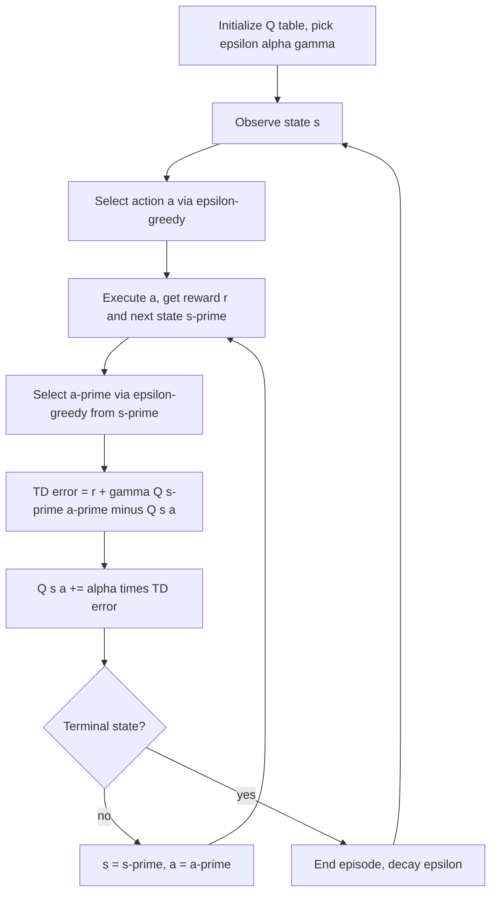

# SARSA (State-Action-Reward-State-Action)

## 1. Detailed Explanation

SARSA is an on-policy temporal difference algorithm for control. The name encodes its update tuple: it uses the current State, Action taken, Reward received, next State, and the next Action actually selected under the current policy. This distinguishes it from Q-learning, which uses the greedy next action regardless of what the behavior policy will actually do.

The update rule is: Q(s,a) ← Q(s,a) + α[r + γ·Q(s',a') - Q(s,a)] where a' is sampled from the same ε-greedy policy. The critical consequence: SARSA's value estimates account for the exploration noise introduced during training. In risky environments like cliff-walking, SARSA learns to avoid states near hazards because it knows the ε-greedy policy occasionally makes random moves — and random moves near a cliff are costly.

SARSA is preferred over Q-learning in safety-critical applications where the training policy is also the deployment policy (or nearly so): autonomous driving simulators, robot training in physical environments, and online trading systems where bad exploration moves incur real costs. It is also preferred when the behavior policy cannot be changed independently of the target policy.

Expected SARSA is a variance-reduced variant: instead of sampling Q(s',a'), it uses the expectation Σ_{a'} π(a'|s')Q(s',a') over all actions. This eliminates the variance from action sampling at a modest computational cost, typically converging faster than standard SARSA.

SARSA(λ) extends SARSA with eligibility traces, propagating TD errors backward through recently visited state-action pairs, accelerating credit assignment in long episodes.

---

## 2. Core Intuition

SARSA is like a cautious driver who factors in their own habit of occasionally running red lights when estimating how risky an intersection is — so they give it a wide berth even when the light is green. Q-learning is a perfect driver who evaluates routes as if they will always obey every rule, then discovers the "optimal" route passes dangerously close to hazards. On-policy learning makes the value estimate honest about the actual behavior.

---

## 3. How It Works

**Update rule:** Q(s,a) ← Q(s,a) + α[r + γ·Q(s',a') - Q(s,a)]

1. **Initialize** Q(s,a) = 0 for all state-action pairs; set ε, α, γ.
2. **Observe** state s; select action a using ε-greedy policy over Q(s,·).
3. **Execute** action a; receive reward r; observe next state s'.
4. **Select next action** a' using ε-greedy over Q(s',·) — this is the key step SARSA differs from Q-learning.
5. **TD error:** δ = r + γ·Q(s',a') - Q(s,a).
6. **Update:** Q(s,a) ← Q(s,a) + α·δ.
7. **Advance:** s ← s', a ← a'; repeat from step 3 until terminal.

---

## 4. Architecture and Trade-offs

### SARSA Variants Comparison

| Variant | Next-action Value | Bias | Variance | Compute |
|---------|-----------------|------|----------|---------|
| SARSA | Q(s',a'), a' ~ pi | On-policy | Medium | O(1) |
| Expected SARSA | E_pi[Q(s',a')] | On-policy | Lower | O(|A|) |
| Q-learning | max_a Q(s',a) | Off-policy (greedy) | Low | O(|A|) |
| SARSA(lambda) | Eligibility traces | On-policy | Higher (λ>0) | O(|S||A|) |

### Safety vs Optimality Trade-off

| Scenario | Prefer SARSA | Prefer Q-learning |
|----------|-------------|-----------------|
| Training = deployment | Yes | No |
| Safe exploration required | Yes | No |
| Data reuse / replay buffer | No | Yes |
| Converge to true optimal | No (greedy limit only) | Yes |
| Stochastic, risky environment | Yes | No |

### Lambda Parameter Effect in SARSA(lambda)

| Lambda | Credit Assignment | Convergence Speed | Memory | Noise Sensitivity |
|--------|-----------------|-------------------|--------|------------------|
| 0 | 1-step only | Slow | Low | Low |
| 0.5 | Moderate look-back | Medium | Medium | Medium |
| 0.9 | Long look-back | Fast (sparse rewards) | High | High |
| 1.0 | Full Monte Carlo | Slowest (variance) | High | Very High |

---

## 5. Interview Q&A

**Q: In what scenario would SARSA perform better than Q-learning in deployment?**
A: When your deployment policy is stochastic (e.g., ε-greedy at ε=0.05 for robustness) and you train at ε=0.3. SARSA's values are calibrated to the noisy policy, so the agent naturally avoids high-risk areas. Q-learning would compute values for a hypothetically perfect greedy policy that never exists in deployment. The performance gap is largest in environments where ε-random moves cause catastrophic outcomes.

**Q: Why does Expected SARSA converge faster than standard SARSA?**
A: Standard SARSA samples one action a' and uses Q(s',a') as its gradient signal — this introduces per-step variance proportional to Q-value spread across actions. Expected SARSA averages over all actions weighted by their probabilities, eliminating that variance at the cost of computing a weighted sum over |A| Q-values. This improvement is especially large when |A| is small (< 10) and Q-values vary widely.

**Q: What breaks when you forget to use a' from the behavior policy and accidentally use the greedy action?**
A: You have inadvertently implemented Q-learning. The algorithm still converges but now learns off-policy values. In cliff environments, you lose SARSA's safety property. In continuous tasks, you lose on-policy correctness guarantees. The bug is silent — reward curves look plausible — but the learned policy reflects Q-learning's greedy target, not your intended on-policy behavior.

**Q: When would you choose SARSA(lambda) over one-step SARSA?**
A: When the reward signal is sparse and episodes are long (>50 steps), eligibility traces accelerate credit assignment dramatically. Set λ=0.7–0.9 for maze navigation or long-horizon control. For dense reward environments with short episodes, λ=0 (one-step) is usually sufficient and avoids the instability of high-λ traces with noisy rewards.

**Q: How does on-policy training affect exploration strategy design?**
A: In on-policy methods, the same policy that collects data is optimized — so you cannot use a wildly exploratory behavior policy while learning a conservative target. This means ε must be decayed carefully: too fast, and you exploit a poorly trained policy; too slow, and training reward never reflects the final performance. UCB exploration or Boltzmann (softmax) exploration often work better than ε-greedy for SARSA because they explore more intelligently without random cliffs.

**Q: What symptom tells you your SARSA agent is stuck in local suboptimality?**
A: The training reward plateaus early and the Q-table shows many unvisited state-action pairs (Q=0 for unvisited). Specifically, if entropy of the greedy policy (distribution over best actions per state) is very low and reward is below theoretical optimum, the agent converged to a poor path without sufficient exploration. Fix: restart with higher initial ε (0.5–1.0), use optimistic initialization, or add an exploration bonus.

---

## 6. Best Practices

- Use Expected SARSA when |A| ≤ 10; the variance reduction is free and convergence improves 20–40%.
- Set α = 0.05–0.2 for stochastic environments; higher α causes instability when rewards are noisy.
- Decay ε with a cosine or linear schedule from 1.0 to 0.01 over the first 60% of total steps.
- For SARSA(λ), use the replacing traces variant (clip trace to 1.0) rather than accumulating traces to avoid numerical overflow in long episodes.
- Monitor visit counts per (s,a) pair; any pair with count < 100 in a 10,000-episode run is likely underexplored.
- In cliff-like environments, compare SARSA's training reward to Q-learning's — SARSA should exceed Q-learning during training (safer exploration), but Q-learning may match or exceed at test time (greedy policy).
- Use γ = 0.95–0.99 for most tasks; γ < 0.9 makes the agent myopic and ignores consequences more than 10 steps away.

---

## 7. Common Pitfalls

- **Using greedy next action instead of sampled a':** Implements Q-learning silently. Symptom: no convergence difference versus Q-learning on cliff task — SARSA's safety property disappears. Fix: always sample a' from the current ε-greedy policy before the update.
- **Not resetting a' at episode start:** Carry-over of a' from the previous episode's terminal state corrupts the first update. Symptom: initial Q-values for start states drift. Fix: always sample fresh a from the initial state at episode start.
- **High lambda with noisy rewards:** Eligibility traces amplify noise, causing Q-values to oscillate. Symptom: SARSA(λ=0.9) converges more slowly than SARSA(λ=0) despite theoretical advantage. Fix: reduce λ or normalize rewards to [-1, 1] before using large λ.
- **On-policy with a large replay buffer:** Storing transitions from earlier policies and replaying them breaks the on-policy assumption. Symptom: learned values become a mix of old and current policy values; policy gradient is biased. Fix: either use Q-learning (off-policy) with replay, or limit replay to very recent transitions (importance sampling required for correctness).
- **Ignoring that optimal SARSA policy is epsilon-greedy, not greedy:** SARSA converges to the best policy for the ε-greedy agent, which is not the globally optimal greedy policy. For the final greedy policy to be optimal, ε must be decayed to 0. Symptom: SARSA's final greedy policy is slightly suboptimal. Fix: decay ε to 0 at the end of training.

---

## 8. Related Concepts

- [06-q-learning](./06-q-learning.md) — off-policy counterpart; same structure, greedy target instead of sampled
- [08-deep-q-networks](./08-deep-q-networks.md) — extends Q-learning to neural function approximation; same off-policy principle
- [05-temporal-difference-learning](./05-temporal-difference-learning.md) — TD(0) is the prediction root; SARSA is on-policy TD control
- [09-policy-gradient](./09-policy-gradient.md) — alternative to value-based control; directly parameterizes the policy
- [03-markov-decision-processes](./03-markov-decision-processes.md) — formal MDP framework both SARSA and Q-learning solve
