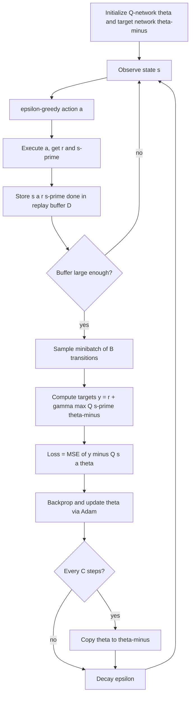

# Deep Q-Networks (DQN)

## 1. Detailed Explanation

Deep Q-Networks (DQN), introduced by Mnih et al. (DeepMind, 2015), was the first algorithm to demonstrate superhuman performance across a wide range of tasks using raw sensory input. It extends Q-learning by replacing the lookup table with a neural network Q(s,a;θ) parameterized by weights θ. This enables generalization across continuous or very large state spaces like raw pixels.

The key challenge in combining Q-learning with neural networks is the deadly triad: off-policy learning, function approximation, and bootstrapping together can cause divergence. DQN addresses this with two innovations:

**Experience replay:** Transitions (s,a,r,s') are stored in a replay buffer and sampled uniformly for training. This breaks the temporal correlation between consecutive samples (which would violate the i.i.d. assumption of SGD) and increases data efficiency by reusing each transition many times.

**Target network:** A separate network θ⁻ (a periodic copy of θ) computes the TD target y = r + γ·max_{a'} Q(s',a';θ⁻). Holding θ⁻ fixed for C steps (typically 100–1000) stabilizes training by preventing the "chasing a moving target" problem where both the prediction and its target shift simultaneously.

DQN is the foundation for virtually all modern deep RL: Double DQN, Dueling DQN, Prioritized Experience Replay, Rainbow DQN, and distributional RL all build on this architecture. In industry, DQN-family algorithms are used for recommendation systems, game-playing, chip floor planning, and data center cooling optimization.

---

## 2. Core Intuition

DQN is like training for a chess tournament using flashcards: you write down positions you encountered (replay buffer), study a random mix of them instead of just yesterday's games (breaking correlations), and grade your answers against an answer key that only updates monthly (target network) rather than one that changes every time you learn something new. The combination turns the unstable "chasing your own tail" problem into a well-behaved supervised learning task.

---

## 3. How It Works

**Loss:** L(θ) = E_{(s,a,r,s')~D}[(r + γ·max_{a'} Q(s',a';θ⁻) - Q(s,a;θ))²]

1. **Initialize** online network Q(·;θ) and target network Q(·;θ⁻) with θ⁻ = θ. Initialize replay buffer D.
2. **Collect experience:** take ε-greedy action a, observe (r, s'), store (s,a,r,s',done) in D.
3. **Sample minibatch:** draw B transitions uniformly from D (once |D| >= warmup size).
4. **Compute target:** y = r if done, else y = r + γ·max_{a'} Q(s',a';θ⁻).
5. **Compute loss:** L = (1/B) Σ (y - Q(s,a;θ))².
6. **Backpropagate and update** θ via Adam/SGD.
7. **Periodically copy** θ → θ⁻ every C steps (hard update) or soft-update θ⁻ ← τθ + (1-τ)θ⁻.

---

## 4. Architecture and Trade-offs

### DQN Family Comparison

| Algorithm | Key Change | Addresses | Extra Cost |
|-----------|-----------|-----------|-----------|
| DQN | Replay + target network | Instability, correlation | 2x memory for target net |
| Double DQN | Select action with Q, evaluate with Q-minus | Overestimation bias | None (reuses existing nets) |
| Dueling DQN | V(s) + A(s,a) architecture | Slow value learning | Slightly wider net |
| Prioritized ER | Sample by TD error | Low data efficiency | Priority queue overhead |
| Rainbow | All of the above + distributional | All above + aleatoric uncertainty | ~2x training time |

### Replay Buffer Size vs Performance

| Buffer Size | Staleness | Memory (4-frame atari) | Sample Diversity |
|------------|-----------|----------------------|----------------|
| 10K | Low | 160 MB | Low |
| 100K | Medium | 1.6 GB | Medium |
| 1M | High | 16 GB | High (original DQN) |
| 10M | Very High | 160 GB | Very High |

### Target Network Update Strategies

| Strategy | Formula | Period | Stability | Lag |
|----------|---------|--------|-----------|-----|
| Hard update | theta-minus = theta | Every C steps | High (sudden shift) | High |
| Soft update (Polyak) | theta-minus = tau*theta + (1-tau)*theta-minus | Every step | Very high | Low |

---

## 5. Interview Q&A

**Q: Why does DQN need a replay buffer but tabular Q-learning does not?**
A: Neural network SGD assumes i.i.d. training samples. Consecutive environment transitions are temporally correlated (s_t and s_{t+1} are adjacent frames), violating this assumption and causing catastrophic forgetting of earlier experience. The buffer breaks temporal correlation by shuffling samples. Tabular Q-learning updates a single table entry per step — there is no global function that can "forget" other entries.

**Q: What breaks if you update the target network too frequently (C=1)?**
A: With C=1, the target is always the current network — equivalent to no target network at all. TD targets move every step, creating a non-stationary regression problem. The network chases its own predictions, causing oscillation or divergence in Q-values. You observe loss that bounces rather than decreases. Fix: increase C to 100–1000 or use soft updates with τ=0.005.

**Q: When would you choose Double DQN over standard DQN?**
A: When you observe that Q-value estimates are systematically too high (overestimation). This is diagnosable by comparing Q(s,a) estimates to actual empirical returns — if Q estimates exceed mean returns consistently, use Double DQN. Overestimation is most harmful in tasks with large action spaces or large reward variance. Double DQN adds zero computational cost by reusing the existing online and target networks.

**Q: How do you choose batch size and replay buffer size?**
A: Batch size 32–64 balances gradient noise and compute; larger batches (256) improve gradient quality at the cost of memory bandwidth. Buffer size should be at least 10× the expected episode length times 100 episodes, so the sampled minibatch has diverse age distribution. For a CartPole task (~200 steps/episode), 20K transitions is enough; for Atari, 1M is standard.

**Q: What is the "deadly triad" and how does DQN partially escape it?**
A: The deadly triad is the combination of function approximation + bootstrapping + off-policy learning that can cause divergence even when each ingredient alone is stable. DQN does not fully escape it — target networks and replay buffer stabilize it empirically but there are no convergence guarantees with neural approximation. In practice, gradient clipping, Huber loss, and careful learning rates are required to keep training stable.

**Q: How would you debug a DQN that is not learning at all?**
A: Check in order: (1) Is the replay buffer filling before updates start? (2) Is the network output range appropriate for the reward scale? (3) Is ε decaying — is the agent actually exploiting learned Q-values? (4) Are Q-values changing at all (log Q(s,a) before and after 1000 steps)? (5) Is the target network updating? The most common failure is a bug in the done flag that allows bootstrapping through terminal states, making y = r + γ·max Q even when the episode ended.

---

## 6. Best Practices

- Use Huber loss (smooth L1) instead of MSE — it clips gradients for large TD errors, preventing instability when Q-values are initially random.
- Warm up the replay buffer with random actions for 1000–10000 steps before starting updates; prevents early updates on a near-empty buffer with highly correlated samples.
- Clip rewards to [-1, 1] for multi-game training; preserves relative signal while preventing gradient explosions from large reward scales.
- Set target network update period C = 1000 as a default; tune down for simple tasks, up for complex ones.
- Use a learning rate of 1e-4 (Adam) with gradient clipping at 10 as the starting configuration.
- Track average Q-value magnitude over time; rapid growth signals overestimation or instability.
- Separate epsilon decay schedule from number of updates — decay based on total environment steps, not gradient steps.

---

## 7. Common Pitfalls

- **Missing done flag in TD target:** Using y = r + γ·max Q(s',a') even when s' is terminal inflates Q-values for pre-terminal states. Symptom: Q-values grow unboundedly. Fix: y = r when done=True, y = r + γ·max Q otherwise.
- **Replay buffer too small:** Buffer fills with recent correlated experience; effective diversity drops. Symptom: agent learns fast initially then forgets earlier behavior. Fix: increase buffer size or use prioritized experience replay.
- **Target network updated too rarely (C too large):** Targets are very stale; gradient signal from early training persists too long. Symptom: learning is slow, Q-values lag far behind actual returns. Fix: reduce C or switch to soft updates.
- **Network too large for the task:** Overfits to replay buffer distribution; Q-values are accurate for seen states but generalize poorly. Symptom: train reward high, eval reward low. Fix: reduce network capacity; add dropout or L2 regularization.
- **Epsilon decayed to 0 too quickly:** Agent stops exploring before Q-values are accurate; converges to suboptimal policy. Symptom: reward plateaus early at suboptimal level. Fix: decay ε on a longer schedule; keep minimum ε = 0.05 for continued stochastic behavior.

---

## 8. Related Concepts

- [06-q-learning](./06-q-learning.md) — tabular foundation DQN extends
- [07-sarsa](./07-sarsa.md) — on-policy alternative; Deep SARSA possible but less common
- [09-policy-gradient](./09-policy-gradient.md) — alternative approach that parameterizes policy directly
- [10-actor-critic](./10-actor-critic.md) — combines value and policy networks; successor to pure DQN
- [05-temporal-difference-learning](./05-temporal-difference-learning.md) — TD(0) mathematical foundation
