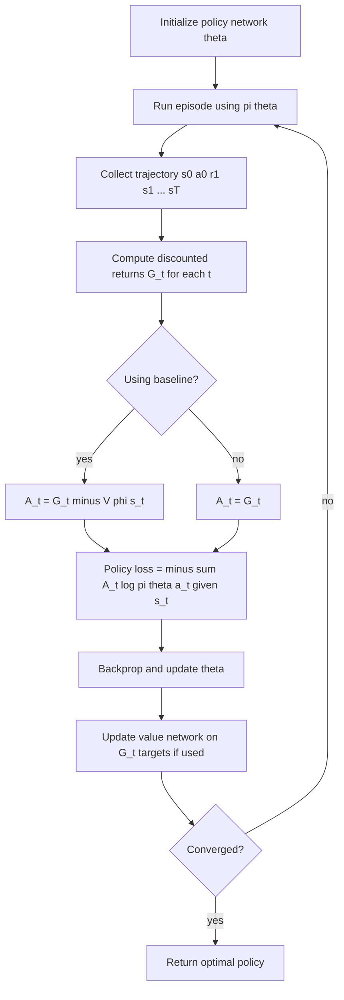

# Policy Gradient Methods

## 1. Detailed Explanation

Policy gradient methods directly parameterize and optimize the policy π_θ(a|s) without maintaining an explicit value function as the primary object. This contrasts with value-based methods (Q-learning, DQN) where the policy is derived implicitly via argmax. The central result is the Policy Gradient Theorem: ∇_θ J(θ) = E_{τ~π_θ}[Σ_t ∇_θ log π_θ(a_t|s_t) · Q^π(s_t,a_t)], which shows how to compute unbiased gradient estimates from sampled trajectories.

REINFORCE (Williams, 1992) is the simplest implementation: replace Q^π with the Monte Carlo return G_t = Σ_{k≥t} γ^{k-t} r_{k+1}. The algorithm is unbiased but high-variance because G_t depends on all future randomness. Subtracting a baseline b(s) reduces variance without introducing bias (since E[∇_θ log π · b] = 0 by the log-derivative trick). A natural baseline is the state value function V(s), giving the advantage A(s,a) = G_t - V(s).

Policy gradient methods shine where value-based methods struggle: (1) continuous action spaces — the policy can directly output action distributions (Gaussian); (2) stochastic optimal policies — when the optimal policy is inherently random (e.g., rock-paper-scissors), Q-learning must learn an implicit mixed strategy while policy gradient naturally parameterizes it; (3) end-to-end differentiable systems — the policy can be part of a larger differentiable pipeline.

In production, REINFORCE underpins RLHF fine-tuning of language models (PPO is a stabilized policy gradient), robotic manipulation in simulation, and structured prediction with non-differentiable reward signals.

---

## 2. Core Intuition

REINFORCE is like a basketball coach who reviews game footage and says: "Every time we made a move that preceded a win, do it more often; every time we made a move that preceded a loss, do it less often." You do not need to understand why a move was good — you just reinforce the good-outcome moves. The baseline is the team's average performance, so a mediocre win does not get credit; only moves in better-than-average games get reinforced.

---

## 3. How It Works

**REINFORCE update:** θ ← θ + α · G_t · ∇_θ log π_θ(a_t|s_t)

1. **Initialize** policy network π_θ with random weights.
2. **Collect episode:** follow π_θ from s_0, record trajectory τ = {s_0,a_0,r_1,...,s_T}.
3. **Compute returns:** G_t = Σ_{k=t}^{T} γ^{k-t} r_{k+1} for each timestep t.
4. **Optional baseline:** compute b(s_t) = V_φ(s_t) from a value network; compute advantage A_t = G_t - b(s_t).
5. **Policy loss:** L = -Σ_t A_t · log π_θ(a_t|s_t) (negative because we maximize J).
6. **Backpropagate** and update θ via gradient ascent.
7. **Update baseline** if using a value network: minimize (G_t - V_φ(s_t))² over episode transitions.

---

## 4. Architecture and Trade-offs

### Policy Gradient Variants

| Algorithm | Return Estimate | Variance | Bias | Update Frequency |
|-----------|---------------|----------|------|-----------------|
| REINFORCE | Monte Carlo G_t | Very High | Zero | Per episode |
| REINFORCE + baseline | G_t - V(s) | High | Zero | Per episode |
| Actor-Critic (A2C) | TD: r + gamma*V(s') | Medium | Low | Per step |
| PPO | Clipped advantage | Low | Low | Mini-batch |
| TRPO | KL-constrained | Low | Low | Per update |

### Policy Parameterization Options

| Action Space | Parameterization | Output | Example |
|-------------|----------------|--------|---------|
| Discrete | Softmax | Categorical distribution | GridWorld, Atari |
| Continuous | Gaussian | mu and sigma outputs | Robotic control |
| Mixed | Combination | Hybrid | Real-world manipulation |
| Structured | Autoregressive | Sequential distribution | Code generation |

### Baseline Options

| Baseline | Variance Reduction | Computation | When to Use |
|---------|-------------------|-------------|-------------|
| None | 0% | Zero | Debugging only |
| Mean return | ~30-50% | Trivial | Simple tasks |
| State value V(s) | ~60-80% | Extra network | Standard practice |
| Q(s,a) | ~80-90% | Extra network | Actor-critic style |

---

## 5. Interview Q&A

**Q: Why does REINFORCE have high variance and how do you reduce it?**
A: G_t sums all future rewards, each of which is random. With a 200-step episode, G_t at step 0 combines 200 random variables. Variance compounds multiplicatively with discounting. Reduce it by: (1) subtracting a baseline V(s) — reduces variance without adding bias; (2) reward normalization — standardize G_t to zero mean and unit variance per batch; (3) shorter rollout windows (n-step returns) — trade some variance for a little bias; (4) using actor-critic instead.

**Q: When would you use policy gradient instead of DQN?**
A: Use policy gradient when the action space is continuous (DQN requires discretization, which fails in high dimensions), when the optimal policy is stochastic (DQN's greedy policy cannot represent mixed strategies), or when you need differentiable end-to-end training with a non-differentiable reward (e.g., BLEU score in text generation). DQN is generally more sample-efficient for discrete action spaces.

**Q: Why is the log-probability gradient (log pi) used instead of the probability gradient (pi)?**
A: The policy gradient theorem gives ∇J = E[G_t · ∇log π(a|s)]. This form is numerically stable (log keeps probabilities in a well-scaled range), computationally simple (log-softmax is standard), and unbiased. Direct gradient of π risks near-zero probability collapse (if π(a|s) → 0, the gradient explodes when normalized by π). The log-derivative trick is exact: ∇log π = ∇π / π.

**Q: What is the "credit assignment problem" in REINFORCE and how do eligibility traces help?**
A: REINFORCE assigns equal credit to all actions in an episode — an action at step 5 gets the same return G_5 regardless of whether that specific action caused the reward at step 100. Eligibility traces (REINFORCE with traces) weight recent actions more heavily. Actor-critic methods solve this more directly by using the TD advantage r + γV(s') - V(s), which isolates the contribution of a single action.

**Q: How would you add entropy regularization to prevent a policy from converging too early?**
A: Add β·H(π) = -β·Σ_a π(a|s)log π(a|s) to the policy loss (negative for maximization). This penalizes low-entropy (confident) policies, encouraging exploration. Typical β = 0.01–0.1 decayed over training. Monitor policy entropy per episode; if it collapses to near zero before reward has plateaued, increase β.

---

## 6. Best Practices

- Normalize advantages to zero mean and unit variance per batch; this is the single most impactful variance reduction technique and costs nothing.
- Use reward discounting γ = 0.99 for most tasks; for episodic tasks shorter than 100 steps, γ = 0.95 works well.
- Collect at least 10–20 episodes per gradient update for stable gradient estimates; more is better but compute-intensive.
- Add entropy regularization (β = 0.01) by default; remove only if policy is converging too slowly.
- Gradient clipping (max norm = 0.5–5.0) prevents large policy updates from destabilizing training.
- Monitor KL divergence between old and new policy per update; if KL > 0.2, the update step is too large.
- For continuous actions, use separate networks for mean μ_θ(s) and log-variance log σ²; do not share the variance across states.

---

## 7. Common Pitfalls

- **High variance with no baseline:** Training is unstable and reward curves are extremely noisy. Even episodes with decent returns may get negative signal due to high mean return. Fix: always add a value network baseline.
- **Reward scale mismatch:** If returns G_t are in the range [0, 1000], the gradient log π · G_t is large and steps are oversized. Symptom: policy loss explodes and NaN appears. Fix: normalize rewards to [-1, 1] or standardize G_t per batch.
- **Sampling too few episodes per update:** Gradient estimate is so noisy the update is a random walk. Fix: increase rollout count to 20+ episodes, or use actor-critic for step-level updates.
- **Ignoring temporal structure:** Applying G_t = full episode return to all timesteps is inefficient. G_t at the last step should only reflect r_T (one reward), not the full episode sum. Fix: compute causally correct returns G_t = Σ_{k≥t} γ^{k-t} r_{k+1}.
- **Policy entropy collapse:** Policy becomes deterministic too early before finding the optimal action. Subsequent gradient updates cannot recover because all probability mass is on one action. Fix: add entropy regularization; monitor entropy per episode and stop training if it drops below threshold.

---

## 8. Related Concepts

- [10-actor-critic](./10-actor-critic.md) — extends REINFORCE with a critic to reduce variance
- [08-deep-q-networks](./08-deep-q-networks.md) — value-based alternative; complements policy gradient for discrete actions
- [06-q-learning](./06-q-learning.md) — tabular value-based method; policy gradient is the direct competitor
- [07-sarsa](./07-sarsa.md) — on-policy value method; policy gradient shares the on-policy characteristic
- [03-markov-decision-processes](./01-markov-decision-processes.md) — formal MDP framework underpinning the Policy Gradient Theorem
