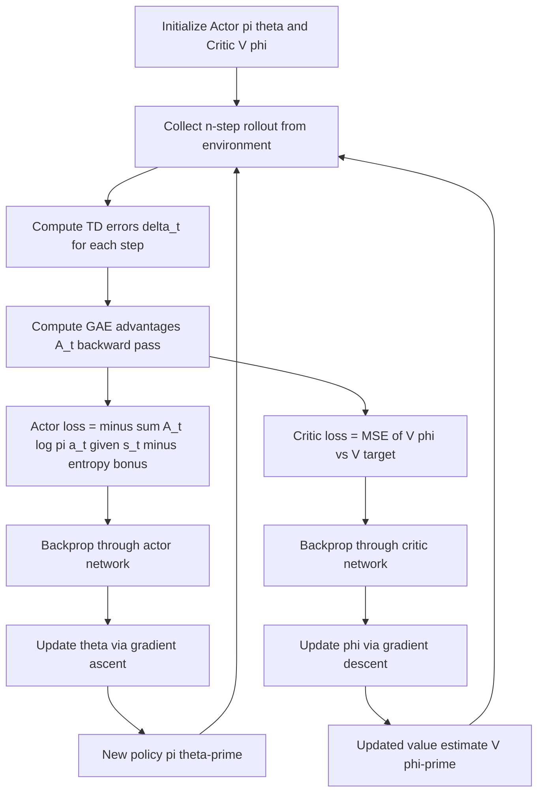

# Actor-Critic Methods

## 1. Detailed Explanation

Actor-Critic methods combine the strengths of policy gradient (actor) and value function approximation (critic) in a single framework. The actor π_θ(a|s) maintains a parameterized policy and is updated via policy gradient. The critic V_φ(s) estimates the state-value function and provides a low-variance advantage estimate A(s,a) = r + γV_φ(s') - V_φ(s) (the TD error), which replaces the high-variance Monte Carlo return used by REINFORCE.

The key insight is that the TD advantage A(s,a) has much lower variance than G_t because it uses the critic's bootstrap estimate V(s') instead of summing all future rewards. This enables per-step updates (unlike REINFORCE's per-episode updates), dramatically improving sample efficiency. The cost is a small bias introduced by the critic's approximation errors — the bias-variance trade-off is tunable via the GAE (Generalized Advantage Estimation) parameter λ.

A2C (Advantage Actor-Critic) is the synchronous version, where multiple workers collect environment steps in parallel before a single update. A3C (Asynchronous) uses truly parallel workers with asynchronous gradient updates. PPO (Proximal Policy Optimization) and SAC are modern successors that address A2C's training instability with clipped objectives.

Actor-Critic is the dominant paradigm in modern deep RL production systems: PPO trains ChatGPT-style RLHF, SAC controls robotics arms in simulation-to-real transfer, and A2C variants are used in game-playing and recommendation systems. Understanding actor-critic is prerequisite to understanding any state-of-the-art RL algorithm.

---

## 2. Core Intuition

Actor-Critic is like a student (actor) and a tutor (critic) working together. The student tries different approaches to a problem and reports what worked. The tutor does not wait for the end-of-semester exam; instead, after each homework problem, the tutor estimates how much better or worse the student's approach was compared to expectations and gives immediate, calibrated feedback. The student adjusts their strategy based on this feedback, and the tutor updates their expectations. Neither can learn as fast alone.

---

## 3. How It Works

**Actor update:** θ ← θ + α_θ · A(s_t,a_t) · ∇_θ log π_θ(a_t|s_t)

**Critic update:** φ ← φ - α_φ · (r + γV_φ(s') - V_φ(s)) · ∇_φ V_φ(s)

**GAE advantage:** A_t^{GAE} = Σ_{l≥0} (γλ)^l δ_{t+l}, where δ_t = r_t + γV(s_{t+1}) - V(s_t)

1. **Initialize** actor network π_θ and critic network V_φ (can share base layers).
2. **Collect n-step rollout:** follow π_θ, store (s_t, a_t, r_t, s_{t+1}) for t = 0..n-1.
3. **Compute TD errors:** δ_t = r_t + γV_φ(s_{t+1}) - V_φ(s_t) for each step.
4. **Compute GAE advantages:** A_t = Σ_{l=0}^{T-t} (γλ)^l δ_{t+l} (backward pass over rollout).
5. **Actor loss:** L_actor = -Σ_t A_t · log π_θ(a_t|s_t) - β·H(π_θ) (add entropy bonus).
6. **Critic loss:** L_critic = Σ_t (V_φ(s_t) - V_target_t)² where V_target_t = Σ_l (γ)^l r_{t+l} + γ^n V_φ(s_n).
7. **Update** both networks via backpropagation; optionally share gradients through shared base.

---

## 4. Architecture and Trade-offs

### Actor-Critic Variants

| Algorithm | Update | Advantage | Parallelism | Stability |
|-----------|--------|-----------|-------------|-----------|
| A2C | Synchronous n-step | GAE | Multiple workers, sync | High |
| A3C | Asynchronous steps | n-step | Multiple workers, async | Medium |
| PPO | Clipped surrogate | GAE | Mini-batch epochs | Very High |
| SAC | Off-policy + entropy | Soft advantage | Replay buffer | Very High |
| TD3 | Deterministic actor | Q-value | Replay buffer | High |

### GAE Lambda Parameter

| Lambda | Advantage Estimate | Variance | Bias | Best for |
|--------|------------------|----------|------|---------|
| 0 | 1-step TD | Very Low | High | Short tasks, fast convergence |
| 0.5 | Intermediate | Medium | Medium | Balanced |
| 0.95 | ~20-step return | Medium-High | Low | Most continuous tasks |
| 1.0 | Full Monte Carlo | Very High | Zero (exact) | Short episodes |

### Shared vs Separate Networks

| Architecture | Memory | Training | Risk | When to Use |
|-------------|--------|----------|------|-------------|
| Shared base + separate heads | Low | Joint backprop | Gradient conflict | Same input modality |
| Fully separate networks | High | Independent | None | Different scales |
| Separate + periodic sync | Medium | Alternating | Staleness | Multi-GPU training |

---

## 5. Interview Q&A

**Q: Why does actor-critic converge faster than REINFORCE with baseline?**
A: REINFORCE requires a full episode before any update — in a 500-step episode, you wait 500 steps to get one gradient estimate. Actor-critic updates every n steps (typically n=5–20), providing 50–100x more updates per unit of experience. The trade-off is the critic introduces bias via bootstrapping, but with a well-trained critic this bias is small compared to the variance reduction benefit.

**Q: What is GAE and when do you set lambda=0.95 vs lambda=0?**
A: GAE (Generalized Advantage Estimation) is an exponentially weighted average of n-step TD errors: A_t = Σ (γλ)^l δ_{t+l}. Lambda=0 gives the 1-step TD advantage (low variance, high bias), lambda=1 gives the full MC return (zero bias, high variance). Lambda=0.95 is the empirical sweet spot for most continuous control tasks. Use lambda=0 for short tasks where the 1-step estimate is accurate; use lambda=0.95–0.99 for longer tasks where credit assignment spans many steps.

**Q: How do you handle the case where actor and critic have conflicting gradients through a shared network?**
A: Gradient conflict happens when the critic's loss pushes shared features in a direction that hurts the actor (and vice versa). Common fixes: (1) scale losses — L_total = L_actor + c_v·L_critic, where c_v = 0.25–0.5 down-weights critic; (2) gradient clipping per loss before summing; (3) use separate networks and only share the first few layers; (4) use separate optimizers for actor and critic even with shared base. PPO uses L_total = L_policy - c_v·L_value + c_e·L_entropy with coefficients.

**Q: When would you use SAC instead of A2C for a continuous control task?**
A: SAC (Soft Actor-Critic) is off-policy — it uses a replay buffer and can reuse data efficiently. Use SAC when: (1) environment steps are expensive (physical robot); (2) you need sample efficiency over wall-clock time; (3) the task has multimodal optimal behavior that benefits from maximum entropy exploration. Use A2C when: (1) environment steps are cheap (simulation); (2) you prefer simpler, synchronous training; (3) you need stable, predictable convergence for RLHF-style finetuning.

**Q: What is the effect of entropy regularization on the actor, and how do you tune beta?**
A: Entropy regularization H(π) = -Σ π(a|s) log π(a|s) added to the actor loss encourages the policy to remain stochastic, preventing premature convergence to a suboptimal deterministic policy. Start β = 0.01; if the policy entropy drops below 0.5 nats in the first 30% of training, increase to 0.05. If the policy never converges despite high reward, decrease β. Anneal β toward 0 near end of training to allow the policy to become deterministic.

**Q: How would you debug an actor-critic where the critic is accurate but the actor does not improve?**
A: The critic is accurate but actor is stagnant typically means: (1) the advantage A_t ≈ 0 everywhere — the critic learned the mean value and all actions look equal; fix by checking the advantage distribution (should have non-trivial variance); (2) the policy gradient is being killed by very small π(a|s) for the sampled actions (degenerate policy); monitor log π values. (3) learning rate α_θ is too small compared to α_φ — the critic updates faster, advantages are "used up" before the actor can benefit; try α_θ = 5×α_φ as a starting ratio.

---

## 6. Best Practices

- Set learning rates α_critic = 3x to 10x α_actor; the critic must be accurate before actor updates are meaningful.
- Use GAE with λ = 0.95 as the default; only tune after confirming other hyperparameters are stable.
- Collect rollouts of n = 16–128 steps per update; shorter rollouts reduce bias but require more frequent updates.
- Normalize advantages per minibatch to zero mean, unit variance — this is the most important trick for stability.
- Add entropy coefficient β = 0.01; monitor entropy and increase if the policy collapses in the first 30% of training.
- For shared architectures, clip actor and critic gradients separately before they reach shared layers.
- Log both actor loss and critic loss; if only one of them is decreasing, there is a gradient conflict or learning rate imbalance.

---

## 7. Common Pitfalls

- **Critic not trained enough before actor updates:** Actor receives random advantage estimates and policy diverges immediately. Symptom: actor loss oscillates wildly from the start. Fix: pre-train critic for 100 steps before allowing actor updates, or use a much higher learning rate for the critic.
- **Advantage not normalized:** Raw advantages can span [-100, +100] in sparse-reward tasks, causing huge policy gradient steps. Symptom: policy entropy collapses in a few updates. Fix: normalize advantages per update batch to mean=0, std=1.
- **Gradient conflict in shared network:** Critic loss pushes features toward value-predictive representations; actor loss toward action-discriminative representations. Symptom: both actor and critic losses oscillate. Fix: reduce critic loss weight (c_v = 0.25) or use separate networks.
- **Lambda too high with noisy rewards:** High-λ GAE amplifies noise across many steps. Symptom: advantage estimates are noisy even with accurate critic; actor gradient is noisy. Fix: reduce λ from 0.95 to 0.7 in noisy reward environments.
- **n-step rollout too short:** 1-step advantages are highly biased if the critic is inaccurate (early training). Symptom: actor converges to wrong policy early. Fix: use n=32+ steps to give the critic enough signal per update; alternatively increase actor learning rate warmup.

---

## 8. Related Concepts

- [09-policy-gradient](./09-policy-gradient.md) — REINFORCE is the actor without a critic; A2C adds the critic
- [08-deep-q-networks](./08-deep-q-networks.md) — pure critic approach; actor-critic combines the paradigms
- [06-q-learning](./06-q-learning.md) — critic in actor-critic approximates V(s), rooted in Q-learning
- [07-sarsa](./07-sarsa.md) — on-policy TD learning that actor-critic's critic is based on
- [03-markov-decision-processes](./01-markov-decision-processes.md) — Bellman equations that underpin both actor and critic updates
