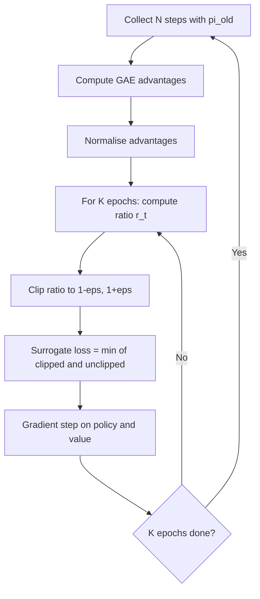

# 11 — Proximal Policy Optimization (PPO)

## 1. Detailed Explanation

Proximal Policy Optimization (PPO) is the dominant policy-gradient algorithm in modern
reinforcement learning, widely used in robotics, game-playing, and — most prominently —
aligning large language models via RLHF (Reinforcement Learning from Human Feedback).
It was introduced by Schulman et al. (OpenAI, 2017) as a practical, simpler alternative
to Trust Region Policy Optimization (TRPO), which requires expensive second-order
optimisation.

The core problem PPO solves is *step size control*. Plain policy gradient (REINFORCE)
updates the policy with gradient steps but has no mechanism to prevent a single update
from catastrophically changing the policy. If the new policy is much worse, you cannot
reuse the collected rollout data to recover — you must collect fresh experience. PPO
introduces a clipping constraint on the probability ratio r_t = pi_new(a|s) / pi_old(a|s),
ensuring the update stays within a trust region without the computational cost of TRPO.

PPO is the algorithm behind OpenAI's InstructGPT, Anthropic's Claude, and most other
RLHF-aligned LLMs. In the RLHF setting, the language model is treated as the policy,
token sequences are "actions", and a separate reward model (trained on human preferences)
provides the reward signal. A KL divergence penalty is added to prevent the model from
drifting too far from the supervised fine-tuned (SFT) reference policy — preventing
reward hacking where the model finds degenerate outputs that score well under the reward
model but are nonsensical to humans.

---

## 2. Core Intuition

Think of policy gradient as a student adjusting their study approach based on test scores.
Without constraints, one very good result might cause them to over-correct — studying
only one topic obsessively and forgetting everything else.
PPO is like telling the student: "adjust your approach, but don't change more than 20%
of your habits from last week" — it clips the adjustment ratio so learning is steady and
stable across many small updates.

---

## 3. How It Works

1. **Collect rollout:** Run the current policy pi_old in the environment for N steps.
   Record (state, action, reward, done) tuples and log-probabilities log pi_old(a|s).

2. **Compute advantages:** Using GAE (Generalised Advantage Estimation):
   delta_t = r_t + gamma * V(s_{t+1}) - V(s_t)
   A_t = sum_{k=0}^{inf} (gamma * lambda)^k * delta_{t+k}
   This combines low-variance MC returns with low-bias TD bootstrapping.

3. **Compute policy ratio:** For each (s, a) pair:
   r_t(theta) = pi_theta(a|s) / pi_old(a|s) = exp(log pi_theta - log pi_old)

4. **Clip the objective:** Take the minimum of the unclipped and clipped surrogate:
   L_CLIP = E[min(r_t * A_t, clip(r_t, 1-eps, 1+eps) * A_t)]
   When advantage is positive, this limits how much we can increase pi(a|s).
   When advantage is negative, this limits how much we can decrease pi(a|s).

5. **Multiple gradient epochs:** Unlike vanilla PG which discards the batch after one
   gradient step, PPO reuses the same rollout batch for K = 4–10 gradient epochs.
   This is safe because the clip prevents the policy from straying too far from pi_old.

6. **Update value function:** Minimise MSE between V(s) and the computed returns.
   Some implementations also clip the value loss for symmetry.

---

## 4. Architecture and Trade-offs

### PPO Variants

| Variant | Advantage Estimation | Action Space | Typical Use |
|---------|----------------------|--------------|-------------|
| PPO-Clip | GAE(lambda) | Discrete or continuous | Most common, all domains |
| PPO-KL | Adaptive KL penalty | Discrete or continuous | Alternative to clip |
| PPO-RLHF | Reward model + KL | Token sequences | LLM alignment |
| PPO-MT | Shared trunk, task heads | Multi-task | Transfer learning |

### Key Hyperparameters

| Parameter | Typical Range | Effect of Too High | Effect of Too Low |
|-----------|---------------|-------------------|-------------------|
| clip_eps | 0.1 – 0.3 | Large, unstable updates | Very slow learning |
| K epochs | 4 – 10 | Policy diverges from data | Wastes sample efficiency |
| GAE lambda | 0.90 – 0.97 | High variance (MC) | High bias (TD) |
| Entropy coef | 0.0 – 0.05 | Random policy | Premature convergence |
| Batch size N | 512 – 4096 | Memory pressure | Noisy gradients |

### PPO vs Competitors

| Algorithm | On/Off-Policy | Continuous | Sample Eff. | Stability | Impl. Complexity |
|-----------|---------------|------------|-------------|-----------|-----------------|
| REINFORCE | On | Yes | Low | Low | Very simple |
| PPO | On | Yes | Medium | High | Moderate |
| SAC | Off | Yes (only) | High | High | Complex |
| TD3 | Off | Yes (only) | High | Medium | Moderate |

---

## 5. Interview Q&A

**Q: Why does PPO use multiple gradient epochs per rollout instead of just one?**
A: Collecting experience is expensive (requires environment interaction). PPO's clip
constraint ensures the policy doesn't move too far from pi_old, making it safe to
reuse the same batch for K gradient steps. This amortises the rollout cost over K
updates, improving sample efficiency by roughly K× compared to REINFORCE.

**Q: What happens if you set clip_eps = 0.5 (much larger than typical 0.2)?**
A: The policy can change drastically in one update, especially in early training when
advantages have high magnitude. This causes instability — the policy may suddenly
collapse to a degenerate action distribution. You'd see loss spikes and episodic
returns dropping sharply. Fix: reduce clip_eps to 0.1–0.2 and normalise advantages.

**Q: In RLHF, why add a KL penalty in addition to PPO's clip?**
A: PPO's clip only prevents large single-step updates; over many iterations the policy
can still drift far from the SFT reference. The KL penalty acts as a persistent
regulariser: r_shaped = r_reward_model - beta * KL(pi_RL || pi_SFT). Without it,
the model learns to exploit the reward model (reward hacking) with degenerate outputs.

**Q: How would you debug training where PPO returns plateau early?**
A: Check these in order: (1) advantage variance — if near zero, value function is
overfit and clips all gradient signal; (2) entropy — if zero, policy is deterministic
too early, add entropy bonus; (3) ratio distribution — if r_t always exactly at clip
boundary, GAE advantages have the wrong sign, check reward normalisation.

**Q: What is the difference between PPO-Clip and PPO-KL?**
A: PPO-Clip uses a hard clip on the ratio and is generally more robust — it doesn't
require tuning a KL penalty coefficient. PPO-KL adds a soft penalty that adapts its
coefficient based on measured KL. Clip is the standard choice; KL is used when you
want explicit control over divergence (e.g., RLHF where KL to a reference policy
is important for safety).

**Q: When would you NOT use PPO?**
A: When sample efficiency is critical (PPO is on-policy, requiring fresh rollouts).
For purely continuous control with many samples available, SAC or TD3 are often
2-5x more sample-efficient. PPO also struggles with very long-horizon tasks where
credit assignment is hard — model-based methods are better there.

---

## 6. Best Practices

- **Normalise advantages per batch:** Zero-mean, unit-variance advantages prevent
  learning rate sensitivity and improve numerical stability in the loss gradient.
- **Use 4–8 K epochs per rollout:** More epochs risks policy divergence; fewer wastes
  data. Monitor the ratio r_t distribution — most values should stay within [0.8, 1.2].
- **Set clip_eps = 0.2 as a starting point:** Reduce to 0.1 for fine-tuning or
  when training is unstable; increase to 0.3 for tasks needing faster adaptation.
- **Add entropy regularisation (coef 0.01–0.05):** Prevents premature policy collapse
  in early training; anneal to zero over the final 20% of training.
- **Separate learning rates for actor and critic:** Critic typically needs 5–10×
  higher LR than actor since value function changes faster than the policy.
- **Use GAE lambda = 0.95 default:** Provides excellent bias-variance tradeoff for
  most tasks; reduce toward 0.9 for short-horizon tasks, increase toward 0.99 for
  long-horizon tasks.
- **Monitor explained variance of value function:** Should increase toward 0.95+
  over training. Low explained variance means the value function is underfit and
  providing poor advantage estimates.

---

## 7. Common Pitfalls

- **Not normalising advantages:** Raw advantages can span [-50, +50] in many tasks.
  Large magnitudes cause exploding gradients regardless of clip. Always normalise
  to mean=0, std=1 per minibatch.
  Fix: `adv = (adv - adv.mean()) / (adv.std() + 1e-8)`

- **Reusing old log-probs incorrectly:** The ratio r_t = exp(new_lp - old_lp) must
  use log-probs from the *beginning of the epoch* (pi_old), not updated from previous
  epoch iterations. Recomputing old_lp mid-epoch breaks the clip guarantee.
  Fix: store log-probs once before the epoch loop begins.

- **Forgetting the entropy bonus:** Without entropy regularisation, PPO tends to
  collapse to deterministic policies early in training, especially on discrete action
  spaces. The agent stops exploring and gets stuck in local optima.
  Symptom: policy entropy drops to near zero before returns have converged.

- **Value function overfit to current batch:** Too many value update steps or too
  high value LR causes the baseline to perfectly fit the current batch. Next batch
  advantages collapse to near zero, killing the policy gradient signal.
  Fix: use early stopping on value loss or keep value LR modest (1e-3 to 1e-2).

- **RLHF without KL penalty:** The reward model is a proxy, not the true human
  preference. Without KL penalty the policy exploits reward model weaknesses within
  a few hundred PPO steps, generating nonsensical but highly-scored outputs.

---

## 8. Related Concepts

- [10-policy-gradient](./09-policy-gradient.md) — PPO extends vanilla PG with ratio clipping
- [12-soft-actor-critic](./12-soft-actor-critic.md) — entropy-regularised off-policy alternative
- [14-exploration-exploitation](./14-exploration-exploitation.md) — entropy bonus relates to exploration
- [15-reward-shaping](./15-reward-shaping.md) — RLHF KL penalty is a form of reward shaping
- [13-multi-armed-bandit](./13-multi-armed-bandit.md) — bandit formulation underlies the ratio objective
