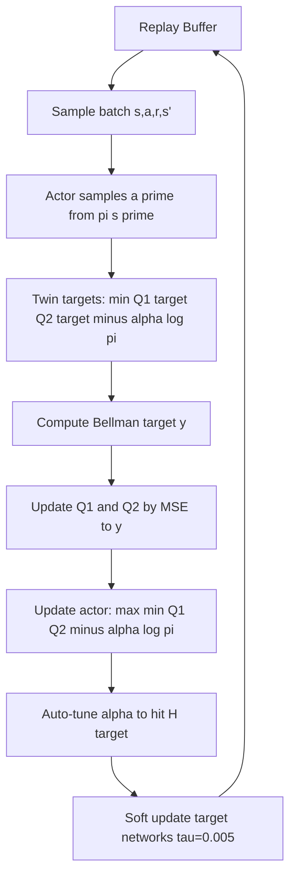

# 12 — Soft Actor-Critic (SAC)

## 1. Detailed Explanation

Soft Actor-Critic is the leading off-policy algorithm for continuous control, introduced by
Haarnoja et al. (Berkeley, 2018). SAC combines three ideas into one cohesive framework:
the actor-critic architecture, experience replay from DQN, and maximum entropy RL theory.

The central innovation is the *maximum entropy objective*. Standard RL maximises expected
cumulative reward E[sum r_t]. SAC adds an entropy term: E[sum r_t + alpha * H(pi(·|s_t))],
where H is Shannon entropy and alpha is a temperature hyperparameter. Maximising entropy
encourages the policy to remain as stochastic as possible while still achieving high reward.
This produces policies that explore widely, naturally avoid local optima, and transfer better
to perturbed environments.

SAC addresses two major weaknesses of earlier off-policy actor-critic methods (like DDPG):
training instability and extreme sensitivity to hyperparameters. DDPG's single critic tends
to overestimate Q-values, causing the actor to exploit those errors and produce pathological
policies. SAC uses twin critics — two independent Q-networks — and takes the minimum Q
estimate as the target, a pessimistic correction that suppresses overestimation. Combined
with soft (exponential moving average) target network updates, SAC is remarkably stable.

SAC is used in robotics (manipulation, locomotion), autonomous driving simulators, and
recommendation systems where actions are continuous. Its sample efficiency — typically 10-50x
better than PPO on MuJoCo benchmarks — makes it the default choice when environment
interactions are expensive.

---

## 2. Core Intuition

Imagine a chess grandmaster who not only plays the best moves but also deliberately randomises
slightly, so opponents cannot predict them exactly and so they stay sharp across many
strategies. SAC is that grandmaster: it trains an agent to earn high reward while also
staying as uncertain and exploratory as possible — the entropy term literally rewards
unpredictability. The twin critics act as two independent judges; the policy only trusts a
move when both judges agree it is good.

---

## 3. How It Works

1. **Sample from replay buffer:** Draw a batch of (s, a, r, s', done) transitions from a
   large replay buffer (capacity 1M typical), enabling off-policy learning.

2. **Compute target Q:** Using the twin target critics Q1_target, Q2_target and the
   current policy's *next action* a' ~ pi(·|s') with entropy:
   y = r + gamma * (1 - done) * (min(Q1_target(s',a'), Q2_target(s',a')) - alpha * log pi(a'|s'))

3. **Update twin critics:** Minimise MSE of Q1(s,a) and Q2(s,a) against target y.
   Two separate critics with independent weights are trained independently.

4. **Update actor:** Maximise: E[min(Q1(s,a~), Q2(s,a~)) - alpha * log pi(a~|s)]
   where a~ is re-parameterised (reparameterisation trick): a = mu + sigma * noise.
   Gradients flow through the reparameterisation, not the action samples.

5. **Auto-tune temperature alpha:** Optimise alpha to satisfy a target entropy H_target:
   L(alpha) = E[-alpha * (log pi(a|s) + H_target)]
   This eliminates the need to hand-tune alpha — it adapts during training.

6. **Soft target network update:** Every step: theta_target <- tau * theta + (1-tau) * theta_target
   with tau = 0.005. This slow-moving target prevents oscillating Q estimates.

---

## 4. Architecture and Trade-offs

### SAC vs PPO vs TD3 vs DDPG

| Property | SAC | PPO | TD3 | DDPG |
|----------|-----|-----|-----|------|
| On/Off-policy | Off | On | Off | Off |
| Action space | Continuous only | Both | Continuous only | Continuous only |
| Sample efficiency | Very high | Low-medium | High | High |
| Training stability | Very high | High | Medium | Low |
| Hyperparameter sensitivity | Low (auto alpha) | Medium | Medium | High |
| Exploration strategy | Max-entropy (built-in) | Entropy bonus | Gaussian noise | Ornstein-Uhlenbeck |
| Twin critics | Yes | No | Yes | No |
| Common use | Robotics, control | LLM, games | Robotics | Robotics (legacy) |

### Key SAC Hyperparameters

| Parameter | Typical Value | Effect if Too High | Effect if Too Low |
|-----------|--------------|-------------------|-------------------|
| Target entropy H_target | -dim(action) | Excessive randomness | Premature determinism |
| Tau (soft update) | 0.005 | Unstable Q targets | Too-slow target update |
| Replay buffer size | 1e6 | Memory pressure | Correlated samples |
| Batch size | 256 | GPU memory pressure | Noisy gradients |
| Learning rate | 3e-4 | Divergence | Very slow convergence |
| Hidden units | 256 per layer | Overfitting, slow | Insufficient capacity |

### Actor Network Design

| Architecture | When to Use | Trade-off |
|-------------|-------------|-----------|
| 2-layer MLP, 256 hidden | Standard control (MuJoCo, robotics) | Simple, fast |
| CNN + MLP | Pixel-based observations | Higher capacity, slower |
| Recurrent (LSTM) | Partial observability | Harder to train, slower |
| Gaussian head (mu, log_sigma) | All SAC variants | Reparameterisation trick |

---

## 5. Interview Q&A

**Q: When would you use SAC over PPO?**
A: Use SAC when (1) the action space is continuous, (2) environment interactions are
expensive and sample efficiency matters, or (3) you cannot parallelize environment
rollouts. PPO shines when you can run many environments in parallel (e.g., simulated
game environments) or when the action space is discrete. For robotics with a physical
robot, SAC is almost always preferred — 10-50x fewer samples needed.

**Q: What happens when the temperature alpha is set too high?**
A: The entropy term dominates the reward signal. The policy optimises primarily for
high entropy (staying random) and stops caring about reward. In practice you see
near-uniform action distributions and flat reward curves. If auto-tuning alpha, check
that the measured entropy is close to H_target — if it's much higher, H_target is
set too loosely (should be approximately -dim(action)).

**Q: Why use twin critics instead of a single critic?**
A: A single Q-network in actor-critic methods tends to overestimate Q-values because
the actor is trained to exploit the critic. The actor shifts actions toward regions
where Q is high, the critic updates on those biased targets, and the cycle spirals into
divergence. Twin critics break this: taking the minimum of Q1, Q2 introduces a pessimistic
bias that counteracts overestimation. TD3 introduced this trick; SAC adopted it.

**Q: How does the reparameterisation trick differ from REINFORCE?**
A: REINFORCE (log-derivative trick) estimates the policy gradient as E[G * grad log pi],
which is unbiased but high-variance since it uses Monte Carlo samples. The reparameterisation
trick expresses a ~ pi(·|s) as a = f(mu, sigma, noise) where noise ~ N(0,1), then
differentiates directly through f. This gives lower-variance gradients because the
expectation is over fixed noise, not over the policy parameters.

**Q: What is entropy collapse and how do you detect it?**
A: Entropy collapse is when the policy's entropy drops to near zero early in training —
the policy becomes deterministic too soon and stops exploring. You detect it by tracking
the mean log-probability log pi(a|s): if it rapidly becomes very negative (e.g., -20 or
lower), the policy is almost deterministic. Fix: check auto-tuning is enabled; if manually
setting alpha, increase it; verify the target entropy H_target is not too close to zero.

**Q: Why does SAC use soft target network updates instead of hard updates?**
A: Hard updates (copy weights every N steps) cause the target Q to jump discontinuously,
creating sharp oscillations in training loss. Soft updates (exponential moving average with
tau=0.005) produce a slowly-changing target, so the Bellman target y = r + gamma * Q_target
changes smoothly. This is especially important in SAC because the actor is updated every
step — a jumping target would create instability in actor gradients.

---

## 6. Best Practices

- **Enable auto-tuning of alpha:** Set target entropy to -dim(action) and let SAC adapt
  alpha. Manual tuning is fragile; auto-tuning adds only one scalar gradient step per
  iteration and works across tasks without modification.
- **Use tau = 0.005 for soft updates:** Smaller tau (0.001) is more stable but slower;
  larger tau (0.01) updates faster but can destabilise Q targets. Start at 0.005.
- **Normalise observations online:** Maintain running mean/variance of observations and
  normalise inputs to the actor and critic. Many control tasks have heterogeneous
  observation scales that cause learning rate issues without normalisation.
- **Set replay buffer to 1M transitions:** Too small (< 10K) causes correlated samples
  and poor generalisation; too large consumes memory without benefit once training
  stabilises. 1M is the standard default.
- **Separate replay buffer warm-up:** Fill 5000-10000 random transitions before starting
  gradient updates. This prevents very early updates from being dominated by highly
  correlated initial experiences.
- **Use 256 hidden units per layer in both actor and critic:** This is the standard for
  MuJoCo-scale problems. Scale up to 512 for harder manipulation tasks or pixel inputs.
- **Monitor alpha values during training:** Alpha should decrease over time as the policy
  learns (less exploration needed). If alpha keeps increasing, the reward signal is too
  weak or the environment dynamics are stochastic.

---

## 7. Common Pitfalls

- **Forgetting target network update:** If soft target network updates are skipped,
  the Bellman backup is computed against the live networks, creating a moving target
  that causes Q-value divergence (loss spikes to NaN). Always verify both Q1_target and
  Q2_target are updated every step with tau=0.005.
  Fix: `theta_target = tau * theta + (1-tau) * theta_target` after each gradient step.

- **Replay buffer memory overflow on long runs:** A replay buffer of 1M transitions with
  256-dim observations uses ~1GB RAM. On pixel-based tasks (84x84x4 frames), the same
  buffer exceeds 30GB. Either reduce buffer size or use compressed storage (uint8 frames).
  Symptom: system memory exhausted after 100K training steps.

- **Ignoring entropy collapse:** The policy becomes deterministic early, training reward
  plateaus prematurely. Without entropy tracking, this looks like convergence but is
  actually suboptimal exploration. Always log mean policy entropy alongside reward.

- **Wrong action squashing:** SAC's Gaussian policy produces unbounded actions; the
  tanh squashing to [-1, 1] requires a log-determinant correction to the log-probability:
  log pi(a|s) = log N(u|mu,sigma) - sum(log(1 - tanh^2(u_i))). Missing this correction
  biases the entropy estimate and destabilises alpha auto-tuning.

- **Using SAC for discrete actions without modification:** Standard SAC with reparameterisation
  only works for continuous actions. Discrete-SAC requires a separate formulation (Christodoulou
  2019) using softmax actions and exact entropy. Do not apply continuous SAC to discrete
  spaces — probabilities will not sum to one after tanh squashing.

---

## 8. Related Concepts

- [11-proximal-policy-optimization](./11-proximal-policy-optimization.md) — on-policy alternative, better for discrete spaces and parallel envs
- [10-actor-critic](./10-actor-critic.md) — SAC builds on the actor-critic architecture
- [14-exploration-exploitation](./14-exploration-exploitation.md) — maximum entropy is SAC's exploration strategy
- [09-policy-gradient](./09-policy-gradient.md) — SAC's actor update uses the reparameterisation trick, a PG variant
