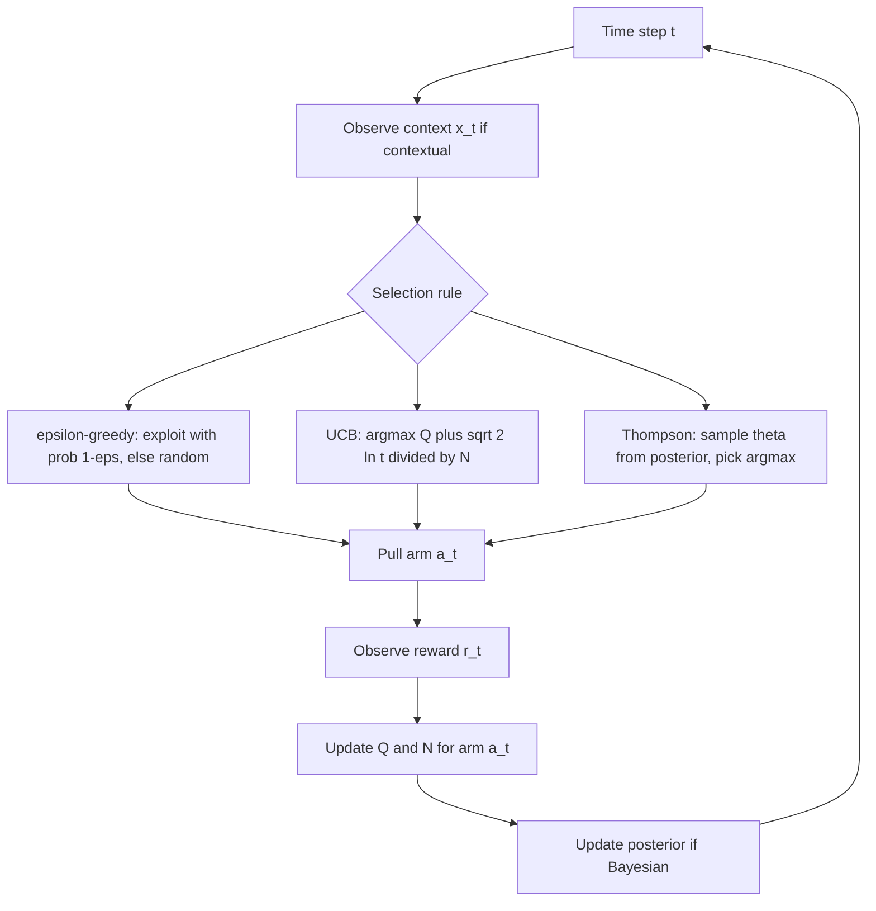

# 13 — Multi-Armed Bandit

## 1. Detailed Explanation

The multi-armed bandit (MAB) is the simplest sequential decision-making problem: an agent
faces K slot machines ("arms"), each paying a reward drawn from an unknown distribution.
At each time step t the agent selects one arm a_t and receives reward r_t ~ P(a_t). The
goal is to maximise cumulative reward over T rounds, which requires trading off between
*exploration* (trying arms to learn their distributions) and *exploitation* (pulling the
arm believed to be best).

The theoretical measure of quality is *regret*: the gap between the agent's actual reward
and what it would have earned by always pulling the optimal arm. Sublinear regret O(log T)
is achievable; a random policy suffers linear regret O(T).

MAB is not just a toy problem. It underlies A/B testing (two arms), clinical trials (K
treatment arms), recommender systems (K content items), ad auction selection, and hyperparameter
search. It also formalises the exploration problem in full RL: at each state, the agent faces
a bandit problem over actions.

The key variants differ in what information is available: a *contextual bandit* receives a
feature vector (context) x_t before choosing an arm, and the reward depends on both arm and
context — this covers recommendation and personalisation. A *non-stationary bandit* has
arm distributions that change over time, requiring the agent to forget old observations.
LinUCB extends UCB to contextual settings using a linear reward model.

---

## 2. Core Intuition

Imagine trying K new restaurants, each visited once, and then deciding where to eat every
day for a year. You want to find the best restaurant quickly (exploration) but also eat
well as soon as possible (exploitation). A bandit algorithm is a principled policy for
managing this calendar — it tells you exactly when it is worth trying an untested
restaurant vs. returning to your current favourite.

---

## 3. How It Works

1. **Initialise estimates:** Set Q(a) = 0 and N(a) = 0 for each arm a in {1, ..., K}.
   Q(a) is the sample mean reward; N(a) is the pull count.

2. **Select arm:** Use a selection rule (epsilon-greedy, UCB, Thompson, or LinUCB)
   to choose a_t. The rule balances estimated quality with exploration incentive.

3. **Observe reward:** Pull arm a_t, observe r_t ~ P(a_t).

4. **Update estimates:** N(a_t) += 1. Incremental mean update:
   Q(a_t) = Q(a_t) + (r_t - Q(a_t)) / N(a_t)

5. **Compute exploration bonus (UCB only):** U(a) = sqrt(2 * ln(t) / N(a)).
   UCB selects argmax_a [Q(a) + U(a)]. Bonus is large when arm is underexplored.

6. **Repeat until T rounds:** Track cumulative reward and regret for evaluation.

---

## 4. Architecture and Trade-offs

### Algorithm Comparison

| Algorithm | Exploration Strategy | Regret Bound | Non-Stationary | Implementation Complexity |
|-----------|---------------------|-------------|---------------|--------------------------|
| Epsilon-greedy | Fixed random with prob epsilon | O(K * T * epsilon) | Use sliding window | Very simple |
| UCB1 | Confidence interval | O(K * ln T) | UCB-SW or discounted | Simple |
| Thompson Sampling | Sample from posterior | O(sqrt(K * T * ln T)) | Reset posteriors | Moderate (Bayesian update) |
| LinUCB | Context-aware UCB | O(d * sqrt(T * ln T)) | Context shifts handled | Moderate (linear algebra) |
| EXP3 | Adversarial; hedging | O(sqrt(K * T * ln K)) | Fully adversarial | Moderate |

### Epsilon-Greedy Variants

| Variant | Formula | When to Use |
|---------|---------|-------------|
| Fixed epsilon | epsilon = const | Stationary, exploration budget known |
| Epsilon-decay | epsilon_t = epsilon_0 / sqrt(t) | Stationary, converge to exploitation |
| Epsilon-first | Explore N times, then exploit | Finite horizon, known T |
| Boltzmann | P(a) proportional to exp(Q(a)/tau) | Smooth exploration, tau annealing |

### Bandit vs Full RL

| Dimension | Bandit | Full RL |
|-----------|--------|---------|
| State space | Stateless (or one state) | Sequential, multi-state |
| Credit assignment | Immediate feedback | Delayed, sparse reward |
| Complexity | O(K) arms | State × action × time |
| Algorithms | UCB, Thompson, LinUCB | Q-learning, PPO, SAC |
| Common application | A/B test, recommendation | Games, robotics, LLM |

---

## 5. Interview Q&A

**Q: When is Thompson Sampling better than UCB1?**
A: Thompson Sampling outperforms UCB1 empirically in most practical settings because it
adapts uncertainty in a fully Bayesian way rather than using a fixed confidence interval
formula. UCB1's O(sqrt(2 ln t / N)) term is derived for worst-case Bernoulli rewards and
can be overly conservative when rewards are concentrated (low variance). Thompson is
especially better when reward distributions are known to be Bernoulli (click-through rates)
— the Beta-Bernoulli posterior has a closed-form update that is cheap and accurate.

**Q: How does a bandit relate to full reinforcement learning?**
A: A bandit is a single-state MDP: there is one state (or the state is the context),
actions are the arms, and reward is immediate. Full RL generalises this to sequential
decisions where the agent's actions affect future states. Bandit algorithms inform RL
exploration strategies — UCB appears in MCTS as UCT (Upper Confidence Trees), and
Thompson Sampling is used in posterior sampling RL (PSRL). The regret framework from
bandits also motivates RL exploration-bonus methods.

**Q: What is regret and why should you minimise it rather than just maximising reward?**
A: Regret = T * mu* - sum_{t=1}^{T} mu_{a_t}, where mu* is the optimal arm mean. It
measures cumulative opportunity cost — how much reward was left on the table. Minimising
regret is stronger than maximising raw reward: any algorithm with sublinear regret O(log T)
must necessarily converge to pulling the optimal arm in the long run. Regret also enables
fair comparison across bandit algorithms with different time horizons.

**Q: How do you handle non-stationary bandits where arm rewards drift over time?**
A: Three main approaches: (1) Sliding-window UCB — only use the last W observations per
arm; (2) Discounted UCB — weight recent rewards more heavily via exponential decay; (3)
Change-point detection — monitor for distribution shifts (e.g., CUSUM test), then reset
estimates. The sliding window is simplest; discounted is smoother. If the drift pattern is
known (seasonal), use a parametric model. Non-stationarity is common in production A/B
tests with user behaviour shifts.

**Q: What is the explore-then-commit strategy and when does it fail?**
A: Explore all K arms N times, then commit to the arm with highest sample mean for the
remaining T - K*N steps. This is optimal when T is known in advance and reward variance
is roughly equal across arms. It fails when T is unknown, when some arms have much higher
variance (needs more exploration), or when the best arm changes over time. UCB and Thompson
are strictly better in practice because they allocate exploration adaptively.

**Q: How does LinUCB extend bandits to recommendation systems?**
A: In LinUCB, each arm a has a linear reward model: E[r | x, a] = x^T theta_a, where x is
the user/item context vector. The algorithm maintains a ridge regression estimate of theta_a
and a confidence ellipsoid for each arm. The UCB bonus adapts to the context: arms with
uncertain theta in the direction of the current context get exploration bonuses. This is
deployed in news recommendation (the original LinUCB paper used Yahoo! news clicks).

---

## 6. Best Practices

- **Start with Thompson Sampling for Bernoulli rewards:** It has strong empirical performance,
  a simple closed-form Beta update, and naturally adapts exploration. Less tuning than epsilon.
- **Use UCB1 when you need theoretical guarantees:** It achieves O(K ln T) regret provably.
  Thompson's regret bounds are harder to prove but typically better empirically.
- **Tune epsilon-greedy with decay schedule epsilon = min(1, K / (d^2 * t)) for stationary
  environments:** This achieves near-optimal regret without a Bayesian prior.
- **Track arm pull counts to detect cold-start:** Arms pulled fewer than 30 times have
  unreliable estimates. Flag them for priority exploration in A/B test dashboards.
- **Use sliding window W = 1000-10000 for non-stationary settings:** Smaller W reacts
  faster to changes but increases variance of estimates. Tune W based on expected drift rate.
- **For contextual bandits in production, use batched updates:** Collect a batch of
  interactions, then retrain the LinUCB or neural model offline. Pure online updates
  are slow to serve at query latency requirements.

---

## 7. Common Pitfalls

- **Non-stationary environment with stationary algorithm:** If arm distributions drift
  (e.g., item popularity changes seasonally) and you use standard UCB1 which never
  forgets, regret grows linearly. Symptoms: the pulled arm has steadily declining rewards
  after many steps. Fix: switch to sliding-window UCB or discounted updates.

- **Overconfident Thompson prior (too narrow Beta prior):** Starting with Beta(100, 100)
  instead of Beta(1, 1) means the algorithm "thinks" it already knows the reward rate and
  stops exploring. Arms with true rates far from 0.5 will never be adequately explored.
  Fix: always initialise with non-informative priors Beta(1, 1) or N(0, sigma^2) for
  Gaussian arms, unless you have genuine prior knowledge.

- **Exploration not disabled at serving time:** In production A/B tests, exploration
  (e.g., epsilon=0.1) should be reduced or disabled once the winner is declared, or you
  permanently serve 10% suboptimal traffic. After statistical significance is reached,
  commit to the best arm.

- **Treating correlated arms as independent:** In recommendation, different content
  items share user preferences. Modelling each arm independently wastes exploration.
  Use LinUCB or neural bandits that share a feature representation across arms.

---

## 8. Related Concepts

- [14-exploration-exploitation](./14-exploration-exploitation.md) — bandit is the simplest setting for this tradeoff
- [03-dynamic-programming-rl](./03-dynamic-programming-rl.md) — DP is the other extreme: full state space, no exploration needed
- [06-q-learning](./06-q-learning.md) — Q-learning generalises bandit ideas to multi-step MDPs
