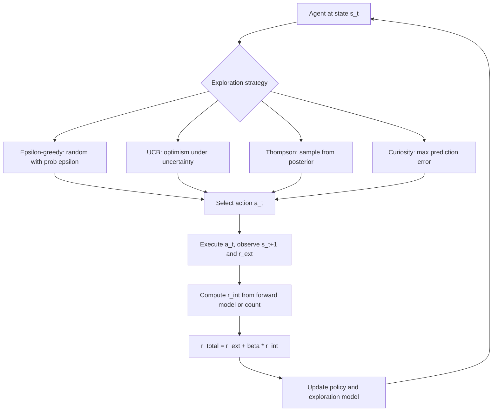

# 14 — Exploration-Exploitation Tradeoff

## 1. Detailed Explanation

The exploration-exploitation tradeoff is the fundamental dilemma in reinforcement learning
and decision making: should the agent try new actions to gather information (explore), or
should it repeat actions that have worked well before (exploit)? Getting this balance wrong
is one of the most common causes of failure in real RL systems.

Pure exploitation without exploration leads to premature convergence: the agent gets stuck
in the first reasonably good policy it finds and never discovers globally better solutions.
Pure exploration is equally useless — the agent never leverages what it has learned. The
challenge is that exploration must be *directed* to be useful: random exploration in a
large state space (e.g., a robot arm with 100K possible joint configurations) wastes most
interactions on uninformative transitions.

This becomes especially critical in sparse reward environments — tasks where most
state-action pairs receive zero reward and only a narrow path leads to positive feedback.
A simple example: a maze where reward is only at the exit. Undirected random exploration
rarely stumbles upon it; the agent must actively seek novel states.

Modern solutions go beyond random exploration. Count-based exploration rewards visiting
states the agent has seen fewer times. Curiosity-driven exploration (Pathak et al. 2017)
trains a forward model to predict next states and uses the prediction error as intrinsic
reward — high error means the state is novel and worth visiting. Random Network Distillation
(RND, Burda et al. 2018) uses a fixed random neural network and rewards states where the
agent's learned network differs most from the fixed one. These intrinsic rewards augment
the extrinsic reward: r_total = r_extrinsic + beta * r_intrinsic.

---

## 2. Core Intuition

Think of exploring a new city versus revisiting your favourite neighbourhood. If you always
go to the familiar street, you exploit known value but miss the better restaurant two blocks
away. If you wander randomly, you waste time in industrial zones. The best strategy is
systematic curiosity: prioritise going to areas you have not been, while keeping track of
what you have already found. Curiosity-based exploration gives the agent exactly this — a
bonus reward for novelty, not for randomness.

---

## 3. How It Works

1. **Define an exploration strategy:** Choose how the agent selects non-greedy actions.
   Options range from trivially simple (epsilon-greedy) to computationally intensive
   (curiosity networks, posterior sampling).

2. **Collect intrinsic rewards (if using curiosity):** A forward model predicts next state
   s_{t+1} from (s_t, a_t). Intrinsic reward r_int = ||s_{t+1} - f(s_t, a_t)||^2.
   Higher prediction error = more novel transition = more intrinsic reward.

3. **Combine rewards:** r_total = r_ext + beta * r_int. Beta controls how much exploration
   is incentivised vs. reward maximisation. Anneal beta over training.

4. **Update novelty estimates:** In count-based methods, maintain a visit counter N(s).
   Bonus = k / sqrt(N(s)). In RND, update the distillation network to minimise
   prediction error, so truly novel states (hard to predict) keep getting high bonuses.

5. **Decay exploration over training:** Epsilon-greedy decays epsilon from 1.0 to 0.01.
   Curiosity beta anneals to 0 when the agent has learned the environment dynamics.
   Without decay, exploration prevents the agent from fully committing to the learned policy.

6. **Evaluate exploration quality:** Track state space coverage (unique states visited),
   entropy of action distribution, and intrinsic reward magnitude. A healthy agent shows
   high early coverage and declining intrinsic rewards as the environment is mastered.

---

## 4. Architecture and Trade-offs

### Exploration Strategy Comparison

| Strategy | Theoretical Guarantee | Sparse Reward | Implementation | Scalability |
|----------|----------------------|--------------|---------------|------------|
| Epsilon-greedy | None | Poor | Trivial | O(1) |
| UCB (bandit) | O(log T) regret | Poor (tabular only) | Simple | Tabular only |
| Thompson Sampling | Bayes-optimal | Poor | Moderate | Tabular/linear |
| Curiosity (ICM) | None | Good | Moderate (neural) | Scales to pixels |
| RND | None | Very good | Moderate | Scales to pixels |
| Count-based | O(1/sqrt(N)) | Good | Simple (tabular) | Hash-based for continuous |
| Go-Explore | None (empirical) | Excellent | Complex | Large-scale games |

### Intrinsic Reward Comparison

| Method | Intrinsic Reward Signal | Key Assumption | Failure Case |
|--------|------------------------|---------------|-------------|
| ICM (forward model) | State prediction error | Novel states = hard to predict | Noisy TV problem |
| RND | Fixed random network prediction gap | Novelty = far from seen states | Stochastic envs |
| Count-based | Visit frequency | State can be counted/hashed | High-dim continuous states |
| Episodic curiosity | Similarity to episodic memory | Novel = different from past | Memory storage |

### Exploration Decay Schedules

| Schedule | Formula | When to Use |
|----------|---------|-------------|
| Linear decay | epsilon = max(eps_min, eps_start - t/T) | Known horizon T |
| Exponential | epsilon = eps_start * decay^t | Asymptotic tasks |
| Polynomial | epsilon = eps_start / (1 + k*t) | Regret-optimal bandit |
| Adaptive (beta) | beta decreases as r_int falls | Curiosity-based methods |

---

## 5. Interview Q&A

**Q: When would you use curiosity-driven exploration over epsilon-greedy?**
A: Use curiosity when rewards are sparse and random exploration almost never finds them.
In game environments like Montezuma's Revenge (reward only at key/room transitions),
pure epsilon-greedy agents get zero reward throughout training. Curiosity drives the agent
toward novel states (unpredicted observations) and enables systematic coverage of the
game world. Epsilon-greedy suffices when rewards are dense and the agent receives regular
feedback — most CartPole-style tasks, for instance.

**Q: What causes an agent to get stuck in local optima due to poor exploration?**
A: The agent finds a policy that achieves moderate reward early, then exploitation
reinforces that policy until the action distribution concentrates on a narrow set of
behaviors. The symptom is a reward curve that plateaus quickly and stays flat despite
more training. Common triggers: (1) epsilon too small from the start; (2) no entropy
bonus in policy gradient; (3) replay buffer filled with similar on-policy transitions.
Debug by logging action entropy — if near zero at convergence, exploration collapsed.

**Q: How do you debug insufficient exploration?**
A: First, check action entropy over training — sustained near-zero entropy means the
policy is deterministic too early. Second, visualise state coverage (for gridworlds or
2D envs) — sparse coverage means exploration is undirected. Third, check if reward is
ever non-zero in early episodes — if not, the agent is never getting feedback signal.
Fixes: increase epsilon or entropy bonus coefficient; add curiosity module; lower
discount gamma to make the agent care more about immediate reward; check environment
for bugs in reward computation.

**Q: What is the noisy TV problem and how do you avoid it?**
A: Curiosity-based agents (like ICM) use prediction error as intrinsic reward. A
stochastic source (a TV showing random noise) generates infinite prediction error —
the model can never predict it, so the agent becomes obsessed with it and ignores
the actual task. This is the noisy TV problem. Avoid it by using RND instead of ICM:
RND's fixed random network maps stochastic states to a fixed output, so novelty signal
is based on whether the *state has been visited before*, not on whether it is predictable.

**Q: What is the difference between exploration and exploitation in the context of
    a production recommendation system?**
A: Exploitation serves the content item predicted to have the highest click-through rate
for the current user. Exploration serves a less-certain item to learn whether it might
be even better. In production you balance these with Thompson Sampling or epsilon-greedy:
explore 5-10% of requests to update reward estimates, exploit the rest. Too little
exploration means you never discover rising content; too much hurts short-term engagement
metrics. The key challenge is that exploration costs are real (suboptimal clicks now) so
exploration rates are usually much lower than in simulated RL.

---

## 6. Best Practices

- **Always track action entropy:** Log mean policy entropy alongside reward during
  training. A well-exploring agent maintains entropy > 0.5 nats in early training. Entropy
  collapsing to zero before reward convergence signals exploration failure.
- **Anneal exploration over training in two phases:** High exploration (epsilon=1.0 or
  large curiosity beta) for the first 30-50% of steps, then decay toward epsilon=0.01.
  Abrupt decay causes instability; gradual annealing is more stable.
- **Use curiosity for sparse reward; epsilon-greedy for dense reward:** Curiosity adds
  model complexity and training cost (~30% overhead for ICM). That cost is only
  justified when the reward is sparse enough that the agent genuinely gets stuck.
- **Normalise intrinsic rewards:** Intrinsic reward magnitude changes as the novelty model
  learns. Normalise using running statistics (RunningMeanStd) so beta does not need
  constant retuning as training progresses.
- **For multi-task or lifelong learning, maintain persistent novelty memory:** Episodic
  curiosity modules reset each episode. For long-horizon lifelong tasks, maintain a
  persistent memory store so novelty is computed against all seen states, not just
  the current episode.

---

## 7. Common Pitfalls

- **Epsilon too small from the start:** Setting epsilon=0.05 at step 1 means the agent
  barely explores. Without random transitions, the replay buffer (in off-policy RL) is
  filled with near-identical trajectories, causing a severely biased Q-function.
  Fix: start with epsilon=1.0 and decay slowly over the first 100K steps.

- **Exploration not disabled at test time:** Leaving epsilon=0.1 during evaluation adds
  noise to measured performance. Test policy should use epsilon=0 (greedy) or only the
  mean action (no stochastic sampling) to get clean evaluation metrics.

- **Curiosity without reward normalisation:** Raw curiosity rewards scale unpredictably.
  If intrinsic rewards are 10x larger than extrinsic, the agent ignores the task reward
  entirely. Always normalise both components to similar scales before combining.

- **Using count-based exploration in continuous state spaces:** State counts N(s) only
  work for discrete or small discrete-ised state spaces. In continuous spaces (robot joint
  angles), no two states are identical so N(s) = 1 always and counts convey no
  information. Use locality-sensitive hashing or kernel density estimates for continuous spaces.

---

## 8. Related Concepts

- [13-multi-armed-bandit](./13-multi-armed-bandit.md) — exploration-exploitation in the simplest 1-state setting
- [11-proximal-policy-optimization](./11-proximal-policy-optimization.md) — entropy bonus in PPO is an exploration mechanism
- [06-q-learning](./06-q-learning.md) — epsilon-greedy is standard exploration in Q-learning
- [12-soft-actor-critic](./12-soft-actor-critic.md) — maximum entropy RL is SAC's exploration strategy
