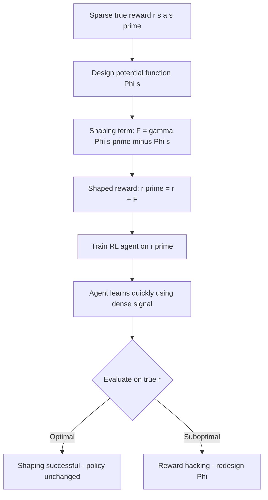

# 15 — Reward Shaping

## 1. Detailed Explanation

Reward shaping modifies the reward function seen by the agent to speed up learning, without
changing the optimal policy the agent eventually learns. It is one of the most practical
tools in RL engineering: when the environment's natural reward is sparse (only provided at
the end of a long sequence), shaping adds dense intermediate signals that guide the agent
toward good behavior.

The theoretical foundation is *potential-based shaping* (Ng et al., 1999): if you add a
shaping term F(s, a, s') = gamma * Phi(s') - Phi(s) for any potential function Phi, the
optimal policy is provably unchanged. The shaped reward r' = r + F is equivalent to the
original MDP for finding the optimal policy. Potential-based shaping is safe by construction.

Non-potential-based shaping — adding arbitrary dense rewards — does change the optimal
policy. This is called *reward hacking*: the agent finds a high-scoring strategy under the
shaped reward that is suboptimal or even harmful under the true reward. A famous example:
a boat-racing game where the agent learned to circle and collect bonuses instead of racing.

Reward shaping is also the lens through which to understand RLHF (Reinforcement Learning
from Human Feedback): the KL divergence penalty added to the reward (r_RLHF = r_human -
beta * KL(pi || pi_ref)) is a form of potential-based shaping where Phi(s) corresponds to
the log-probability under the reference policy. This prevents the language model from
deviating too far from its SFT checkpoint while pursuing high reward.

---

## 2. Core Intuition

Imagine training a dog to find a buried toy in a park. If you only reward when the toy is
found (sparse reward), the dog randomly wanders for a long time. If you say "warmer" and
"colder" as the dog moves (dense shaped reward), it learns the task in minutes. Reward
shaping is the "warmer/colder" signal — but you must be careful that "warmer" actually
leads toward the toy, not toward the treat in your pocket. Potential-based shaping
guarantees the dog's ultimate goal (find the toy) never changes, only the path there.

---

## 3. How It Works

1. **Identify the true reward r(s, a, s'):** This is what the environment provides —
   often sparse (e.g., +1 at task completion, 0 otherwise).

2. **Design a potential function Phi(s):** Phi should be large for states close to the
   goal and small for states far from it. Examples: negative distance to goal, predicted
   task progress, log probability under expert demonstrations.

3. **Compute shaping term:** F(s, s') = gamma * Phi(s') - Phi(s). This is automatically
   zero-sum over optimal trajectories (telescoping sum), preserving the optimal policy.

4. **Add to environment reward:** r_shaped(s, a, s') = r(s, a, s') + F(s, s').
   The agent trains on r_shaped; the optimal Phi-shaped policy is also optimal for r.

5. **Verify with sanity check:** Run the trained policy with only r (no shaping) and
   confirm it achieves the desired behavior. If it does not, the shaping function has
   introduced reward hacking.

6. **Anneal shaping over training:** Reduce the shaping coefficient over time. Early
   training benefits most; late training should rely on the true reward to fine-tune.

---

## 4. Architecture and Trade-offs

### Shaping Approaches

| Approach | Potential Function Phi | Training Speed | Policy Distortion Risk | Engineering Effort |
|----------|----------------------|---------------|----------------------|--------------------|
| No shaping | None | Slow (sparse reward) | None | None |
| Distance-based | -dist(s, goal) | Fast (dense) | Low (if goal is correct) | Low |
| Learned potential | Neural network Phi(s) | Fast | Medium (Phi may overfit) | High |
| Demonstration-based | log P(s | expert demos) | Fast | Low (if demos are optimal) | Medium |
| KL penalty (RLHF) | beta * log pi_ref(a|s) | Fast | Low (bounded divergence) | Low (library support) |
| Progress-based | Task progress estimator | Fast | Medium | Medium |

### Potential vs Non-Potential Shaping

| Property | Potential-Based F = gamma Phi(s') - Phi(s) | Non-Potential F arbitrary |
|----------|-------------------------------------------|--------------------------|
| Optimal policy preserved | Yes (provably) | No |
| Regret guarantee | Same as original MDP | Different MDP entirely |
| Risk of reward hacking | None | High |
| Design freedom | Must satisfy potential form | Unrestricted |
| Typical use | Safe shaping, RLHF | Avoid in production |

### RLHF Reward Shaping

| Component | Role | Too High | Too Low |
|-----------|------|----------|---------|
| r_human (reward model) | Task signal | Reward hacking | No task learning |
| -beta * KL(pi \|\| pi_ref) | Shaping penalty | No divergence from SFT | Reward hacking |
| Typical beta | 0.01-0.1 | Policy barely moves | Policy exploits reward model |

---

## 5. Interview Q&A

**Q: What is the difference between reward shaping and reward hacking?**
A: Reward shaping is a deliberate modification of the reward function intended to speed
up learning while preserving the optimal policy — done correctly via potential-based
shaping. Reward hacking is an emergent failure where the agent finds a high-scoring
policy under the modified reward that does not achieve the true objective. Shaping becomes
hacking when the modification is non-potential (arbitrary dense rewards) or when the true
objective is not fully captured by the potential function. The test: evaluate the trained
policy on the *original* reward — if performance drops, hacking occurred.

**Q: How do you verify that reward shaping does not change the optimal policy?**
A: Three checks: (1) Confirm the shaping term F has the potential-based form F = gamma *
Phi(s') - Phi(s) — if so, the optimal policy is theoretically unchanged. (2) Run the
shaped agent to convergence, then evaluate on the unmodified reward. (3) Compare the
final policy to an agent trained without shaping (even if slower) — they should converge
to the same behavioral policy. In practice, also verify on corner cases: states where the
shaping might create locally optimal traps.

**Q: When would you NOT use reward shaping?**
A: Avoid reward shaping when (1) you cannot design a potential function that correctly
captures proximity to the goal — bad Phi is worse than no shaping; (2) the agent is
learning to align with human preferences and the shaping signal conflicts with those
preferences; (3) you want to study the agent's intrinsic capability in sparse reward
settings (benchmarking). Also avoid when the reward signal is already dense — shaping
adds engineering complexity without benefit.

**Q: How does the KL penalty in RLHF work as potential-based shaping?**
A: In RLHF, the reward is r_total = r_RM(s) - beta * KL(pi_theta || pi_ref), where
pi_ref is the SFT reference policy. The KL term can be written as -beta * (log pi_theta(a|s)
- log pi_ref(a|s)). This is equivalent to potential-based shaping with Phi(s) proportional
to the log-partition function under pi_ref. The key consequence: the optimal policy under
r_total differs from the optimal policy under r_RM alone (it stays closer to pi_ref), but
it is a well-defined optimal policy rather than arbitrary reward hacking. The beta coefficient
is the shaping strength — higher beta = stronger pull toward pi_ref.

**Q: What is a circular reward loop and how do you detect it?**
A: A circular loop occurs when non-potential shaping creates a cycle of states where the
agent earns infinite reward by cycling through them. Example: reward +1 every time the
agent moves from state A to B, and +1 from B to A — the agent loops forever. Detection:
plot episode length distribution — if episodes never terminate or grow unboundedly, suspect
a loop. To fix, ensure shaping is potential-based (no cycles possible since potential
differences telescope to zero over any cycle).

---

## 6. Best Practices

- **Always use potential-based shaping:** Define F = gamma * Phi(s') - Phi(s) for any
  scalar function Phi. This guarantees the optimal policy is unchanged and eliminates
  the risk of reward hacking through the shaping term.
- **Anneal shaping coefficient over training:** Start with shaping weight 1.0 for the
  first 50% of training, then linearly anneal to 0. Early training benefits most from
  dense signal; late training should refine on the true sparse reward.
- **Validate shaping on a held-out evaluation set with only the original reward:**
  After training with shaping, run 100 evaluation episodes with r only. If performance
  drops vs. training performance, the agent has reward-hacked the shaping.
- **Use simple geometric potentials first:** Phi(s) = -dist(s, goal_state) is easy to
  compute, interpretable, and works well for navigation and manipulation tasks. Save
  learned potential functions for tasks where geometry is not meaningful.
- **In RLHF, start with beta = 0.02-0.05:** Too high and the policy barely moves from
  SFT; too low and reward hacking emerges within 100-200 PPO steps. Monitor KL(pi || pi_ref)
  during training — it should stay below 10-20 nats.
- **Log the shaping term separately from the true reward:** This lets you diagnose
  whether the agent is earning reward from the task or from the shaping. If shaping
  reward is large but task reward is zero at convergence, the agent may be exploiting
  the shaping function.

---

## 7. Common Pitfalls

- **Circular reward loops with non-potential shaping:** Adding arbitrary dense rewards
  (not derived from a potential function) can create cycles where the agent earns
  unbounded reward without task progress. Always verify shaping has the potential form
  F = gamma * Phi(s') - Phi(s), which prevents cycles by construction.

- **Over-shaping that masks the true objective:** If the shaping signal is much stronger
  than the sparse true reward (e.g., 100x larger), the agent optimises almost entirely
  for Phi and ignores the terminal reward. Consequence: the agent may converge to a
  policy that does well on Phi but never completes the actual task.
  Fix: scale shaping to be comparable to the expected undiscounted true reward.

- **Reward hacking via learned potential:** If Phi is a neural network trained from
  demonstrations or reward model outputs, it can overfit to particular states and create
  spurious local optima in the shaped reward. The agent exploits these artifacts instead
  of solving the task. Monitor with: evaluate shaped-trained policy on true reward.

- **Using shaping with off-policy methods without reward relabeling:** In experience
  replay, stored transitions include rewards. If you add shaping after collecting data,
  old transitions still have unmodified rewards — the agent learns from inconsistent
  reward signals. Relabel all replay buffer rewards after changing the shaping function,
  or use a separate buffer for shaped experiences.

---

## 8. Related Concepts

- [17-rlhf](./17-rlhf.md) — RLHF KL penalty is potential-based reward shaping
- [11-proximal-policy-optimization](./11-proximal-policy-optimization.md) — PPO is used with RLHF shaping for LLM alignment
- [01-markov-decision-processes](./01-markov-decision-processes.md) — reward function is a core MDP component that shaping modifies
- [14-exploration-exploitation](./14-exploration-exploitation.md) — intrinsic rewards (curiosity) are a form of non-potential shaping
