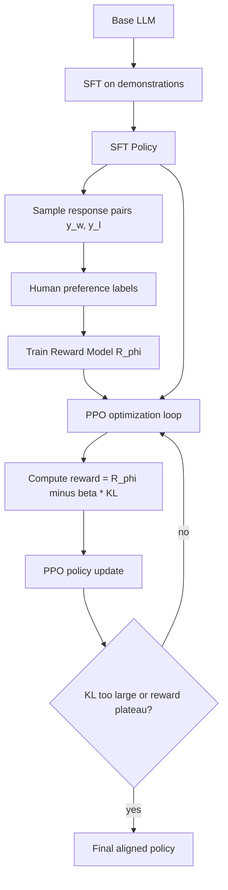

# 17 — Reinforcement Learning from Human Feedback (RLHF)

## 1. Detailed Explanation

Reinforcement Learning from Human Feedback (RLHF) is the training pipeline that made large language models like ChatGPT, Claude, and Gemini helpful and aligned with human intent. The core challenge: writing a reward function that captures "what humans actually want" is impossible — human preferences involve nuance, context, and values that resist explicit specification. RLHF sidesteps this by training a reward model from human preference data, then optimizing the language model against that learned reward.

The pipeline has three stages. **Stage 1 — Supervised Fine-Tuning (SFT):** Fine-tune the base LLM on high-quality human demonstrations to get a baseline aligned policy. **Stage 2 — Reward Model Training:** Collect pairwise preference data: given prompt x, show two responses (y_w, y_l) and ask humans which is better. Train R_φ(x,y) using the Bradley-Terry model: P(y_w ≻ y_l) = σ(R_φ(x,y_w) − R_φ(x,y_l)), minimizing cross-entropy loss -E[log σ(R_w − R_l)]. **Stage 3 — PPO Fine-tuning:** Optimize the SFT policy via PPO to maximize E[R_φ(x,y)] while penalizing KL divergence from the reference policy: L = E[R_φ] − β·KL[π_θ||π_ref]. The KL term prevents **reward hacking** — generating responses that exploit the reward model's imperfections rather than being genuinely good.

RLHF is now central to deploying LLMs: it's why models follow instructions, decline harmful requests, and write in a helpful tone. Its successor, **Direct Preference Optimization (DPO)**, bypasses the reward model entirely using a closed-form relationship between policy and reward.

---

## 2. Core Intuition

RLHF is like training a restaurant with a food critic who can't articulate what makes food good but can always say which of two dishes they prefer. You collect enough comparisons to build a "taste model," then optimize your kitchen to score highly under that model — while staying close enough to your original recipes that you don't become incoherent. The KL penalty is the "don't stray too far from your original cooking style" constraint.

---

## 3. How It Works

**RLHF Pipeline:**

1. **SFT**: Fine-tune base LLM π_0 on expert demonstrations D_demo to get π_SFT.
2. **Collect preferences**: Sample (x, y_w, y_l) pairs; human annotators label which response is preferred.
3. **Train reward model**: Minimize L_RM = -E[log σ(R_φ(x,y_w) − R_φ(x,y_l))] over preference dataset.
4. **PPO loop**: Sample prompt x, generate y ~ π_θ(·|x), compute reward r = R_φ(x,y) − β·KL[π_θ||π_ref].
5. **Policy update**: PPO updates π_θ to maximize r using clipped surrogate objective.
6. **Monitor**: Track KL divergence, reward score, and calibration; stop when reward plateau or KL > threshold.

---

## 4. Architecture / Trade-offs

### KL Penalty β vs Reward–KL Tradeoff

| β value | Reward maximization | KL from reference | Risk |
|---------|--------------------|--------------------|------|
| 0.01    | Aggressive         | High               | Reward hacking, incoherence |
| 0.1     | Balanced           | Moderate           | Standard production value |
| 1.0     | Conservative       | Low                | Undertrained, close to SFT |
| Adaptive| Context-aware      | Controlled         | Best but complex to tune |

### RLHF vs DPO vs SFT-only

| Method     | Reward Model | Online RL | Compute | Reward Hacking Risk | Production Use |
|------------|-------------|-----------|---------|---------------------|----------------|
| SFT only   | No          | No        | Low     | None                | Weak alignment |
| RLHF (PPO) | Yes         | Yes       | High    | Moderate            | ChatGPT, Claude |
| DPO        | No (implicit)| No      | Low     | Low                 | Llama-2-chat   |
| KTO        | No          | No        | Low     | Very low            | Modern alternative |

### Reward Model Architecture

| Component | Typical choice | Alternative |
|-----------|---------------|-------------|
| Backbone  | Same LLM (frozen) | Smaller LLM |
| Head      | Linear → scalar | MLP → scalar |
| Training  | Cross-entropy on pairs | Listwise ranking |
| Data size | 50K–500K pairs | Can work with 10K |

---

## 5. Interview Q&A

**Q: What happens to model quality when β → 0 in the PPO stage?**
A: The policy stops being penalized for diverging from π_ref and aggressively maximizes R_φ. It discovers exploits in the reward model — e.g., generating very long responses, using specific phrases that trick the RM — without those responses being actually better. This is reward hacking. Monitor by running human evals alongside automated RM scores; divergence indicates hacking.

**Q: How do you know when your reward model is well-calibrated?**
A: Use Brier score on held-out preference pairs: predict P(y_w ≻ y_l) and compare to binary outcomes. Also check calibration curves (predicted probability vs actual win rate). A calibrated RM has Brier score < 0.2 and flat calibration curve. Miscalibration manifests as overconfident RM scores on long/specific responses.

**Q: Why does RLHF need the KL term rather than just maximizing reward?**
A: Without KL, PPO will drift arbitrarily far from the SFT policy — the policy learns to game the reward model (which is imperfect) rather than generate genuinely good text. The KL term anchors optimization near the SFT distribution, where the reward model is more reliable.

**Q: When would you choose DPO over RLHF?**
A: DPO when: you have a fixed preference dataset (not growing), you want to avoid training and hosting a separate reward model, and compute is a constraint. RLHF when: you want online preference collection, need to iteratively improve the reward model, or want fine-grained control over reward shaping.

**Q: What's the first sign that your reward model has distribution shift problems during PPO?**
A: The reward score keeps rising while human preference scores plateau or fall — the model has found a distribution that scores well under RM but is out-of-distribution for the RM's training data. Fix: collect new preference data on policy outputs and retrain RM; or add diversity/length penalties.

**Q: How would you reduce annotation cost for reward model training?**
A: (1) Active learning: prioritize pairs where RM is most uncertain. (2) Synthetic labels: use a stronger RM to label easy pairs. (3) Constitutional AI: use the LLM itself to self-critique and generate preference labels. (4) Efficient annotation interfaces that reduce per-pair time.

---

## 6. Best Practices

- Start with β = 0.1 and tune based on KL/reward tradeoff curves; never set β < 0.01.
- Collect at least 50K preference pairs before training the reward model; fewer leads to poor generalization.
- Use the same tokenizer and base model for SFT policy and reward model — mismatches cause subtle distribution artifacts.
- Monitor reward model calibration (Brier score) on a held-out set; retrain if Brier > 0.25.
- Cap training at 1–3 PPO epochs; beyond that, reward hacking risk increases sharply.
- Use ensemble of 2–3 reward models to detect when policy is exploiting a single RM's weaknesses.
- Track length statistics of generated outputs — reward hacking often manifests as responses growing 2–3x longer.

---

## 7. Common Pitfalls

- **Reward hacking (β too small)**: Symptom: RM score rises but human evals plateau or fall. Fix: increase β to 0.1–1.0, collect new preference data on current policy outputs.
- **Reward model memorizes annotator style, not quality**: Symptom: RM highly sensitive to formatting/length. Fix: augment training pairs with length-normalized versions; use multiple annotators per pair.
- **KL divergence explodes**: Symptom: generated text becomes incoherent mid-training. Fix: reduce PPO learning rate from 1e-5 to 1e-6, add KL early stopping at 0.1 nats.
- **Preference annotation noise**: Symptom: RM accuracy stuck at 60–65% even with large data. Fix: improve annotation guidelines, use gold-standard pairs for inter-annotator reliability checks.
- **SFT stage skipped**: Symptom: PPO training unstable from the start. Fix: always SFT first — raw base model is too noisy for stable PPO optimization.

---

## 8. Related Concepts

- [17-policy-gradient](./09-policy-gradient.md) — PPO is the policy gradient method used in RLHF Stage 3
- [18-inverse-rl](./18-inverse-rl.md) — IRL also learns reward from behavior; RLHF learns from preferences
- [16-model-based-rl](./16-model-based-rl.md) — World models can augment RLHF with synthetic preference data
- [20-offline-rl](./20-offline-rl.md) — DPO is effectively offline RL on preference data
- [19-multi-agent-rl](./19-multi-agent-rl.md) — Constitutional AI uses multi-agent self-play variants
