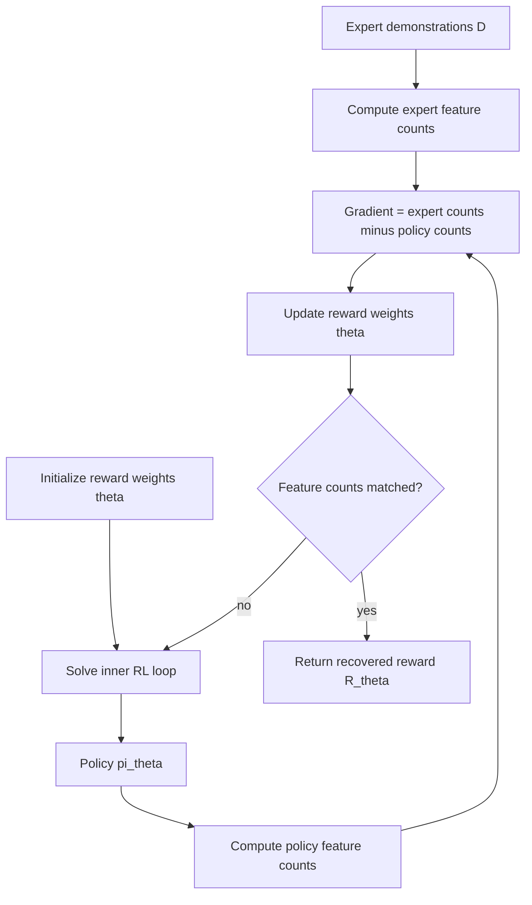

# 18 — Inverse Reinforcement Learning

## 1. Detailed Explanation

Inverse Reinforcement Learning (IRL) flips the standard RL problem: instead of finding the optimal policy given a reward function, IRL infers the reward function from observed expert behavior. The premise is that expert demonstrations implicitly encode a reward signal — the expert is (approximately) optimal under some unknown R, and IRL recovers R that makes the observed trajectories optimal.

**Behavioral Cloning (BC)** is the simplest imitation approach: treat (s, a) pairs as supervised training data and learn π_BC(a|s) via classification/regression. BC is fast and data-efficient but suffers from **distributional shift** — at test time, small errors compound because the policy was never trained to recover from states it hasn't seen. After T steps, BC error grows as O(T²) vs O(T) for IRL-trained policies.

**Maximum Entropy IRL (MaxEnt IRL)** resolves the reward ambiguity by choosing R* that maximizes entropy over all policies while matching the expert's feature expectations: R* = argmax_R [E_{expert}[Σ_t R(s_t,a_t)] - log Z(R)]. This produces the probability distribution over trajectories proportional to exp(Σ_t R(s_t,a_t)) — the "most random" distribution consistent with expert statistics.

**GAIL (Generative Adversarial Imitation Learning)** approximates IRL using a GAN-style discriminator: D distinguishes expert vs agent trajectories, providing an implicit reward signal without explicitly recovering R. GAIL avoids solving the inner RL loop required by MaxEnt IRL and scales to high-dimensional continuous control.

IRL is used in autonomous driving (inferring driver intent), robotics (learning dexterous manipulation), and game AI (replicating human play styles).

---

## 2. Core Intuition

IRL is like watching a chess grandmaster play and inferring what they value — material, position, tempo — by analyzing thousands of their moves. You don't know their evaluation function, but you can deduce it from the fact that their moves are consistently "optimal" under whatever hidden criteria they hold. Once you've inferred that criteria, you can train a new player to optimize it.

---

## 3. How It Works

**MaxEnt IRL:**

1. **Collect expert trajectories** D = {τ_1, ..., τ_N} from demonstrations.
2. **Initialize reward weights** θ to zeros.
3. **Compute expected feature counts** under current policy π_θ: E_π[f(s,a)].
4. **Compute gradient**: ∇θ = E_expert[f] - E_π[f] — difference between expert and policy feature counts.
5. **Update**: θ ← θ + α∇θ.
6. **Re-solve RL inner loop**: compute new policy π_θ = argmax_π E_π[Σ R_θ(s,a)] using value iteration.
7. **Repeat** until E_expert[f] ≈ E_π[f] (feature matching converged).

---

## 4. Architecture / Trade-offs

### BC vs MaxEnt IRL vs GAIL

| Method | Requires RL inner loop | Distribution shift robustness | Scales to high-dim | Data efficiency |
|--------|----------------------|------------------------------|--------------------|-----------------|
| Behavioral Cloning | No | Poor (O(T²) error) | Yes | High |
| MaxEnt IRL | Yes (expensive) | Good | Medium | Medium |
| GAIL | Yes (online RL) | Good | High | Low–Medium |
| DAgger (BC+) | No (interactive) | Good | Yes | Medium |

### Distribution Shift in Behavioral Cloning

| BC training steps T | Error growth | Recovery behavior |
|--------------------|-------------|------------------|
| 10 steps            | ~10 errors  | Manageable        |
| 50 steps            | ~2500 errors| Often fails       |
| 100 steps           | ~10000 errors | Usually fails   |

*Error grows as O(T²) because each compounding mistake visits novel states.*

### Expert Data Requirements

| Method | Min useful demonstrations | Scales with more data | Handles noisy experts |
|--------|--------------------------|----------------------|----------------------|
| BC     | ~100 trajectories        | Well                 | Poorly (copies noise)|
| MaxEnt IRL | ~10–50 trajectories  | Moderately           | Well (averages out)  |
| GAIL   | ~50–200 trajectories     | Well                 | Moderately           |

---

## 5. Interview Q&A

**Q: Why does behavioral cloning fail on long-horizon tasks when it performs well on short ones?**
A: BC error compounds quadratically with horizon length — the policy encounters states outside its training distribution and has no recovery mechanism. On T=10 tasks, this is invisible; on T=100 tasks, early small mistakes cascade into irreversible failures. Fix: use DAgger (collect new data at states the BC policy visits) or IRL (the reward function generalizes better than the policy).

**Q: What makes MaxEnt IRL computationally expensive compared to behavioral cloning?**
A: MaxEnt IRL requires solving a full RL problem (value iteration / policy optimization) in the inner loop at every gradient step. For a GridWorld with 100 states, each inner-loop solve costs O(S²A) per sweep. With 100 outer IRL iterations, this is 100× more expensive than BC's single supervised pass. For continuous spaces, the inner loop cost is even worse.

**Q: When would you use GAIL instead of MaxEnt IRL?**
A: GAIL when: the state space is continuous/high-dimensional (MaxEnt IRL requires discretization or approximation), you have online access to the environment (GAIL needs on-policy RL), or you want to avoid explicitly recovering R (you only care about cloning behavior). MaxEnt IRL when: you want an interpretable, transferable reward function, or need to transfer to a different agent morphology.

**Q: How does the GAIL discriminator produce a reward signal?**
A: The discriminator D(s,a) ∈ [0,1] is trained to output 1 for expert (s,a) and 0 for agent (s,a). The implicit reward is r = -log(1 - D(s,a)) — higher reward when the discriminator can't tell agent from expert. This is analogous to the generator's adversarial loss in standard GANs.

**Q: What breaks MaxEnt IRL when expert demonstrations are sub-optimal or inconsistent?**
A: MaxEnt IRL assumes the expert is optimal under R*. If demonstrations are noisy, the inferred reward rationalizes the noise as intentional — e.g., if experts sometimes go right when left is better, the recovered reward may assign equal value to both. Fix: use Bayesian IRL to model the expert as noisily rational, or filter demonstrations by quality score.

**Q: How would you evaluate whether IRL recovered the "right" reward?**
A: Three metrics: (1) policy transfer — train a new RL agent with recovered R; does it match expert performance? (2) reward correlation — if true R is known (simulated), compute Pearson correlation. (3) preference prediction — does the recovered R correctly rank pairs of trajectories by human preference?

---

## 6. Best Practices

- Always compare BC as a baseline before running IRL — if BC matches performance, IRL overhead isn't worth it.
- For MaxEnt IRL on GridWorlds, run 5–10 value iteration sweeps for the inner RL loop; 1–2 sweeps is too noisy.
- Normalize feature vectors to [0,1] before IRL to prevent large-magnitude features dominating reward weights.
- Use at least 10–20 expert trajectories; with fewer, reward recovery is dominated by trajectory noise.
- For GAIL: use the gradient penalty variant (WGAN-GP style) for stable discriminator training.
- Monitor inner-loop policy performance during IRL; if it doesn't improve, the reward hasn't converged.
- In BC, use L2 regularization (α=1e-4) to prevent overfitting on states that appear infrequently in demonstrations.

---

## 7. Common Pitfalls

- **BC distributional shift ignored**: Symptom: BC achieves 95% accuracy on training states but fails on held-out sequences. Fix: use DAgger or ensure training data covers all reachable states.
- **IRL inner loop under-converged**: Symptom: recovered reward looks reasonable but policy trained on it performs poorly. Fix: increase inner-loop iterations; use warm-starting (initialize from previous policy).
- **Feature engineering bias in MaxEnt IRL**: Symptom: recovered reward weights are large but policy doesn't match expert. Fix: add interaction features; verify feature counts actually differ between expert and random policy.
- **GAIL mode collapse**: Symptom: discriminator loss → 0 quickly, generator doesn't improve. Fix: use gradient penalty, reduce discriminator learning rate, or balance update frequencies.
- **Copying expert artifacts**: Symptom: BC copies irrelevant expert behaviors (e.g., specific mouse movements). Fix: use IRL to recover intent-based reward, then train fresh policy on that reward.

---

## 8. Related Concepts

- [17-rlhf](./17-rlhf.md) — RLHF learns reward from human preferences; IRL learns from demonstrations
- [16-model-based-rl](./16-model-based-rl.md) — Model-based planning can accelerate the IRL inner loop
- [19-multi-agent-rl](./19-multi-agent-rl.md) — Multi-agent IRL infers reward for multiple interacting agents
- [20-offline-rl](./20-offline-rl.md) — Offline RL uses fixed dataset; IRL also uses offline demonstrations
- [05-q-learning](./05-q-learning.md) — IRL inner loop often uses Q-learning / value iteration
