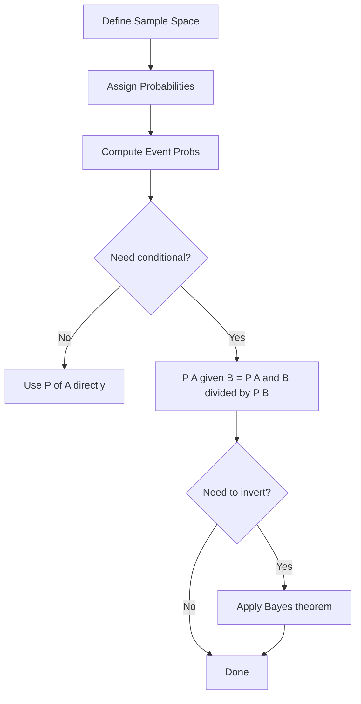

# Probability Fundamentals

## Detailed Explanation

Probability is the mathematical language of uncertainty, and it underpins every machine learning model ever built. Every loss function, every prediction score, every confidence interval rests on the same three axioms Kolmogorov formalized in 1933: probabilities are non-negative, the probability of the entire sample space is 1, and the probability of mutually exclusive events is additive.

A **sample space** Omega is the set of all possible outcomes. An **event** is a subset of Omega. The probability P assigns a number in [0,1] to each event, satisfying the axioms. These simple rules cascade into the entire machinery of ML: softmax outputs are probability distributions, cross-entropy is negative log-likelihood, and Bayesian inference uses the update rule P(H|D) = P(D|H) P(H) / P(D).

**Conditional probability** P(A|B) = P(A and B) / P(B) is the workhorse of ML. It answers: given that B occurred, what fraction of those outcomes also have A? **Bayes' theorem** inverts this: P(A|B) = P(B|A) P(A) / P(B). This is how spam filters, medical tests, and recommendation engines all work — computing the posterior probability of a hypothesis given evidence.

**Independence** means P(A and B) = P(A) P(B). Naive Bayes classifiers assume features are conditionally independent given the class, which is why they are called "naive." In production, this independence assumption often fails but the classifier still works well because it is a good discriminator even if the probability estimates are wrong.

Understanding the difference between joint, marginal, and conditional distributions is critical for debugging data pipelines, feature engineering, and model diagnostics. Practitioners who skip this foundation struggle to reason about why their model is wrong.

## Core Intuition

A probability is a fraction of outcomes: if you repeated the experiment infinitely many times, what fraction of runs would produce event A? Conditional probability is simply re-weighting that fraction after observing new evidence — you throw away all outcomes that do not satisfy the condition, then measure within that reduced universe. Bayes' theorem is nothing more than this re-weighting applied to hypotheses rather than events.

## How It Works

**Step-by-step from sample space to Bayes:**

1. **Define sample space**: List all possible outcomes. Example: rolling a die — Omega = {1,2,3,4,5,6}.
2. **Assign probabilities**: Each outcome gets a non-negative weight; all weights sum to 1. P(1)=P(2)=...=P(6)=1/6 for a fair die.
3. **Compute event probabilities**: P(A) = sum of probabilities of outcomes in A. P(even) = 1/6+1/6+1/6 = 1/2.
4. **Apply addition rule**: P(A or B) = P(A) + P(B) - P(A and B).
5. **Apply multiplication rule**: P(A and B) = P(A|B) P(B) = P(B|A) P(A).
6. **Apply Bayes' theorem**: P(A|B) = P(B|A) P(A) / P(B). Invert the conditioning direction.

## Architecture / Trade-offs

### Frequentist vs Bayesian Interpretation

| Aspect | Frequentist | Bayesian |
|---|---|---|
| What is probability? | Long-run frequency of events | Degree of belief, updated by evidence |
| Parameters | Fixed, unknown constants | Random variables with distributions |
| Uncertainty | Confidence intervals (frequentist coverage) | Credible intervals (posterior probability) |
| Data requirement | Need large samples for CLT guarantees | Can work with small samples via priors |
| Computational cost | Usually analytical or cheap | Often requires MCMC or variational inference |
| Use in ML | p-values, t-tests, MLE | Bayesian neural networks, Gaussian processes |

### Joint vs Marginal vs Conditional

| Distribution | Formula | What it captures | Example |
|---|---|---|---|
| Joint P(A,B) | P(A and B) | How A and B co-occur | P(spam=1, word="money") |
| Marginal P(A) | Sum over B of P(A,B) | Distribution of A ignoring B | P(spam=1) overall |
| Conditional P(A given B) | P(A,B) / P(B) | Distribution of A given B fixed | P(spam=1 given word="money") |

### Independence vs Uncorrelated

| Property | Definition | Implication |
|---|---|---|
| Independent | P(A,B) = P(A) P(B) | Zero correlation AND zero higher-order dependence |
| Uncorrelated | Cov(A,B) = 0 | Only zero linear relationship; may still be dependent |
| Conditionally independent | P(A,B given C) = P(A given C) P(B given C) | Naive Bayes assumption |

Note: Independence implies uncorrelated, but NOT vice versa. Example: X ~ N(0,1), Y = X^2. They are uncorrelated but highly dependent.

## Interview Q&A

**Q: When does the difference between P(A|B) and P(B|A) matter most in practice?**
A: Medical testing is the classic case: P(disease|positive test) != P(positive test|disease). A test that is 99% sensitive (P(positive|disease)=0.99) can still give only 9% probability of disease given a positive test if disease prevalence is 0.1%. This is base rate neglect and is the most common mistake data scientists make when evaluating classifiers on imbalanced data.

**Q: How does statistical independence differ from being uncorrelated?**
A: Uncorrelated means zero covariance — only no linear relationship. Independence is stronger: it means zero relationship of ANY kind. X ~ N(0,1) and Y = X^2 are uncorrelated (E[XY]=0) but obviously dependent. For Gaussian variables specifically, uncorrelated DOES imply independent — that is the rare case where they coincide.

**Q: When would you use Bayes' theorem in a production ML system?**
A: Spam filters (P(spam|features)), fraud detection (P(fraud|transaction)), and any classifier on imbalanced data where the base rate matters. Also in updating model confidence estimates when new data arrives without retraining — a Bayesian update can adjust a prior belief in O(1) time.

**Q: Your dataset has features A and B. You find P(A,B) = P(A)P(B). Can you safely remove B from the model?**
A: Not necessarily. Joint independence does not imply conditional independence. P(A,B|C) might not equal P(A|C)P(B|C), so A and B might carry complementary information about the target C. Always test conditional independence given the label.

**Q: What goes wrong when you multiply many small probabilities together?**
A: Numerical underflow — the product becomes smaller than float64's minimum (~1e-308). Use log-probabilities (sum of logs instead of product). This is why cross-entropy loss is defined as -sum(log p_i) and language model perplexity is exp(average negative log-likelihood).

**Q: How would you check whether two features are conditionally independent given the target?**
A: Compute the conditional mutual information I(A;B|Y) = sum over y of P(Y=y) KL(P(A,B|y) || P(A|y)P(B|y)). If it is near zero, they are approximately conditionally independent. Alternatively, use a chi-square test of conditional independence or fit models with and without the interaction term and compare.

## Best Practices

- Always verify that your probability estimates sum (or integrate) to 1 — even small numerical errors compound.
- Use log-probabilities when multiplying many small values to avoid underflow; use `scipy.special.logsumexp` for numerically stable log-sum-exp.
- Distinguish prior probability (before seeing data) from posterior probability (after data) — conflating them is the most common Bayesian mistake.
- Never assume features are independent without testing — measure mutual information or correlation matrices first.
- For imbalanced classes, always compute P(positive class|predicted positive) — precision, not just sensitivity/recall — since base rates dominate.
- Use conditional probability tables (CPTs) explicitly when building decision systems so that assumptions about independence are visible and testable.
- When using probability in A/B tests, compute P(metric > 0 | data), not just p-values — the Bayesian quantity is more directly useful for ship/no-ship decisions.

## Common Pitfalls

- **Base rate neglect**: Using P(evidence|hypothesis) as if it were P(hypothesis|evidence). A highly sensitive test still has low PPV when prevalence is low. Fix: always compute the full Bayes formula using the actual prior.
- **Independence assumption without checking**: Naive Bayes assumes conditional independence. If features are strongly correlated, the probability estimates will be wrong (though classification accuracy may survive). Fix: inspect pairwise correlation and mutual information matrices before assuming independence.
- **Confusing joint and conditional**: Writing P(A,B) when you mean P(A|B). The joint probability is always smaller (or equal) to either marginal; the conditional can be larger than the marginal. Fix: be explicit about conditioning every time.
- **Forgetting to normalize**: Computing unnormalized scores and treating them as probabilities. In Bayes, the denominator P(evidence) is the normalizing constant. Fix: always divide by the sum/integral of the numerator.
- **Using probabilities in multiplicative pipelines without log-space**: Multiplying N probabilities each ~0.9 for N=1000 gives 0.9^1000 ~ 2e-46, which underflows to 0. Fix: sum log-probabilities throughout.

## Related Concepts

- [02 Distributions Reference](./02-distributions-reference.md) — probability distributions are the parametric models for random variables
- [03 Bayesian Inference](./03-bayesian-inference.md) — builds directly on Bayes' theorem for parameter estimation
- [04 Maximum Likelihood Estimation](./04-maximum-likelihood-estimation.md) — MLE is the frequentist counterpart to Bayesian inference
- [05 Hypothesis Testing](./05-hypothesis-testing.md) — frequentist framework for making decisions under uncertainty
