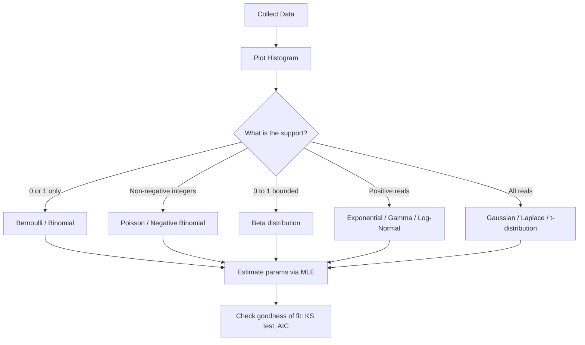

# Distributions Reference

## Detailed Explanation

A probability distribution describes how probability mass or density is spread across the possible values of a random variable. Every ML model implicitly assumes a distribution: linear regression assumes Gaussian noise, logistic regression models Bernoulli trials, Poisson regression models count data, and variational autoencoders use Gaussian latent variables. Choosing the wrong distribution leads to miscalibrated uncertainty, biased estimates, and poor predictions.

Distributions come in two families: **discrete** distributions assign probability mass to countable outcomes (Bernoulli, Binomial, Poisson, Multinomial), and **continuous** distributions assign probability density to uncountable outcomes (Gaussian, Exponential, Beta, Gamma, Dirichlet). For continuous distributions, individual point probabilities are zero; probability is computed by integrating the PDF over an interval.

Three quantities characterize any distribution: the **PDF/PMF** (shape of the distribution), the **CDF** (accumulated probability up to a value), and the **parameters** that control location and scale. The mean (first moment) tells you the expected value; the variance (second moment) tells you spread; skewness and kurtosis describe asymmetry and tail weight.

In practice, when you observe data and want to fit a distribution, you use **maximum likelihood estimation** (MLE) to find the parameters that make the observed data most probable. The choice of which family to fit is a modeling assumption that should be validated with goodness-of-fit tests (Kolmogorov-Smirnov, chi-square) and information criteria (AIC, BIC).

The **Central Limit Theorem** (CLT) is the reason the Gaussian appears everywhere: sums of many independent random variables converge to Gaussian regardless of the original distribution, as long as variance is finite. This is why sample means have Gaussian sampling distributions and why the CLT underpins most classical hypothesis testing.

## Core Intuition

A distribution is a recipe for generating random numbers: it tells you which values are common and which are rare. The Gaussian is the "average of averages" shape that emerges whenever many independent small effects add up. Choose your distribution by matching its support (where it puts mass) and shape (symmetric vs skewed, bounded vs unbounded) to the structure of your data.

## How It Works

**Step-by-step: from raw data to fitted distribution:**

1. **Examine data**: Plot histogram and check support (only positive? bounded [0,1]? integer counts?).
2. **Select distribution family**: Match support and shape to candidate distributions.
3. **Estimate parameters via MLE**: Maximize log-likelihood; for many distributions, MLE has closed-form solutions.
4. **Evaluate fit**: Overlay fitted PDF on histogram, compute KS test statistic, compare AIC across candidate families.
5. **Use the distribution**: Compute probabilities, quantiles (inverse CDF), or generate samples.

## Architecture / Trade-offs

### Key Distributions: Formula, Parameters, Use Cases

| Distribution | Type | Support | Mean | Variance | Key Use Case |
|---|---|---|---|---|---|
| Bernoulli(p) | Discrete | {0,1} | p | p(1-p) | Binary outcome (click/no click) |
| Binomial(n,p) | Discrete | {0..n} | np | np(1-p) | Count of successes in n trials |
| Poisson(lambda) | Discrete | {0,1,...} | lambda | lambda | Event counts per unit time |
| Gaussian(mu, sigma^2) | Continuous | all reals | mu | sigma^2 | Noise, measurement error, CLT limit |
| Exponential(lambda) | Continuous | positive reals | 1/lambda | 1/lambda^2 | Time between events |
| Beta(alpha, beta) | Continuous | [0,1] | a/(a+b) | ab/((a+b)^2(a+b+1)) | Prior for probabilities |
| Gamma(k, theta) | Continuous | positive reals | k*theta | k*theta^2 | Waiting time for k events |
| Dirichlet(alpha) | Continuous | simplex | alpha_i/sum | see formula | Prior for categorical distributions |

### Relationships Between Distributions

| Relationship | Description |
|---|---|
| Binomial(n,p) as n->inf, np=lambda | Converges to Poisson(lambda) |
| Gamma(1, 1/lambda) | Equals Exponential(lambda) |
| Beta(1,1) | Equals Uniform(0,1) |
| Sum of Exponentials | Gamma distribution |
| CLT: sum of any iid r.v. | Converges to Gaussian |
| Log-Normal | exp of a Gaussian variable |

### When to Use Each

| Scenario | Distribution | Reason |
|---|---|---|
| Binary classification label | Bernoulli | Two outcomes with fixed probability |
| Number of emails per hour | Poisson | Count with fixed average rate |
| Model weight initialization | Gaussian | CLT reasoning; symmetric, unbounded |
| Bayesian prior for click rate | Beta | Conjugate to Bernoulli; bounded [0,1] |
| Time between server failures | Exponential | Memoryless property for Poisson processes |
| Topic proportions in LDA | Dirichlet | Distribution over distributions (simplex) |
| Regression residuals (robust) | Laplace/t | Heavier tails than Gaussian for outliers |

## Interview Q&A

**Q: How do you decide which distribution to use when modeling a continuous feature?**
A: Start by checking support: is it bounded to [0,1] (Beta), strictly positive (Gamma/Exponential/Log-Normal), or unconstrained (Gaussian/Laplace)? Then check shape: is it symmetric or skewed? Does it have heavy tails? Overlay several candidates on the histogram and compare AIC — lower AIC means better fit penalized for parameters. For regression, check residual plots, not the feature distribution itself.

**Q: What distribution should you use to model event counts per unit time?**
A: Poisson, which assumes events occur at a fixed average rate lambda and independently. Verify by checking that mean approximately equals variance (a diagnostic: if variance >> mean, use Negative Binomial which has an overdispersion parameter). Poisson is used in web traffic, rare disease incidence, and queue arrivals.

**Q: What is the Central Limit Theorem and why does it matter for ML?**
A: The CLT states that the mean of n iid random variables converges in distribution to Gaussian with mean mu and variance sigma^2/n as n grows, regardless of the underlying distribution (given finite variance). This is why t-tests, confidence intervals, and z-tests work: sample means are approximately Gaussian even when the raw data is not. In ML, it also justifies using Gaussian noise assumptions for large batches.

**Q: When would you use a Beta distribution as a prior in production?**
A: Any time you need a prior on a probability parameter bounded to [0,1]: click-through rate estimation, conversion rates in A/B tests, or spam probability. Beta is conjugate to Bernoulli/Binomial, so the posterior is also Beta and updates analytically — no MCMC needed. Start with Beta(1,1) (uniform) if you have no prior information, or Beta(5,95) to encode a belief that click rate is around 5%.

**Q: Why does the Poisson distribution have equal mean and variance?**
A: It is a mathematical property of the Poisson process: events are independent, and the number that fall in a fixed window is driven entirely by the rate lambda, which acts as both mean and variance. When you observe variance > mean (overdispersion), it signals violations of this independence assumption — common in real data. Negative Binomial adds a dispersion parameter to handle this.

**Q: How would you detect if your residuals are NOT Gaussian?**
A: Plot a QQ-plot (quantile-quantile) of residuals against Gaussian quantiles — deviations from the diagonal indicate non-normality. Use the Kolmogorov-Smirnov or Shapiro-Wilk test for a formal test. Heavy-tailed residuals suggest Laplace or t-distribution; right-skewed positive residuals suggest Log-Normal. Non-normality matters for confidence intervals and p-values but less for point predictions.

## Best Practices

- Always visualize your data before choosing a distribution — histograms and box plots reveal support, shape, and outliers.
- Use `scipy.stats.kstest` or `scipy.stats.shapiro` to formally test distributional fit, not just visual inspection.
- Prefer `scipy.stats` distribution objects over manual formula implementations — they handle edge cases and numerical stability.
- For count data, always check if mean approximately equals variance before assuming Poisson; if variance >> mean, use Negative Binomial.
- When fitting a distribution to data, use `.fit()` for MLE and compare multiple families with AIC = 2k - 2 log-likelihood (lower is better).
- Use log-scale for distributions with long tails (Exponential, Pareto, Log-Normal) to see the full shape.
- In Bayesian inference, choose conjugate priors when possible (Beta for Bernoulli, Gaussian for Gaussian) to get analytical posteriors.

## Common Pitfalls

- **Applying Gaussian assumptions to bounded or skewed data**: Fitting a Gaussian to strictly positive data (e.g., salaries, latencies) ignores the support constraint and gives negative probability mass. Fix: use Log-Normal or Gamma instead.
- **Ignoring overdispersion in count data**: Using Poisson when variance >> mean underestimates uncertainty. Fix: use Negative Binomial or check for zero-inflation.
- **Confusing PDF and PMF**: For continuous distributions, P(X = x) = 0; you must integrate the PDF over an interval. Fix: always use the CDF for probability calculations: P(a < X < b) = CDF(b) - CDF(a).
- **Using AIC without penalty**: Comparing log-likelihoods directly without penalizing for number of parameters will always favor more complex distributions. Fix: use AIC = 2k - 2 log L or BIC = k log(n) - 2 log L.
- **Forgetting that CLT requires finite variance**: CLT does not apply to distributions with infinite variance (Cauchy, Pareto with alpha < 2). Heavy-tailed data will not give Gaussian sample means even at large n.

## Related Concepts

- [01 Probability Fundamentals](./01-probability-fundamentals.md) — distributions are parametric models for the probability framework
- [03 Bayesian Inference](./03-bayesian-inference.md) — Beta and Gaussian are key conjugate priors
- [04 Maximum Likelihood Estimation](./04-maximum-likelihood-estimation.md) — MLE fits distribution parameters
- [05 Hypothesis Testing](./05-hypothesis-testing.md) — t-tests and chi-square tests assume specific distributions
