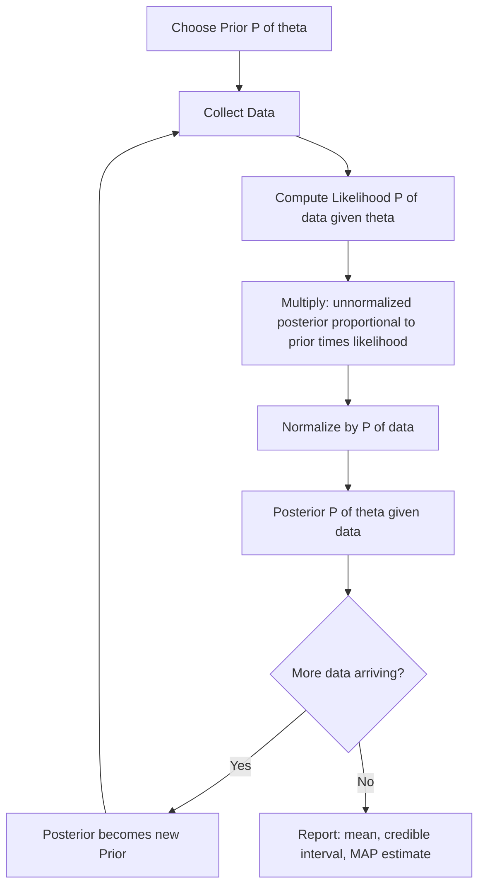

# Bayesian Inference

## Detailed Explanation

Bayesian inference is a principled framework for updating beliefs in light of new evidence. The central equation is Bayes' theorem applied to statistical inference: posterior ∝ likelihood × prior. The **posterior** P(θ|data) combines what you believed before seeing data (the **prior** P(θ)) with what the data tells you about θ (the **likelihood** P(data|θ)), divided by the normalizing constant called the **evidence** or marginal likelihood P(data).

This framework is fundamentally different from frequentist inference. In frequentist statistics, parameters are fixed but unknown constants, and the uncertainty is about the data (confidence intervals, p-values). In Bayesian statistics, parameters are treated as random variables with distributions, and the uncertainty is expressed directly as a probability distribution over parameters — the posterior.

The practical power of Bayesian inference comes from three properties. First, **coherent uncertainty quantification**: the posterior gives you P(θ > threshold | data), which is directly interpretable, unlike confidence intervals. Second, **principled incorporation of prior knowledge**: if you have previous experiments or domain expertise, encode them in the prior. Third, **natural sequential updating**: as new data arrives, the current posterior becomes the new prior — Bayesian inference is inherently online.

**Conjugate priors** are a key computational convenience: when the prior and posterior belong to the same distribution family, the update is analytical. Beta-Binomial and Gaussian-Gaussian are the most important conjugate pairs. When conjugacy is unavailable, practitioners use Markov Chain Monte Carlo (MCMC) or Variational Inference (VI) to approximate the posterior.

In ML, Bayesian inference appears in: Bayesian neural networks (distributions over weights), Gaussian processes (Bayesian non-parametric regression), Bayesian hyperparameter optimization, and MAP estimation (a special case where we maximize the posterior rather than computing its full distribution).

## Core Intuition

Bayesian inference is the process of updating your beliefs when you see new evidence. The prior is what you believe before looking at the data; the likelihood is what the data tells you about which parameter values are consistent with the observations; and the posterior is the updated belief combining both. Each new data point you observe makes your posterior distribution narrower and closer to the truth.

## How It Works

**Step-by-step Bayesian update:**

1. **Choose a prior P(θ)**: Encode your knowledge before seeing data. Use a uniform (Beta(1,1)) if you know nothing; use an informative prior if you have previous data.
2. **Define the likelihood P(data|θ)**: Choose the probability model for how data is generated given θ.
3. **Compute posterior ∝ P(data|θ) × P(θ)**: Multiply prior by likelihood. This is unnormalized.
4. **Normalize**: Divide by P(data) = integral of P(data|θ)P(θ) dθ to get a proper distribution.
5. **Summarize the posterior**: Report mean, median, credible interval (e.g., 95% HDI).
6. **Update sequentially**: If more data arrives, the current posterior becomes the new prior.

## Architecture / Trade-offs

### MAP vs MLE vs Full Bayesian

| Method | Objective | Uncertainty | Regularization | Computational Cost |
|---|---|---|---|---|
| MLE | Maximize P(data given theta) | None (point estimate) | None (can overfit) | Low: closed form or gradient ascent |
| MAP | Maximize P(theta given data) | None (point estimate) | Yes: prior acts as regularizer | Low: same as MLE plus prior gradient |
| Full Bayes | Compute full P(theta given data) | Full posterior distribution | Yes: automatic via prior | High: MCMC or VI needed (except conjugates) |

### Conjugate Prior Pairs

| Likelihood | Conjugate Prior | Posterior | Use Case |
|---|---|---|---|
| Bernoulli/Binomial(p) | Beta(alpha, beta) | Beta(alpha+k, beta+n-k) | Click rates, conversion rates |
| Poisson(lambda) | Gamma(alpha, beta) | Gamma(alpha+n_x_bar, beta+n) | Event counts per time |
| Gaussian(mu, known sigma) | Gaussian(mu_0, sigma_0) | Gaussian (closed form) | Mean estimation with known variance |
| Gaussian(known mu, sigma^2) | Inverse-Gamma(alpha, beta) | Inverse-Gamma | Variance estimation |
| Categorical(p) | Dirichlet(alpha) | Dirichlet(alpha+counts) | Topic models, multinomial data |

### Credible Interval vs Confidence Interval

| Property | Bayesian Credible Interval | Frequentist Confidence Interval |
|---|---|---|
| Interpretation | P(theta in [a,b] given data) = 95% | If we repeated sampling, 95% of intervals would contain true theta |
| What varies | Parameter (random in Bayesian) | The interval (parameter is fixed) |
| Direct probability statement | Yes — directly about parameter | No — about the procedure |
| Requires prior | Yes | No |
| Width | Depends on prior and data | Depends only on data |

## Interview Q&A

**Q: When would you choose Bayesian inference over frequentist methods in production?**
A: When you need to incorporate prior knowledge (previous experiments, domain expertise), when you need to quantify uncertainty directly as a probability (not just a confidence interval), or when you want sequential updating as new data arrives. A/B testing is a good example: Bayesian P(B>A) is more actionable than a p-value. Also when sample sizes are small and the prior can regularize estimates.

**Q: What is MAP estimation and how does it relate to regularization?**
A: MAP (Maximum A Posteriori) maximizes P(θ|data) ∝ P(data|θ)P(θ). Taking log: maximize log P(data|θ) + log P(θ). With a Gaussian prior on θ, log P(θ) ∝ -||θ||² — this is exactly L2 regularization (Ridge). With a Laplace prior, log P(θ) ∝ -||θ||₁ — this is L1 regularization (Lasso). So L1/L2 regularization has a Bayesian interpretation as MAP estimation with Laplace/Gaussian priors.

**Q: What is a credible interval and how does it differ from a confidence interval?**
A: A 95% credible interval means P(θ ∈ [a,b] | data) = 0.95 — a direct probability statement about the parameter. A frequentist 95% confidence interval means: if we repeated the experiment infinitely many times and computed a confidence interval each time, 95% of those intervals would contain the true θ. The confidence interval does NOT mean the parameter is in the interval with 95% probability. Practitioners routinely misinterpret confidence intervals as credible intervals; Bayesian credible intervals are the mathematically correct version of that interpretation.

**Q: When do conjugate priors become insufficient?**
A: When the model is complex enough that the likelihood is not from an exponential family (e.g., neural networks, non-linear models, hierarchical models with many levels). In these cases, the posterior has no closed form and must be approximated via MCMC (exact but expensive) or Variational Inference (approximate but fast). In practice, conjugate priors cover many practical ML problems: A/B testing, click rate estimation, topic models (Dirichlet).

**Q: How does adding a prior affect the bias-variance trade-off?**
A: A prior introduces bias (pushes estimates toward the prior mean) but reduces variance (shrinkage). This is exactly the bias-variance trade-off: a weak prior has little bias but high variance; a strong prior has more bias but much lower variance. With small datasets, the variance dominates, so a strong prior helps even if slightly wrong. With large datasets, the likelihood dominates and the prior becomes irrelevant — consistent with MLE converging to MAP as n→∞.

**Q: What does it mean for a posterior to be "dominated by the likelihood"?**
A: As n→∞, the likelihood concentrates around the true parameter value with strength proportional to n, while the prior is fixed. So the posterior becomes narrower and narrower around the MLE estimate, and the effect of the prior vanishes. This is why Bayesian and frequentist methods agree asymptotically. In small samples, the prior matters; in large samples, the data overwhelms the prior.

## Best Practices

- Always plot the prior, likelihood, and posterior together to verify the update makes intuitive sense.
- For A/B tests, use Beta-Binomial (conjugate, analytical, no MCMC needed) rather than MCMC.
- Start with weak (diffuse) priors unless you have strong domain knowledge — do not over-constrain with a strong prior without justification.
- Use the posterior predictive distribution P(x_new | data) for forecasting, not just the MAP estimate.
- When using MCMC, check convergence diagnostics: R-hat < 1.01 (Gelman-Rubin), effective sample size > 400.
- For MAP in neural networks, use weight decay (L2 regularization) with the decay coefficient = sigma^{-2} where sigma is the prior standard deviation.
- Sequential Bayesian updating is numerically equivalent to fitting on all data at once — but verify numerical stability when doing many sequential updates.

## Common Pitfalls

- **Treating MAP as full Bayesian**: MAP gives a point estimate, not uncertainty. It can be overconfident. Full Bayesian gives a distribution. Use full Bayesian when uncertainty quantification matters.
- **Choosing an informative prior without justification**: A strong prior that is wrong will dominate in small samples and give biased estimates. Fix: use weakly informative priors and perform prior predictive checks (sample from the prior, verify simulated data looks plausible).
- **Confusing prior and posterior**: After seeing data, always work with the posterior, not the prior. Reporting the prior probability of an event after data is observed is a common mistake.
- **Forgetting the evidence normalizing constant**: The unnormalized posterior (prior × likelihood) is not a probability distribution. Fix: either normalize analytically (for conjugates) or use MCMC/VI which work with unnormalized posteriors.
- **Interpreting credible intervals as confidence intervals**: They answer different questions. Credible intervals make direct probability statements about parameters; confidence intervals describe the sampling procedure. Never say "there's a 95% probability the true parameter is in this confidence interval" — that is the credible interval statement.

## Related Concepts

- [01 Probability Fundamentals](./01-probability-fundamentals.md) — Bayes' theorem is the foundation of Bayesian inference
- [02 Distributions Reference](./02-distributions-reference.md) — Beta, Gaussian, Dirichlet are key prior/posterior distributions
- [04 Maximum Likelihood Estimation](./04-maximum-likelihood-estimation.md) — MLE is the limiting case as the prior becomes flat
- [05 Hypothesis Testing](./05-hypothesis-testing.md) — frequentist alternative to Bayesian inference
