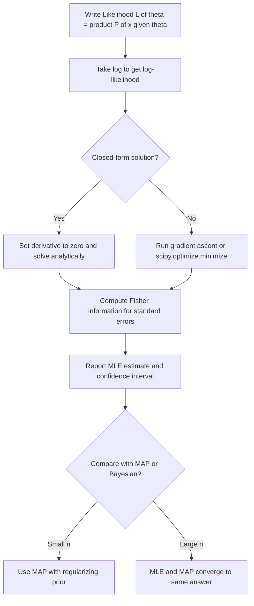

# Maximum Likelihood Estimation

## Detailed Explanation

Maximum Likelihood Estimation (MLE) is the most widely used method for fitting statistical models to data. Given observed data X = {x₁, ..., xₙ} and a parametric model with parameter θ, MLE finds the parameter value that makes the observed data most probable: θ* = argmax_θ P(X|θ). Because probabilities are products of many small numbers, in practice we maximize the **log-likelihood** ℓ(θ) = Σᵢ log P(xᵢ|θ), which is numerically stable and turns products into sums.

MLE has several remarkable properties. It is **consistent**: as n→∞, the MLE converges in probability to the true parameter θ*. It is **asymptotically efficient**: among all unbiased estimators, MLE achieves the lowest possible variance (the Cramér-Rao lower bound) as n→∞. It is **asymptotically normal**: √n(θ̂_MLE - θ*) → N(0, I(θ*)⁻¹) where I(θ) is the **Fisher information matrix**, which quantifies how much information the data carries about θ.

**Connection to loss functions in ML**: MLE is not just a statistical tool — it is the foundation of most ML training objectives. Minimizing cross-entropy loss on a classification problem is exactly MLE for categorical distributions. Minimizing mean squared error (MSE) is MLE under a Gaussian noise assumption. Minimizing binary cross-entropy is MLE for Bernoulli outputs. Understanding this connection helps you reason about when a loss function is appropriate and what distributional assumptions it implies.

**MLE vs MAP vs Bayesian**: MLE ignores any prior information and can overfit with small datasets. MAP adds a prior term (equivalent to adding a regularization penalty), which reduces variance at the cost of introducing bias. Full Bayesian inference computes the entire posterior distribution, providing calibrated uncertainty estimates but at much higher computational cost.

The **Fisher information** I(θ) = E[-∂²ℓ/∂θ²] measures how sharply peaked the likelihood function is near θ*. Its inverse I(θ*)⁻¹ gives the asymptotic variance of the MLE — a large Fisher information means the MLE is very precise. This is the basis for computing standard errors and confidence intervals from MLE.

## Core Intuition

MLE answers the question: "Which parameter value would have made this data most likely?" You search over all possible parameter values and pick the one that assigns the highest probability to exactly the data you observed. Working in log-space converts the product of probabilities to a sum, which is numerically stable and easier to optimize with gradient descent.

## How It Works

**Step-by-step MLE procedure:**

1. **Write down the likelihood**: L(θ) = ∏ᵢ P(xᵢ|θ). Each observation is assumed to be iid.
2. **Take the log**: ℓ(θ) = Σᵢ log P(xᵢ|θ). Products become sums; numerically stable.
3. **Find the maximum**: Set ∂ℓ/∂θ = 0 and solve (analytical), or run gradient ascent (numerical).
4. **Verify it is a maximum**: Check ∂²ℓ/∂θ² < 0 (negative curvature).
5. **Compute standard errors**: SE(θ̂) = 1/√I(θ̂) using Fisher information.

## Architecture / Trade-offs

### MLE Analytical Solutions for Common Distributions

| Distribution | Parameter | MLE Solution | Derivation hint |
|---|---|---|---|
| Gaussian | mu | x_bar = mean of data | Set d/d_mu log-likelihood = 0 |
| Gaussian | sigma^2 | (1/n) sum (x_i - x_bar)^2 | Set d/d_sigma^2 = 0 (note: biased) |
| Bernoulli/Binomial | p | k/n (fraction successes) | Set d/d_p = 0 |
| Poisson | lambda | x_bar (sample mean) | Set d/d_lambda = 0 |
| Exponential | lambda | 1/x_bar (inverse mean) | Set d/d_lambda = 0 |
| Categorical | p_k | n_k/n (class frequency) | Lagrange multiplier for sum=1 |

### MLE vs MAP vs Full Bayesian

| Property | MLE | MAP | Full Bayes |
|---|---|---|---|
| What you get | Point estimate | Point estimate | Posterior distribution |
| Uncertainty | Asymptotic CI from Fisher information | Same as MLE | Full posterior (credible intervals) |
| Regularization | None (overfits with small n) | Yes (prior = regularizer) | Yes (prior = regularizer) |
| Overfitting risk | High when n << d | Lower (controlled by prior) | Lowest (uncertainty prevents overconfidence) |
| Computational cost | Low | Low (same as MLE + prior) | High (MCMC/VI, except conjugates) |
| Large n behavior | Consistent, efficient | Same as MLE (prior ignored) | Same as MLE (posterior concentrates) |

### Fisher Information and Standard Errors

| Quantity | Formula | Meaning |
|---|---|---|
| Score | s(theta) = d log p / d theta | Gradient of log-likelihood |
| Fisher information | I(theta) = E[s^2] = -E[d^2 log p/d theta^2] | Expected curvature of log-likelihood |
| Asymptotic variance | Var(theta_hat) ~ 1/I(theta) | Smaller I = wider CI |
| Cramér-Rao bound | Var(any unbiased estimator) >= 1/I(theta) | MLE achieves this bound asymptotically |

## Interview Q&A

**Q: Why do we maximize log-likelihood instead of likelihood?**
A: Two reasons. First, numerical stability: the product of many probabilities (each < 1) underflows to 0 for even moderate n. Log converts the product to a sum. Second, mathematical convenience: derivatives of sums are easier to compute than derivatives of products, and log turns exp/power terms into simple linear forms. The argmax is unchanged because log is monotone increasing.

**Q: What is the connection between cross-entropy loss and MLE?**
A: For classification, the cross-entropy loss H(y, p) = -Σ yₖ log pₖ is exactly the negative log-likelihood of the categorical distribution. Minimizing cross-entropy is MLE under the assumption that labels are generated by a categorical distribution with parameters given by the softmax output. This justifies cross-entropy as the "correct" loss for multi-class classification.

**Q: When does MLE overfit and what do you do about it?**
A: MLE overfits when n << d (more parameters than data). With no regularization, the likelihood can be made arbitrarily large by fitting noise. Solutions: (1) MAP with regularizing prior (L2/L1), (2) early stopping, (3) dropout (implicit regularization), (4) reduce model complexity. The Fisher information gives you a warning: if I(θ) is near-singular, you have an ill-conditioned estimation problem.

**Q: What is the Fisher information and why does it matter?**
A: The Fisher information I(θ) measures how much information a sample carries about θ. It equals the expected negative second derivative of the log-likelihood (the curvature at the true θ). Large I(θ) means the likelihood is sharply peaked → precise MLE. Small I(θ) means the likelihood is flat → uncertain MLE. The Cramér-Rao bound says no unbiased estimator can have variance smaller than 1/I(θ), and MLE achieves this bound asymptotically.

**Q: Why is the Gaussian MLE estimate for sigma^2 biased?**
A: The MLE gives σ² = (1/n)Σ(xᵢ-x̄)², but the unbiased estimator uses (n-1) in the denominator. The bias arises because we estimated the mean x̄ from the same data, reducing the effective degrees of freedom by 1. This bias is small for large n but matters in small samples. For small n, use the unbiased estimator (divide by n-1) unless you specifically want MLE.

**Q: How do you compute confidence intervals from MLE?**
A: By the asymptotic normality of MLE: √n(θ̂ - θ*) → N(0, I(θ*)⁻¹). So a 95% CI is θ̂ ± 1.96/√(n · I(θ̂)). In practice, approximate I(θ̂) by the observed Fisher information: -∂²ℓ/∂θ²|_{θ̂}. For multivariate θ, use the inverse of the Hessian of the log-likelihood at θ̂.

## Best Practices

- Always work in log-likelihood (ℓ) space, not likelihood (L) space, to avoid numerical underflow.
- Use `scipy.optimize.minimize` with method='L-BFGS-B' for numerical MLE with bounds, or `scipy.stats.X.fit()` for common distributions.
- Check that your log-likelihood is concave (single maximum); if not, you may find a local rather than global maximum.
- Compute standard errors from the Hessian of the log-likelihood at the MLE to quantify uncertainty.
- For logistic regression, MLE has no closed form but the objective is concave — gradient ascent always finds the global maximum.
- With small samples (n < 10d), consider MAP with a regularizing prior rather than pure MLE to reduce overfitting.
- Use AIC = 2k - 2ℓ(θ̂) and BIC = k log(n) - 2ℓ(θ̂) to compare models with different numbers of parameters.

## Common Pitfalls

- **Maximizing likelihood instead of log-likelihood**: Product of small probabilities underflows to 0, and subsequent gradient is 0 (vanishing gradient). Fix: always take log first.
- **Forgetting the iid assumption**: MLE derivation assumes observations are iid. Time series data, hierarchical data, and correlated observations violate this. Fix: use appropriate likelihood (e.g., multivariate Gaussian, or conditional likelihood for time series).
- **Treating MLE like the true parameter**: MLE is an estimate with uncertainty. Report confidence intervals alongside point estimates. Never treat θ̂_MLE as exact.
- **Using MLE for Gaussian variance on small samples**: The MLE σ̂² is biased downward. Fix: use (n-1) denominator (the sample variance) unless you want the biased MLE specifically.
- **Not checking for multiple local maxima**: For mixture models and neural networks, the likelihood is non-concave and gradient ascent can converge to local optima. Fix: use multiple random initializations and take the best result.

## Related Concepts

- [01 Probability Fundamentals](./01-probability-fundamentals.md) — likelihood is a conditional probability viewed as a function of θ
- [02 Distributions Reference](./02-distributions-reference.md) — MLE analytical solutions exist for all standard distributions
- [03 Bayesian Inference](./03-bayesian-inference.md) — MAP is MLE + prior; full Bayes computes the whole posterior
- [05 Hypothesis Testing](./05-hypothesis-testing.md) — likelihood ratio tests are based on MLE
