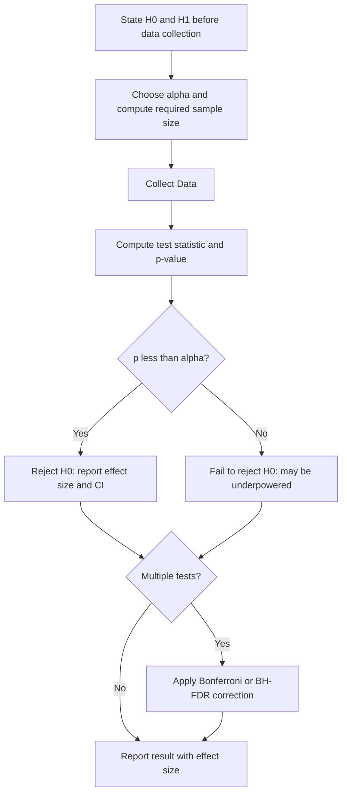

# Hypothesis Testing

## Detailed Explanation

Hypothesis testing is the statistical framework for making decisions under uncertainty using data. The process starts by defining a **null hypothesis H₀** (typically "no effect" or "no difference") and an **alternative hypothesis H₁** (the effect you want to detect). The goal is to determine whether the observed data is consistent with H₀ or provides sufficient evidence to reject it.

The **p-value** is the probability of observing data at least as extreme as what was observed, assuming H₀ is true: p = P(test statistic ≥ observed value | H₀). A common misconception is that the p-value is the probability that H₀ is true — it is not. It is a statement about how surprising the data would be in a world where H₀ holds. A p-value of 0.03 does not mean H₀ has a 3% chance of being true; it means the data would occur in only 3% of experiments if H₀ were true.

Two types of errors govern the trade-off: **Type I error** (false positive, α) is rejecting H₀ when it is actually true. **Type II error** (false negative, β) is failing to reject H₀ when it is actually false. **Power** = 1 - β is the probability of correctly detecting a true effect. The significance level α is typically set to 0.05 before data collection. **Effect size** (e.g., Cohen's d) measures the practical magnitude of a difference, not just statistical significance.

**Statistical significance ≠ practical significance**. With large enough samples, trivially small effects become statistically significant. Always report effect sizes alongside p-values.

In ML practice, hypothesis testing is most commonly used for A/B testing (t-tests, z-tests for proportions), feature selection (chi-square tests, ANOVA), and comparing model performance (paired t-tests on cross-validation scores). The most serious pitfall is **multiple testing**: running 20 simultaneous hypothesis tests at α=0.05 gives a 64% chance of at least one false positive. **Bonferroni correction** (divide α by m tests) and **Benjamini-Hochberg FDR control** are standard remedies.

**Sample size and power analysis** must be done before collecting data. Under-powered experiments cannot detect true effects even if they exist; over-powered experiments waste resources and detect trivial effects. Always compute required n = 2σ²(z_{α/2} + z_β)²/δ² before starting an A/B test.

## Core Intuition

A hypothesis test asks: "How surprised would I be by this data if the null hypothesis were true?" If the answer is "very surprised" (p-value small), you reject the null. Think of it as a court trial: H₀ is innocent until proven guilty; the p-value is how unlikely the evidence would be if the defendant were innocent; and α is how strong the evidence must be before you convict. Effect size is the severity of the crime — a statistically significant jaywalking conviction is still just jaywalking.

## How It Works

**Step-by-step hypothesis test:**

1. **State H₀ and H₁**: e.g., H₀: μ_A = μ_B vs H₁: μ_A ≠ μ_B (two-tailed).
2. **Choose α (significance level)**: Typically 0.05. Set BEFORE looking at data.
3. **Compute test statistic**: t = (x̄_A - x̄_B) / SE where SE is the standard error.
4. **Compute p-value**: P(|T| ≥ |observed t| | H₀) using the t-distribution CDF.
5. **Make decision**: If p < α, reject H₀. Report effect size and confidence interval.
6. **Correct for multiple testing**: If running m tests, apply Bonferroni (α_corrected = α/m) or BH-FDR.

## Architecture / Trade-offs

### Common Statistical Tests

| Test | When to Use | Assumptions | Null Hypothesis |
|---|---|---|---|
| One-sample t-test | Compare sample mean to known value | Gaussian data or n > 30 | mu = mu_0 |
| Two-sample t-test | Compare means of two groups | Gaussian or large n, equal/unequal var | mu_A = mu_B |
| Paired t-test | Compare before/after on same units | Gaussian differences | mean difference = 0 |
| Chi-square test | Categorical feature vs categorical label | Expected counts >= 5 | Independence |
| Mann-Whitney U | Non-parametric alternative to t-test | No normality needed | Same distribution |
| ANOVA | Compare means across 3+ groups | Gaussian within groups | All means equal |
| KS test | Compare two continuous distributions | None | Same distribution |
| Permutation test | Any statistic, small samples | Only exchangeability | No difference |

### Multiple Testing Corrections

| Method | Controls | Formula | When to Use |
|---|---|---|---|
| Bonferroni | Family-Wise Error Rate (FWER) | alpha_corrected = alpha / m | Conservative; few tests |
| Benjamini-Hochberg (BH) | False Discovery Rate (FDR) | Threshold k/m * alpha | Many tests, ok with some FPs |
| Holm-Bonferroni | FWER (less conservative) | Step-down Bonferroni | Between Bonferroni and BH |

### Power Analysis Parameters

| Parameter | Symbol | Typical Value | Interpretation |
|---|---|---|---|
| Significance level | alpha | 0.05 | Acceptable false positive rate |
| Power | 1 - beta | 0.80 | Probability of detecting true effect |
| Effect size | delta (Cohen's d) | 0.2/0.5/0.8 = small/medium/large | Practical magnitude |
| Required n | n per group | Depends on above | Must be computed BEFORE data collection |

## Interview Q&A

**Q: Your A/B test shows p=0.03 after 3 days of running. Should you ship?**
A: No — for three reasons. First, **peeking**: you set α=0.05 before the test but are checking before the planned end, inflating Type I error (the actual false positive rate is much higher than 0.05 when you stop as soon as p < 0.05). Second, **novelty effect**: early users behave differently from long-term users; wait for the effect to stabilize. Third, **power**: was your original power analysis designed to detect the observed effect size? A barely-significant result may have low power and be noise. Fix: use sequential testing methods (O'Brien-Fleming boundaries) or Bayesian approaches if you need early stopping.

**Q: What is the difference between Type I and Type II errors, and how do you control them?**
A: Type I (α, false positive): rejecting H₀ when it is true — saying the treatment works when it doesn't. Type II (β, false negative): failing to reject H₀ when it is false — missing a real effect. You control α by setting the significance threshold; you control β by choosing sample size large enough for your desired power (1-β). They trade off: reducing α increases β for fixed sample size. The only way to reduce both simultaneously is to collect more data.

**Q: Why is running 20 A/B tests at α=0.05 dangerous?**
A: With m=20 independent tests each at α=0.05, the probability of at least one false positive is 1-(1-0.05)^20 ≈ 0.64. You will almost certainly find at least one "significant" result by chance. Fix: Bonferroni correction (use α/m = 0.0025 per test) or Benjamini-Hochberg FDR (controls expected fraction of false discoveries, less conservative than Bonferroni).

**Q: When would you use Mann-Whitney U instead of a t-test?**
A: When the data is not Gaussian and the sample is too small for the CLT to apply (n < 30 per group), or when the data has heavy outliers. Mann-Whitney U tests whether one group tends to have larger values than the other (stochastic dominance), not whether means are equal. For revenue metrics (right-skewed, heavy-tailed), Mann-Whitney is often more appropriate than a t-test.

**Q: What is effect size and why does it matter alongside p-values?**
A: Effect size measures the practical magnitude of a difference. Cohen's d = (μ_A - μ_B)/σ_pooled; |d| = 0.2/0.5/0.8 is considered small/medium/large. With large samples (n = 100,000), you can achieve p < 0.001 for Cohen's d = 0.01 — a statistically significant but practically irrelevant 0.01% conversion difference. Effect size tells you whether the difference is worth acting on, not just whether it's real.

**Q: What is the minimum detectable effect and how do you use it in experiment design?**
A: The MDE is the smallest effect size your experiment is powered to detect (at given α and 1-β). You set the MDE based on business requirements: "we only care about effects larger than +2% conversion." Then: n = 2σ²(z_{α/2} + z_β)²/MDE². If the required n is larger than your traffic allows in a reasonable time window, either accept a smaller power or a wider MDE — never run an underpowered test and interpret null results as evidence of no effect.

## Best Practices

- Always do a power analysis BEFORE collecting data to determine required sample size; do not peek at results during collection.
- Report effect sizes (Cohen's d, Pearson r, relative risk) alongside p-values — statistical significance alone is not enough.
- For non-Gaussian data or small samples, prefer permutation tests or Mann-Whitney over t-tests.
- Apply multiple testing corrections whenever you run more than one test: Bonferroni for small m, Benjamini-Hochberg for large m.
- Use two-tailed tests by default; only use one-tailed when you have a strong directional hypothesis stated before data collection.
- For A/B tests, specify: alpha, power (typically 0.80), MDE, and n_required before starting. Document all three.
- When you fail to reject H₀, compute the power retrospectively to check if your experiment was sensitive enough to detect the effect you care about.

## Common Pitfalls

- **Misinterpreting p-values**: "p=0.05 means H₀ is 5% likely to be true" is wrong. p is P(data this extreme | H₀ true). Fix: always report what the p-value actually means in context.
- **Multiple testing without correction**: Running many tests at α=0.05 inflates the false positive rate. Fix: Bonferroni or BH-FDR correction, or pre-specify a single primary metric.
- **Peeking (sequential testing without correction)**: Stopping a test as soon as p < α leads to inflated Type I error. Fix: pre-specify n, use O'Brien-Fleming boundaries, or use Bayesian stopping rules.
- **Confusing absence of evidence with evidence of absence**: "We failed to reject H₀" does NOT mean there is no effect. It means we do not have enough evidence. An underpowered test will frequently fail to reject even when the effect is real. Fix: always check post-hoc power.
- **Not checking t-test assumptions**: Applying a t-test to revenue data (extreme outliers, log-normal shape) without checking normality. Fix: use Mann-Whitney U or permutation test for non-normal data; use bootstrap CIs for heavy-tailed metrics.

## Related Concepts

- [01 Probability Fundamentals](./01-probability-fundamentals.md) — p-values are probabilities computed from the null distribution
- [02 Distributions Reference](./02-distributions-reference.md) — t-test uses t-distribution, chi-square test uses chi-square distribution
- [03 Bayesian Inference](./03-bayesian-inference.md) — Bayesian A/B testing as an alternative to frequentist hypothesis testing
- [04 Maximum Likelihood Estimation](./04-maximum-likelihood-estimation.md) — likelihood ratio tests are the most powerful tests (Neyman-Pearson)
