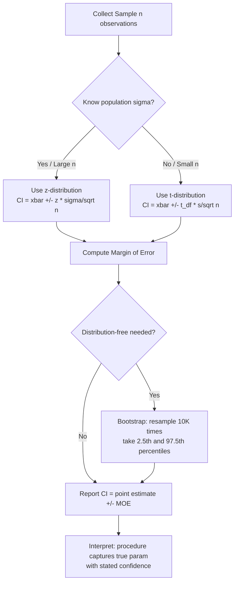

# Confidence Intervals

## 1. Detailed Explanation

A confidence interval (CI) is a range of values, derived from sample data, that is likely to contain the true population parameter. A 95% CI means: if we repeated the same sampling procedure many times and computed a CI each time, 95% of those intervals would contain the true parameter. Critically, this does NOT mean there is a 95% probability that the true parameter lies in any specific computed interval — the true parameter is either in the interval or it is not; probability applies to the procedure, not the result.

CIs are essential in data science and ML because point estimates alone (e.g., "accuracy is 87.3%") are misleading without uncertainty quantification. A tight CI signals reliable estimates from adequate sample sizes; a wide CI flags insufficient data. In A/B testing, the CI for the difference in means directly answers "is the effect large enough to be practically significant?" In model evaluation, bootstrapped CIs on metrics reveal whether two models differ beyond sampling noise.

The width of a CI depends on three factors: (1) sample size n — larger n narrows the interval by 1/√n; (2) variance σ² — more spread in data widens the interval; (3) confidence level — 99% CIs are wider than 95% CIs for the same data. Understanding this three-way trade-off is essential for study design: to halve CI width, you must quadruple sample size.

The t-distribution is used when σ is unknown (estimated from data) or when n < 30. For large n, the t and z distributions converge. Bootstrap CIs are distribution-free: they resample the observed data with replacement and use empirical percentiles, making them valid even for non-normal data or complex statistics like medians and correlations.

## 2. Core Intuition

Think of a CI as a fishing net you cast around your sample estimate — the wider the net, the more confident you are of catching the true value, but you sacrifice precision. The t-distribution is a wider net than the z-distribution for small samples, accounting for the extra uncertainty of estimating σ from limited data. Bootstrap CIs skip the distribution assumptions entirely by asking: "what range of estimates would I get if I sampled from my observed data repeatedly?"

## 3. How It Works

**Step-by-step:**

1. **Compute the point estimate** — sample mean x-bar, proportion p-hat, or other statistic.
2. **Determine the standard error** — SE = σ/√n (known σ) or s/√n (estimated from data).
3. **Choose the critical value** — z* = 1.96 for 95% z-CI; t* from t-distribution with n-1 degrees of freedom for t-CI.
4. **Compute margin of error** — MOE = critical_value × SE.
5. **Form the interval** — [estimate - MOE, estimate + MOE].
6. **Verify interpretation** — the interval is a statement about the procedure reliability, not a probabilistic statement about where the fixed parameter lies.

## 4. Architecture / Trade-offs

### CI Method Comparison

| Method | When to Use | Assumptions | Width |
|--------|-------------|-------------|-------|
| z-CI | Known σ or n ≥ 30 | Normal population or CLT applies | Narrowest |
| t-CI | Unknown σ, any n | Normal population (robust for n > 15) | Wider for small n |
| Bootstrap percentile CI | Non-normal, complex stats (median, correlation) | IID samples | Varies |
| Wilson score (proportion) | Proportions near 0 or 1 | Binomial data | More accurate at extremes |
| Normal approximation (proportion) | Proportions near 0.5 | np ≥ 5 and n(1-p) ≥ 5 | Symmetric, simple |

### Confidence Level vs Width Trade-off

| Confidence Level | z* critical value | Relative Width vs 95% |
|-----------------|-------------------|----------------------|
| 90% | 1.645 | 0.84× (narrower) |
| 95% | 1.960 | 1.00× (baseline) |
| 99% | 2.576 | 1.31× (wider) |
| 99.9% | 3.291 | 1.68× (much wider) |

### Sample Size vs CI Width

| Sample Size n | SE (σ=1) | 95% CI Width |
|--------------|---------|-------------|
| 25 | 0.200 | 0.784 |
| 100 | 0.100 | 0.392 |
| 400 | 0.050 | 0.196 |
| 1600 | 0.025 | 0.098 |

To halve the CI width, you must quadruple sample size — a fundamental 1/√n relationship.

## 5. Interview Q&A

**Q: A data scientist reports a 95% CI for mean session duration of [4.2 min, 5.1 min]. A stakeholder says "there's a 95% chance the true mean is in this range." Is this correct?**
A: No. The 95% refers to the procedure, not this specific interval. The true mean is fixed — it either is or is not in [4.2, 5.1]. If we repeated the experiment 100 times and computed a CI each time, approximately 95 of those CIs would contain the true mean. The interval we computed is just one realization of that procedure.

**Q: When would you use a bootstrap CI instead of a t-CI in an ML evaluation context?**
A: Use bootstrap when the statistic is complex (e.g., AUC-ROC, F1 score, quantile), the distribution is skewed, or the sample is small and non-normal. Bootstrap makes no parametric assumptions and works for any statistic you can compute from a sample. For a simple mean with n > 30, the t-CI is equivalent and faster.

**Q: Your A/B test produces CI for lift of [−0.5%, +2.3%]. How do you interpret this for the product team?**
A: The CI includes zero, so we cannot conclude the treatment has a statistically significant positive effect at this confidence level. We should also check whether the entire interval is within an acceptable range (the smallest detectable effect that matters). If the CI includes -0.5%, the true effect could be slightly negative, so shipping would carry risk.

**Q: How does the CI change if you increase your confidence level from 95% to 99% without changing the sample?**
A: The CI becomes wider. The 99% z* = 2.576 vs 95% z* = 1.960, so the margin of error increases by about 31%. You gain more confidence that the interval covers the true parameter, at the cost of a less precise estimate.

**Q: You have a conversion rate of 2% from 500 visitors. Why might the normal approximation CI be problematic here?**
A: With n=500 and p=0.02, you have np = 10 successes. The normal approximation requires both np ≥ 5 and n(1-p) ≥ 5 — technically met, but 10 successes is barely adequate. The distribution is skewed right near p=0. The Wilson score interval or exact Clopper-Pearson interval is more accurate here, especially for the lower bound which could approach zero.

**Q: If you want a CI width of ±0.5 percentage points for a proportion around 50% at 95% confidence, how many observations do you need?**
A: Using n = z² × p(1-p) / MOE² = (1.96)² × 0.25 / (0.005)² ≈ 38,416 observations. This is why large-scale A/B tests require hundreds of thousands of users for detecting small effects.

**Q: What is the difference between a confidence interval and a prediction interval?**
A: A CI gives a range for the true population parameter (e.g., the mean). A prediction interval gives a range for the next individual observation — it is always wider because it accounts for both estimation uncertainty and individual variability. In regression, the prediction interval for a single new point is substantially wider than the CI for the expected value at that point.

## 6. Best Practices

- **Always report CIs alongside point estimates** — a bare number like "accuracy = 87.3%" is uninformative without knowing whether the CI is [85%, 90%] or [60%, 99%].
- **Use Wilson score interval for proportions** when the rate is below 10% or above 90%, or sample size is under 100. The normal approximation breaks down at the tails.
- **Bootstrap with at least 10,000 resamples** for stable 95% CI endpoints; use 100,000 for 99% CI or tail-sensitive statistics.
- **Required sample size for desired width:** n = (2 × z × σ / width)² — compute this before collecting data, not after.
- **t-CI automatically widens for small samples** — with n=10, t* = 2.26 vs z* = 1.96, giving about 15% wider intervals. This is the correct behavior, not a bug.
- **Check normality assumption for very small n** — for n < 15, the t-CI requires approximate normality. Use Wilcoxon signed-rank or bootstrap for skewed data.
- **When comparing two groups, CI for the difference is more informative than two separate CIs** — two overlapping CIs does not imply p > 0.05.

## 7. Common Pitfalls

- **"95% chance the parameter is in the interval"** — the classic misinterpretation. Confidence refers to the long-run frequency of the procedure, not the probability for a specific interval. Fix: restate as "computed by a procedure that captures the true value 95% of the time."

- **Using normal approximation for extreme proportions** — CI for a 1% conversion rate from 200 users can produce a lower bound of negative values using the normal approximation. Fix: always use Wilson score or exact binomial when np < 10 or n(1-p) < 10.

- **Confusing CI width with precision of estimate** — a very narrow CI from a biased study (e.g., non-random sampling) is precise but wrong. Precision ≠ accuracy. Fix: validate sampling process before interpreting interval width.

- **Looking at two separate CIs to test for group differences** — two CIs can overlap yet the difference is statistically significant. Fix: compute CI directly for the difference in parameters.

- **Ignoring multiple comparisons** — computing 20 independent 95% CIs, at least one will exclude the true value by chance. Fix: use Bonferroni correction or FDR control when constructing many CIs simultaneously.

## 8. Related Concepts

- [01-descriptive-statistics](./01-probability-fundamentals.md) — point estimates that CIs are built around
- [02-probability-distributions](./02-distributions-reference.md) — t and z distributions underlying CI computation
- [03-hypothesis-testing](./05-hypothesis-testing.md) — duality between CIs and two-sided hypothesis tests
- [07-statistical-power-sample-size](./07-statistical-power-sample-size.md) — sample size for desired CI width
- [08-ab-testing-statistics](./08-ab-testing-statistics.md) — CI for difference in means in experiments
