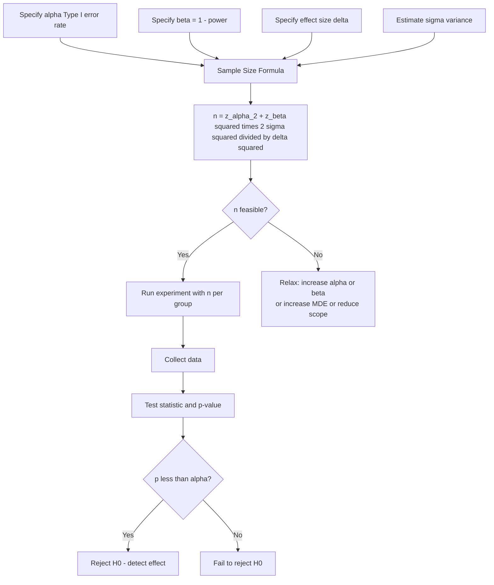

# Statistical Power and Sample Size

## 1. Detailed Explanation

Statistical power is the probability that a test correctly rejects a false null hypothesis — in other words, the probability of detecting a real effect when one exists. Formally, power = 1 − β, where β is the Type II error rate (false negative rate). A test with 80% power has a 20% chance of missing a true effect. In practice, 80% power is the accepted industry minimum; 90% is preferred for high-stakes decisions.

Power matters enormously in data science because underpowered experiments are a silent failure mode. An A/B test that fails to reach significance may simply have been too small to detect the effect — but the team interprets it as "no effect" and ships nothing. Worse, if you run many underpowered tests and publish/act on the ones that reach significance, you dramatically inflate false discoveries (the Winner's Curse). Simulations show that with 20% power, 64% of "significant" findings are false positives.

The four-way relationship among power, Type I error α, effect size Δ, and sample size n is deterministic: fix any three and the fourth is determined. The sample size formula for a two-sample z-test is:

n = (z_{α/2} + z_β)² × 2σ² / Δ²

where z_{α/2} is the critical value for α (1.96 for α=0.05 two-tailed) and z_β is the critical value for β (0.84 for 80% power). This formula makes the key insight clear: sample size grows as the square of the effect size in the denominator — halving the effect size you want to detect requires quadrupling the sample.

The Minimum Detectable Effect (MDE) is the smallest effect size that a given study design can detect at the specified power and α. It is the designer's knob: accept a larger MDE to run with fewer users, or require a smaller MDE (catching subtle improvements) at the cost of far more data.

## 2. Core Intuition

Power is the sensitivity of your experiment's detector: high power means your instrument can pick up a faint signal; low power means only loud signals register. Running an underpowered experiment and concluding "no effect" when significance is not reached is like trying to detect a whisper in a noisy room and declaring the person is silent — the problem is your detector, not the signal. The sample size formula tells you exactly how large a room (experiment) you need to hear effects of a given loudness (effect size).

## 3. How It Works

**Step-by-step:**

1. **Set α** — typical choice is 0.05 for two-tailed test; 0.01 for high-stakes decisions.
2. **Set target power** — commonly 0.80 (β=0.20) or 0.90 (β=0.10).
3. **Determine the minimum effect size** that is practically meaningful (MDE) — e.g., 1 percentage point lift in conversion, or Cohen's d = 0.2 for a small standardized effect.
4. **Estimate variance** — from historical data, pilot study, or domain knowledge.
5. **Compute required n** using the formula: n = (z_{α/2} + z_β)² × 2σ² / Δ².
6. **Check feasibility** — if n is too large, accept a larger MDE or lower power; document the decision.

## 4. Architecture / Trade-offs

### Effect Size Classification (Cohen's d)

| Effect Size | d value | Proportion of variance | Example |
|-------------|---------|----------------------|---------|
| Small | 0.2 | ~1% | Subtle UX change |
| Medium | 0.5 | ~6% | Moderate copy rewrite |
| Large | 0.8 | ~14% | Major product redesign |
| Very Large | 1.0+ | 20%+ | Complete algorithm swap |

### Required Sample Size per Group (power=0.8, α=0.05, two-tailed)

| Effect Size d | n per group | Total n |
|--------------|-------------|---------|
| 0.2 (small) | 394 | 788 |
| 0.5 (medium) | 64 | 128 |
| 0.8 (large) | 26 | 52 |
| 1.0 (very large) | 17 | 34 |

### One-Tailed vs Two-Tailed Tests

| Parameter | One-tailed | Two-tailed |
|-----------|-----------|-----------|
| Critical value (α=0.05) | z = 1.645 | z = 1.960 |
| Required n (d=0.5) | 52 per group | 64 per group |
| Use when | Direction known a priori | Direction not predetermined |
| Risk | Inflated false positive if wrong direction | Conservative, preferred for A/B tests |

### The Underpowered Experiment Problem

| Power | % of "significant" results that are false discoveries |
|-------|-----------------------------------------------------|
| 0.80 | ~24% (base rate α=0.05, 1-in-10 effects are real) |
| 0.50 | ~50% |
| 0.20 | ~64% |

This shows why running many small underpowered tests and acting on "significant" ones produces mostly false discoveries — the Winner's Curse.

## 5. Interview Q&A

**Q: An A/B test runs for two weeks and shows p=0.08. The team wants to run it one more week. What is the statistical problem with this approach?**
A: This is "peeking" — continuously monitoring and extending the experiment until significance is reached inflates the true Type I error far above the nominal α=0.05. Each additional look introduces another chance to cross the significance threshold by random chance. Fix: precompute the required sample size, commit to stopping at that point, or use sequential testing methods (SPRT, alpha-spending) that explicitly account for interim looks.

**Q: Your product manager wants to detect a 0.1 percentage point lift in a 5% baseline conversion rate. What sample size do you need, and is this feasible?**
A: With p0=0.05, p1=0.051, effect size ≈ 0.001/√(0.05×0.95) ≈ Cohen's h ≈ 0.0046 — this is an extremely small effect. Using the sample size formula, you'd need millions of users per variant. In practice, this MDE is not feasible for most products. The right answer: discuss with PM what effect size is practically meaningful and realistically detectable given traffic.

**Q: You have power=0.80 and α=0.05. If you reject H0, what is the probability your finding is a true positive?**
A: It depends on the prior probability that H0 is false. Using Bayes' theorem: PPV = (power × P(H1)) / (power × P(H1) + α × P(H0)). If only 10% of tested hypotheses are true (H1): PPV = (0.8×0.1) / (0.8×0.1 + 0.05×0.9) = 0.08/0.125 = 64%. So 36% of "significant" findings are false positives even at 80% power when most hypotheses are null.

**Q: How does sample size change if you switch from 80% to 90% power, keeping all else equal?**
A: Power 80% uses z_β = 0.84; power 90% uses z_β = 1.28. The numerator (z_{α/2} + z_β)² goes from (1.96+0.84)² = 7.84 to (1.96+1.28)² = 10.50 — a 34% increase in required sample size. You need about 34% more observations to push power from 80% to 90%.

**Q: What is the Minimum Detectable Effect (MDE) and why is it a design input rather than an output?**
A: MDE is the smallest effect size that the experiment can detect at the specified power and α. It is a design input because you determine it from business value: "we only care about improvements of at least 1 percentage point because smaller effects don't justify the engineering cost." Once you specify MDE, power, and α, sample size is determined. MDE as an output means you compute what effect the sample size you have can detect — useful for post-hoc power analysis of historical experiments.

**Q: You designed an A/B test with n=500 per group for a medium effect (d=0.5). Due to slow traffic, only 200 per group were collected before the experiment was stopped. What should you do?**
A: Do not simply analyze with p < 0.05 as the threshold. The test is underpowered (power ≈ 45% with n=200 vs n=500). Options: (1) extend the experiment to reach n=500; (2) report the result as inconclusive with the actual power computed; (3) compute and report the observed effect size and CI, letting the CI width tell the story. Never act on a "not significant" result from an underpowered experiment as evidence of no effect.

## 6. Best Practices

- **Always compute sample size before launching** — never start with "run until significant." Use scipy.stats.norm or statsmodels.stats.power for accurate calculations.
- **Use 80% power as the floor, prefer 90%** — 80% power means 20% miss rate on real effects, which is already aggressive for high-stakes decisions.
- **Account for attrition** — if 10% of users drop out or dilute, inflate n by 1/(1-attrition_rate)² to maintain power.
- **For proportions, use Cohen's h** — h = 2×arcsin(√p1) - 2×arcsin(√p0). More accurate than treating proportions like continuous outcomes.
- **Effect size should come from business value, not statistics** — "what is the smallest lift worth shipping?" determines MDE, not the data.
- **Post-hoc power analysis on significant results is circular** — if p < 0.05, "observed power" will always be ≥50% by construction. Only do power analysis prospectively.
- **Bonferroni correction for multiple metrics** — if testing 5 metrics at α=0.05, each test's α should be 0.01, which requires larger n.

## 7. Common Pitfalls

- **Peeking and optional stopping** — checking p-values before data collection is complete and stopping when p < 0.05 inflates actual Type I error to 20-40%. Fix: pre-register the sample size and stopping rule, or use sequential testing methods.

- **Underpowered "null result" conclusions** — concluding "treatment has no effect" because p > 0.05 when power is 30%. The correct conclusion is "we failed to detect an effect." Fix: compute actual power, report CI, and explicitly state the test was underpowered.

- **Using same sample for exploratory and confirmatory analysis** — if you explore the data, find the most promising metric, then compute p-value on the same data, the p-value is invalid. Fix: split data (pilot for exploration, holdout for confirmation) or pre-register the primary metric.

- **Ignoring variance heterogeneity** — using σ from historical data when the new treatment changes variance (e.g., a new recommendation algorithm with high variance outcomes). Fix: estimate variance from the first 10% of data, recompute n before full launch.

- **Conflating statistical significance with practical significance** — with n=1,000,000 you can detect d=0.01 (trivially small effect) at p < 0.001. Fix: always examine effect size and CI, not just p-value. A CI entirely below your MDE is "not practically significant" even if statistically significant.

## 8. Related Concepts

- [03-hypothesis-testing](./05-hypothesis-testing.md) — Type I and Type II errors, the foundation of power analysis
- [06-confidence-intervals](./06-confidence-intervals.md) — CI width and required n are dual formulations of the same problem
- [08-ab-testing-statistics](./08-ab-testing-statistics.md) — practical application of power analysis in A/B test design
- [05-regression-analysis](./15-statistical-ml-connections.md) — power analysis for regression coefficients
