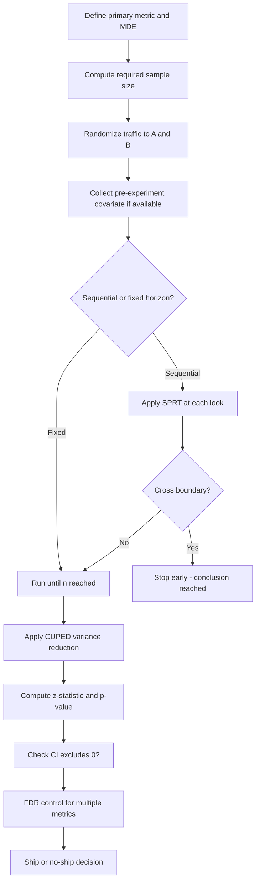

# A/B Testing Statistics

## 1. Detailed Explanation

A/B testing is a controlled experiment that compares two or more variants of a system to determine which performs better on a metric of interest. While system design covers the infrastructure (traffic splitting, logging, dashboards), the statistical machinery is what makes the conclusion valid. Getting the statistics wrong produces either phantom discoveries (false positives) or missed improvements (false negatives) — both costly.

The foundational tool is the two-sample z-test for proportions: compute a test statistic, compare to critical value, report p-value and confidence interval. But production A/B testing at scale requires going further. CUPED (Controlled-experiment Using Pre-Experiment Data) reduces variance by regressing out a pre-experiment covariate, increasing effective sample size by 20-50% without collecting more data. Sequential testing via SPRT allows early stopping when evidence is strong, avoiding the "peeking problem" that inflates false positives with fixed-horizon tests. Bayesian A/B with Beta-Binomial posteriors provides intuitive answers ("probability B beats A = 94%") and allows stopping rules based on credible intervals rather than p-values.

Multi-metric experiments require FDR control: if you track 20 metrics and use α=0.05 per test, you expect one false positive by chance. Benjamini-Hochberg controls the expected proportion of false discoveries rather than the per-test error rate, striking a better balance than conservative Bonferroni in high-dimensional metric dashboards.

Key principle: the analysis plan (primary metric, sample size, stopping rule) must be locked before launch. Post-hoc metric selection, early stopping on significance, or extending runtime after peeking all invalidate the stated false positive rate.

## 2. Core Intuition

An A/B test is a structured argument: you assume variants are identical (H0), collect evidence (data), and ask "how improbable is this evidence if H0 is true?" CUPED is like removing noise from a speaker before judging the signal — the pre-experiment covariate explains variance unrelated to the treatment, so what remains is a clearer signal. SPRT is a sequential court case: you keep hearing evidence until it is overwhelming in one direction, rather than waiting for a fixed trial date.

## 3. How It Works

**Step-by-step:**

1. **Pre-experiment:** Specify primary metric, MDE, alpha, power; compute n per variant; lock the analysis plan.
2. **Randomization:** Assign users to A or B using a hash of user ID; ensure independence and no cross-contamination.
3. **Variance reduction:** If pre-experiment data exists (e.g., last-week revenue), compute CUPED-adjusted outcomes to reduce estimator variance.
4. **Test statistic:** Compute z = (p_B - p_A) / SE, where SE = sqrt(p_pooled × (1 - p_pooled) × (1/n_A + 1/n_B)).
5. **Sequential check (optional):** Apply SPRT log-likelihood ratio test if sequential testing is enabled; stop if bounds crossed.
6. **Report:** p-value, CI for the difference, effect size, and whether CI excludes 0 (statistical significance) and MDE (practical significance).

## 4. Architecture / Trade-offs

### Testing Framework Comparison

| Method | False Positive Control | Early Stopping | Interpretability | Complexity |
|--------|----------------------|----------------|-----------------|------------|
| Fixed-horizon z-test | Exact at alpha | No (peeking inflates FP) | Simple p-value | Low |
| SPRT | Controlled across looks | Yes, efficient | LLR bounds | Medium |
| Bayesian Beta-Binomial | Prior-dependent | Yes, credible intervals | P(B>A) intuitive | Medium |
| mSPRT (mixture SPRT) | Any-time validity | Yes | LLR-based | High |

### Variance Reduction Methods

| Method | Variance Reduction | Requires | When to Use |
|--------|-------------------|---------|-------------|
| CUPED | 20-50% typical | Pre-experiment covariate | When historical per-user data available |
| CUPAC | 30-60% | ML model of counterfactual | When multiple covariates available |
| Stratified sampling | 10-30% | Stratification variable | When groups have very different baselines |
| None | 0% | Nothing | Greenfield product with no history |

### Multiple Comparison Correction

| Method | Controls | Conservative? | Use when |
|--------|---------|---------------|----------|
| Bonferroni | Family-wise error rate (FWER) | Very | Few tests, low tolerance for any FP |
| Benjamini-Hochberg | False discovery rate (FDR) | Moderate | Many metrics, some FPs acceptable |
| No correction | Nothing | No | Single primary metric |

## 5. Interview Q&A

**Q: Your A/B test runs for 2 weeks, reaches significance at day 10, and you stop it. What went wrong statistically?**
A: The fixed-horizon z-test is only valid if you commit to stopping at the pre-specified sample size. Stopping early when p < 0.05 is "peeking" -- the actual Type I error can reach 20-30% even though the nominal alpha is 0.05. Fix: either (1) use SPRT which has valid stopping rules, (2) use alpha-spending (O'Brien-Fleming) for planned interim analyses, or (3) commit to the full sample before looking.

**Q: What is CUPED and when does it help?**
A: CUPED regresses out a pre-experiment covariate (e.g., last week's revenue per user) from the outcome metric. The adjusted outcome Y' = Y - theta*(X - E[X]) has the same expectation as Y (so no bias) but lower variance because X explains part of Y's variation. This is equivalent to running a larger experiment. It helps most when the pre-experiment metric has high correlation (r > 0.5) with the outcome; with r = 0.8, variance reduction is 1 - r^2 = 36%.

**Q: Explain the difference between Bayesian A/B (P(B>A) = 94%) and a frequentist result (p = 0.03). Which is more useful for a PM?**
A: The Bayesian statement "P(B>A) = 94%" is directly interpretable: given the data and prior, there is 94% posterior probability treatment B has higher true rate than A. The frequentist "p = 0.03" means: if A and B are identical, we'd see data this extreme only 3% of the time. PMs typically prefer the Bayesian framing because it answers the business question directly. The frequentist CI for the difference is also very useful operationally ("lift is between +0.2% and +1.8%").

**Q: You track 15 metrics in your A/B test dashboard and 3 show p < 0.05. Your boss wants to ship. What do you do?**
A: With 15 independent tests at alpha=0.05, you expect 0.75 false positives by chance. Three is more than chance would predict, but you need to apply multiple comparison correction. Apply Benjamini-Hochberg to control FDR at 10%: sort p-values, compare each to (rank/15)*0.10. Only count metrics that pass this threshold as real findings. Also check whether the primary pre-specified metric is among the three significant ones -- if not, the result is exploratory, not confirmatory.

**Q: What is the SPRT and how does it differ from running a z-test at every time point?**
A: SPRT (Sequential Probability Ratio Test) computes the log-likelihood ratio (LLR) of H1 vs H0 sequentially. It crosses predefined bounds (A = log((1-beta)/alpha), B = log(beta/(1-alpha))) to stop. Unlike running z-tests at each look (which inflates alpha dramatically), SPRT maintains exact Type I error control across all looks simultaneously. The trade-off: SPRT requires specifying the alternative p1 in advance; it is optimal (minimum expected sample size) only under that specific H1.

**Q: Your experiment shows p = 0.04 but the CI for lift is [+0.01%, +0.8%]. Should you ship?**
A: This is statistically significant (p < 0.05) but the CI includes effects as small as 0.01%, which may be below your MDE (e.g., 1%). Check: does the entire CI lie above the MDE threshold? If not, the practical significance is uncertain. The correct question is not "is p < 0.05?" but "is the lower bound of the CI above the minimum practically meaningful effect?" If the CI is [+0.5%, +1.5%] and MDE = 0.5%, ship. If CI is [+0.01%, +0.8%], the answer depends on cost and risk tolerance.

**Q: How does Beta-Binomial Bayesian A/B testing work, and what prior do you use?**
A: Model conversions as Binomial. The Beta distribution is the conjugate prior for Binomial, so the posterior is also Beta: Beta(alpha + conversions, beta + non-conversions). With a non-informative prior Beta(1,1) (uniform), the posterior after observing k successes in n trials is Beta(1+k, 1+n-k). To compute P(B>A), sample from both posteriors 100K times and count fraction where sample_B > sample_A. Use an informative prior (Beta fitted to historical baseline rate) to stabilize estimates with small samples.

## 6. Best Practices

- **Lock the analysis plan before launch** -- primary metric, sample size, stopping rule. Any deviation invalidates stated false positive rate.
- **Use CUPED when pre-experiment covariate correlation exceeds 0.3** -- even modest correlation gives meaningful variance reduction; code it into the experiment framework, not ad-hoc.
- **Report the CI for the difference, not just p-value** -- the CI tells you the range of plausible effects; a p-value alone does not distinguish a 0.1% from a 10% lift.
- **Require full sample before analysis for fixed-horizon tests** -- peeking even once raises true alpha from 0.05 to ~0.08; peeking 5 times raises it to ~0.14.
- **For proportion metrics, use pooled SE** -- SE = sqrt(p_hat*(1-p_hat)*(1/nA + 1/nB)) where p_hat = (conversions_A + conversions_B)/(nA + nB).
- **Always check novelty effect** -- user behavior often changes simply because something is new. Run for at least 2 full weeks to see post-novelty steady-state.
- **FDR control for guardrail metrics** -- primary metric uses strict alpha; secondary and guardrail metrics should use Benjamini-Hochberg at FDR=10%.

## 7. Common Pitfalls

- **Peeking and optional stopping** -- checking results daily and stopping when significant inflates Type I error. Fix: commit to n before launch, or adopt sequential testing (SPRT/alpha-spending) that allows valid interim looks.

- **SRM (Sample Ratio Mismatch)** -- actual n_A/n_B deviates from expected 50/50 split, indicating randomization bug, bot traffic, or cache issues. Fix: run chi-squared test on sample counts before analysis; invalidate results if p < 0.001 for SRM.

- **Ignoring network effects (SUTVA violation)** -- in social products, treating one user affects others (e.g., one user's feed changes their friends' behavior). Cluster randomization by network community is required. Fix: use geo-based or cluster-based randomization.

- **Using per-metric alpha without correction** -- tracking 20 metrics at alpha=0.05 gives ~64% chance of at least one false positive. Fix: Benjamini-Hochberg for secondary metrics; Bonferroni if any false positive is unacceptable.

- **Combining CUPED incorrectly** -- CUPED theta must be estimated from pooled data (both treatment and control combined), not from control alone, to avoid introducing bias. Fix: always concatenate both groups when computing the covariance ratio.

## 8. Related Concepts

- [03-hypothesis-testing](./03-hypothesis-testing.md) — z-test and t-test foundations
- [06-confidence-intervals](./06-confidence-intervals.md) — CI for difference in means
- [07-statistical-power-sample-size](./07-statistical-power-sample-size.md) — pre-experiment sample size calculation
- [09-causal-inference](./09-causal-inference.md) — RCT as the gold standard; when A/B tests cannot be run
