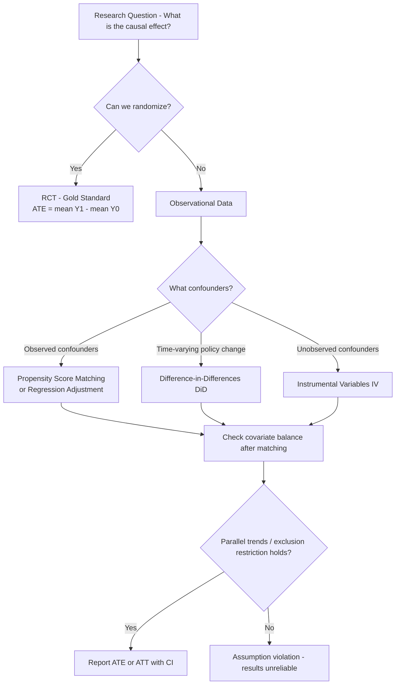

# Causal Inference

## 1. Detailed Explanation

Causal inference is the branch of statistics concerned with answering "what would happen if we intervened?" rather than "what is correlated with what?" The distinction matters profoundly: a spam filter trained on correlation will learn that emails with the word "unsubscribe" are associated with spam, but removing "unsubscribe" from legitimate emails does not make them spam. Correlation describes data; causation describes mechanisms.

The Rubin Causal Model (potential outcomes framework) formalizes this: each unit i has potential outcomes Y_i(1) (outcome under treatment) and Y_i(0) (outcome under control). The individual causal effect is Y_i(1) - Y_i(0), but we can never observe both for the same unit -- this is the fundamental problem of causal inference. The Average Treatment Effect (ATE) = E[Y(1) - Y(0)] is estimable from experiments or, under assumptions, from observational data.

Randomized controlled trials (RCTs) are the gold standard: random assignment ensures treatment is independent of potential outcomes, so the observed difference in group means is an unbiased estimate of ATE. But RCTs are often impossible (ethical, logistical, or economic constraints). Observational methods bridge the gap under assumptions: propensity score matching balances treated and control groups on observed confounders; difference-in-differences (DiD) uses temporal and cross-group variation to isolate causal effects; instrumental variables (IV) use external sources of variation to identify effects when confounders are unobserved.

Understanding confounders, colliders, and mediators is essential. A confounder is a common cause of treatment and outcome -- controlling for it is required. A collider is a common effect of treatment and outcome -- controlling for it opens a spurious path and introduces bias. A mediator lies on the causal path -- controlling for it blocks the effect you want to measure.

## 2. Core Intuition

Causal inference is about answering a counterfactual question: "what would this user's revenue have been if we had NOT shown them the ad?" Since we can never go back in time, we construct a credible comparison group (control) that represents what would have happened. Every causal method is a different strategy for making that comparison group valid: RCT uses randomization, PSM uses covariate matching, DiD uses temporal self-control, and IV uses an external nudge.

## 3. How It Works

**Step-by-step for propensity score matching:**

1. **Estimate propensity scores** -- fit logistic regression of treatment T on observed covariates X: P(T=1|X).
2. **Match treated to controls** -- for each treated unit, find control with closest propensity score (nearest-neighbor, caliper, or kernel).
3. **Check balance** -- verify that matched groups have similar covariate distributions (standardized mean difference < 0.1 for all X).
4. **Estimate ATT** -- average Y(1) - Y(0) over matched pairs; Y(0) is the matched control's outcome.
5. **Sensitivity analysis** -- test how large an unobserved confounder would need to be to overturn the conclusion (Rosenbaum bounds).

## 4. Architecture / Trade-offs

### Causal Methods Comparison

| Method | Assumption Required | Handles Unobserved Confounders | Sample Requirement | Complexity |
|--------|--------------------|---------------------------------|-------------------|------------|
| RCT | Random assignment | Yes (by design) | Moderate | Low |
| Propensity Score Matching | No unobserved confounders | No | Large | Medium |
| Regression Adjustment | Linear functional form | No | Moderate | Low |
| Difference-in-Differences | Parallel trends | Partially (time-invariant) | Two periods, two groups | Medium |
| Instrumental Variables | Valid instrument | Yes (if instrument valid) | Large (weak IV problem) | High |
| Regression Discontinuity | Sharp cutoff | Local only | Moderate near cutoff | Medium |

### DAG Node Types and When to Control

| Node Type | Role | Should Control? | Consequence of Wrong Choice |
|-----------|------|-----------------|---------------------------|
| Confounder | Common cause of T and Y | Yes | Omitting creates bias |
| Mediator | On causal path T -> M -> Y | Only if mediating effect excluded | Blocks causal effect |
| Collider | Common effect of T and Y | No | Conditioning opens spurious path |
| Instrument | Affects T but not Y directly | Use to predict T, not include in outcome model | Treating as confounder wastes it |

### Bias vs Variance Trade-off in Matching

| Matching Strategy | Bias | Variance | Use When |
|-----------------|------|---------|---------|
| 1:1 nearest neighbor | Low | High (small matched sample) | Large control pool |
| 1:K (K=5) nearest neighbor | Moderate | Lower | Moderate control pool |
| Kernel matching | Low | Lowest | All controls contribute (weighted) |
| Exact matching on bins | Lowest | Highest (discards unmatched) | Few key discrete confounders |

## 5. Interview Q&A

**Q: A product team shows that users who receive push notifications have 30% higher retention. They want to send push notifications to all users. What causal question are they failing to ask?**
A: They are measuring a correlation between notification receipt and retention, not the causal effect of sending notifications. Users who engage with push notifications are likely already highly engaged -- that engagement causes both notification interaction and retention. The causal question is: "what is the retention rate for a randomly selected user who would not otherwise receive a notification, if we send them one?" Fix: run an A/B test randomizing notification receipt, or use propensity score matching on user engagement covariates.

**Q: Explain Simpson's Paradox and give an example where it could mislead a data science team.**
A: Simpson's Paradox occurs when an aggregate trend reverses when data is stratified by a third variable. Classic example: overall, treatment A has higher survival rate than treatment B. But when stratified by disease severity, B is better for both mild and severe cases. The aggregate is misleading because B is disproportionately used for mild cases (a confounder). In data science: overall, ads shown to users in market X have lower CVR than market Y -- but within each product category, market X is always higher. Market mix confounds the aggregate.

**Q: When does propensity score matching fail, and how would you detect the failure?**
A: PSM fails when there are unobserved confounders -- variables that affect both treatment assignment and outcome but are not in your dataset. No statistical test can detect this directly. Indirect checks: (1) run a sensitivity analysis (Rosenbaum bounds) to quantify how large an unobserved confounder would need to be to overturn the conclusion; (2) look for proxy variables for likely unobserved confounders and test covariate balance on them; (3) if you have a validation RCT on a subsample, compare PSM estimate to RCT estimate.

**Q: What is the parallel trends assumption in DiD, and how do you test it?**
A: Parallel trends assumes that in the absence of treatment, the treated group would have followed the same time trend as the control group. You cannot directly test this (the counterfactual is unobserved), but you can test pre-treatment parallel trends: plot the outcome over time for both groups in the periods before treatment -- if trends are parallel pre-treatment, parallel trends post-treatment is more credible. Falsification: if you fake the treatment date to a pre-treatment period, you should find no effect.

**Q: Why is conditioning on a collider dangerous, and what real-world scenario creates this problem?**
A: Conditioning on a collider (a variable caused by both treatment and outcome) opens a spurious non-causal association. Example: in a study of whether exercise causes weight loss, if you condition on "enrolled in a wellness program" (caused by both having health awareness and wanting weight loss), you introduce a collider bias. In ML: if you train a model on accepted loan applications and use it to predict default, conditioning on "approved" (caused by creditworthiness and approval threshold) biases the estimates for the rejected population.

**Q: What makes a valid instrumental variable, and give an example?**
A: A valid instrument Z must satisfy three conditions: (1) relevance: Z is correlated with treatment T; (2) exclusion restriction: Z affects outcome Y only through T, not directly; (3) independence: Z is independent of unobserved confounders. Example: geographic distance to a college as an instrument for education (affects education enrollment; does not directly affect wages except through education; independent of individual ability in most cases). Invalid: using proximity to an economically thriving city -- it affects wages directly, violating exclusion restriction.

**Q: Your DiD estimate shows a treatment effect of +$50 revenue per user. How would you validate this finding?**
A: Multiple validation checks: (1) pre-treatment placebo test -- apply DiD to a period before treatment; should find zero effect; (2) falsification test -- test on a metric that should not be affected by the treatment; (3) subsetting -- the effect should be larger in subgroups more exposed to the treatment (heterogeneous effects in the right direction); (4) sensitivity to control group choice -- if a different control group gives very different estimates, investigate why; (5) compare to any available experimental estimate.

## 6. Best Practices

- **Draw the DAG before choosing a method** -- explicitly identify confounders, mediators, and colliders in your domain. The wrong set of control variables produces biased estimates regardless of sample size.
- **Always check covariate balance after matching** -- standardized mean difference (SMD) < 0.1 for all covariates is the standard; plot love plots to visualize.
- **Use overlap (common support) check** -- propensity scores of treated and controls should overlap substantially. Extrapolation outside the overlapping region is unreliable.
- **Pre-register your estimand** -- ATE (all units), ATT (treated units only), or LATE (local average for compliers in IV)? Each answers a different question and requires different assumptions.
- **Conduct sensitivity analysis** -- always quantify how robust the conclusion is to unobserved confounding. Rosenbaum bounds for PSM, placebo tests for DiD.
- **Use regression adjustment alongside matching** -- "doubly robust" estimators (matching + regression on residuals) remain consistent if either the propensity model or outcome model is correctly specified.

## 7. Common Pitfalls

- **Treating correlation as causation in model features** -- a model that includes "number of support tickets" as a feature for churn prediction may learn that resolving tickets (which causes tickets) helps retention, leading to wrong interventions. Fix: build causal models of feature relationships before using them in production decision systems.

- **Controlling for mediators** -- including a mediator as a covariate in a regression blocks the path you are trying to measure. If exercise reduces weight through metabolism (mediator), including metabolic rate in the regression gives the direct effect only, not the total effect. Fix: use structural equation models or front-door criterion if you want to separate direct and indirect effects.

- **Ignoring common support violation** -- PSM extrapolates to treated units with propensity scores outside the range of the control group. Fix: restrict analysis to the region of common support; report the restricted ATE with honest labeling.

- **Weak instrument bias in IV** -- an instrument with low F-statistic (< 10 rule of thumb) amplifies bias rather than removing it. Fix: test instrument strength with first-stage F-statistic; use limited information maximum likelihood (LIML) instead of 2SLS for weak instruments.

## 8. Related Concepts

- [03-hypothesis-testing](./05-hypothesis-testing.md) — significance testing framework used in causal analysis
- [08-ab-testing-statistics](./08-ab-testing-statistics.md) — RCT as the gold standard for causal identification
- [05-regression-analysis](./15-statistical-ml-connections.md) — regression adjustment for observed confounders
- [10-information-theory](./10-information-theory.md) — mutual information as a measure of statistical dependence
