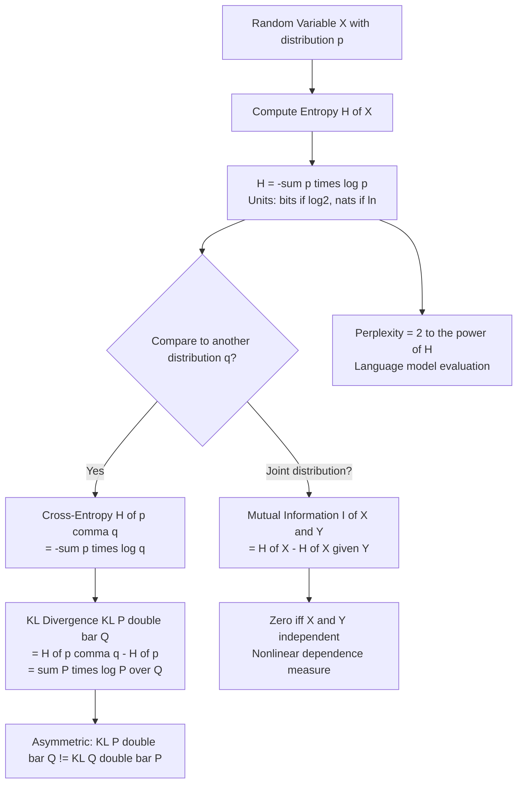

# Information Theory

## 1. Detailed Explanation

Information theory, founded by Claude Shannon in 1948, provides a mathematical framework for quantifying uncertainty, information, and the cost of communication. In machine learning, it underpins the most fundamental operations: cross-entropy is the loss function for classification, KL divergence measures distribution mismatch in variational autoencoders and knowledge distillation, mutual information drives feature selection, and perplexity benchmarks language models.

Entropy H(X) = -sum_x p(x) log p(x) measures the average surprise or unpredictability of a random variable. A fair coin has entropy of 1 bit (maximum uncertainty); a biased coin that always lands heads has entropy of 0 (no uncertainty). Entropy is maximized by the uniform distribution and minimized by degenerate distributions.

Cross-entropy H(p,q) = -sum_x p(x) log q(x) measures the average bits needed to encode events from true distribution p using a code designed for distribution q. When a neural network minimizes cross-entropy loss, it is finding parameters that make the model distribution q as close as possible to the true label distribution p.

KL divergence KL(P||Q) = sum_x P(x) log(P(x)/Q(x)) measures how much information is lost when Q is used to approximate P. It is asymmetric: KL(P||Q) != KL(Q||P). Forward KL (fitting Q to P) is mean-seeking; reverse KL (fitting P to Q) is mode-seeking. This asymmetry matters in knowledge distillation and RL fine-tuning.

Mutual information I(X;Y) = H(X) - H(X|Y) = H(Y) - H(Y|X) measures how much knowing Y reduces uncertainty about X. It is zero iff X and Y are independent, making it a powerful nonlinear dependence measure for feature selection.

## 2. Core Intuition

Entropy is the average number of yes/no questions you need to ask to identify the outcome of a random variable -- a uniform distribution over 8 outcomes needs exactly 3 bits (log2(8)). Cross-entropy is how many questions you need when your codebook is wrong (built for distribution q instead of true distribution p) -- the extra questions are wasted on wrong assumptions. KL divergence is precisely that waste: the gap between cross-entropy and entropy. Mutual information is how many questions about X you can skip by first learning Y.

## 3. How It Works

**Step-by-step for cross-entropy in neural network training:**

1. **Forward pass** -- model outputs logits; softmax gives predicted probabilities q(y|x).
2. **Compute cross-entropy** -- H(p,q) = -sum_k p_k * log q_k where p is one-hot true label.
3. **Gradient** -- d H/d logit_k = q_k - p_k (softmax output minus one-hot label); this is why softmax + cross-entropy has such clean gradients.
4. **Minimize** -- gradient descent drives q toward p, reducing cross-entropy toward the true entropy H(p).
5. **At optimum** -- if model perfectly fits data, H(p,q) = H(p) = 0 for deterministic labels.

## 4. Architecture / Trade-offs

### Information Measures Comparison

| Measure | Formula | Range | Symmetric? | Use Case |
|---------|---------|-------|-----------|----------|
| Entropy H(X) | -sum p log p | [0, log K] | N/A | Measure uncertainty |
| Joint Entropy H(X,Y) | -sum p(x,y) log p(x,y) | [max(H(X),H(Y)), H(X)+H(Y)] | Yes | Combine uncertainty |
| Conditional Entropy H(X|Y) | H(X,Y) - H(Y) | [0, H(X)] | No | Remaining uncertainty |
| Cross-Entropy H(p,q) | -sum p log q | [H(p), infinity) | No | Classification loss |
| KL Divergence KL(P||Q) | sum P log P/Q | [0, infinity) | No | Distribution mismatch |
| Mutual Information I(X;Y) | H(X) - H(X|Y) | [0, min(H(X),H(Y))] | Yes | Feature selection, dependence |

### KL Divergence Asymmetry: Forward vs Reverse

| Property | Forward KL: fit Q to minimize KL(P||Q) | Reverse KL: fit Q to minimize KL(Q||P) |
|---------|----------------------------------------|----------------------------------------|
| Behavior | Mean-seeking (Q covers all modes of P) | Mode-seeking (Q concentrates on one mode) |
| Underfitting | Zero-forcing: Q(x)=0 where P(x)>0 possible | Zero-forcing: Q(x)=0 where P(x)=0 enforced |
| Use in ML | VAE encoder (ELBO maximization) | RL RLHF KL penalty term |
| Language model | MLE training (cross-entropy = forward KL) | PPO KL regularization toward reference model |

### Perplexity Interpretation

| Perplexity | Interpretation | Model Quality |
|-----------|---------------|--------------|
| ~10-50 | Similar to trigram model | Baseline |
| ~50-200 | Decent statistical LM | Competitive |
| ~200-1000 | Weak / random ordering | Poor |
| Near K (vocabulary size) | Random guessing | Worst case |

## 5. Interview Q&A

**Q: Why do neural network classifiers minimize cross-entropy loss rather than accuracy?**
A: Accuracy is not differentiable -- a small change in weights that does not change the predicted class gives zero gradient. Cross-entropy is smooth and differentiable everywhere, providing useful gradient signal even when the correct class is already the argmax. Additionally, minimizing cross-entropy is equivalent to maximizing log-likelihood under the model distribution, which is the principled statistical objective.

**Q: What is the relationship between cross-entropy loss and KL divergence in classification?**
A: H(p,q) = H(p) + KL(P||Q). When minimizing cross-entropy over model parameters theta, H(p) is constant (it depends only on the true labels), so minimizing H(p,q) is equivalent to minimizing KL(P_data||Q_theta). Training a classifier is literally minimizing the KL divergence between the empirical data distribution and the model distribution.

**Q: You are compressing a knowledge distillation loss. Why does the choice of KL(teacher||student) vs KL(student||teacher) matter?**
A: KL(teacher||student) is forward KL -- it penalizes the student heavily when the teacher assigns high probability but the student assigns low probability. This forces the student to cover all teacher modes, producing a "spread out" student that does not miss any teacher behavior. KL(student||teacher) is reverse KL -- it forces the student to avoid placing probability where the teacher does not, producing a mode-seeking student that concentrates on the teacher's dominant modes. Most distillation work uses forward KL (or equivalently cross-entropy with teacher soft labels) because covering all teacher knowledge is preferred over missing behaviors.

**Q: How does mutual information-based feature selection differ from correlation-based selection?**
A: Correlation only captures linear relationships: two features with correlation 0 can still have strong nonlinear dependence (e.g., X and X^2 have zero linear correlation). Mutual information I(X;Y) = 0 iff X and Y are strictly independent -- it detects any statistical dependence, linear or nonlinear. In practice, MI-based selection (sklearn's mutual_info_classif) is more powerful for detecting non-monotone relationships (e.g., quadratic, threshold effects) but more expensive to compute reliably in high dimensions.

**Q: A language model has perplexity 50 on test data. What does this mean intuitively?**
A: The model is, on average, as uncertain as if it were choosing uniformly among 50 equally likely tokens at each step. Lower perplexity means more confident and accurate predictions. Perplexity 50 corresponds to average cross-entropy H = log2(50) ≈ 5.6 bits per token. The baseline for English vocabulary of 50K tokens with uniform distribution would be perplexity 50,000 -- so perplexity 50 indicates the model has learned massive amounts of structure.

**Q: What happens to entropy when you increase temperature T in a softmax? Why does this matter for sampling from LLMs?**
A: Temperature T scales logits before softmax: softmax(logits/T). As T increases above 1, the distribution flattens (higher entropy, more random samples). As T decreases below 1, the distribution sharpens (lower entropy, more deterministic). At T=0, softmax becomes argmax (entropy=0). For LLM sampling: T=1 is standard sampling from the model distribution; T<1 produces more coherent but repetitive text; T>1 produces more diverse but less coherent text. Temperature is a direct dial on the entropy of the output distribution.

**Q: Why is KL divergence not a metric (distance) in the mathematical sense?**
A: A metric requires symmetry (d(P,Q)=d(Q,P)) and triangle inequality. KL divergence violates both: KL(P||Q) != KL(Q||P) in general, and there exist distributions where the triangle inequality fails. Jensen-Shannon divergence JS(P,Q) = 0.5*KL(P||M) + 0.5*KL(Q||M) where M=(P+Q)/2 is symmetric, bounded in [0,1], and its square root is a proper metric. JS is used in GANs (originally) and where symmetry matters.

## 6. Best Practices

- **Use natural log (nats) for KL divergence in optimization** -- log2 (bits) is for communication/perplexity. Mixing units creates scale mismatches with other loss components.
- **Clip probabilities when computing KL** -- add epsilon=1e-10 to avoid log(0); use np.clip(q, 1e-10, 1) rather than checking q > 0 pointwise for performance.
- **Normalize distributions before computing MI** -- joint probability table must sum to 1 exactly; floating point errors can cause MI to be slightly negative; clip to zero.
- **For feature selection, use sklearn.feature_selection.mutual_info_classif** -- it applies k-nearest neighbor entropy estimation, which is more accurate than binning for continuous features.
- **Temperature-scale teacher logits in distillation** -- H(teacher_soft_T, student_soft_T) with T=3-5 is standard; higher temperature reveals soft probability structure in teacher's off-peak predictions.
- **Perplexity is base-sensitive** -- always specify log base (2 or e). GPT-3 paper uses natural log; compare perplexities only when computed with the same base.
- **Mutual information is non-negative** -- if your estimate is negative, it indicates undersampling or numerical error. Use larger samples or better entropy estimators.

## 7. Common Pitfalls

- **Confusing cross-entropy with KL divergence** -- cross-entropy H(p,q) includes the entropy H(p) of the true distribution. When minimizing over model parameters, they are equivalent (H(p) is constant). But their absolute values differ: H(p,q) >= H(p) always, and the gap is KL(P||Q).

- **Assuming KL divergence is symmetric** -- code that computes KL(P||Q) and assumes it equals KL(Q||P) will produce wrong results. Fix: always be explicit about direction; in RLHF, the KL penalty is usually KL(policy||reference), not the reverse.

- **Using mutual_info_classif for already-discretized binary features** -- the sklearn implementation uses k-NN estimation designed for continuous variables; for categorical/binary features, use mutual_info on the contingency table directly.

- **Perplexity comparison across different tokenizations** -- a BPE tokenizer with 32K vocab and a character tokenizer give incomparable perplexities. Fix: compare bits-per-character (BPC) instead, normalizing by the number of characters in the tokenization.

- **Log(0) in entropy computations** -- when p=0, p*log(p) should be 0 (by convention: 0*log(0)=0 in information theory). Failing to filter out zero-probability events produces NaN. Fix: use `p = p[p > 0]` before computing entropy.

## 8. Related Concepts

- [02-probability-distributions](./02-probability-distributions.md) — probability distributions are inputs to all information measures
- [03-hypothesis-testing](./03-hypothesis-testing.md) — likelihood ratio tests and KL connection
- [04-bayesian-statistics](./04-bayesian-statistics.md) — KL divergence as the variational inference objective
- [09-causal-inference](./09-causal-inference.md) — mutual information as statistical dependence, relevant to DAG structure learning
