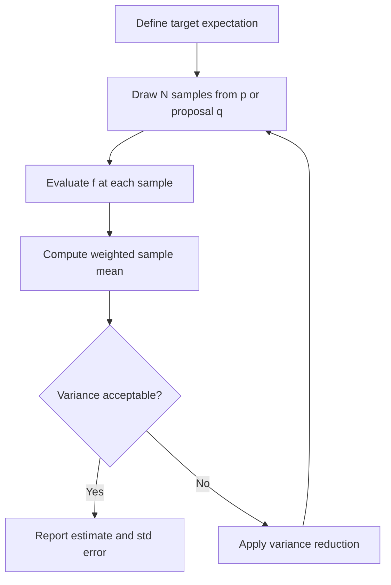

# Monte Carlo Sampling

## Detailed Explanation

Monte Carlo (MC) sampling is a family of techniques that use random sampling to estimate quantities that are analytically intractable. The core idea is to approximate an expectation E[f(X)] by drawing N independent samples x_1, ..., x_N from the distribution p(x) and computing the sample mean: E[f(X)] ≈ (1/N) Σ f(x_i). By the Law of Large Numbers this converges to the true expectation as N → ∞, and by the Central Limit Theorem the estimator error decreases as 1/√N regardless of the dimensionality of the problem — a critical advantage over quadrature methods, which suffer the curse of dimensionality.

Monte Carlo underpins much of modern machine learning and statistics: Bayesian inference uses MC to approximate posterior distributions, reinforcement learning uses policy-gradient estimators, generative modeling uses MC to evaluate likelihoods, and quantitative finance uses MC to price derivatives. The main limitation is slow convergence (O(1/√N)), which motivates variance reduction strategies — importance sampling, control variates, antithetic variates, and quasi-Monte Carlo — that achieve the same accuracy with fewer samples.

Understanding when naive MC fails and which variance reduction technique to reach for is the central practical question. Importance sampling addresses rare-event estimation (e.g., tail probabilities) by reweighting samples from a proposal distribution. Control variates exploit a correlated quantity with a known expectation to reduce noise. Antithetic variates exploit negative correlation between paired samples. In production ML systems these techniques translate directly to more efficient gradient estimators and tighter uncertainty quantification.

## Core Intuition

Rolling many dice to estimate π is slow because most samples give noisy information — importance sampling is like loading the dice so they land where the function varies most, getting the same accuracy with far fewer throws. Every variance reduction technique is a way to extract more signal from each sample by exploiting structure you already know about the problem.

## How It Works

1. **Define the target quantity** as an expectation: E[f(X)] where X ~ p(x). For integration, set f(x) = g(x)/p(x) if g is the integrand.
2. **Draw N independent samples** x_1, ..., x_N from p(x) using a pseudo-random number generator.
3. **Evaluate f at each sample** to get f(x_1), ..., f(x_N). Compute the sample mean μ̂ = (1/N) Σ f(x_i).
4. **Quantify uncertainty**: Var[μ̂] = Var[f(X)]/N. Std error = σ_f / √N. Error halves when N quadruples.
5. **Apply variance reduction if needed**: switch proposal q(x) ≠ p(x) for importance sampling; add a control variate with known mean; pair samples x_i with antithetic −x_i.
6. **Check convergence**: plot running estimate vs N; confirm error decays as 1/√N on a log-log plot.

## Architecture / Trade-offs

### Estimator Comparison

| Method | Bias | Variance | Samples for 1% accuracy | Complexity |
|--------|------|----------|--------------------------|------------|
| Naive MC | Zero | Var[f]/N | ~10,000 | Low |
| Importance Sampling | Zero (correct weights) | Can be much lower | 100-500 for tail probs | Medium |
| Antithetic Variates | Zero | Reduced by correlation | 5,000-7,000 | Low |
| Control Variates | Zero | Reduced by R^2 | 1,000-5,000 | Medium |
| Quasi-MC (Sobol) | Asymptotically zero | O(log(N)^d/N) | ~1,000 | Medium |

### Variance Reduction Trade-offs

| Technique | When to use | What you need | Risk |
|-----------|-------------|---------------|------|
| Importance Sampling | Tail probabilities, rare events | Good proposal q(x) | IS weights blow up if q too narrow |
| Control Variates | Correlated quantity with known mean exists | Analytic baseline | Correlation estimate needed |
| Antithetic Variates | Symmetric distributions, monotone f | Negatively correlated pairs | Loses independence; invalid for some statistics |
| Stratified Sampling | Known partition of domain | Domain knowledge | Partitioning choice matters |

## Interview Q&A

**Q: Why does MC error scale as 1/√N rather than 1/N, and what does this mean for practical use?**
A: The variance of the sample mean is Var[f(X)]/N, so the standard deviation (error) scales as 1/√N. This means to halve your error you need 4x more samples, and to cut it by 10x you need 100x more samples. In practice this means naive MC is fine for moderate accuracy requirements (1-5%) but becomes very expensive for high accuracy (0.1%), where variance reduction or analytical tricks are necessary.

**Q: When would importance sampling fail and make things worse rather than better?**
A: IS fails when the proposal q(x) assigns low probability to regions where the target p(x)f(x) is large — this creates a few samples with astronomically large weights and tiny coverage elsewhere. You would see high variance IS weights (weight variance >> weight mean) and the estimate would be dominated by one or two samples. Diagnose with the effective sample size ESS = (Σw_i)^2 / Σw_i^2; if ESS << N you have a bad proposal.

**Q: How would you estimate P(X > 4) for X ~ N(0,1) with standard MC and why is it inefficient?**
A: Naive MC draws N samples from N(0,1) and counts those exceeding 4: P̂ = #{x_i > 4}/N. But P(X > 4) ≈ 3.2e-5, so you need roughly N >> 1/3.2e-5 ≈ 31,000 samples to see even one event, and thousands of times more for a stable estimate. Importance sampling centered near 4 (e.g., proposal N(4,1)) gets the same accuracy with 200-500 samples by focusing draws in the rare region.

**Q: What is the connection between MC estimation and gradient estimators in deep learning?**
A: Policy gradient (REINFORCE) is a MC estimator of ∇E[R]. The log-derivative trick gives ∇E[R] = E[R · ∇log p(a|s)], which is approximated by sampling trajectories. The same variance problem applies: MC gradient estimators have high variance, which is why baselines (control variates) and importance sampling are used in PPO, A2C, and other algorithms.

**Q: When would you use quasi-Monte Carlo instead of standard MC?**
A: Use quasi-MC (Sobol, Halton sequences) when the integrand is smooth and the dimensionality d is moderate (d < 20 or so). Quasi-MC fills space more uniformly than pseudo-random samples, giving O((log N)^d / N) error vs O(1/√N) for standard MC. Beyond d ≈ 20-30 the log factor dominates and quasi-MC loses its advantage. Standard MC remains preferable for high-dimensional integration.

**Q: Your MC estimate has high variance even with N=100,000 samples. What do you check first?**
A: Check whether f(x) has heavy tails or occasional extreme values — look at the distribution of f(x_i) across your samples. If a small fraction of samples (say 1%) account for >50% of the sum, you have a heavy-tailed integrand and need importance sampling. Also check that your samples are genuinely i.i.d.: if using MCMC, check for autocorrelation which inflates effective variance.

## Best Practices

- Always compute the standard error (σ_f / √N) alongside your MC estimate; an estimate without error bars is useless for decision-making.
- Use N=1,000 as a quick sanity check, then scale to N=10,000-100,000 for production estimates; plot the running mean to visually confirm convergence.
- Check importance sampling weights: compute ESS = (Σw_i)^2 / Σw_i^2; if ESS/N < 0.1 your proposal is poorly matched and IS will give unreliable results.
- For option pricing or finance simulations, use antithetic variates by default — they cost nothing extra and typically halve variance for smooth payoffs.
- Seed your random number generator (np.random.seed(42)) for reproducibility; use separate seeds for different experimental runs so results can be independently verified.
- When estimating tail probabilities below 1e-4, always use importance sampling or other rare-event methods — naive MC at those levels requires millions of samples.
- Log the convergence rate (error vs N on log-log scale); slope should be ≈ -0.5 for standard MC. Deviations signal dependency or heavy tails.

## Common Pitfalls

- **Forgetting to divide by the proposal density**: In importance sampling, the estimator is (1/N) Σ f(x_i) p(x_i)/q(x_i). Omitting the p/q weight gives a biased estimate that looks plausible but is systematically wrong.
  → Fix: Always write w_i = p(x_i)/q(x_i) explicitly and verify weights sum to N (or normalize them to 1).

- **Using too small an N and stopping at a "good-looking" value**: With random noise, estimates fluctuate and you can always find a lucky N where the estimate looks correct. This is selection bias.
  → Fix: Use a fixed, pre-specified N chosen from the expected variance, or use sequential stopping rules with multiple testing correction.

- **Correlated samples inflating effective sample size**: If samples are drawn sequentially from a chain (MCMC) rather than i.i.d., the effective N is much less than the nominal N. Treating N=10,000 MCMC steps as 10,000 independent samples underestimates variance.
  → Fix: Compute the integrated autocorrelation time τ and use ESS = N/(2τ+1) as your true effective sample size.

- **Heavy-tailed f causing unstable estimates**: When f(x) has infinite variance (e.g., for certain posteriors), the 1/√N convergence guarantee breaks down and estimates can remain highly variable even with large N.
  → Fix: Detect via kurtosis of f(x_i) values; if kurtosis > 10, suspect heavy tails and switch to robust estimators or importance sampling.

## Related Concepts

- [12-markov-chains-mcmc.md](./12-markov-chains-mcmc.md) — MCMC uses Markov chains to draw correlated samples from complex distributions where i.i.d. sampling is impossible
- [08-bayesian-inference.md](./08-bayesian-inference.md) — Bayesian posteriors are the primary use case for MC sampling in statistics
- [03-probability-distributions.md](./03-probability-distributions.md) — Understanding the proposal distribution for importance sampling requires distributional knowledge
- [15-statistical-ml-connections.md](./15-statistical-ml-connections.md) — MC gradient estimators connect to policy gradient and variational inference in ML
