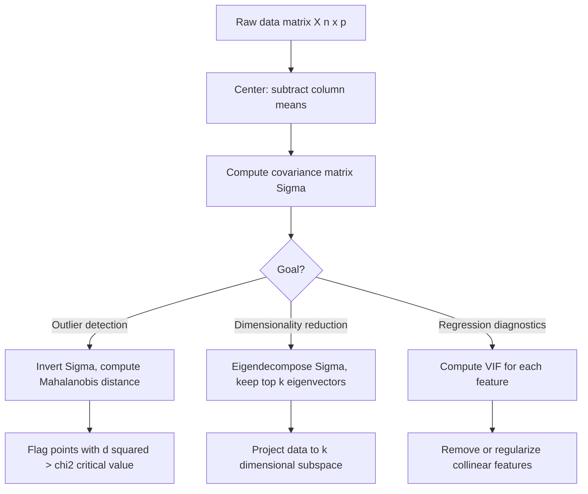

# Multivariate Statistics

## Detailed Explanation

Multivariate statistics extends classical univariate methods to deal with multiple variables simultaneously, preserving and exploiting the correlational structure between them. The multivariate Gaussian N(μ, Σ) is the central distribution: μ is the mean vector and Σ is the covariance matrix, whose (i,j) entry is Cov(X_i, X_j). The covariance matrix encodes both individual variances on the diagonal and linear relationships between features off-diagonal. In contrast to using multiple separate univariate analyses, the multivariate framework correctly accounts for the joint behavior of all variables, avoiding false discoveries from ignoring correlations.

The Mahalanobis distance d² = (x - μ)ᵀ Σ⁻¹ (x - μ) is a multivariate distance metric that generalizes z-scores to multiple dimensions. Unlike Euclidean distance, it accounts for the scale and correlation of each variable, making it the standard tool for multivariate outlier detection and anomaly detection. A point with Mahalanobis distance exceeding the chi-squared critical value at d degrees of freedom is flagged as an outlier.

Principal Component Analysis (PCA) is the canonical technique for dimensionality reduction: it finds the orthogonal directions (principal components) in which the data varies the most, corresponding to the eigenvectors of the covariance (or correlation) matrix ordered by descending eigenvalue. Multicollinearity — high correlation between predictor variables — is a pervasive problem in regression, inflating coefficient variance and making individual coefficients unreliable. The Variance Inflation Factor (VIF) quantifies multicollinearity: VIF_j = 1/(1-R²_j) where R²_j is the R-squared from regressing feature j on all other features. VIF > 10 signals severe collinearity.

## Core Intuition

Standard Euclidean distance treats all directions equally, but real data has preferred axes of variation — PCA finds those axes. Mahalanobis distance is Euclidean distance after stretching and rotating the space to make the data spherical, so a point that looks close in raw space but lies far along a low-variance axis is correctly recognized as unusual.

## How It Works

1. **Compute the sample mean vector** μ̂ = (1/n) Σ x_i and center the data: X_c = X - μ̂.
2. **Estimate the covariance matrix** Σ̂ = (1/(n-1)) X_c^T X_c. Verify it is positive semi-definite (all eigenvalues ≥ 0).
3. **For Mahalanobis distance**: invert Σ̂ (or use Cholesky decomposition for numerical stability); compute d²_i = (x_i - μ̂)ᵀ Σ̂⁻¹ (x_i - μ̂). Under normality, d² ~ χ²(p) where p is dimensionality.
4. **For PCA**: compute eigendecomposition Σ̂ = V Λ Vᵀ, or equivalently SVD of centered X. Sort eigenvectors by descending eigenvalue; compute explained variance ratio = λ_k / Σ λ_i.
5. **Project the data**: Z = X_c V_k where V_k contains the top-k eigenvectors (principal components).
6. **Check for multicollinearity**: compute pairwise correlations and VIF for regression applications; remove or combine highly collinear features (VIF > 10) before fitting models.

## Architecture / Trade-offs

### Distance Metrics for Outlier Detection

| Distance | Formula | Accounts for correlation | Scale invariant | Best for |
|----------|---------|--------------------------|-----------------|----------|
| Euclidean | sqrt(sum (x_i - mu_i)^2) | No | No | Spherical, equal-variance data |
| Standardized Euclidean | sqrt(sum ((x_i-mu_i)/sigma_i)^2) | No | Yes | Uncorrelated features of different scales |
| Mahalanobis | sqrt((x-mu)^T Sigma^-1 (x-mu)) | Yes | Yes | Correlated, unequal-variance features |
| Cosine | 1 - (x.y)/(||x||*||y||) | Implicit | Yes (direction only) | High-dim text, sparse vectors |

### Dimensionality Reduction Comparison

| Method | Captures | Interpretable | Preserves | When to use |
|--------|----------|---------------|-----------|-------------|
| PCA | Linear variance | Yes (loadings) | Global structure, distances | Preprocessing, noise reduction, VIF fix |
| t-SNE | Local structure | No | Local neighborhoods | Visualization (2-3D only) |
| UMAP | Local + global | Partial | Topology | Visualization + some downstream use |
| LDA | Class separability | Yes | Class boundaries | Supervised dimensionality reduction |

## Interview Q&A

**Q: When would you use Mahalanobis distance instead of Euclidean distance for anomaly detection?**
A: Use Mahalanobis whenever features have different scales or are correlated. For example, if you have CPU usage (0-100%) and memory usage (0-100 GB), a point at (90%, 5 GB) might look close in Euclidean space to (85%, 5 GB) but be a genuine outlier in the multivariate sense if those two metrics are highly correlated in normal operation. Mahalanobis correctly accounts for the joint distribution; Euclidean would flag many normal points that happen to lie along low-variance directions.

**Q: You run PCA and the first 2 PCs explain 40% of variance. Is this a problem?**
A: It depends on the goal. For visualization (2D embedding) it is often acceptable if you explicitly communicate the remaining 60% is unexplained. For dimensionality reduction before a downstream model, it likely means your data does not have a dominant low-dimensional structure — consider keeping 95% explained variance (usually requiring many more PCs). Run a scree plot to see where the elbow is. Also check whether standardization changes the explained variance — if features are on very different scales, the covariance matrix is dominated by high-variance features and PCA on the correlation matrix (standardized) is more meaningful.

**Q: What does a VIF of 25 tell you, and what would you do about it?**
A: VIF_j = 25 means that regressing feature j on all other features gives R² = 1 - 1/25 = 0.96, so 96% of the variance in feature j is explained by other features. This causes severe coefficient instability: small changes in the data can flip the sign of coefficients, and standard errors are inflated by a factor of sqrt(25) = 5. Remedies: (1) drop one of the highly correlated features; (2) combine them into a composite (average, or first PC of the collinear group); (3) use Ridge regression which handles multicollinearity by adding L2 regularization.

**Q: PCA assumes linear structure. When would you want a nonlinear alternative?**
A: When the true low-dimensional structure is curved (e.g., a Swiss roll, faces changing pose, time series with cyclical patterns). In those cases PCA will mix dimensions that correspond to different semantic variations. Kernel PCA uses a nonlinear feature map implicitly via the kernel trick, UMAP uses manifold learning, and autoencoders learn a nonlinear encoder. For ML preprocessing, if PCA retains poor class separability on the reduced space, try nonlinear methods, but note they are harder to interpret and more prone to overfitting.

**Q: How would you handle the case where n < p (more features than samples) for Mahalanobis distance?**
A: When p > n, the sample covariance matrix Σ̂ is singular and cannot be inverted. Solutions: (1) use a regularized or shrinkage estimator (Ledoit-Wolf) which adds a multiple of the identity to ensure invertibility; (2) compute Mahalanobis distance in the PCA-reduced space (k << n components); (3) use the Moore-Penrose pseudoinverse. In high-dimensional settings (p >> n) Mahalanobis distance also becomes unstable due to estimation error in Σ̂ — robust covariance estimators (MCD) are preferred.

**Q: Your PCA projection makes downstream classifier accuracy drop. What do you investigate?**
A: First, check how much variance the retained components explain — if you kept only 50%, you may have discarded discriminative information. Second, check whether class labels were used to choose components — PCA is unsupervised and may keep components of high variance but low class separability. Third, ensure you fitted PCA on training data only and applied the same transform to test data; if PCA was fit on all data, you have data leakage. Fourth, consider LDA (supervised) instead of PCA if the goal is classification.

## Best Practices

- Always standardize features (zero mean, unit variance) before PCA unless all features are on the same scale; otherwise high-variance features dominate the first PC regardless of their signal content.
- For outlier detection, use robust covariance estimation (Minimum Covariance Determinant) rather than the sample covariance when outliers are expected — the sample covariance is itself contaminated by the outliers you are trying to detect.
- Choose the number of PCA components by the 95% explained variance rule for preprocessing, or by cross-validation when optimizing for a downstream task.
- Compute VIF before fitting any regression model; remove or combine features with VIF > 10 to get stable coefficient estimates.
- When p/n > 0.1, distrust the sample covariance matrix — use shrinkage (e.g., Ledoit-Wolf) for more accurate estimation of the covariance structure.
- For anomaly detection, calibrate your Mahalanobis threshold using chi-squared quantiles (chi2.ppf(0.975, df=p) for 97.5th percentile) rather than arbitrary cutoffs.
- Visualize the pairwise correlation matrix and scatter plots of features before fitting any multivariate model — structure that is obvious visually can reveal collinearity, clusters, or non-Gaussian behavior that invalidates model assumptions.

## Common Pitfalls

- **PCA fit on the full dataset including test**: Fitting PCA on all data before train-test split leaks information from the test set into the projection. The test set distribution is partially revealed to the model. Fix: fit PCA on training data only, then apply `.transform()` to test data using the training-set eigenvectors.

- **Inverting a near-singular covariance matrix**: When features are nearly collinear or n ≈ p, direct inversion of Σ̂ is numerically unstable and gives huge, erratic Mahalanobis distances. Fix: use `np.linalg.solve` or add a small regularization constant λI before inverting, or use the pseudoinverse.

- **Interpreting PC loadings as causal**: High loading of a feature on PC1 means it contributes to explaining variance, not that it is causally important. Two correlated features may both have high loadings on PC1. Fix: use domain knowledge alongside loadings; PCA is a description of variance structure, not causation.

- **Using VIF without standardization**: VIF is scale-invariant in principle but implementation details vary. Always standardize before computing VIF to ensure consistent interpretation across packages.

## Related Concepts

- [13-multivariate-statistics.md](./13-multivariate-statistics.md) — This file
- [07-regression-analysis.md](./15-statistical-ml-connections.md) — Multicollinearity directly affects regression stability; VIF is the diagnostic
- [11-monte-carlo-sampling.md](./11-monte-carlo-sampling.md) — Sampling from multivariate Gaussians uses Cholesky decomposition of the covariance matrix
- [15-statistical-ml-connections.md](./15-statistical-ml-connections.md) — PCA connects to SVD and latent factor models used throughout ML
