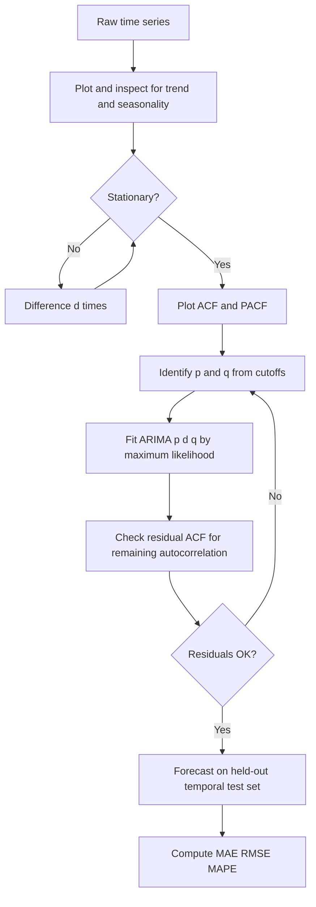

# Time Series Statistics

## Detailed Explanation

A time series is a sequence of observations indexed in time order: {x_1, x_2, ..., x_T}. Unlike cross-sectional data, observations are not exchangeable — the order matters and adjacent values are typically correlated. The most critical property for modeling is stationarity: a time series is (weakly) stationary if its mean, variance, and autocovariance structure do not change over time. Many classical methods (ARIMA, AR, MA) assume stationarity, so testing and achieving it is the first step in any time series analysis.

The autocorrelation function (ACF) measures the correlation between x_t and x_{t-k} at lag k. The partial ACF (PACF) measures the same correlation after removing the linear effect of all intermediate lags. ACF and PACF plots are the primary diagnostic tools for identifying the order of an ARIMA model: AR(p) processes have PACF that cuts off at lag p; MA(q) processes have ACF that cuts off at lag q.

ARIMA(p, d, q) unifies three components: AR(p) captures autoregression (x_t depends on its own past p values), I(d) handles non-stationarity via d rounds of differencing, and MA(q) models a moving average of past error terms. The Augmented Dickey-Fuller (ADF) test is the standard stationarity test: the null hypothesis is that the series has a unit root (non-stationary); a small p-value (< 0.05) rejects the null and supports stationarity. A key practical rule: never use k-fold cross-validation for time series because it shuffles time order, leaking future data into the past. Use rolling or expanding window cross-validation instead.

## Core Intuition

A stationary time series is like a river whose water level fluctuates around a stable mean — it wanders but does not drift away forever. A non-stationary series is like a drunk walking randomly: even one differencing (looking at step sizes rather than positions) often converts it back into a stable, mean-reverting process suitable for modeling.

## How It Works

1. **Visualize and check stationarity**: plot the series; compute rolling mean and rolling variance over windows of size ~n/5. If both are approximately constant, stationarity is plausible. Run an ADF test to formalize.
2. **Difference if non-stationary**: apply first-order differencing x'_t = x_t - x_{t-1} (d=1) and re-check. Seasonal series may need seasonal differencing x'_t = x_t - x_{t-s}.
3. **Inspect ACF and PACF** on the stationary series: sharp PACF cutoff at lag p → AR(p); sharp ACF cutoff at lag q → MA(q); gradual decay in both → ARMA(p,q).
4. **Fit the ARIMA(p,d,q) model** using maximum likelihood (or least squares for AR). Select p,q by minimizing AIC or BIC.
5. **Validate on a held-out temporal window**: always split at a fixed time boundary, with training data before and test data after. Compute MAE, RMSE, MAPE.
6. **Check residuals**: residuals should look like white noise (no autocorrelation). Plot ACF of residuals; if ACF is flat, the model has captured the systematic variation.

## Architecture / Trade-offs

### ARIMA Component Identification Guide

| Pattern in ACF/PACF | Suggested model | Notes |
|---------------------|-----------------|-------|
| PACF cuts off at p, ACF tails off | AR(p) | x_t = phi_1 x_{t-1} + ... + phi_p x_{t-p} + eps |
| ACF cuts off at q, PACF tails off | MA(q) | x_t = theta_1 eps_{t-1} + ... + theta_q eps_{t-q} + eps |
| Both ACF and PACF tail off | ARMA(p,q) | Combined model; use AIC to select p,q |
| Linear trend in series | d=1 differencing needed | First differences remove linear trend |
| Seasonal peaks in ACF | SARIMA(P,D,Q)s | Seasonal differencing at period s |

### Forecasting Methods Comparison

| Method | Handles trend | Handles seasonality | Parameters | Best for |
|--------|---------------|---------------------|------------|----------|
| Naive (last value) | No | No | 0 | Benchmark only |
| Moving Average | Partial | No | 1 (window) | Short-term smoothing |
| ARIMA | Yes (d>=1) | No | p,d,q | Short-term, stationary after differencing |
| SARIMA | Yes | Yes | 7 | Seasonal business data |
| Exponential Smoothing | Yes | Optional | 2-3 | Fast deployment, interpretable |
| Facebook Prophet | Yes | Yes | Many | Irregular seasonality, missing data |

## Interview Q&A

**Q: Why can you not use sklearn's KFold cross-validation for time series forecasting?**
A: KFold shuffles the data randomly, which means a fold can include training samples from the future and test samples from the past. This leaks future information into the model — the model sees what happens after the test point during training, giving artificially optimistic validation scores. Use rolling-origin (time series split): train on t=1..T_i, test on T_i+1..T_i+h, then expand or roll the window forward. Always maintain temporal ordering.

**Q: Your ADF test gives p=0.003 but the rolling mean is visibly trending upward. How do you reconcile this?**
A: A small ADF p-value rejects the unit root null but does not guarantee a trend-stationary process — the series could be trend-stationary (stationary around a deterministic trend) rather than difference-stationary. Plot rolling means over multiple window sizes; if trend is consistent, the ADF test might be picking up stationarity around a linear trend rather than true homogeneity. Apply both differencing and visual inspection; if differencing removes the trend and rolling statistics become stable, use d=1 in your ARIMA model.

**Q: When does high autocorrelation in a time series make standard confidence intervals incorrect?**
A: Standard regression CIs assume independent errors. Positively autocorrelated residuals (Durbin-Watson statistic < 1.5) mean the effective sample size is smaller than n, so standard errors are underestimated and CIs are too narrow. Fix with Newey-West standard errors (robust to autocorrelation and heteroscedasticity) or by explicitly modeling the autocorrelation structure in the residuals (ARIMA errors).

**Q: How do you choose between MAPE and RMSE for evaluating forecast accuracy?**
A: RMSE is in the same units as the series and penalizes large errors more heavily (squared). Use RMSE when large errors are disproportionately costly. MAPE is scale-free (percentage), easier to communicate to stakeholders, and allows comparison across series of different magnitudes. MAPE breaks down when true values are near zero (infinite percentage error) and is asymmetric (underprediction is penalized more than overprediction of the same magnitude). Use RMSE as the primary metric for model selection and MAPE for business reporting.

**Q: Your ARIMA residuals still show autocorrelation at seasonal lags (12, 24, 36). What does this mean?**
A: The ARIMA(p,d,q) model has not captured the seasonal pattern. You need to add seasonal components: fit SARIMA(p,d,q)(P,D,Q,s) where P,D,Q are the seasonal AR, differencing, and MA orders and s=12 for monthly data. First apply seasonal differencing (D=1): x'_t = x_t - x_{t-12} to remove seasonal non-stationarity, then check the ACF of the doubly-differenced series for remaining seasonal autocorrelation at multiples of 12.

## Best Practices

- Split time series at a fixed temporal boundary; never shuffle. Put the most recent 10-20% as the test set and validate using rolling origin cross-validation on the training portion.
- Always plot the series before testing: visible trends, seasonal cycles, structural breaks, and outliers suggest the appropriate preprocessing and model family before running any test.
- Use AIC or BIC for model selection across ARIMA orders; AIC favors predictive accuracy, BIC imposes a larger penalty on parameters and favors parsimony. For forecasting, AIC is preferred.
- Check residuals after fitting: plot ACF of residuals and run a Ljung-Box test (p > 0.05 means residuals are white noise and the model is adequate).
- Difference conservatively: over-differencing introduces unnecessary MA structure; d=1 suffices for most series with a linear trend.
- When statsmodels is unavailable, implement AR(1) manually: fit phi via OLS (regress x_t on x_{t-1}), forecast as x_{T+h} = phi^h * x_T; compute 95% PI using residual std and propagated variance.
- Use a naive baseline (last observed value, or seasonal naive for seasonal data) as a benchmark; a model that cannot beat the naive forecast is useless in practice.

## Common Pitfalls

- **Temporal data leakage via standard cross-validation**: Using KFold on time series data lets future observations influence model training. Fix: use sklearn's TimeSeriesSplit which maintains temporal order.

- **Differencing a stationary series**: Over-differencing makes the series non-invertible and introduces negative autocorrelation. Fix: run ADF before differencing; stop once the null is rejected (p < 0.05).

- **Fitting ARIMA order by inspecting ACF/PACF on the non-stationary series**: The ACF decays very slowly for unit-root processes and gives misleading order suggestions. Fix: always achieve stationarity (difference until ADF p < 0.05) before reading ACF/PACF.

- **Ignoring seasonality**: Fitting ARIMA without seasonal components to seasonal data leaves systematic patterns in residuals, hurts forecasts, and inflates error metrics. Fix: plot the series first; if seasonal peaks are visible, add seasonal differencing and SARIMA components.

- **Evaluating on a single test window**: One test period may be unusually easy or hard. Fix: use multiple rolling-origin evaluation windows and report the average forecast error.

## Related Concepts

- [06-hypothesis-testing.md](./06-hypothesis-testing.md) — ADF test is a hypothesis test for stationarity; understanding test statistics and p-values is essential
- [07-regression-analysis.md](./07-regression-analysis.md) — ARIMA models are generalizations of regression with structured error correlation
- [13-multivariate-statistics.md](./13-multivariate-statistics.md) — Multivariate time series (VAR models) extend AR to multiple correlated series
- [15-statistical-ml-connections.md](./15-statistical-ml-connections.md) — Time series forecasting connects to recurrent neural networks and sequence models in ML
