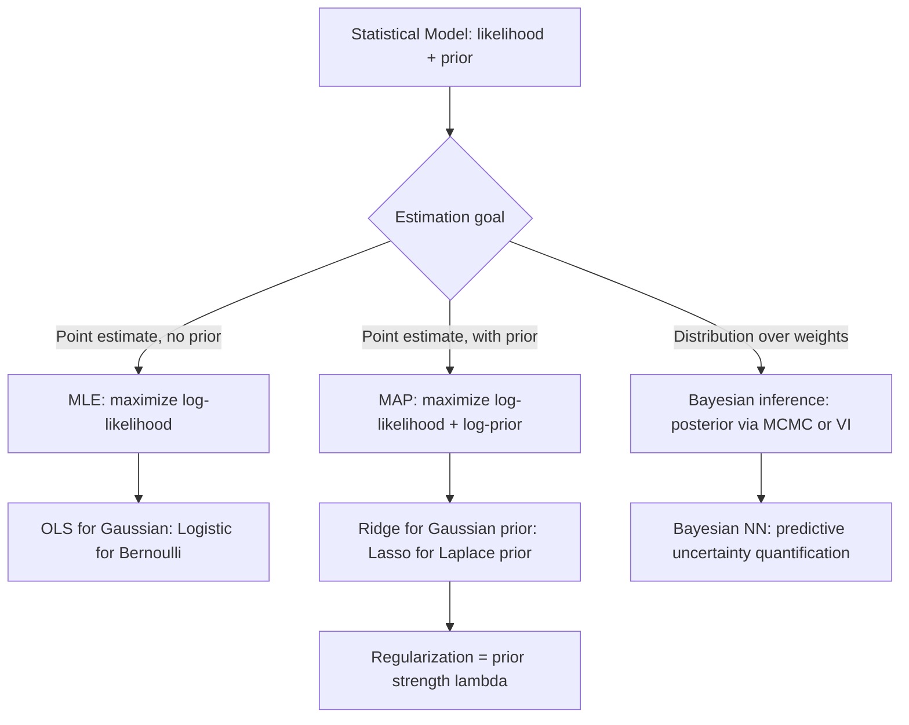

# Statistical-ML Connections

## Detailed Explanation

Many machine learning algorithms are statistical models viewed through the lens of optimization, and making this connection explicit yields deep insights about regularization, uncertainty, and model selection. Linear regression is maximum likelihood estimation (MLE) under the assumption that residuals are i.i.d. Gaussian: minimizing mean squared error is exactly equivalent to maximizing the log-likelihood of a Gaussian noise model. This equivalence is not cosmetic — it explains why MSE is the right loss for Gaussian data and why it can fail badly when noise is non-Gaussian (use MAE for Laplace noise, Huber loss for mixed noise).

Regularization has a Bayesian interpretation as placing a prior on weights. Ridge regression (L2 penalty) is MAP estimation under a Gaussian prior: adding λ||w||² to the loss is equivalent to believing weights are drawn from N(0, 1/λ). Lasso (L1 penalty) corresponds to a Laplace prior, which concentrates mass at zero, explaining why Lasso produces sparse solutions. This connects to the bias-variance tradeoff: a stronger prior (larger λ) shrinks weights more aggressively, reducing variance at the cost of bias.

Logistic regression is MLE for a Bernoulli outcome model: the cross-entropy loss is the negative log-likelihood of a Binomial model. The EM algorithm maximizes the marginal likelihood of observed data by alternating between computing expected complete-data log-likelihood (E-step) and maximizing it (M-step), connecting to variational inference, mixture models, and semi-supervised learning. Bootstrap is a frequentist resampling method that approximates the sampling distribution of any statistic — equivalent in many settings to an approximate Bayesian posterior. These connections guide principled model selection: the right loss function, regularizer, and uncertainty quantification method all follow from the statistical model.

## Core Intuition

Every ML model makes implicit statistical assumptions — if you make those assumptions explicit, the loss function, regularizer, and uncertainty estimate all follow as logical consequences. Changing the noise model changes the loss; changing the prior changes the regularizer; changing neither but switching from point estimates to distributions gives you a Bayesian neural network.

## How It Works

1. **Write the statistical model**: specify a likelihood p(y|x, w) (e.g., Gaussian, Bernoulli) and optionally a prior p(w).
2. **MLE**: maximize the log-likelihood Σ log p(y_i|x_i, w) with respect to w. This directly yields OLS for linear regression and cross-entropy minimization for logistic regression.
3. **MAP**: maximize the log posterior = log-likelihood + log-prior. For Gaussian prior on w, log p(w) = -λ||w||² + const, giving Ridge. For Laplace prior, log p(w) = -λ||w||₁ + const, giving Lasso.
4. **Bias-variance tradeoff**: decompose expected test error into bias² + variance + irreducible noise. Increasing regularization (larger λ) decreases variance but increases bias. Find the crossover via cross-validation.
5. **Bootstrap uncertainty**: resample training data with replacement B times; fit the model on each bootstrap replicate; the distribution of predictions across B models approximates the sampling distribution of the estimator.
6. **EM for latent variables**: introduce latent variable z; E-step computes q(z) = p(z|x, w); M-step maximizes E_q[log p(x,z|w)]; iterate until convergence to a local maximum of the marginal likelihood.

## Architecture / Trade-offs

### Loss Functions and Their Statistical Models

| Loss function | Statistical model | Optimal for | Sensitive to outliers |
|---------------|------------------|-------------|----------------------|
| MSE (L2) | Gaussian noise N(0, sigma^2) | Symmetric, light-tailed residuals | Yes — squared penalty |
| MAE (L1) | Laplace noise | Symmetric, heavy-tailed residuals | No |
| Huber loss | Mixed Gaussian + Laplace | Robust regression | Moderate |
| Cross-entropy | Bernoulli (logistic) | Binary classification | Moderate |
| KL divergence | Variational approximation | Distribution matching | Depends on direction |

### Regularization and Priors

| Regularization | Prior | Effect on weights | Induces sparsity |
|----------------|-------|-------------------|-----------------|
| None (MLE) | Uniform | No shrinkage | No |
| Ridge (L2) | Gaussian N(0, 1/lambda) | Shrinks all weights toward 0 | No |
| Lasso (L1) | Laplace | Exact zeros for small weights | Yes |
| Elastic Net | Gaussian + Laplace mixture | Ridge + sparsity | Yes (partial) |
| Dropout | Approximate Gaussian VI | Ensemble-like averaging | Implicit |

## Interview Q&A

**Q: Why does minimizing MSE equal maximizing likelihood under a Gaussian noise model?**
A: The negative log-likelihood of N(y; wx, σ²) is (y - wx)²/(2σ²) + const. Minimizing NLL over w is identical to minimizing (y - wx)², which is MSE. This derivation shows that MSE is the statistically correct loss only when the noise is Gaussian and i.i.d. If your residuals are heavy-tailed or skewed, MSE will be statistically misspecified and MAE or a robust loss is more appropriate.

**Q: What does the Lasso shrink to zero that Ridge does not, and why?**
A: The Laplace prior p(w) ∝ exp(-λ|w|) has a sharp peak at zero, while the Gaussian prior p(w) ∝ exp(-λw²) is smooth at zero. In the posterior, the Laplace prior pushes small coefficients exactly to zero because the gradient of |w| is ±1 at any nonzero w, creating a discontinuity at w=0 that allows exact zeroing. The Gaussian prior's gradient is smooth, so Ridge shrinks but never exactly zeros. Geometrically, the L1 ball has corners that intersect with the loss contours at sparse solutions.

**Q: When would you prefer the bootstrap for uncertainty over asymptotic standard errors?**
A: Use bootstrap when (a) the estimator is complex (nonlinear function of data, e.g., median, correlation) and analytic standard errors don't exist; (b) the sample size is small and asymptotic normality is questionable; (c) the distribution of the test statistic is unknown or skewed. Asymptotic SEs are faster and valid for large n with smooth, well-behaved estimators. For ensemble methods or decision trees, bootstrap is the only practical option.

**Q: How does dropout in neural networks relate to Bayesian uncertainty?**
A: Gal and Ghahramani (2016) showed that a neural network with dropout is a variational approximation to a Gaussian process. Running the network with dropout active at test time (MC Dropout) samples from an approximate posterior over weights. The variance of the predictions over multiple forward passes approximates predictive uncertainty. This is computationally cheap but the Gaussian process approximation is rough; in practice it gives calibrated uncertainty for well-represented inputs but overconfident predictions out-of-distribution.

**Q: You fit Ridge regression and the coefficient for feature X is near zero. Does this mean feature X is unimportant?**
A: Not necessarily. Ridge shrinks all coefficients by the same factor, so an important feature that happens to be highly correlated with others will also have a small coefficient (the weight is shared across the correlated group). To assess feature importance, use Lasso (which exactly zeros truly unimportant features), run permutation importance, or interpret coefficients after computing VIF to check for multicollinearity. A small Ridge coefficient is a signal to investigate further, not a final answer.

**Q: What is the EM algorithm doing at a statistical level, and when would it fail?**
A: EM maximizes the marginal likelihood p(x|w) = Σ_z p(x,z|w) by iterating: E-step computes the expected complete-data log-likelihood Q(w, w_old) = E_{z|x,w_old}[log p(x,z|w)]; M-step maximizes Q with respect to w. It is guaranteed to increase log-likelihood at every step but converges only to a local maximum, not necessarily the global maximum. Failure modes: (1) initialization sensitivity — start from multiple random initializations; (2) degenerate components in GMMs (a component collapses to a single point, giving infinite likelihood); (3) slow convergence when the latent variable is weakly informative.

**Q: How does KL divergence connect variational inference to the EM algorithm?**
A: Variational inference approximates an intractable posterior p(z|x) with a simpler distribution q(z). The ELBO (evidence lower bound) = E_q[log p(x,z)] - KL(q||p) is a lower bound on log p(x). EM can be viewed as coordinate ascent on the ELBO: the E-step sets q(z) = p(z|x, w_old) (exact posterior), and the M-step maximizes the expected log-joint. When exact E-step is intractable (variational EM), q is restricted to a parametric family (mean-field) and optimized via gradient methods — this is the foundation of VAEs and modern probabilistic deep learning.

## Best Practices

- Always check your loss function against your noise model: for count data use Poisson deviance, for survival data use partial likelihood, for classification use cross-entropy — don't default to MSE without thinking about the data-generating process.
- Use cross-validation to select regularization strength λ; for Ridge try a log-scale grid from 1e-4 to 1e2; for Lasso check the full regularization path (sklearn's LassoCV) to see which features survive.
- When computing bootstrap confidence intervals, use 1,000-5,000 resamples for reliable coverage; 200 is a minimum for rough intervals but 10,000 for critical decisions.
- Report credible intervals (Bayesian) or confidence intervals (frequentist) alongside point estimates; a model that only reports predictions without uncertainty is incomplete for real deployment.
- For EM on Gaussian mixtures, always run multiple initializations (>=10) and take the solution with the highest converged log-likelihood; the global optimum is not guaranteed.
- The bias-variance tradeoff is empirically visible in learning curves: high bias shows training and validation error both high; high variance shows low training error but high validation error. Always plot both before concluding a model needs regularization.

## Common Pitfalls

- **Using MSE for classification probabilities**: MSE applied to binary outcomes (0/1) is the Brier score, which is valid but less informative than log-loss (cross-entropy). MSE penalizes misclassification linearly, while log-loss penalizes confident wrong predictions much more heavily. Fix: use cross-entropy (binary_crossentropy) for classification tasks.

- **Confusing MAP with posterior uncertainty**: MAP gives a single point estimate (the mode of the posterior), not a full distribution. Reporting it with narrow standard errors from the Fisher information assumes the posterior is Gaussian around the mode, which fails for multimodal posteriors. Fix: use MCMC or variational inference for genuine posterior uncertainty.

- **Choosing lambda by training set performance**: Training error always decreases as λ → 0. Fix: always tune λ via cross-validation on the validation set; never select the smallest λ because it has the lowest training error.

- **Misinterpreting Lasso zero coefficients as true zeros**: Lasso can fail to zero a truly unimportant feature if it is correlated with an important one (group effect). Fix: use the stability selection method — run Lasso 100 times on bootstrapped data and count how often each feature is selected; features with > 80% selection rate are stable.

## Related Concepts

- [07-regression-analysis.md](./15-statistical-ml-connections.md) — OLS, Ridge, and Lasso are the three foundational models discussed here
- [08-bayesian-inference.md](./03-bayesian-inference.md) — MAP estimation, priors, and posterior computation are core Bayesian topics
- [11-monte-carlo-sampling.md](./11-monte-carlo-sampling.md) — Bootstrap and MCMC are the two main MC methods for uncertainty quantification
- [12-markov-chains-mcmc.md](./12-markov-chains-mcmc.md) — MCMC is used for full Bayesian inference when MAP is insufficient
