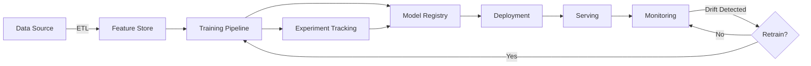

# MLOps Overview

## TL;DR
ML engineering: not just training. Covers data pipelines, model serving, monitoring, retraining, versioning. Enables reliable, scalable production ML.

## Core Intuition
ML systems are fragile. Code, data, models all evolve. MLOps manages this: CI/CD for ML, automated retraining, monitoring.

## How It Works



**Key components:**
- **Data Pipeline (ETL):** Ingest, transform, validate data
- **Feature Store:** Centralized feature management and versioning
- **Experiment Tracking:** Log hyperparameters, metrics, models (MLflow, Weights & Biases)
- **Model Registry:** Version models, manage deployment states
- **Deployment Orchestration:** Automate model promotion (dev → staging → prod)
- **Serving:** Inference API with batching, caching, GPU management
- **Monitoring & Alerting:** Track performance drift, prediction quality, latency
- **Retraining Pipeline:** Automated retraining on schedule or drift trigger

## Detailed Trade-off Analysis

| Aspect | Manual ML | Basic MLOps | Full MLOps |
|--------|-----------|------------|-----------|
| Setup time | 1 week | 2 weeks | 4 weeks |
| Retraining | Manual | Scheduled | Automated on drift |
| Rollback time | Hours | 5 min | 1 min |
| Monitoring | None | Basic | Comprehensive |
| Cost | Low | Moderate | High |

**Decision:** 1-2 models→manual. 3-5 models→basic MLOps. 10+ models or critical→full MLOps.

---

## Production Failure Scenarios

**Scenario 1: Manual retraining causes skew**
- Engineer retrains locally, different preprocessing than serving. Model quality drops.
- Fix: Automate retraining. Use shared preprocessing.

**Scenario 2: No monitoring, drift goes undetected**
- Model accuracy degrades 10% over 3 months. Unknown until customer complains.
- Fix: Monitor accuracy, prediction distribution daily. Alert on drift.

**Scenario 3: No versioning, can't rollback**
- Model v2 breaks. Want v1. But v1 code deleted.
- Fix: Version everything (code, data, models). Git commit hash with model.

---

## Implementation Guidance

**Wrong:** Manual retraining, no monitoring, no versioning.
**Right:** Automated pipeline, monitoring alerts, version control on everything.

---

## Sophisticated Interview Q&A

**Q1: 1 model vs 10 models. MLOps investment?**
A: 1 model: overhead not justified. 10 models: essential (prevents chaos, enables scaling).

**Q2: Training-serving skew. Common?**
A: Very common. Solutions: feature store (shared definitions), preprocessing shared code, testing.

**Q3: When automate retraining?**
A: On schedule (hourly/daily) OR on drift (accuracy drops >1%). Both needed for production.

---

## Cost & Resource Analysis

Manual ML: cheap initially, expensive at scale (engineers bottleneck).
Full MLOps: expensive upfront, cheap at scale (everything automated).

---

## Monitoring & Observability

Metrics: model_accuracy, prediction_distribution, training_frequency, retraining_time. Alerts: accuracy drops, drift detected, retraining fails.

## Common Mistakes / Gotchas
- **Manual processes:** retraining by hand is error-prone. Automate.
- **No versioning:** can't rollback. Version code, data, models.
- **Missing monitoring:** find issues in production too late.

## Interview Q&A

**Q: What is the most common reason ML models fail in production?**
A: Training-serving skew: the model was trained on data preprocessed differently than production data—different scaling, encoding, or feature order. Other top causes: data drift (distribution of production inputs changes), inadequate monitoring (failures go undetected), and insufficient testing of edge cases. The infrastructure to catch these issues (feature stores, monitoring, CI/CD) is what MLOps provides.

**Q: When should a company invest in MLOps infrastructure vs. keeping ML simple?**
A: Invest when: you have 3+ models in production, models need to be retrained regularly, multiple teams contribute to ML pipelines, or model failures have significant business impact. Keep simple when: you have 1-2 models that rarely change, the models are low-stakes, or you're still validating the ML use case. Over-engineering MLOps for one model is wasteful; under-engineering for 10 models creates technical debt that slows the entire team.

**Q: How does MLOps differ from DevOps and what does that mean for tooling?**
A: DevOps handles code and infrastructure; MLOps handles code + data + models + experiments. Unique MLOps challenges: data versioning (code versioning tools don't handle large datasets), experiment tracking (many hyperparameter configurations to compare), model validation (both technical metrics and business metrics), and data drift (models degrade without code changes). Tooling must address all four: MLflow/W&B for experiments, DVC for data versioning, Evidently for drift, and custom model cards for documentation.

**Q: What does a minimal viable MLOps setup look like?**
A: Minimum: (1) version control for code and model artifacts, (2) automated retraining pipeline with data validation, (3) staging environment for model validation before production, (4) basic monitoring of prediction distribution and key business metrics. This can be built with MLflow + GitHub Actions + simple dashboards in a few weeks. Don't let perfect MLOps be the enemy of shipping—start minimal and add components as team pain points emerge.

**Q: What is the ROI calculation for investing in MLOps infrastructure?**
A: Quantify: engineer hours spent debugging production issues (monitoring reduces this), time to retrain and deploy models (CI/CD reduces this), models that failed silently before monitoring caught them (value of prevented failures). Typical improvements: 3-5x faster model deployment, 50-70% reduction in production incidents, 2-3x more models maintained per engineer. The investment pays off when the cost of infrastructure is less than the cost of the manual work it replaces, usually at 3-5 production models.

## Best Practices

- **Version everything:** Code, data, models, configs. Use DVC for datasets, model registries for artifacts.
- **Separate environments:** Dev, staging, production. Never train in prod. Use blue-green deployments for rollback.
- **Automate retraining:** Trigger on schedule (hourly/daily) or drift detection (Kolmogorov-Smirnov test on prediction distribution).
- **Monitor early, monitor often:** Track prediction distribution, input feature distribution, model latency, prediction errors.
- **Start minimal:** MLflow + GitHub Actions + CloudRun covers 80% of use cases. Add complexity only when you hit pain points.
- **Test data pipelines:** Unit tests on ETL, integration tests on feature computation, validation tests on output schema.
- **Document model lineage:** Track which training data, which hyperparameters, which commit created each model.

## Code Examples

### Example 1: MLOps Pipeline with MLflow

```python
import mlflow
from sklearn.model_selection import train_test_split
from sklearn.ensemble import RandomForestClassifier
import pandas as pd

# Set MLflow tracking
mlflow.set_experiment("mlops-example")

def train_pipeline(data_path, test_size=0.2, n_estimators=100, max_depth=10):
    # Load data
    data = pd.read_csv(data_path)
    X, y = data.drop('target', axis=1), data['target']
    X_train, X_test, y_train, y_test = train_test_split(X, y, test_size=test_size)
    
    # Start MLflow run
    with mlflow.start_run(description="Random Forest baseline"):
        # Log hyperparameters
        mlflow.log_params({
            "n_estimators": n_estimators,
            "max_depth": max_depth,
            "test_size": test_size
        })
        
        # Train
        model = RandomForestClassifier(n_estimators=n_estimators, max_depth=max_depth)
        model.fit(X_train, y_train)
        
        # Evaluate
        train_score = model.score(X_train, y_train)
        test_score = model.score(X_test, y_test)
        
        # Log metrics
        mlflow.log_metrics({
            "train_accuracy": train_score,
            "test_accuracy": test_score
        })
        
        # Log model
        mlflow.sklearn.log_model(model, "model")
        
        print(f"Train: {train_score:.3f}, Test: {test_score:.3f}")

# Run training
train_pipeline("data.csv", n_estimators=100, max_depth=10)

# Later: Load best model
best_run = mlflow.search_runs(order_by=["metrics.test_accuracy DESC"]).iloc[0]
best_model = mlflow.sklearn.load_model(f"runs:/{best_run.run_id}/model")
```

### Example 2: Data Drift Detection

```python
import numpy as np
from scipy.stats import ks_2samp

class DriftDetector:
    def __init__(self, baseline_data, threshold=0.05):
        self.baseline = baseline_data
        self.threshold = threshold
    
    def check_drift(self, current_data, feature_name):
        """Detect if feature distribution shifted significantly"""
        statistic, p_value = ks_2samp(self.baseline[feature_name], current_data[feature_name])
        
        drifted = p_value < self.threshold
        return {
            "feature": feature_name,
            "p_value": p_value,
            "drifted": drifted,
            "action": "Trigger retraining" if drifted else "Continue monitoring"
        }

# Usage
detector = DriftDetector(baseline_data=pd.read_csv("baseline.csv"))
batch_data = pd.read_csv("recent_predictions.csv")

for feature in batch_data.columns:
    result = detector.check_drift(batch_data, feature)
    print(result)
```

### Example 3: Model Registry Pattern

```python
import json
from datetime import datetime
from pathlib import Path

class ModelRegistry:
    def __init__(self, registry_path="./model_registry"):
        self.registry_path = Path(registry_path)
        self.registry_path.mkdir(exist_ok=True)
    
    def register_model(self, model_name, model_path, metrics, commit_hash):
        """Register a model with metadata"""
        metadata = {
            "model_name": model_name,
            "model_path": str(model_path),
            "metrics": metrics,
            "commit": commit_hash,
            "timestamp": datetime.now().isoformat(),
            "status": "staging"  # staging -> production after validation
        }
        
        registry_file = self.registry_path / f"{model_name}_registry.json"
        with open(registry_file, 'w') as f:
            json.dump(metadata, f, indent=2)
        
        print(f"Model registered: {registry_file}")
    
    def promote_model(self, model_name, target_status="production"):
        """Promote model from staging to production"""
        registry_file = self.registry_path / f"{model_name}_registry.json"
        
        with open(registry_file, 'r') as f:
            metadata = json.load(f)
        
        metadata["status"] = target_status
        metadata["promoted_at"] = datetime.now().isoformat()
        
        with open(registry_file, 'w') as f:
            json.dump(metadata, f, indent=2)
        
        print(f"Model promoted to {target_status}")

# Usage
registry = ModelRegistry()
registry.register_model("fraud_detector", "./models/fraud_v1.pkl", 
                       {"accuracy": 0.95, "auc": 0.92}, "abc123def456")
registry.promote_model("fraud_detector", "production")
```

## Interview Quick-Reference
**MLOps?** Entire ML system: pipelines, training, serving, monitoring, retraining. Automation is key.

## Related Topics
- [Data Pipelines](02-data-pipelines.md) — ETL part
- [Monitoring & Observability](16-monitoring-and-observability.md) — detection

## Resources
- [Hidden Technical Debt in Machine Learning](https://arxiv.org/abs/1503.04811)
