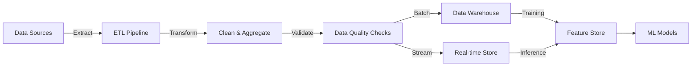

# Data Pipelines

## TL;DR
ETL: Extract data, Transform (clean, join, aggregate), Load to warehouse/lake. Batch (daily) or streaming (continuous). Foundation of ML systems.

## Core Intuition
Raw data → useful features. Pipeline automates: extract from sources, transform, load.

## How It Works



**Batch Processing:** 
- Schedule: daily or hourly
- Latency: hours to minutes
- Cost: efficient (process large volumes together)
- Use: training, daily reports, non-urgent features

**Stream Processing:**
- Schedule: continuous
- Latency: seconds to minutes
- Cost: expensive (always running)
- Use: fraud detection, real-time recommendations, latency-sensitive features

## Key Properties / Trade-offs
- Latency: batch (hours), streaming (seconds)
- Cost: batch cheap, streaming expensive
- Complexity: batch simple, streaming complex

## Common Mistakes / Gotchas
- **No error handling:** bad data propagates → broken models
- **Slow transforms:** bottleneck. Optimize with distributed processing (Spark).
- **Data quality:** no validation → garbage data in
- **Lineage:** can't trace data origin → hard to debug

## Interview Q&A

**Q: How do you decide between batch processing and stream processing for an ML data pipeline?**
A: Batch when: features don't need to be real-time (end-of-day reports, daily retraining), data volumes are large and latency requirements are loose (hours to days), simplicity is valued over freshness. Stream when: features need to be up-to-date within seconds (fraud detection, real-time recommendations), you're processing continuously arriving events, or decisions need the latest context. Many production systems use both: batch for expensive features (complex aggregations), stream for simple low-latency features (recent activity counts).

**Q: What are the most common causes of data pipeline failures in production?**
A: Schema changes upstream: a source system adds/removes/renames a column without notifying the ML team. Upstream system outages: the pipeline fails silently when source data is missing. Data volume spikes: pipeline times out or runs out of memory during unusually large batches. Silent data quality degradation: pipeline succeeds but produces wrong features (e.g., NULL values increase, outliers appear). Infrastructure changes: a library upgrade breaks serialization. All of these require monitoring, not just code fixes.

**Q: How do you implement data validation in an ML pipeline?**
A: Validate at every boundary: raw data ingestion (check expected columns, types, row counts), feature computation (check distributions against historical baselines), training data preparation (check class balance, feature correlations). Tools: Great Expectations, TFX Data Validation, or custom statistical tests. Set thresholds based on historical variation (flag if metric deviates >3σ from rolling average). Fail the pipeline and alert rather than silently proceeding with bad data.

**Q: What is data lineage and why does it matter for ML?**
A: Data lineage tracks how each piece of data was transformed from raw source to model input. It enables: debugging (trace a model prediction back to the raw data that produced it), compliance (prove what data was used to train a model), impact analysis (understand which models are affected when a data source changes), and reproducibility (recreate exact training datasets). Without lineage, investigating production issues is extremely difficult—you can't answer "why did this prediction change?"

**Q: How do you handle late-arriving data in time-based features?**
A: Late data is common in distributed systems: events with timestamps from yesterday that arrive today. Strategies: (1) watermarks—define a maximum lateness threshold (e.g., 6 hours), process data within the window, reject or ignore later arrivals; (2) reprocessing—allow late data to trigger recomputation of affected time windows; (3) approximate processing—treat late data as "close enough" and accept small errors in time-sensitive features. For model training, ensure your training data has the same late-arrival characteristics as production.

## Best Practices

- **Idempotent operations:** Running the same pipeline twice must produce the same result (critical for rerunning failed jobs).
- **Data quality first:** Add validation at every stage—schema checks, null checks, range checks, cardinality limits.
- **Lineage tracking:** Log source → transform → destination for debugging and compliance. Use Apache Airflow or similar.
- **Incremental processing:** Use watermarks (last_processed_timestamp) to avoid full reruns. Dramatically reduces costs.
- **Error handling:** Retry transient failures (network), alert on permanent failures (schema changes), don't silently drop data.
- **Partition strategy:** Partition by time (YYYY/MM/DD) and domain (country, account) for efficient querying and compliance deletion.

## Code Examples

### Example 1: Batch Pipeline with Airflow

```python
from airflow import DAG
from airflow.operators.python import PythonOperator
from datetime import datetime, timedelta
import pandas as pd

def extract_data(**context):
    # Extract from database
    sql = "SELECT * FROM events WHERE date = '{{ ds }}'"
    df = pd.read_sql(sql, conn)
    df.to_parquet(f"/data/raw/events_{{ ds }}.parquet")

def transform_data(**context):
    # Load raw data
    ds = context['ds']
    df = pd.read_parquet(f"/data/raw/events_{ds}.parquet")

    # Clean: remove nulls, cast types
    df = df.dropna(subset=['user_id', 'action'])
    df['timestamp'] = pd.to_datetime(df['timestamp'])

    # Aggregate features
    df['daily_user_revenue'] = df.groupby('user_id')['amount'].transform('sum')
    df['action_count'] = df.groupby('user_id')['action'].transform('count')

    df.to_parquet(f"/data/processed/features_{ds}.parquet")

def validate_data(**context):
    ds = context['ds']
    df = pd.read_parquet(f"/data/processed/features_{ds}.parquet")

    # Quality checks
    assert df.shape[0] > 0, "No data"
    assert df['daily_user_revenue'].notna().sum() > 0.95 * len(df), "Too many nulls"
    assert df['daily_user_revenue'].max() < 1e6, "Outlier detected"

    print(f"✓ Data validation passed for {ds}")

# Define DAG
default_args = {
    'owner': 'ml_team',
    'retries': 2,
    'retry_delay': timedelta(minutes=5),
}

dag = DAG('daily_features', start_date=datetime(2024,1,1), schedule_interval='@daily', default_args=default_args)

extract = PythonOperator(task_id='extract', python_callable=extract_data, dag=dag)
transform = PythonOperator(task_id='transform', python_callable=transform_data, dag=dag)
validate = PythonOperator(task_id='validate', python_callable=validate_data, dag=dag)

extract >> transform >> validate
```

### Example 2: Data Validation

```python
from great_expectations.dataset import PandasDataset

def validate_features(df):
    ge_df = PandasDataset(df)

    # Column existence
    ge_df.expect_column_to_exist('user_id')
    ge_df.expect_column_to_exist('daily_revenue')

    # Type checks
    ge_df.expect_column_values_to_be_of_type('user_id', 'int')
    ge_df.expect_column_values_to_be_of_type('daily_revenue', 'float')

    # Range checks
    ge_df.expect_column_values_to_be_between('daily_revenue', min_value=0, max_value=1e5)

    # Null checks
    ge_df.expect_column_values_to_not_be_null('user_id')
    ge_df.expect_column_values_to_be_between('daily_revenue', min_value=None, max_value=None,
                                             mostly=0.99)  # Allow 1% nulls

    result = ge_df.validate(result_format='SUMMARY')
    return result['success']
```

### Example 3: Watermark-Based Incremental Processing

```python
def incremental_load(table_name, watermark_key):
    # Get last processed timestamp
    with open(f'./{table_name}.watermark') as f:
        last_processed = f.read().strip()

    # Load only new data
    sql = f"SELECT * FROM {table_name} WHERE {watermark_key} > '{last_processed}'"
    new_data = pd.read_sql(sql, conn)

    if len(new_data) == 0:
        print("No new data")
        return

    # Process new data
    new_data['processed_at'] = datetime.now()
    new_data.to_parquet(f"/data/incremental/{table_name}_{datetime.now().isoformat()}.parquet")

    # Update watermark
    max_timestamp = new_data[watermark_key].max()
    with open(f'./{table_name}.watermark', 'w') as f:
        f.write(str(max_timestamp))

    print(f"Processed {len(new_data)} new rows")
```

## Interview Quick-Reference
**Data pipeline?** Extract, transform, load. Batch or streaming. Automate, monitor, validate.

## Related Topics
- [Feature Store](03-feature-store.md) — stores transformed data
- [Data Governance](26-data-governance.md) — data quality

## Resources
- [Apache Airflow](https://airflow.apache.org/) — orchestration
- [Spark](https://spark.apache.org/) — distributed processing
