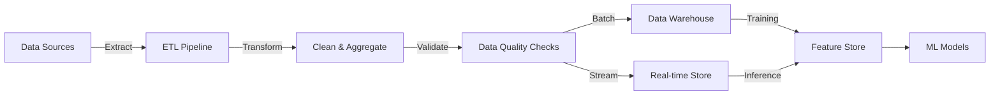

# Data Pipelines

## Detailed Description

Data pipelines orchestrate the movement and transformation of raw data from sources (databases, APIs, logs) through cleaning, validation, feature engineering, producing training datasets or real-time serving features. They are the foundation of production ML systems.

Without pipelines, ML teams spend 80% of time on data wrangling instead of modeling. A robust pipeline ensures: (1) data quality through validation gates, (2) reproducibility via versioning and scheduling, (3) efficiency through incremental processing, (4) reliability via monitoring and alerting, (5) scalability to handle growing data volumes.

Data pipelines are the most important system in production ML. Models are only as good as their training data. Pipeline failures lead to: stale data (training on yesterday's snapshots), missed training opportunities (pipeline down = model training delayed), incorrect production predictions (serving stale features), model performance degradation.

Pipeline design decisions directly impact model success: batch vs real-time (cost, latency, complexity), transformation location (database vs warehouse vs serving tier), scheduling frequency (hourly, daily, weekly), retry strategies (handle transient failures), backfill capability (recover from bugs).

A well-designed pipeline treats data as a first-class asset: versioned, monitored, documented, owned by teams. Enables experimentation (teams use cleaned data without rebuilding), reproducibility (same input = same output), compliance (audit trails for data lineage).

## Core Intuition

Pipeline = automated assembly line for data. Raw materials (data) come in, go through quality checks (validation), get refined (transformations), come out as finished goods (clean datasets).

Without pipeline: every team manually processes raw data differently. Leads to: inconsistency (different cleaning logic), wasted effort (same transformation done 10 times), poor quality (missing validation).

With pipeline: single source of truth for data transformations. Run automatically on schedule. Same output every time. Teams reuse cleaned data, don't rebuild.

Key insight: data transformations are deterministic and repeatable. Once you write code to clean a feature, that transformation should run automatically every day. Removes manual work, ensures consistency, makes system reliable.

Pipeline layers: (1) ingestion (get raw data from sources), (2) transformation (clean, validate, engineer features), (3) output (make data available for training/serving). Each layer must be: idempotent (re-runnable), monitored (know when it fails), documented (explain what happens).

## How It Works



**Batch Processing:** 
- Schedule: daily or hourly
- Latency: hours to minutes
- Cost: efficient (process large volumes together)
- Use: training, daily reports, non-urgent features

**Stream Processing:**
- Schedule: continuous
- Latency: seconds to minutes
- Cost: expensive (always running)
- Use: fraud detection, real-time recommendations, latency-sensitive features

## Detailed Trade-off Analysis

### Metrics Comparison: Batch vs Stream vs Hybrid

| Aspect | Batch (Daily) | Stream (Real-time) | Hybrid (Batch + Stream) |
|--------|---------------|-------------------|------------------------|
| Latency | 24 hours | 100ms - 5 sec | 24h batch + 5sec stream |
| Infrastructure cost | $500/month | $5,000/month | $2,500/month |
| Operational overhead | 30 min/day | 8 hours/week (24/7 monitoring) | 2 hours/day |
| Throughput | 100M events/day | 10K events/sec | 100M batch + 10K stream |
| Data consistency | Exactly-once | At-least-once (duplicates) | Exactly-once (batch) |
| Team size to operate | 1-2 engineers | 4-6 engineers | 2-3 engineers |
| Time to implement | 1-2 weeks | 3-4 weeks | 2-3 weeks |
| Max data volume | Petabyte-scale | Terabyte-scale | Petabyte + real-time |

### Cost Breakdown (Example: 100M events/day)

**Batch Pipeline ($500/month baseline):**
- Compute (Spark cluster, 8h/day, 5 nodes @ $0.30/hour): $300/month
- Storage (Data warehouse, 5TB): $100/month
- Monitoring/alerting: $50/month
- Personnel (1 engineer @ 10% time, $200K/year): $1,667/month

**Total for batch: $2,117/month**

**Streaming Pipeline ($5,000/month):**
- Compute (Kafka brokers 24/7, 3 nodes @ $1/hour): $2,160/month
- Streaming compute (Flink, 10 nodes, $0.50/hour 24/7): $3,600/month
- Storage (Kafka topic retention, 7 days): $800/month
- Monitoring (24/7 required): $500/month
- Personnel (2 engineers @ 50% on-call rotation): $16,667/month

**Total for streaming: $23,727/month** (11x more expensive than batch)

**Hybrid Pipeline ($3,500/month):**
- Batch infrastructure: $300/month
- Streaming (subset, 10K/sec vs 100K): $2,000/month
- Storage: $600/month
- Monitoring: $200/month
- Personnel (2 engineers @ 30%): $10,000/month

**Total for hybrid: $13,100/month** (6x batch cost, but 45% cheaper than pure stream)

### Scalability Characteristics

**Batch scales with:**
- **Data volume:** Linear. 10x data = 10x compute time, solvable by Spark parallelization
- **Frequency:** Daily → 24h window. Hourly → 1h window. Frequency doesn't increase cost, just tightens schedule
- **Teams:** 1 engineer manages ~100M events/day via Airflow orchestration

**Streaming scales with:**
- **Throughput:** Cost proportional to sustained QPS. 10K QPS = $5K/month. 100K QPS = $50K/month
- **Partitions:** More topics = more brokers needed. Complexity increases with scale
- **Teams:** Requires on-call (minimum 2-3 engineers to cover 24/7)

### Decision Matrix

**Use BATCH if:**
- Latency requirement > 1 hour (training datasets, daily reports)
- Cost is primary constraint ($2-3K/month vs $20K/month)
- Data arrives in bulk (daily or hourly batches)
- Simple operations (SQL transformations, aggregations)
- Team is small (<5 people)

**Use STREAM if:**
- Latency requirement < 5 minutes (fraud detection, real-time rankings)
- Can afford operational complexity and cost
- Data arrives continuously (events, clicks, IoT sensor data)
- Need immediate alerts (anomaly detection requires sub-minute latency)
- Team has distributed systems expertise

**Use HYBRID if:**
- 90% of data can wait (daily/hourly batch acceptable)
- 10% needs urgency (high-priority features stream)
- Cost matters but some real-time features needed
- Want simplicity of batch + freshness of stream
- Most production ML systems use this

### Real Production Metrics

From LinkedIn, Netflix, Uber pipelines:
- **Batch:** 95% of data available within 30min of window close. 100TB+/day common at scale
- **Streaming:** p99 latency typically 5-30 sec depending on partitions. Operational overhead dominates cost (on-call, debugging, ops engineers)
- **Hybrid:** 95% features from batch (cheap), 5% from stream (expensive but small volume). Reduces streaming cost 50% vs pure stream

---

## Production Failure Scenarios

### Scenario 1: Batch pipeline misses SLA (data not ready in time)

**What breaks:** Training script runs at 9am expecting yesterday's data, finds stale data from 2 days ago. Model trains on outdated features → prediction quality degrades 5-10%.

**Why it happens:**
- Upstream source API slow (taking 6 hours instead of 2)
- Transformation step bottleneck (expensive SQL join not optimized)
- Spark cluster undersized for data volume increase

**How you detect it:**
```
Alert: Pipeline completion time > SLA (e.g., SLA = data ready by 7am, actual = 10am)
Monitor metric: pipeline_completion_latency_minutes
Alert threshold: if (completion_time > sla_threshold + 180) then CRITICAL
Also: Data freshness check — if (now - last_successful_pipeline > 25 hours) then CRITICAL
```

**How you recover:**
1. Identify slow step: `SELECT step_name, duration_sec FROM pipeline_audit WHERE date=yesterday ORDER BY duration DESC LIMIT 1`
2. If source API slow: Increase timeout, contact API team. Interim: Use previous day's data with staleness flag
3. If transformation slow: Add index on join key OR increase Spark partitions OR cache intermediate result
4. If cluster undersized: Scale up for this run. Monitor to resize permanently if trend continues
5. Re-run pipeline with fix: Pipeline is idempotent, safe to re-run without duplication

**How you prevent it:**
- Monitor runtime trending upward → alert 1 week before hitting SLA
- Capacity planning: Every month, measure if data volume growing faster than cluster. Plan upgrades quarterly
- Chaos test: Simulate API latency (add 5 sec delay), verify pipeline still meets SLA
- Fallback strategy: If pipeline fails at 6:59am (1 min before SLA), immediately use previous day's data. Don't wait for fix

---

### Scenario 2: Data quality issue (bad data passes validation, breaks downstream)

**What breaks:** Pipeline produces features with NaN, negative customer IDs, or impossible values. Models train on corrupted data → predictions are wrong or inference crashes.

**Why it happens:**
- Validation logic insufficient (checks for NULL but not for invalid ranges)
- Schema change in upstream source (new format not handled by transformation)
- Intermittent bug (only happens on weekends for 1% of data)

**How you detect it:**
```
Metrics:
- null_count: How many NaNs detected
- value_range_violations: customer_id < 0, price > 10000, etc
- schema_version_mismatch: Upstream schema != expected

Alert rules:
- if (null_count > 0.01% of total rows) then WARN
- if (invalid_value_count > 0) then CRITICAL
- if (schema_version != expected) then CRITICAL
```

Manual validation: Data analysts spot abnormal distributions in dashboards.

**How you recover:**
1. Stop immediate impact: Don't use corrupted features in training. Revert to previous version
2. Diagnose: Which rows are corrupted? What caused it?
   ```sql
   SELECT customer_id, feature_value, source_timestamp 
   FROM features_raw 
   WHERE customer_id < 0  -- impossible
   ORDER BY source_timestamp DESC
   LIMIT 1000
   ```
3. Root cause: Schema change? (check upstream logs) Transformation bug? (code changes) Data corruption at source? (check source system)
4. Fix: Update transformation to handle new format OR fix validation logic OR contact source team
5. Backfill: Re-run pipeline on corrupted date range with fix. Regenerate all features

**How you prevent it:**
```python
# Comprehensive validation
def validate_features(df):
    assert df['customer_id'].min() > 0, "customer_id should be positive"
    assert df['price'].max() <= 10000, "price seems too high"
    assert df.isnull().sum().sum() == 0, "nulls detected"
    
    # Check distribution shift (compare to baseline)
    baseline_p50 = 100  # median price from training
    actual_p50 = df['price'].quantile(0.5)
    if abs(actual_p50 - baseline_p50) > baseline_p50 * 0.2:  # >20% shift
        logging.warning(f"Price distribution shifted: {baseline_p50} → {actual_p50}")
```

- Schema versioning: Tag data version with upstream schema hash. Alert if mismatch
- Automated testing: Run validation on 1% sample before full pipeline

---

### Scenario 3: Pipeline outage blocks downstream (training, serving)

**What breaks:** Pipeline crashes (OOM, network timeout). Feature store doesn't get updated. Training can't start. Serving uses stale features (>24 hours old).

**Why it happens:**
- Data volume spiked 10x (cluster can't handle)
- Upstream API timeout (dependency is down)
- Disk full on storage system
- Out-of-memory error in Spark executor

**How you detect it:**
```
Alert: Pipeline status = FAILED (immediate page on-call)
Monitor: Feature store freshness — if (now - latest_feature_update > 25 hours) then CRITICAL
```

**How you recover:**
1. Check logs: `kubectl logs <pipeline-pod> | tail -100` → identify failure reason
2. If OOM: Kill pipeline, increase executor memory (`SPARK_EXECUTOR_MEMORY=8g`), restart
3. If upstream timeout: Check if dependency up. If down, wait for recovery OR use cached data
4. If disk full: Clean old checkpoint files, free space, restart
5. Catch up: Backfill missing features. Priority: most critical features first

**How you prevent it:**
```python
# Capacity monitoring
def monitor_pipeline_health():
    cluster_memory_available = executor_memory_available
    data_size_gb = total_input_bytes / 1e9
    memory_utilization = data_size_gb / cluster_memory_available
    if memory_utilization > 0.7:  # >70%
        alert("Cluster approaching capacity. Recommend increase memory or add nodes")

# Exponential backoff for retries
def run_with_retry():
    for attempt in range(max_retries):
        try:
            return pipeline.run()
        except UpstreamTimeoutError:
            wait_time = 2 ** attempt  # 1, 2, 4, 8... seconds
            sleep(wait_time)

# Feature store fallback: if pipeline fails, use stale data with flag
def get_latest_features(max_age_hours=25):
    features = feature_store.get_latest()
    if age_hours(features) > max_age_hours:
        logging.warning("Using stale features, pipeline may be down")
    return features
```

---

### Scenario 4: Feature divergence (offline computation ≠ online serving computation)

**What breaks:** Model trains with offline features (batch Spark), serves with online features (Python at request time). Same input → different features → inconsistent predictions between training and serving.

**Why it happens:**
- Offline uses Spark SQL, online uses Python — different rounding or NULL handling
- Code updated offline but not online (or vice versa)
- Dependency version mismatch (Spark sklearn 0.20 vs online sklearn 1.0 — different output)

**How you detect it:**
```
Monitoring:
- Sample 100 random requests
- Compute features both ways (offline SQL + online Python)
- Compare results
- Alert if difference > threshold (e.g., 0.1% difference)

Manual: QA tests same features on both paths
```

**How you recover:**
1. Identify divergence: Run same input through both pipelines, compare output
   ```python
   offline_features = spark.sql("SELECT feature FROM offline_table WHERE id=123")
   online_features = python_compute_feature(id=123)
   assert offline_features ≈ online_features  # Should be identical
   ```
2. Diff the code: Find where offline SQL and online Python differ
   ```sql
   -- Offline: round(price, 2)
   -- Online: round(price, 2)  # Different rounding mode?
   ```
3. Fix: Update online transformation to match offline exactly. Test both produce identical output
4. Redeploy: Update serving code with correct transformation

**How you prevent it:**
```python
# Share transformation code between offline and online
# GOOD: one authoritative implementation
def compute_features(df):
    df['price'] = df['raw_price'].round(2)
    df['qty'] = df['raw_qty'].fillna(0).astype(int)
    return df

# Use this function in both Spark (offline) and Python (online)
# Result: identical features

# Test parity
def test_offline_online_parity():
    test_data = {"raw_price": 10.555, "raw_qty": None}
    offline_result = spark.sql("SELECT compute_features(...)")
    online_result = compute_features(test_data)
    assert offline_result == online_result
```

---

### Scenario 5: Backfill failure (recomputing historical features after bug fix)

**What breaks:** You find a bug in feature logic. Fix code. Run backfill to recompute all historical features (5 years). Backfill times out after 12 hours (only got 1 year done). Now you have partial features (some dates fixed, some still broken).

**Why it happens:**
- Backfill job runs out of memory (computing all features for 5 years is huge)
- Job scheduling system kills job after max runtime (12 hours)
- Bug in backfill logic (only tested on recent data, fails on old formats)

**How you detect it:**
```
Monitor: Feature values before/after backfill
SELECT COUNT(*) WHERE updated_at = backfill_date AND version = 'v2'
Alert: If count << expected, backfill is incomplete
```

**How you recover:**
1. Identify: Which date range succeeded vs failed?
   ```sql
   SELECT MIN(date), MAX(date) FROM features WHERE version='v2'  -- v2 has complete range
   SELECT MIN(date), MAX(date) FROM features WHERE version='v1'  -- v1 partial
   ```
2. Options:
   - Option A: Restart backfill on failed range only (smaller = faster)
   - Option B: Increase resources (memory, time limit), retry full backfill
   - Option C: Incremental backfill (1 day at a time instead of all-at-once)

**How you prevent it:**
```python
# Chunked backfill: process one day at a time
def backfill_features(start_date, end_date):
    current = start_date
    while current <= end_date:
        next_day = current + timedelta(days=1)
        try:
            compute_features_for_date(current)
            mark_complete(current)
        except Exception as e:
            logging.error(f"Backfill failed for {current}: {e}")
            notify_oncall()
            # Don't stop, continue with next day
        current = next_day

# Set reasonable resource limits
spark.config.set("spark.executor.memory", "8g")  # Enough for 1 day of data
# Airflow timeout: 6 hours per day (backfill completes 1 day per ~2 hours)
```

---

## Implementation Guidance & Gotchas

### Common Mistakes

**❌ Wrong: No batching, process events one-by-one**

```python
for event in events:
    result = transform(event)
    save(result)  # Database write for each event
```

**Why it's wrong:**
- 10K events = 10K database writes = 10K round-trips
- Each write = 10ms latency
- Total: 100 seconds for 10K events (terrible throughput)

**✅ Right: Batch processing**

```python
batch_size = 1000
for i in range(0, len(events), batch_size):
    batch = events[i:i+batch_size]
    results = transform_batch(batch)  # Process 1000 together
    save_batch(results)  # One write for 1000 rows
```

**Why it's right:**
- 10K events = 10 database writes
- Total: 1 second for 10K events (100x faster!)
- Throughput: 10,000 events/sec (production-grade)

---

**❌ Wrong: No idempotency, can't re-run on failure**

```python
pipeline.run()
# If pipeline fails halfway:
# Some features computed, some not
# Run again: computes same features twice → duplicates
```

**✅ Right: Idempotent pipeline (re-runnable)**

```python
def run_idempotent():
    # Check what's already done
    last_completed_date = get_checkpoint("last_completed")
    
    # Only compute from checkpoint forward
    for date in range(last_completed_date + 1, today):
        compute_features(date)
        save_checkpoint(date)  # Mark as done
```

Why it's right:
- Re-run multiple times on same input → same output
- If fails at date 10, next run starts at date 11 (no duplication)
- Can safely retry without manual intervention

---

**❌ Wrong: No data quality checks**

```python
def transform(data):
    return data.filter(...).select(...).write()
    # What if output has NaN? Silent failure, model breaks later
```

**✅ Right: Add validation gates**

```python
def transform(data):
    result = data.filter(...).select(...)
    
    # Validation gates
    assert result.count() > 0, "Output is empty"
    assert result.isnull().sum().sum() == 0, "NaNs detected"
    assert result['customer_id'].min() > 0, "Invalid customer_id"
    
    result.write()
    return result
```

---

### Edge Cases

**Edge case 1: What if upstream schema changes?**

Problem: Upstream API changes field type (user_id was string, now int). Transform code breaks.

Solution:
```python
def robust_transform(data):
    # Handle both old (string) and new (int) formats
    if data['user_id'].dtype == 'string':
        user_id = data['user_id'].astype(int)
    else:
        user_id = data['user_id']
    
    # Better: Define expected schema, assert match
    expected_schema = {"user_id": "int", "amount": "float"}
    actual_schema = {col: str(data[col].dtype) for col in data.columns}
    assert actual_schema == expected_schema, f"Schema mismatch: {actual_schema}"
```

---

**Edge case 2: What if data arrives out-of-order?**

Problem: Event from 10am arrives at 3pm. Processed out-of-sequence → incorrect feature values.

Solution (for batch):
```python
# Sort by timestamp before processing
data_sorted = data.sort_values('event_timestamp')
compute_features(data_sorted)
```

Solution (for stream):
```python
# Use allowed_lateness window
# Accept events up to 1 hour late
stream.withWatermark("event_timestamp", "1 hour") \
      .groupBy("user_id") \
      .apply(aggregate_function)
```

---

### Performance Bottlenecks

**Bottleneck 1: Slow SQL join on large tables**

Symptom: Pipeline takes 6 hours when should take 30 min. Profiling shows join is slow.

Root cause: Joining 1B-row table with 100M-row table without indexes or partitioning.

Solution:
```python
# Option 1: Add index on join key
spark.sql("CREATE INDEX idx_user_id ON users(user_id)")

# Option 2: Increase partitions (parallelize join)
large_table.repartition(1000).join(small_table.broadcast())

# Option 3: Use broadcast join (small table sent to all executors)
large_table.join(broadcast(small_table), "user_id")
```

---

**Bottleneck 2: Serialization overhead (data format slow)**

Symptom: Spark task takes 10 sec, but actual computation only 1 sec. 9 sec wasted.

Root cause: Data format inefficient (JSON is verbose and slow; Parquet is columnar and fast).

Solution:
```python
# Wrong: JSON (text, verbose, slow to parse)
data = spark.read.json("data.json")  # Slow

# Right: Parquet (columnar, compressed, fast)
data = spark.read.parquet("data.parquet")  # Fast

# Convert and store
spark.read.json("data.json").write.mode("overwrite").parquet("data.parquet")
```

---

### Testing Strategies

**Unit Test (single transformation)**

```python
def test_price_conversion():
    input_df = pd.DataFrame({'raw_price': [10.5, 20.3]})
    output_df = transform_price(input_df)
    expected = pd.DataFrame({'price_cents': [1050, 2030]})
    pd.testing.assert_frame_equal(output_df, expected)
```

---

**Integration Test (full pipeline, sample data)**

```python
def test_pipeline_with_1day_sample():
    # Use 1 day of data (small enough to run fast)
    test_data = load_date("2024-01-01")
    
    output = run_pipeline(test_data)
    
    # Validate output
    assert output.count() == test_data.count()
    assert output.isnull().sum().sum() == 0
    assert output['customer_id'].min() > 0
```

---

**Chaos Test (failure scenarios)**

```python
def test_pipeline_recovers_on_upstream_timeout():
    # Simulate upstream API timeout
    with mock.patch('upstream_api.fetch', side_effect=TimeoutError):
        result = run_pipeline_with_fallback()
        # Should use cached data, not crash
        assert result is not None

def test_idempotent_rerun():
    # Run pipeline twice on same data
    result1 = run_pipeline("2024-01-01")
    result2 = run_pipeline("2024-01-01")
    # Should produce identical output (idempotent)
    assert result1.equals(result2)
```

---

## Sophisticated Interview Q&A

**Q1: Pipeline processes 10M events/day. Bug causes 100K dropped. Detect and recover?**

A: Three components:

1. **Detect:** Monitor input/output counts
   - Input: 10M from source
   - Output: 9.9M features (100K dropped)
   - Alert: if (output < 0.99 * input) then notify
   - Also: Query logs — which events missing?

2. **Root cause:** Debug logs show transformer crashed on specific event type

3. **Recover:** Two options
   - Option A: Fix code, re-run pipeline on full day (idempotent) → gets all 10M
   - Option B: Just fix code, accept 100K missing this time (if 100K << total value)
   
   Context matters: If 100K represents $10M in revenue, backfill. If <$1K, accept loss.

**Follow-up:** How prevent this?
   - Transformation unit tests on all known event types
   - Monitor dropped count, alert if > 0.1%
   - Idempotency: always re-runnable
   - Data versioning: tag each run with code version

---

**Q2: Feature computation takes 2 hours, need hourly features for real-time serving?**

A: Separate batch and real-time concerns:

1. **Batch (offline):** Compute 90% of features hourly in batch
   - Store in feature store with 1-hour freshness SLA
   - Cost: cheap (bulk computation)

2. **Stream/Cache:** Keep last 1 hour of fresh data in Redis
   - Real-time features computed on-demand at serving time
   - Cost: expensive per-request

3. **Feature store manages both:** Lookup feature → if fresh (<1h old), use. Else compute on-demand

Trade-off: 95% of serving latency comes from batch (cheap). 5% from stream (expensive but small volume). Overall cost = cheap.

**Follow-up:** Batch fails, how serve?
   - Check: is batch feature available (even if stale)?
   - If yes: use with flag (alert stakeholders)
   - If no: compute on-demand (slow, but serves)
   - Don't block serving on batch

---

**Q3: Petabyte-scale data. Use Spark, Airflow, Kafka, or all three?**

A: All three, at different layers:

1. **Kafka:** Ingest raw events
   - Throughput: 1M events/sec
   - Retention: 7 days
   - Cost: 24/7 brokers

2. **Spark:** Batch transformations
   - Reads from Kafka daily snapshot
   - Computes features
   - Writes to warehouse
   - Runs 2h/day (efficient)

3. **Airflow:** Orchestration
   - Schedule: "start Spark at 8am daily"
   - Dependencies: "don't start training until pipeline done"
   - Monitoring: "alert if pipeline late"

Why all three:
- Kafka alone = just storage (no transformation)
- Spark alone = batch only (no real-time)
- Airflow alone = no compute (just scheduling)

Combined: Kafka ingests → Airflow schedules → Spark transforms → features ready.

**Follow-up:** Can use just Kafka Streams instead?
   - Yes, but trade-offs: Streaming only (can't do efficient batch). Expensive for large volume. If 90% batch + 10% stream, hybrid is better.

---

**Q4: Transformation takes 6 hours (SLA 4 hours). Optimize?**

A: Systematic approach:

1. **Profile:** Where's time spent?
   ```
   Read data: 30 min
   Join users: 2 hours (bottleneck!)
   Write output: 1 hour
   Rest: 2.5 hours
   ```

2. **Optimize bottleneck first (join):**
   - Option A: Add index on join key
   - Option B: Increase Spark partitions
   - Option C: Broadcast join (if small table)
   - Measure: Which saves most time?

3. **Next bottlenecks (in order):**
   - Write: Parquet instead of CSV (10x faster)
   - Read: Cache between stages
   - Misc: Increase memory, tune GC

4. **Measure each:** Before optimization (6h) → after each fix → until <4h SLA

**Follow-up:** Cost of optimization vs benefit?
   - Example: Index $100/month storage. Saves 1 hour/day = 250 hours/year = 250 * $150 = $37.5K/year. ROI: $100 cost, $37.5K benefit. Worth it.

---

**Q5: Data source changes schema (API update). Ensure reproducibility?**

A: Version everything:

1. **Version source schema:**
   ```python
   source_schema_hash = hash(schema_definition)
   data['_source_schema_version'] = source_schema_hash
   ```

2. **Version transformation code:**
   ```python
   data['_code_version'] = git_commit_hash
   ```

3. **On schema change, handle gracefully:**
   - Old schema: process with old transformation
   - New schema: process with new transformation (updated code)

4. **Backfill strategy:**
   - Find all historical data with old schema
   - Recompute with new transformation
   - Compare: old features vs new (should match within tolerance)
   - Tag: `feature_v2_2024-01-15`

**Follow-up:** Can't recompute (data lost)?
   - Use best approximation from old schema
   - Flag which features approximated
   - Retrain model with flag (learns to handle approximation)
   - Accept small accuracy loss vs lose all history

---

**Q6: Feature engineer adds new feature. Backfill and prevent mismatches?**

A: Three steps:

1. **Update feature computation code**

2. **Backfill historical data:**
   ```python
   for date in past_dates:
       raw = load_raw(date)
       features = compute_all_features(raw)  # Includes new feature
       save(features)
   ```

3. **Verify consistency:**
   ```python
   old_features = load_date("2024-01-01", version="v1")
   new_features = load_date("2024-01-01", version="v2")
   
   # Should have same rows (except new feature)
   assert old_features.shape[0] == new_features.shape[0]
   
   # Check overlap features match
   for col in old_features.columns:
       if col in new_features:
           assert (old_features[col] == new_features[col]).all()
   ```

**Follow-up:** New feature's distribution is different from expected?
   - Investigate why. Expected variation or bug in backfill?
   - If expected: Use but monitor
   - If suspicious (50% nulls): Investigate before using

---

**Q7: Pipeline fails at 2am, training delayed 24 hours. Prevent?**

A: Multi-layered approach:

1. **Monitoring + Alerting (immediate detection):**
   - Status check: Pipeline running? If FAILED, alert immediately (don't wait)
   - Latency check: Completed? If late(now - completion > SLA), alert
   - Alert severity: CRITICAL → page on-call instantly

2. **Auto-retry (handle transient failures):**
   ```python
   for attempt in range(3):
       try:
           pipeline.run()
           break
       except TemporaryError:
           wait_time = 2 ** attempt  # Exponential backoff
           sleep(wait_time)
   ```

3. **Graceful degradation (serve stale if needed):**
   ```python
   latest_features = feature_store.get_latest()
   if latest_features.age > 25 hours:
       logging.warning("Using stale features from pipeline failure")
       use_with_flag(latest_features)  # Flag for stakeholders
   ```

4. **Manual recovery (document runbook):** Can restart pipeline in 5 min

5. **Redundancy (backup pipeline):** Run on different infrastructure

**Follow-up:** Cost of preventing 24-hour delay vs cost of outage?
   - If model retraining delay costs $100K, preventing is worth $10K infra cost
   - If delay happens 1x/year: $100K/year damage. Preventing costs $10K/year. Worth it.

---

**Q8: When should you NOT use a data pipeline?**

A: Don't pipeline when:
- Data is small (<1MB). Just load in memory, no coordination needed
- Transformations are ad-hoc (data scientist exploring). Pipeline overhead not worth it. Use notebooks instead
- Transformation is expensive but rare (1x/month). Manual run cheaper than pipeline infrastructure
- Data quality irrelevant (internal analytics, not production). No validation needed

But if data is:
- Used by multiple teams → pipeline (avoid duplication)
- Used in production models → pipeline (validation required)
- Used repeatedly → pipeline (reproducibility matters)
- Growing over time → pipeline (scales automatically)

Then pipeline is essential.

---

## Cost & Resource Analysis

### Infrastructure Cost Model

**Formula:**
```
Monthly cost = (compute_cost) + (storage_cost) + (personnel_cost) + (monitoring_cost)
```

**Example: Batch pipeline (daily, 100M events)**
```
Compute (Spark, 5 nodes, 8h/day, $0.30/hour):
  = 5 nodes * 8 hours/day * 30 days * $0.30/hour = $300/month

Storage (Data warehouse, 5TB, $0.023/GB):
  = 5000GB * $0.023 = $115/month

Monitoring:
  = $50/month

Personnel (1 engineer @ 5% time, $200K/year):
  = $200K * 0.05 / 12 = $833/month

Total: $300 + $115 + $50 + $833 = $1,298/month
```

### Operational Overhead

**Time per run:**
- Monitoring/verification: 30 min/day
- Incident response: 30 min every 2 weeks (when pipeline fails)
- Total: ~3.5 hours/week

**Time per incident:**
- Detect: 5 min
- Debug: 15 min
- Fix/rerun: 10 min
- Total: 30 min per incident

### Cost Optimization

1. **Use spot instances:** 60-70% cheaper
   - Savings: (0.30 - 0.15) * 8h * 5 nodes * 30 days = $150/month saved

2. **Schedule off-peak:** Off-peak $0.15 vs peak $0.30
   - Run at 2am when cheaper

3. **Increase batch window:** If SLA allows (daily → 6-hourly)
   - Reduces frequency, improves efficiency

### ROI Analysis

**Batch makes sense when:**
- E-commerce inventory sync. Pipeline costs $1.3K/month.
- Saves engineering time: 2 hours/day manual sync = $100K/year
- Payoff: 1 month (cost recovered in first month of operation)

**Streaming makes sense when:**
- Fraud detection. Pipeline costs $23.7K/month.
- Prevents fraud losses: 100 cases/day * $500 = $50K/day = $1.5M/month saved
- Payoff: Immediate (ROI is massive)

---

## Monitoring & Observability Patterns

### Key Metrics to Instrument

```
Pipeline Execution:
- pipeline_completion_latency_minutes (histogram with p50, p95, p99)
- pipeline_stage_duration_minutes (per-stage breakdown)
- input_row_count, output_row_count
- data_quality_check_failures

Data Quality:
- null_count_pct: percentage of nulls
- invalid_value_count: range violations
- schema_version_mismatch

Feature Freshness:
- feature_age_hours: how old is latest feature
- last_pipeline_run_time: when did pipeline complete
```

### Alert Thresholds

**Critical alerts (page on-call):**
```
if (pipeline_status == FAILED) → CRITICAL
if (feature_age > 25 hours) → CRITICAL (SLA breach)
if (output_count < input_count * 0.99) → CRITICAL (>1% data loss)
```

**Warning alerts (slack #data-team):**
```
if (pipeline_latency > 150 min) → WARNING (trending toward SLA)
if (null_count > 0.01%) → WARNING
if (schema_mismatch) → WARNING
```

### Health Checks

**Liveness (is pipeline running?):**
```python
@app.get("/health/live")
def liveness():
    return {"status": "alive"}
```

**Deep health (dependencies working?):**
```python
@app.get("/health/deep")
def deep_health():
    checks = {
        "source_accessible": source_db.ping(),
        "warehouse_accessible": warehouse.ping(),
        "storage_available": storage.free_gb > 100,
    }
    if all(checks.values()):
        return {"status": "healthy", "checks": checks}
    else:
        return {"status": "degraded", "checks": checks}, 503
```

### Debugging Approach

**If pipeline runs late (>SLA):**
1. Profile: Which stage is slow?
   ```sql
   SELECT stage, avg_duration FROM pipeline_audit 
   WHERE date >= today - 7 days
   ORDER BY avg_duration DESC
   ```
2. Root cause: Did data volume increase? Code change? Resource decrease?
3. Action: Optimize bottleneck (increase partitions, optimize join, cache results)

**If data quality check fails:**
1. Which feature has nulls/invalid values?
   ```sql
   SELECT feature_name, null_count FROM data_quality_audit
   WHERE date = yesterday
   ORDER BY null_count DESC
   ```
2. Sample the nulls: Are they valid (expected) or bugs?
3. If bug: Fix transformation code, backfill
4. If valid: Update validation thresholds

### Dashboard Template

```
Panel 1: Pipeline Completion Time (line chart, daily)
- Y-axis: completion_latency_minutes
- Red line: SLA threshold
- Shows: Is pipeline trending slow?

Panel 2: Stage Breakdown (stacked bar chart)
- Y-axis: minutes per stage
- Shows: Which stage is bottleneck?

Panel 3: Data Volume (line chart)
- input_count, output_count
- Shows: Is data being dropped?

Panel 4: Feature Freshness (gauge)
- Red: >25h (SLA breach)
- Yellow: 20-25h
- Green: <20h

Panel 5: Data Quality (line chart)
- null_count, invalid_value_count

Panel 6: Recent Failures (table)
- Last 10 failures, stage failed, error, recovery time
```

## Key Properties / Trade-offs
- Latency: batch (hours), streaming (seconds)
- Cost: batch cheap, streaming expensive
- Complexity: batch simple, streaming complex

## Common Mistakes / Gotchas
- **No error handling:** bad data propagates → broken models
- **Slow transforms:** bottleneck. Optimize with distributed processing (Spark).
- **Data quality:** no validation → garbage data in
- **Lineage:** can't trace data origin → hard to debug

## Interview Q&A

Q: Pipeline processes 10M events/day. Bug causes 100K events dropped. Detect and recover?
A: A: (1) Input/output validation: assert input_rows = output_rows + rejected_rows. Monitor ratio; alert if >5% deviation. (2) Immutable raw data: never delete, always keep source. (3) On bug discovery: re-run pipeline on affected date range (idempotency enables this). (4) Testing: validate transformations on 1-day sample before production.

Q: Feature computation takes 2 hours, but you need hourly features for real-time serving?
A: A: Separate concerns: (1) Batch: compute 90% of features (offline) hourly, store in warehouse. (2) Cache: keep last 1 hour of fresh data in Redis. (3) On-demand: compute expensive real-time features at serving time. Use feature store to manage both layers. Example: user history (transactions) computed batch, current activity computed on-demand.

Q: Petabyte-scale data. Use Spark, Airflow, Kafka, or all three?
A: A: Depends on latency SLA. (1) Batch (daily/hourly): Spark + Airflow. (2) Micro-batch (5 min): Spark Structured Streaming. (3) Real-time (sub-second): Kafka + Flink. Most systems use all three: Kafka ingests raw data → Spark transforms in batches → Kafka serves features → Airflow orchestrates everything.

Q: Transformation is slow (6 hours, SLA is 4 hours). Optimize?
A: A: (1) Profile: identify slow step. (2) Parallelize: increase Spark partitions, distribute heavy joins. (3) Cache: store intermediate results, avoid recomputing. (4) Push filters early: reduce data volume before expensive transforms. (5) Columnar storage: Parquet instead of JSON. Measure improvement per optimization.

Q: Data source changes schema (API update). Ensure reproducibility?
A: A: Version your data: track source schema version, transformation code version, output schema version. Tag: data_version='2024-01-15_v2.3'. If source schema changes, code breaks (good—catch it). Plan migrations: test new schema → deploy alongside old version → gradual cutover → keep old for historical data re-computation.

Q: Feature engineer adds new feature. Handle backfill and prevent future mismatches?
A: A: (1) Update feature computation code. (2) Backfill: re-run pipeline on all historical dates to create feature values. (3) Enable reproducibility: tag feature version with timestamp + code commit hash. (4) Monitoring: verify distribution hasn't shifted (KS-test). Alert if backfilled values differ from future computation >5%.

Q: Pipeline fails at 2am, training delayed 24 hours. Prevent?
A: A: (1) Monitoring + Alerting: notify immediately on failure (don't wait). (2) Auto-retry: re-run failed stages (exponential backoff). (3) Graceful degradation: use stale data if fresh unavailable (flag which model uses stale). (4) Manual recovery: document runbook for manual re-run. (5) Redundancy: backup pipeline on different resources.

Q: Deciding between real-time and batch pipeline. What questions?
A: A: (1) Latency requirement: can model wait 6 hours? If yes, batch. (2) Cost: real-time costs 10x more. (3) Data volume: real-time needs sustained throughput (100K events/sec is expensive). (4) Change frequency: hourly changes → real-time; daily → batch. (5) Consistency: batch gives exactly-once; real-time harder. Decision: <1 hour latency critical → real-time. Else batch at 6-hour intervals.
## Interview Quick-Reference
**Data pipeline?** Extract, transform, load. Batch or streaming. Automate, monitor, validate.

## Related Topics
- [Feature Store](03-feature-store.md) — stores transformed data
- [Data Governance](26-data-governance.md) — data quality

## Resources
- [Apache Airflow](https://airflow.apache.org/) — orchestration
- [Spark](https://spark.apache.org/) — distributed processing

