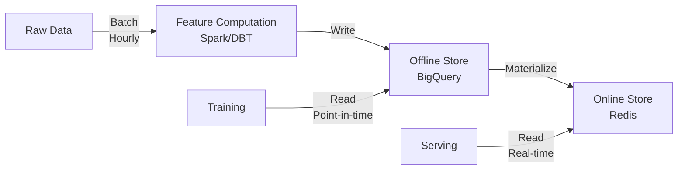

# Feature Store

## TL;DR
Centralized system for managing, versioning, and serving features. Handles feature computation (offline), storage, retrieval, and consistency between training and serving. Enables feature reuse across models and teams.

## Core Intuition
Without a feature store, teams compute features separately for training and serving—causing inconsistencies and wasted effort. A feature store is a shared database for features: one computation, used everywhere.

## How It Works
**Two-layer Architecture:**

1. **Offline Store (Training):**
   - Batch compute features (hourly, daily)
   - Store historical feature tables with timestamps
   - Enable point-in-time lookups (get features as of training date to prevent data leakage)
   - Example: user_id=123, day=2024-01-15 → {age: 35, purchases_30d: 12, country: USA}

2. **Online Store (Serving):**
   - Fast lookup cache (Redis, DynamoDB)
   - Serve fresh features in <50ms per request
   - Handle high QPS (10K+ requests/sec)
   - Automatic sync from offline store

**Workflow:**


## Key Properties / Trade-offs
| Aspect | Offline-Only | Online-Only | Both (Recommended) |
|--------|--------------|-------------|------------------|
| Freshness | Hours old | Real-time | Real-time for serving, historical for training |
| Cost | Cheap (batch) | Expensive (per-request) | Moderate (batch + cache) |
| Training-serving skew | High risk | Low risk | No skew |
| Latency | N/A | <50ms | <50ms serving |
| Complexity | Low | High | High |

## Common Mistakes / Gotchas
- **No offline store:** Train and serve compute features differently → skew
- **Missing point-in-time:** Train on latest data, serve on stale data → overfitting
- **No versioning:** Change feature computation → can't reproduce training
- **Ignoring consistency:** Offline and online features diverge → serving predictions differ from training
- **No feature ownership:** Teams hoard features, others duplicate work

## Best Practices
- **Version everything:** Tag feature set with date/hash. Reproducible training.
- **Schema validation:** Enforce feature names, types, ranges. Early error detection.
- **Point-in-time correctness:** Training must use features as of training_date, not current.
- **Monitoring:** Track feature freshness, staleness, missing values. Alert if data pipeline fails.
- **Document features:** Name, definition, owner, SLA. Enable feature reuse across teams.
- **Automate materialization:** Offline → Online sync on schedule (every 5 minutes for most use cases).
- **Test feature pipelines:** Unit tests for computation logic, integration tests for storage.

## Code Example

```python
from feast import FeatureStore, FeatureView, Field
from feast.infra.offline_stores.bigquery_source import BigQuerySource
from datetime import timedelta

# Define feature view
user_features = FeatureView(
    name="user_features",
    entities=["user_id"],
    ttl=timedelta(days=30),
    schema=[
        Field(name="age", dtype=int),
        Field(name="purchases_30d", dtype=int),
    ],
    source=BigQuerySource(table="bigquery_dataset.user_features_daily"),
    online=True  # Materialize to online store
)

# Usage in training
store = FeatureStore(repo_path=".")
training_df = store.get_historical_features(
    entity_df=train_entities,
    features=["user_features:age", "user_features:purchases_30d"],
    full_feature_names=True
)

# Usage in serving
online_features = store.get_online_features(
    features=["user_features:age", "user_features:purchases_30d"],
    entity_rows=[{"user_id": 123}]
)
print(online_features)  # {"user_features:age": 35, ...}
```

## Interview Q&A
**Q: How do you handle feature freshness trade-offs?**
A: Define SLA per feature: static features (user country) → daily refresh, trending features (user engagement) → hourly, real-time features (current page) → online-only (compute on-demand). Measure staleness: % of online features refreshed in last hour. Alert if <95% refreshed. For low-latency use cases, accept slight staleness (5-15 minutes) if it reduces serving cost.

**Q: Point-in-time correctness: why not just use current features for training?**
A: Data leakage. If you train on tomorrow's features to predict today's label, the model learns patterns that aren't available at prediction time. Example: train on purchase_30d = 100, predict churned=yes. At serving time, you have purchase_30d = 10 (stale), prediction is wrong. Solution: when building training set at day T, fetch features as of day T (not today), ensuring training data represents the state at prediction time.

**Q: Feature store overhead: when is it worth it?**
A: Worth it when: 3+ production models (feature reuse), features are recomputed regularly (cost savings), training-serving skew causes problems, or teams share features. Overhead: storage cost, infrastructure maintenance, initial setup (2-4 weeks). ROI appears at 10+ models or when skew prevents deployment.

## Interview Quick-Reference
| Metric | Target |
|--------|--------|
| Online latency | <50ms per feature |
| Offline-online staleness | <15 min |
| Feature ownership | 100% documented |
| Training-serving skew | 0 |

## Related Topics
- [Model Registry](04-model-registry.md) - stores trained models
- [Data Pipelines](02-data-pipelines.md) - computes features

## Resources
- [Feast: Open Source Feature Store](https://feast.dev)
- [Tecton: Managed Feature Platform](https://www.tecton.ai)
- [Feature Store Survey](https://arxiv.org/abs/2202.00359)
