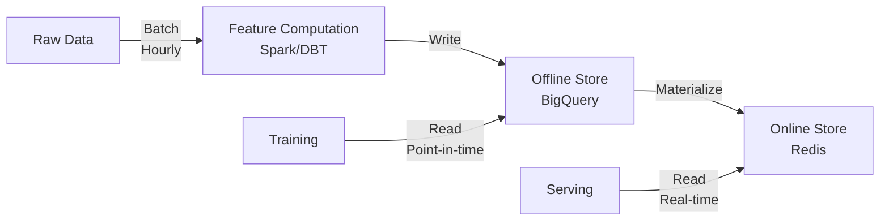

# Feature Store

## Detailed Description

Feature store is central repository managing, computing, storing, serving features across ML systems. Solves: feature computation inconsistency between training/serving, feature reuse, training-serving skew.

Without feature store: teams compute features separately for training (batch), batch serving (offline), online serving (real-time). Results: (1) training-serving skew (model trained on one features, serves on different), (2) duplicated work (same feature engineered 10 times), (3) no single source of truth.

Feature store has two-layer architecture: (1) offline store (data warehouse: BigQuery, Snowflake) storing historical feature tables with timestamps for training; (2) online store (low-latency cache: Redis, DynamoDB) for real-time serving. Features computed once in batch pipeline, automatically materialized to online store.

Key benefits: feature versioning (reproducibility), point-in-time correctness (training uses features from training date, preventing leakage), lineage tracking (know data sources), schema validation (catch type errors), monitoring (alert on staleness or missing values).

Modern platforms (Feast, Tecton, Databricks Feature Store) handle orchestration, versioning, monitoring—reducing setup from months to weeks.

## Core Intuition

Feature store = specialized library for ML features. Instead of each data scientist computing 'user_purchases_last_30_days', that computation lives once. Everyone uses same definition, same code, same schedule.

Prevents inconsistency: ML engineer computes feature, gets 1.2M average. Serving team computes similar code, gets 980K (different date ranges, null handling, stale batches). Model trained on 1.2M performs worse on 980K. This is training-serving skew.

With feature store: define feature once. Auto-computed daily. Syncs to cache. Training reads historical table (state from training date). Serving reads cache (real-time). Both get same feature definition, no skew.

Magic: point-in-time correctness. Training on January 15 → use features as of January 15 (not today). Prevents data leakage (future data predicting past labels).

Team payoff: (1) reuse (shared features across models = less engineering), (2) velocity (new feature in hours, not weeks), (3) observability (monitor all centrally), (4) reproducibility (retrain, get same features, same predictions).

## How It Works

**Two-layer Architecture:**

1. **Offline Store (Training):**
   - Batch compute features (hourly, daily)
   - Store historical feature tables with timestamps
   - Enable point-in-time lookups (get features as of training date to prevent data leakage)
   - Example: user_id=123, day=2024-01-15 → {age: 35, purchases_30d: 12, country: USA}

2. **Online Store (Serving):**
   - Fast lookup cache (Redis, DynamoDB)
   - Serve fresh features in <50ms per request
   - Handle high QPS (10K+ requests/sec)
   - Automatic sync from offline store

**Workflow:**


## Detailed Trade-off Analysis

| Aspect | Direct DB | Cache-Only | Feature Store | Dedicated Store |
|--------|-----------|-----------|---------------|-----------------|
| Latency | 100-500ms | <10ms | <50ms | <20ms |
| Cost | $100/mo | $500/mo | $2K/mo | $5K/mo |
| Consistency | Real-time | Eventual | Eventual | Eventual |
| Training-serving skew | High | Medium | Low | Low |
| Operational complexity | Low | Medium | High | Very High |
| Feature reuse | Poor | Medium | Excellent | Excellent |

**Cost breakdown (100 features):**
- Direct DB: Query cost + storage = $100-200/mo
- Cache-only: Redis $500/mo + manual sync = $500/mo
- Feature Store (Feast/Tecton): Platform $2-5K/mo
- Dedicated: Custom + 2-3 engineers $5-10K/mo

**Decision tree:**
- <5 features, 1 team: Direct DB (cheap, simple)
- 5-50 features, <3 teams: Cache-only (moderate cost)
- 50+ features, 3+ teams: Feature Store (ROI on complexity)
- Complex lineage requirements: Dedicated (full control)

**Real metrics:** Average time to add new feature = 2 days (direct DB) vs 2 hours (feature store). ROI: feature store pays off after 10-15 new features.

---

## Production Failure Scenarios

### Scenario 1: Feature store down, serving blocked
**What breaks:** Redis/DynamoDB unavailable. Serving requests fail.
**Detect:** Serving latency spikes, error_rate > 1%, feature_store_availability = 0
**Recover:** (1) Immediate: fallback to computing features on-demand (slow). (2) Failover: activate backup region. (3) Restore: bring primary back online
**Prevent:** Multi-region replication, circuit breaker for fallback, health checks

### Scenario 2: Offline-online feature divergence
**What breaks:** Batch computed price=100, online cached price=95 (stale). Model expects 100, serves on 95.
**Root cause:** Materialization lag (batch at 3:05pm, online updated at 3:25pm)
**Detect:** Alert if (feature_age > materialization_sla), KS-test offline vs online > 0.05
**Recover:** Manual materialization trigger, recompute online features
**Prevent:** Auto-materialize on batch completion, monitor sync lag, alert if divergence

### Scenario 3: Point-in-time lookup broken
**What breaks:** Training requests feature as-of 2024-01-15, gets 2024-01-16 (future data). Model overfits.
**Root cause:** Missing or incorrect timestamps in offline store
**Detect:** Training job uses current features instead of historical (automated check)
**Recover:** Audit training for leakage, retrain with correct dates
**Prevent:** Enforce timestamp validation, test point-in-time correctness, fail training if using current

### Scenario 4: Feature schema mismatch
**What breaks:** Feature changed from int to float. Training code expects int, inference crashes.
**Root cause:** Feature definition updated without versioning
**Detect:** Schema validation failure, inference errors
**Recover:** Rollback feature definition, retrain models
**Prevent:** Breaking changes require schema migration, test compatibility, version schemas

---

## Implementation Guidance & Gotchas

**❌ Wrong: Direct DB queries in training and serving (different logic)**
```python
# Training
features = bigquery.query(f"SELECT * FROM users WHERE user_id={uid}")

# Serving  
features = redis.get(f"user:{uid}")  # Different = skew
```

**✅ Right: Feature store abstraction (same API, different backends)**
```python
fs = FeatureStore(...)
# Training: routes to offline store (BigQuery)
features = fs.get_historical_features(entities, as_of="2024-01-15")
# Serving: routes to online store (Redis)
features = fs.get_online_features(entities)
```

**Edge cases:**
- Feature freshness SLA varies by use case (real-time: <1min, batch: 24h)
- Null handling differs between systems (BigQuery vs Redis)
- Numeric precision (Python float vs DB float)

**Testing:**
```python
def test_point_in_time():
    # Get features as-of 2024-01-15
    hist = fs.get_historical_features(as_of="2024-01-15")
    # All rows should be from 2024-01-15, not future
    assert hist['timestamp'].max() <= "2024-01-15"

def test_offline_online_parity():
    # Same entity from both stores
    offline = fs.get_historical_features(entities, as_of=today)
    online = fs.get_online_features(entities)
    # Features should be identical (within tolerance for numeric precision)
    assert_features_equal(offline, online, tolerance=0.001)
```

---

## Sophisticated Interview Q&A

**Q1: Feature diverges between offline (training) and online (serving). Root cause and fix?**
A: Materialization lag. Offline computed value=100 at 3:05pm. Online still has value=95 from 1 hour ago. Model trained on 100, serves on 95 → predictions differ.

Fix: (1) Monitor materialization latency, alert if >15min. (2) Auto-materialize on batch completion (not on schedule). (3) Serving fallback: if online stale >30min, compute on-demand. (4) Test parity: compare offline vs online on same entities.

**Q2: Train on historical features (2024-01-15), serve on current. Data leakage risk?**
A: Yes, if model trained on features from 2024-01-15 + labels from 2024-01-16 (future data). That's leakage.

Solution: Point-in-time correctness. Training loads features as-of training_date (2024-01-15) with labels from that date. Serving loads current features (2024-01-20). Different dates = correct.

**Q3: 50 features, offline computed daily, serving needs real-time. Cost-conscious approach?**
A: Hybrid. Batch 90% (cheap, 1/day), stream 10% (expensive, real-time). Offline computes all 50 daily. Online: 45 features cached from batch, 5 features streamed. Serving: lookup 45 (fast), 5 on-demand (slower). Overall cost: mostly batch.

**Q4: Feature store costs $5K/mo. Worth it vs direct DB approach?**
A: Depends on team productivity. Feature store value = time saved per team × number of teams × hourly rate.

Example: Saves 1 month engineer-time per team × 3 teams × $20K/month = $60K benefit. Cost $5K/mo = $60K/year. ROI: 10x. Yes, worth it.

**Q5: Multiple feature stores (batch vs real-time)? Consolidate?**
A: Only if SLAs allow. If batch features acceptable 24h old but serving needs <1min, use separate stores (optimized for each). Single unified API hides complexity. If both need same SLA: consolidate.

**Q6: Feature added but not in online store. Training uses it, serving fails. Prevent?**
A: Schema consistency checks. After batch compute, validate: (1) Feature exists in offline store. (2) Feature materialized to online store. (3) Online feature matches offline type/shape. Alert if mismatch.

**Q7: Point-in-time correctness broken. How detect?**
A: Test: Training uses features as-of training_date, not current date. Automated check: load training data, verify all timestamps <= training_date. Fail training if violation detected.

---

## Cost & Resource Analysis

**Infrastructure costs (100 concurrent features):**
```
Offline store (BigQuery): 
  - Storage 5TB @ $0.023/GB = $115/mo
  - Queries: ~$50/day = $1,500/mo
  - Total: $1,615/mo

Online store (Redis):
  - 10GB @ $0.50/GB = $5/mo

Feature store platform (Feast/Tecton):
  - Managed service: $2,000-5,000/mo

Total: $3,620-6,620/mo
```

**Operational overhead:**
- Daily materialization: 30 min/day (automated)
- Incident response: 1 per month × 30 min
- Documentation/governance: 5 hours/week
- Total: 20-30 hours/week (1-2 engineers)

**ROI calculation:**
- Feature store value = (time saved/team) × (# teams) × (hourly rate) - platform cost
- Example: 10 hours saved/team × 5 teams × $150/hour = $7,500/month savings
- Cost: $5,000/month platform
- Net: $2,500/month benefit (6 month payoff)

**Optimization:**
- Incremental materialization (only changed features)
- Selective online store (only hot features online, rest batch)
- Feature caching (don't recompute static features)

---

## Monitoring & Observability Patterns

**Key metrics:**
```
feature_freshness_minutes: Age of oldest feature in online store
  - Alert: > 60 minutes (SLA breach)

materialization_latency_minutes: Time from offline compute to online sync
  - Alert: > 15 minutes

offline_online_divergence: KS-test comparing distributions
  - Alert: KS-test > 0.05 (features diverging)

feature_null_count_pct: Percentage nulls per feature
  - Alert: > 0.1% for critical features

serving_latency_p99: Time to fetch features at request
  - Alert: > 100ms (SLA breach if <50ms required)
```

**Alerts:**
```
CRITICAL: feature_freshness > 120 minutes (store down?)
WARNING: materialization_latency > 30 minutes
CRITICAL: offline_online_divergence KS > 0.05
CRITICAL: null_count > 0.1%
WARNING: serving_latency_p99 > 75ms (trending)
```

**Health checks:**
- Offline store accessible: Can query table
- Online store accessible: Can fetch from Redis/DynamoDB
- Materialization working: Feature updated in last 2 hours
- Schema match: offline columns == online fields

**Debugging:**
- Feature stale? Check if batch ran. Check materialization job status.
- Serving slow? Check online store latency and load. Consider caching strategy.
- Training-serving skew? Compare offline vs online features. Should be identical.

## Key Properties / Trade-offs

| Aspect | Offline-Only | Online-Only | Both (Recommended) |
|--------|--------------|-------------|------------------|
| Freshness | Hours old | Real-time | Real-time for serving, historical for training |
| Cost | Cheap (batch) | Expensive (per-request) | Moderate (batch + cache) |
| Training-serving skew | High risk | Low risk | No skew |
| Latency | N/A | <50ms | <50ms serving |
| Complexity | Low | High | High |

## Common Mistakes / Gotchas

- **No offline store:** Train and serve compute features differently → skew
- **Missing point-in-time:** Train on latest data, serve on stale data → overfitting
- **No versioning:** Change feature computation → can't reproduce training
- **Ignoring consistency:** Offline and online features diverge → serving predictions differ from training
- **No feature ownership:** Teams hoard features, others duplicate work

## Best Practices

- **Version everything:** Tag feature set with date/hash. Reproducible training.
- **Schema validation:** Enforce feature names, types, ranges. Early error detection.
- **Point-in-time correctness:** Training must use features as of training_date, not current.
- **Monitoring:** Track feature freshness, staleness, missing values. Alert if data pipeline fails.
- **Document features:** Name, definition, owner, SLA. Enable feature reuse across teams.
- **Automate materialization:** Offline → Online sync on schedule (every 5 minutes for most use cases).
- **Test feature pipelines:** Unit tests for computation logic, integration tests for storage.

## Code Example

```python
from feast import FeatureStore, FeatureView, Field
from feast.infra.offline_stores.bigquery_source import BigQuerySource
from datetime import timedelta

# Define feature view
user_features = FeatureView(
    name="user_features",
    entities=["user_id"],
    ttl=timedelta(days=30),
    schema=[
        Field(name="age", dtype=int),
        Field(name="purchases_30d", dtype=int),
    ],
    source=BigQuerySource(table="bigquery_dataset.user_features_daily"),
    online=True  # Materialize to online store
)

# Usage in training
store = FeatureStore(repo_path=".")
training_df = store.get_historical_features(
    entity_df=train_entities,
    features=["user_features:age", "user_features:purchases_30d"],
    full_feature_names=True
)

# Usage in serving
online_features = store.get_online_features(
    features=["user_features:age", "user_features:purchases_30d"],
    entity_rows=[{"user_id": 123}]
)
print(online_features)  # {"user_features:age": 35, ...}
```

## Interview Q&A

Q: 50 ML models, many sharing features. When invest in feature store?
A: A: ROI threshold: ~3-5 models with >30% feature overlap, or training-serving skew causing problems. Costs: $5-10K/month managed, 2-4 weeks engineering setup. Benefits: 3 shared features × 4 hrs each × 5 duplicate teams = 60 hours saved/quarter. At $150/hr, pays for itself month 1.

Q: Feature computation 6 hours, serving needs <100ms latency?
A: A: (1) Offline: batch compute daily in 6 hours → BigQuery. (2) Materialize: sync to Redis every 5 min (lightweight copy). (3) Serve: Redis lookup (<5ms) + on-demand for expensive features. Feast orchestrates. If feature fresh in Redis, serve it; else fallback or stale (flag it).

Q: Prevent data leakage in training. Point-in-time correctness how?
A: A: Store timestamps with features. Training: for each label_date=2024-01-15, fetch features where feature_date ≤ 2024-01-15. Prevents future data predicting past. Feature store's get_historical_features(entity_df, as_of_date) handles this.

Q: Feature A hourly, Feature B daily. Both in same store?
A: A: Yes, configure separately. Feature A: refresh=1hr, ttl=2hrs. Feature B: refresh=1day, ttl=2days. If A stale, return+flag or wait (trade: staleness vs latency).

Q: Fixed bug in feature computation. Backfill without breaking production?
A: A: (1) Create v2. (2) Backfill all historical dates. (3) Dual-write: new models→v2, old→v1. (4) Canary: 10% v2, 90% v1. Monitor predictions differ >5%? Investigate. (5) Full cutover. (6) Archive v1.

Q: Features changing slowly (user country yearly)?
A: A: Slowly changing dimensions (SCD). {user_id:123, country:'USA', effective:2023-01-01, end:2024-01-01}. Training 2023-06-15→'USA'. Training 2024-06-15→'Canada'. Feature store with SCD support handles.

Q: 10% Feature A missing. Handle?
A: A: (1) Flag schema: nullable=True. (2) Strategy: forward_fill, zero, or mean. (3) Monitor: log when imputing, alert if >5%. (4) Model awareness: pass is_imputed flag. Never silent impute.

Q: Scale 10→10K features × 100 models. Bottlenecks?
A: A: (1) Storage: 8TB, compress/archive old. (2) Latency: lazy-load, feature prune, cache top 100. (3) Compute: parallel, bin-pack. Use managed platform (DIY breaks here).
## Interview Quick-Reference

| Metric | Target |
|--------|--------|
| Online latency | <50ms per feature |
| Offline-online staleness | <15 min |
| Feature ownership | 100% documented |
| Training-serving skew | 0 |

## Related Topics

- [Model Registry](04-model-registry.md) - stores trained models
- [Data Pipelines](02-data-pipelines.md) - computes features

## Resources

- [Feast: Open Source Feature Store](https://feast.dev)
- [Tecton: Managed Feature Platform](https://www.tecton.ai)
- [Feature Store Survey](https://arxiv.org/abs/2202.00359)

