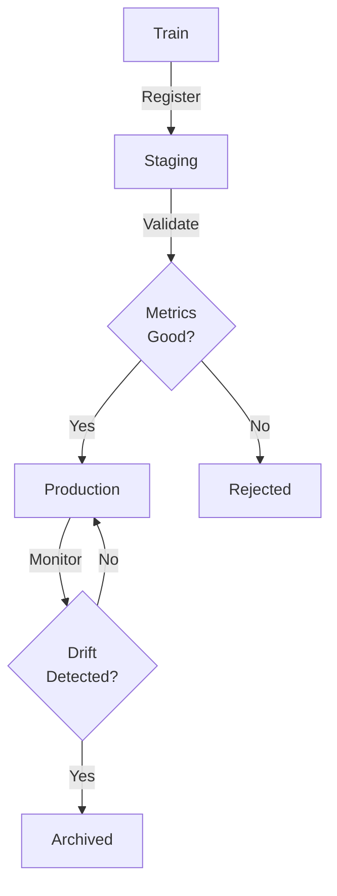

# Model Registry

## TL;DR
Centralized repository for managing model artifacts, metadata, and versions. Tracks: model binaries, hyperparameters, metrics, training data, code version. Enables reproducibility, comparison, and safe deployment.

## Core Intuition
A model registry is a version control system for trained models. Just as Git tracks code versions, a registry tracks model versions—enabling rollback, comparison, and safe promotion to production.

## How It Works
**Model Lifecycle in Registry:**



**Stored Metadata:**
- Model binary (pickle, ONNX, SavedModel)
- Hyperparameters (learning_rate, depth, ...)
- Training metrics (accuracy, loss, F1)
- Training data: commit hash, date range
- Code version: git commit hash
- Status: staging/production/archived
- Owner, creation date, update date

## Key Properties / Trade-offs
| Aspect | Git-based | Artifact Store | Managed Registry |
|--------|-----------|---|---|
| Ease of setup | Hard (manual) | Medium | Easy |
| Version control | Manual | Automatic | Automatic |
| Metadata | Limited | Good | Excellent |
| Cost | Free | Low | Moderate |
| Scalability | Poor | Medium | Excellent |

## Common Mistakes / Gotchas
- **No registry:** models scattered across drives, impossible to reproduce
- **No versioning:** can't rollback to previous model if new one fails
- **Missing metadata:** don't remember what data was used for training
- **No code tracking:** model trained on code that's since been deleted
- **Ignoring status:** promote to prod without validation

## Best Practices
- **Immutable versions:** once registered, don't modify. Create new version if changes needed.
- **Separate staging/prod:** validate models in staging before promotion.
- **Tag with git hash:** enable reproduction. Can rebuild exact model from git commit.
- **Store metrics alongside:** accuracy, precision, recall. Enable easy comparison.
- **Automated promotion:** promote if test accuracy improves by >1%. Reduce manual overhead.
- **Monitor production model:** detect drift, performance degradation. Trigger retraining alert.
- **Cleanup old versions:** retention policy (keep 5 latest, delete rest). Manage storage cost.

## Code Example

```python
import mlflow
import mlflow.sklearn

# Train and register
with mlflow.start_run():
    model = train_model(data)
    mlflow.log_params({"lr": 0.01, "epochs": 100})
    mlflow.log_metrics({"accuracy": 0.95, "f1": 0.92})
    mlflow.sklearn.log_model(model, "model")
    
    # Register in registry
    mlflow.register_model(
        model_uri=f"runs:/{mlflow.active_run().info.run_id}/model",
        name="fraud_detector"
    )

# Promote to production
client = mlflow.tracking.MlflowClient()
client.transition_model_version_stage(
    name="fraud_detector",
    version=2,
    stage="Production"  # Staging -> Production
)

# Serve from registry
production_model = mlflow.pyfunc.load_model(
    "models:/fraud_detector/Production"
)
prediction = production_model.predict(data)
```

## Interview Q&A
**Q: How do you compare models in the registry?**
A: Tag models with metrics (accuracy, F1, latency). Query registry for top-5 by accuracy. Deploy side-by-side with shadow traffic (serve both, compare predictions). Use A/B testing framework to measure business impact. Clear winner? Promote. Close call? Keep both, monitor longer.

**Q: Rollback scenario: new model deployed, but causing issues in production. What's the SOP?**
A: Registry should store previous production model version. Within seconds, switch traffic back to previous model (configuration change, no redeployment). Investigate new model. Once fixed, re-register and redeploy. Total downtime: <1 minute. Without registry, rollback is manual and slow.

## Interview Quick-Reference
| Item | Detail |
|------|--------|
| Versioning | Immutable, git-backed |
| Status | Staging → Production → Archived |
| Metadata | Metrics, hyperparams, training data |
| Promotion | Automated on test performance |

## Related Topics
- [Model Serving](05-model-serving.md) - serves from registry
- [A/B Testing](14-ab-testing.md) - compares models

## Resources
- [MLflow Model Registry](https://mlflow.org/docs/latest/model-registry.html)
- [DVC Model Registry](https://dvc.org/)
- [Seldon Model Store](https://docs.seldon.io/projects/seldon-core/en/latest/graph/model_signatures.html)
