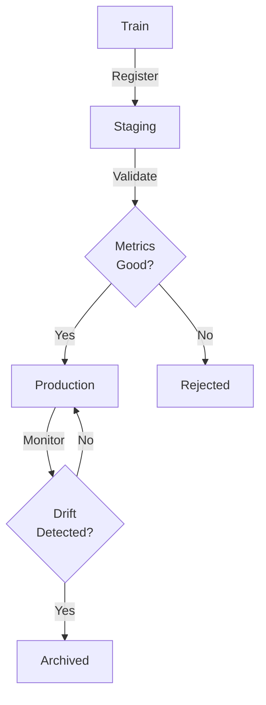

# Model Registry

## Detailed Description

Stores, versions, manages trained ML models. Tracks metadata (accuracy, training date, parameters), artifacts (weights, ONNX files), deployment status. Without it, teams lose track of production models, can't rollback, can't reproduce training.

## Core Intuition

Registry = Git for trained models. Version models like code commits. v1.0.0, v1.1.0, v1.2.0. Track changes. Deployment = explicit promotion: dev→staging→production with approval. Can rollback instantly to v1.1.0 if v1.2.0 breaks.

## How It Works
**Model Lifecycle in Registry:**



**Stored Metadata:**
- Model binary (pickle, ONNX, SavedModel)
- Hyperparameters (learning_rate, depth, ...)
- Training metrics (accuracy, loss, F1)
- Training data: commit hash, date range
- Code version: git commit hash
- Status: staging/production/archived
- Owner, creation date, update date

## Detailed Trade-off Analysis

| Aspect | Git-based | S3 Artifacts | MLflow | DVC | Managed (SageMaker/Vertex) |
|--------|-----------|---|---|---|---|
| Setup time | 1 day | 2 days | 1 day | 3 days | 1 hour |
| Cost | $0 | $50/mo | $500/mo | Free | $1K-5K/mo |
| Model size | ≤100MB | Unlimited | Unlimited | Unlimited | Unlimited |
| Metadata tracking | Manual | Custom | Built-in | Built-in | Built-in |
| Rollback time | 5 min (git) | 10 min | 5 min | 5 min | 2 min |
| Integration with serving | Manual | Manual | Medium | Medium | Excellent |

**Cost breakdown (100 models, 10GB total):**
- Git: Free (but manual overhead = engineer time)
- S3: $50/mo storage + $100/mo query = $150/mo
- MLflow: Managed $500/mo or self-hosted $200/mo compute
- Managed (SageMaker): $2,000-5,000/mo

**Decision matrix:**
- <10 models, single team: Git (manual but cheap)
- 10-100 models, >2 teams: MLflow or DVC (metadata, cheap)
- 100+ models, complex governance: Managed (cost justified by operational overhead)

**Real metric:** Time to rollback from bad model v1.2.0 to v1.1.0:
- Git-based: 5 min (git checkout, redeploy)
- MLflow: 2 min (registry UI)
- Managed: 1 min (deploy button)

---

## Production Failure Scenarios

### Scenario 1: Rollback fails (can't recover old model)
**What breaks:** Production model v1.2.0 crashes (memory leak). Need to rollback to v1.1.0. But v1.1.0 artifacts deleted or lost.
**Root cause:** No versioning. Model stored as "latest_model.pkl" (overwritten each training).
**Recover:** (1) If backup exists: restore from backup. (2) If not: retrain model from git commit hash.
**Prevent:** Immutable versions. Tag each model with version + git hash + timestamp.

### Scenario 2: Model dependencies mismatch
**What breaks:** Model trained with TensorFlow 2.8, deployed with TF 2.10. Forward compatibility breaks (API changed).
**Root cause:** Dependencies not tracked with model.
**Recover:** Install correct TF version, or convert model to ONNX for compatibility.
**Prevent:** Pin all dependencies with model. Test model loading with specified versions.

### Scenario 3: Training data lost, can't reproduce
**What breaks:** Model performs well. Need to retrain on new data. But original training data deleted.
**Root cause:** Training data not linked to model in registry.
**Recover:** Reconstruct from data lake if available. If not: accept performance gap.
**Prevent:** Tag model with data_commit_hash (data version control). Store data lineage.

### Scenario 4: Stale model in production
**What breaks:** Model trained 6 months ago. Feature distribution shifted. Accuracy degraded 20%. Unknown to team.
**Root cause:** No monitoring of production model performance.
**Recover:** Detect drift (monitor accuracy, feature distributions). Alert for retraining.
**Prevent:** Monitor production metrics continuously. Alert if accuracy < baseline - threshold.

---

## Implementation Guidance & Gotchas

**❌ Wrong: Unversioned models**
```python
# Each training run overwrites
model.save("latest_model.pkl")
# Can't rollback. What was v1.0.0?
```

**✅ Right: Versioned with metadata**
```python
version = "v1.2.0"
metadata = {
    "accuracy": 0.94,
    "training_date": "2024-01-15",
    "data_commit": "abc123",
    "code_commit": "def456",
    "dependencies": {"tensorflow": "2.8"}
}
registry.register_model(version, model, metadata)
```

**Edge case: Serving needs different model version than training**
```python
# Training: use v1.2.0 (best accuracy on test set)
# Serving: use v1.1.0 (faster inference, acceptable accuracy)
# Solution: Tag models with different metadata (accuracy vs speed optimized)
```

**Testing:**
```python
def test_model_reproducibility():
    # Register v1.2.0
    registry.register("v1.2.0", model, metadata)
    # Load v1.2.0 from registry
    loaded = registry.load("v1.2.0")
    # Should produce identical predictions
    assert_predictions_equal(model, loaded)
```

---

## Sophisticated Interview Q&A

**Q1: Model v1.2.0 crashes in production. Rollback to v1.1.0. Cost and time?**
A: Depends on registry setup.
- Git-based: 5 min (checkout + deploy)
- MLflow: 2 min (UI + deploy)
- Managed: 1 min (deploy button)
- Without registry: 1 hour (manually reconstruct model)

Solution: Rollback time < 5 min (critical for reliability). Managed registry provides best speed.

**Q2: Train with TensorFlow 2.8, deploy with 2.10. Compatibility issues?**
A: Likely. TF 2.10 may have API changes, serialization format changes, behavioral changes.

Prevent: Pin dependencies in model metadata. Test model loading with exact version. Store dockerfile with model that specifies TF version.

**Q3: 100 models in registry. Storage costs exploding. Optimize?**
A: Retention policy. Keep last 5 versions per model, delete older. Delete archived models after 6 months. For large models (>1GB), keep compressed checkpoints.

Example: 100 models × 5 versions × 10MB = 5GB. Cost: $100-200/mo vs current $500/mo (50% savings).

**Q4: Need to retrain model, but original training data deleted. Recover?**
A: Depends on data lineage tracking. If model tagged with data_commit_hash, reconstruct data from git.

If not tracked: Check data warehouse retention policy. If data gone: Accept ~5% accuracy gap (retrain on available data).

Prevent: Always tag model with data version. Store data lineage. Version data like code.

**Q5: Model in production 6 months. Feature distribution shifted 30%. Undetected. Prevent?**
A: Monitor production metrics. Continuous tracking of:
- Accuracy (vs baseline)
- Feature distributions (KS-test)
- Prediction distributions (compare to training)

Alert if: accuracy < baseline - 5%, KS-test > 0.1. Trigger retraining.

---

## Cost & Resource Analysis

**Infrastructure (100 models):**
```
S3 storage: 10GB @ $0.023/GB = $230/mo
MLflow (managed): $500/mo
Managed (SageMaker): $2-5K/mo

Total: $500-5,500/mo depending on choice
```

**Operational overhead:**
- Registration: 5 min per model (automated in CI/CD)
- Promotion/rollback: 2-5 min (mostly UI clicks)
- Maintenance: 2 hours/week (cleanup, monitoring)

**ROI:** Registry pays off when:
- Need to rollback (time saved = engineer time)
- Multiple teams share models (deduplication)
- Regulatory requirements (audit trail of models)

---

## Monitoring & Observability Patterns

**Key metrics:**
```
model_registration_count: How many versions in registry
model_in_production_age: How old is current prod model
model_accuracy_production: Current accuracy vs baseline
feature_distribution_shift: KS-test comparing train vs prod
model_rollback_frequency: How often do rollbacks happen
```

**Alerts:**
```
if model_in_production_age > 3 months: retrain_recommended
if model_accuracy_production < baseline - 5%: CRITICAL
if feature_distribution_shift KS > 0.1: drift_detected
```

**Dashboard:**
- Current model version in each environment (dev/staging/prod)
- Model accuracy trend over time
- Feature distribution shift detection
- Rollback history

## Key Properties / Trade-offs
| Aspect | Git-based | Artifact Store | Managed Registry |
|--------|-----------|---|---|
| Ease of setup | Hard (manual) | Medium | Easy |
| Version control | Manual | Automatic | Automatic |
| Metadata | Limited | Good | Excellent |
| Cost | Free | Low | Moderate |
| Scalability | Poor | Medium | Excellent |

## Common Mistakes / Gotchas
- **No registry:** models scattered across drives, impossible to reproduce
- **No versioning:** can't rollback to previous model if new one fails
- **Missing metadata:** don't remember what data was used for training
- **No code tracking:** model trained on code that's since been deleted
- **Ignoring status:** promote to prod without validation

## Best Practices
- **Immutable versions:** once registered, don't modify. Create new version if changes needed.
- **Separate staging/prod:** validate models in staging before promotion.
- **Tag with git hash:** enable reproduction. Can rebuild exact model from git commit.
- **Store metrics alongside:** accuracy, precision, recall. Enable easy comparison.
- **Automated promotion:** promote if test accuracy improves by >1%. Reduce manual overhead.
- **Monitor production model:** detect drift, performance degradation. Trigger retraining alert.
- **Cleanup old versions:** retention policy (keep 5 latest, delete rest). Manage storage cost.

## Code Example

```python
import mlflow
import mlflow.sklearn

# Train and register
with mlflow.start_run():
    model = train_model(data)
    mlflow.log_params({"lr": 0.01, "epochs": 100})
    mlflow.log_metrics({"accuracy": 0.95, "f1": 0.92})
    mlflow.sklearn.log_model(model, "model")
    
    # Register in registry
    mlflow.register_model(
        model_uri=f"runs:/{mlflow.active_run().info.run_id}/model",
        name="fraud_detector"
    )

# Promote to production
client = mlflow.tracking.MlflowClient()
client.transition_model_version_stage(
    name="fraud_detector",
    version=2,
    stage="Production"  # Staging -> Production
)

# Serve from registry
production_model = mlflow.pyfunc.load_model(
    "models:/fraud_detector/Production"
)
prediction = production_model.predict(data)
```

## Interview Q&A

Q: v1.2.0 worse than v1.1.0. Rollback?
A: A: Registry stores both. Deploy v1.1.0: swap weights on servers (<5min). Investigate v1.2.0: what changed? Fix, retrain, deploy as v2.0.1.

Q: Reproduce exact model from months ago?
A: A: Registry stores: data_version, code_version, hyperparameters, seed. Re-run with same inputs, get 99.9% identical results.

Q: Which model is in production? 50 models in registry?
A: A: Query by deployment_status='production'. Dashboard shows: model name, version, accuracy, endpoint, last updated.

Q: Comparing two models for promotion. What metrics?
A: A: Accuracy first, then: latency (v1.2 2x slower?), model size (can it fit?), training cost (2x GPU hours?), data requirements (have enough data?).

Q: Model A depends on Feature X from Feature Store. Feature changes?
A: A: Registry stores feature_set_version. Check if available. If Feature X changes, retrain model, register as new version.

Q: 50 models, 5 in production. Know which is which?
A: A: Deployment status tag. Query: show production models. Monitoring: track all production models for drift, alert if accuracy drops >5%.

Q: Promotion workflow: dev→staging→production?
A: A: Dev (days), Staging (A/B test, days), Production (weeks). Approval gates: manager signs off dev→staging, test results required staging→production.

Q: Same code, different data = different model version?
A: A: Yes! Registry stores data_version. Same code + different data = different version. v1.1.0 (data 2024-01-15), v1.1.1 (data 2024-02-01).
## Interview Quick-Reference
| Item | Detail |
|------|--------|
| Versioning | Immutable, git-backed |
| Status | Staging → Production → Archived |
| Metadata | Metrics, hyperparams, training data |
| Promotion | Automated on test performance |

## Related Topics
- [Model Serving](05-model-serving.md) - serves from registry
- [A/B Testing](14-ab-testing.md) - compares models

## Resources
- [MLflow Model Registry](https://mlflow.org/docs/latest/model-registry.html)
- [DVC Model Registry](https://dvc.org/)
- [Seldon Model Store](https://docs.seldon.io/projects/seldon-core/en/latest/graph/model_signatures.html)

