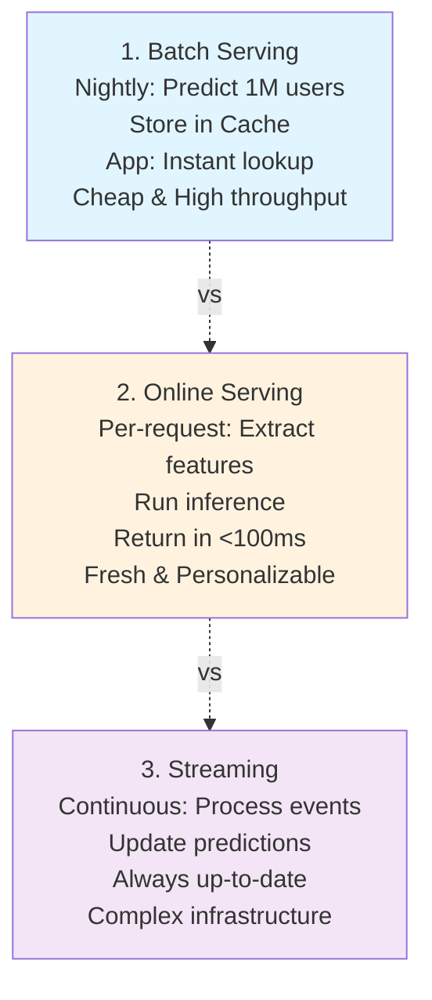

# Model Serving

## Detailed Description

Infrastructure deploying trained models to production. Handles requests, executes model inference, returns predictions. Requires: scalability (handle peak traffic), latency (respond in <100ms), reliability (99.9% uptime), cost-efficiency.

## Core Intuition

Serving = API endpoint for model predictions. Request: features → Inference engine executes model → Response: prediction. Must scale: handle 10K req/sec. Must be fast: <100ms latency. Must be reliable: auto-failover, monitoring.

## How It Works

**Serving Patterns:**



**Pattern Details:**

- **Batch Serving:** Run nightly on all users → compute churn scores → store in DB/cache → app queries (instant). Cheap, high throughput, but predictions are stale (24 hours old).
- **Online Serving:** User requests → extract live features → inference → <100ms response. Fresh and personalizable, but expensive (scale with request volume) and requires fast inference.
- **Streaming:** Kafka topics (user actions) → Stream processor (apply model) → update scores. Always up-to-date, handles high volume, but complex infrastructure.

**Serving Frameworks:**

| Framework | Best For | Latency | Throughput |
|-----------|----------|---------|-----------|
| TensorFlow Serving | Large scale, TF models | 10-50ms | 1000+ req/sec |
| TorchServe | PyTorch models | 10-50ms | 1000+ req/sec |
| ONNX Runtime | Any model (via ONNX) | 5-30ms | 1000+ req/sec |
| FastAPI | Custom Python | 5-20ms | 500+ req/sec |
| Seldon Core | Kubernetes native | 10-100ms | 100-1000 req/sec |
| vLLM | LLMs specifically | 20-500ms | 10-100 req/sec (token generation) |

**Architecture Example (Online Serving at Scale):**
```
                    Load Balancer
                        |
          _______________+_______________
         /               |               \
      Replica1        Replica2        Replica3
      (GPU)           (GPU)           (GPU)
        |               |               |
        +-------+-------+-------+-------+
                |
        Feature Store (Cache)
                |
        Database / Redis
```

## Key Properties / Trade-offs

| Aspect | Batch | Online |
|--------|-------|--------|
| Latency | Minutes-hours | <100ms |
| Freshness | Stale | Real-time |
| Cost | Low (compute once) | High (per-request) |
| Scalability | Linear with data | Linear with requests |
| Storage | High (precomputed) | None |
| Personalization | Limited | Full |

**Compute Resource Selection:**
```
CPU:
  - Good for: tree models (XGBoost), simple models
  - Cost: cheap
  - Latency: 10-100ms
  
GPU:
  - Good for: deep learning, large models
  - Cost: expensive
  - Latency: 5-50ms (with good utilization)
  
TPU/Accelerator:
  - Good for: very high throughput (LLMs, large batch)
  - Cost: moderate-high
  - Latency: <10ms for optimized models
```

## Best Practices

- **Match the serving pattern to requirements:** Batch for low-latency-tolerance use cases (off-peak reports), online for <100ms requirements, streaming for continuous updates.
- **Always version models:** Tag with git commit hash. Serve multiple versions in parallel; switch via config (no redeployment needed).
- **Enforce preprocessing parity:** Use identical preprocessing for training and serving. Version preprocessing code with models.
- **Implement comprehensive health checks:** Liveness (is process alive), readiness (is model loaded and responsive), deep health (are all dependencies reachable).
- **Use containerization + orchestration:** Docker containers for reproducibility, Kubernetes for autoscaling and rollback capabilities.
- **Batch requests:** Group inference into batches (32-256) for 10-100x throughput improvement vs. single-request inference.
- **Monitor serving metrics:** Latency, throughput, prediction distribution, error rates. Alert on latency degradation or distribution shift.

## Common Mistakes / Gotchas

- **Training/serving skew:** Model trained differently than served (different preprocessing, libraries). Use same code for both.
- **Feature mismatch:** Features at serving time ≠ features at training. Validate schema.
- **Not handling latency:** Model takes 200ms but SLA is 50ms. Needs optimization (quantization, caching, approximate inference).
- **Cold start:** Model not loaded → first request times out. Preload models, use autoscaling warmup.
- **Resource exhaustion:** No request limiting → requests pile up → system crashes. Add queue, rate limiting, circuit breaker.
- **No versioning:** Can't rollback bad model. Tag versions, serve multiple versions, switch via config.
- **Ignoring dependency versions:** Model trained with TF 2.8, served with TF 2.10 → incompatible. Pin dependencies.
- **Single replica:** One replica dies → 0% availability. Always have redundancy, health checks, failover.

## Detailed Trade-off Analysis

| Aspect | Batch | Online | Streaming |
|--------|-------|--------|-----------|
| Latency | 6-24h | <100ms | 100-500ms |
| Cost | $500/mo | $10K+/mo | $5K/mo |
| Complexity | Low | Medium | High |
| Personalization | Low | High | Medium |
| Throughput | 100M/day | 10K QPS | 10K QPS |

**Cost model (1M predictions/day):**
- Batch: Spark + compute = $500/mo
- Online: GPU × 10K QPS = $10K+/mo
- Streaming: Flink + continuous = $5K/mo

**Decision:** Batch for <1h latency tolerance. Online for personalization. Stream for continuous updates.

---

## Production Failure Scenarios

### Scenario 1: Model loading timeout (cold start)
**What breaks:** Deploy new model. First requests hang (30s timeout). Users see 504 errors.
**Root cause:** Model 500MB, takes 20s to load. Concurrent requests during warmup = all timeout.
**Recover:** Increase timeout to 60s. Pre-warm replicas before traffic.
**Prevent:** Pre-load models at startup. Use async loading. Measure cold start time.

### Scenario 2: Latency SLA breach (p99 > 200ms)
**What breaks:** Model takes 150ms, network 50ms, post-processing 50ms = 250ms total (SLA 200ms).
**Root cause:** Model quantization/optimization missing. Feature fetch slow.
**Recover:** Optimize slow component. Quantize model (int8). Cache features.
**Prevent:** Profile inference. Optimize to <50ms. Leave headroom.

### Scenario 3: Training-serving skew
**What breaks:** Model trained with preprocessing v1, served with v2 (different normalization). Predictions differ.
**Root cause:** Preprocessing code updated in serving but not in training.
**Recover:** Revert preprocessing. Retrain model.
**Prevent:** Share preprocessing code between training/serving. Version together.

---

## Implementation Guidance & Gotchas

**❌ Wrong: Single replica, process requests one-by-one**
```python
for request in requests:
    features = extract(request)
    pred = model.predict(features)
```

**✅ Right: Batch requests, multiple replicas**
```python
batch_size = 32
replicas = 10
for batch in requests.batch(batch_size):
    features = extract_batch(batch)
    preds = model.predict(features)  # 10-50x faster
```

**Edge case: Model too large for memory**
- Solution: Model sharding (split weights across GPUs), distillation (50% smaller), quantization

**Testing:**
```python
def test_latency():
    assert model.predict_latency < 50ms

def test_concurrent_requests():
    # 100 concurrent requests shouldn't timeout
    assert handle_concurrent(100) without timeout
```

---

## Sophisticated Interview Q&A

**Q1: 10K req/sec, <100ms SLA. Architecture?**
A: Kubernetes cluster, 20-50 replicas (GPU). Load balancer distributes. Cache predictions (80% cache hit = 5x reduction). Batch requests (32 per batch). Result: <50ms p99.

**Q2: Model too large (GPU OOM). Fix?**
A: (1) Quantization (fp32→int8, 50% smaller). (2) Distillation (teach smaller model). (3) Model sharding (split across GPUs). (4) Tensor serving (split layers). Choose based on accuracy trade-off.

**Q3: A/B test serving. Route 5% to new model. Monitor what?**
A: Error rate, latency, prediction distribution. If good, shift to 50%, then 100%. If bad, rollback to 0%.

**Q4: Serving latency 500ms, SLA 200ms. Optimize?**
A: Profile: model 200ms, feature fetch 250ms, post-proc 50ms. Optimize feature fetch (cache, parallel). Result: <100ms total.

**Q5: Model not loading (30s timeout). Warmup?**
A: Pre-load models at startup. Use async loading. Preempt: load before traffic routed.

---

## Cost & Resource Analysis

**Infrastructure (1M predictions/day):**
```
Batch: $500/mo
Online: $10K+/mo
Streaming: $5K/mo
```

**Operational:** 
- Batch: 30 min/day
- Online: 2-4 engineers 24/7
- Streaming: 1-2 engineers

**ROI:** Online (expensive) worth it when latency critical or personalization value > cost.

---

## Monitoring & Observability Patterns

**Metrics:**
```
latency_p50/p95/p99
error_rate
throughput_qps
prediction_distribution
model_load_time
```

**Alerts:**
```
latency_p99 > 200ms: SLA breach
error_rate > 1%: serving issues
prediction_distribution shift: model drift
```

**Health check:** Model loads, can handle requests, dependencies accessible.

## Code Example

```python
from fastapi import FastAPI, HTTPException
from pydantic import BaseModel
import numpy as np
import joblib
from typing import List

app = FastAPI()

# Load model (once, at startup)
model = joblib.load("model.pkl")  # Trained model
scaler = joblib.load("scaler.pkl")  # Feature scaler

class PredictionRequest(BaseModel):
    features: List[float]  # Input features

class PredictionResponse(BaseModel):
    prediction: float
    confidence: float

@app.on_event("startup")
async def startup():
    """Startup event: validate model is loaded."""
    print("Model loaded successfully")

@app.post("/predict", response_model=PredictionResponse)
async def predict(request: PredictionRequest):
    """Make a prediction for a single request."""
    try:
        # 1. Validate input
        if not request.features or len(request.features) != 10:
            raise HTTPException(status_code=400, detail="Expected 10 features")
        
        # 2. Preprocess (must match training)
        X = np.array(request.features).reshape(1, -1)
        X_scaled = scaler.transform(X)
        
        # 3. Predict
        prediction = model.predict(X_scaled)[0]
        confidence = model.predict_proba(X_scaled)[0].max()
        
        return PredictionResponse(prediction=float(prediction), confidence=float(confidence))
    
    except Exception as e:
        raise HTTPException(status_code=500, detail=f"Prediction failed: {str(e)}")

@app.post("/batch_predict")
async def batch_predict(requests: List[PredictionRequest]):
    """Batch predictions for multiple requests."""
    try:
        # Collect all feature vectors
        X_list = [np.array(req.features) for req in requests]
        X = np.vstack(X_list)
        X_scaled = scaler.transform(X)
        
        # Predict all
        predictions = model.predict(X_scaled)
        confidences = model.predict_proba(X_scaled).max(axis=1)
        
        return [
            PredictionResponse(prediction=float(p), confidence=float(c))
            for p, c in zip(predictions, confidences)
        ]
    except Exception as e:
        raise HTTPException(status_code=500, detail=f"Batch prediction failed: {str(e)}")

@app.get("/health")
async def health():
    """Health check endpoint."""
    return {"status": "healthy"}

# Run: uvicorn app:app --host 0.0.0.0 --port 8000 --workers 4
```

## Interview Q&A

Q: 10K req/sec, <100ms latency. Architecture?
A: A: Kubernetes cluster, horizontal pod autoscaling. Load balancer distributes traffic. GPU nodes for inference. Cache predictions when possible. Use request batching (process 32 together = faster than single).

Q: Model too large for single server?
A: A: Model sharding: split weights across GPUs. Or tensor serving (split model layers). Or use cheaper inference hardware (TPUs). Or distill model (50% smaller, acceptable accuracy loss).

Q: Server crashes mid-request. Graceful handling?
A: A: Load balancer detects down server, routes traffic elsewhere. In-flight requests timeout gracefully (return error, not hang). Health checks: server signals readiness status.

Q: How do you A/B test serving?
A: A: Route 10% traffic to new model, 90% to old. Monitor: do new model predictions differ? Accuracy same? Latency better? If good, shift to 50%, then 100%. If bad, rollback to 0%.

Q: Costs $100K/month to serve. Reduce?
A: A: Batch predictions (offline), cache results. Distill model (smaller). Quantize (lower precision, 50% speedup). Use cheaper hardware. Route simple queries to cheaper model.

Q: Model weights 5GB. Load time 30sec. Users wait?
A: A: No. Pre-warm servers before traffic. Or lazy-load on first request (cold start delay, but server ready for subsequent). Archive: don't load all models, only popular ones.

Q: How do you handle version rollout?
A: A: Canary: 5% traffic new model, 95% old. Measure. Gradually shift (25%, 50%, 100%). Monitoring: alert if anything degrades.

Q: Inference latency p99=500ms (SLA: 200ms)?
A: A: Profile: where's time spent? Model forward pass? Feature fetch? Pre/post-processing? Optimize bottleneck. Consider: distill model, quantize, use smaller input, batch.
## Interview Quick-Reference

| Question | What to say |
|---|---|
| "Batch vs online?" | Batch: cheap, stale. Online: fresh, expensive. Pick based on latency SLA and personalization needs. |
| "Latency optimization?" | Caching (avoid recompute), quantization (faster inference), approximate inference, early exit (stop if confident). |
| "Scaling?" | Replicas + load balancer for horizontal scale. Use autoscaling based on latency or QPS. |
| "Cold start?" | Preload models at startup. Use orchestration (K8s) to warm up replicas. Set request timeout > inference time. |
| "Training/serving skew?" | Use same preprocessing code. Version dependencies. Test serving code with training data. |
| "Rollback?" | Version all models, serve multiple versions. Switch via config (no redeployment). Always have fallback. |

## Related Topics
- [Online vs Batch Inference](07-online-vs-batch-inference.md) — choosing the right serving pattern
- [Inference Caching](08-inference-caching.md) — speed up serving via caching
- [Request Batching](09-request-batching.md) — optimize throughput
- [Load Balancing](10-load-balancing.md) — distribute requests across replicas
- [A/B Testing](14-ab-testing.md) — compare models in production

## Resources
- [TensorFlow Serving Architecture](https://www.tensorflow.org/tfx/serving/architecture)
- [Model Serving with FastAPI](https://github.com/tiangolo/fastapi/issues/26)
- [Seldon Core: Production ML Model Server](https://www.seldon.io/)
- [vLLM: High-Throughput and Memory-Efficient LLM Serving](https://github.com/lm-sys/vllm)
- [Papers: Clipper (Berkeley), KubeFlow, TFServing](https://www.usenix.org/system/files/nsdi17-crankshaw.pdf)

