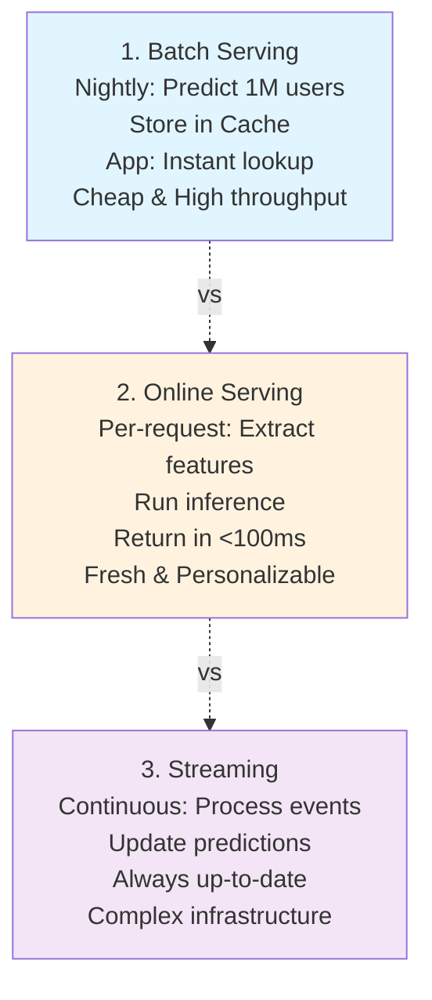

# Model Serving

## TL;DR
Deploy trained models to production infrastructure to serve predictions. Patterns: batch serving (offline, computed in bulk), online serving (real-time, per-request), streaming (continuous updates). Trade-offs: latency vs cost, simplicity vs flexibility.

## Core Intuition
Training produces a model artifact. Serving puts it to work: accept requests, return predictions in sub-second latency, at scale. Model serving is about reliability, speed, and efficiency.

## How It Works

**Serving Patterns:**



**Pattern Details:**

- **Batch Serving:** Run nightly on all users → compute churn scores → store in DB/cache → app queries (instant). Cheap, high throughput, but predictions are stale (24 hours old).
- **Online Serving:** User requests → extract live features → inference → <100ms response. Fresh and personalizable, but expensive (scale with request volume) and requires fast inference.
- **Streaming:** Kafka topics (user actions) → Stream processor (apply model) → update scores. Always up-to-date, handles high volume, but complex infrastructure.

**Serving Frameworks:**

| Framework | Best For | Latency | Throughput |
|-----------|----------|---------|-----------|
| TensorFlow Serving | Large scale, TF models | 10-50ms | 1000+ req/sec |
| TorchServe | PyTorch models | 10-50ms | 1000+ req/sec |
| ONNX Runtime | Any model (via ONNX) | 5-30ms | 1000+ req/sec |
| FastAPI | Custom Python | 5-20ms | 500+ req/sec |
| Seldon Core | Kubernetes native | 10-100ms | 100-1000 req/sec |
| vLLM | LLMs specifically | 20-500ms | 10-100 req/sec (token generation) |

**Architecture Example (Online Serving at Scale):**
```
                    Load Balancer
                        |
          _______________+_______________
         /               |               \
      Replica1        Replica2        Replica3
      (GPU)           (GPU)           (GPU)
        |               |               |
        +-------+-------+-------+-------+
                |
        Feature Store (Cache)
                |
        Database / Redis
```

## Key Properties / Trade-offs

| Aspect | Batch | Online |
|--------|-------|--------|
| Latency | Minutes-hours | <100ms |
| Freshness | Stale | Real-time |
| Cost | Low (compute once) | High (per-request) |
| Scalability | Linear with data | Linear with requests |
| Storage | High (precomputed) | None |
| Personalization | Limited | Full |

**Compute Resource Selection:**
```
CPU:
  - Good for: tree models (XGBoost), simple models
  - Cost: cheap
  - Latency: 10-100ms
  
GPU:
  - Good for: deep learning, large models
  - Cost: expensive
  - Latency: 5-50ms (with good utilization)
  
TPU/Accelerator:
  - Good for: very high throughput (LLMs, large batch)
  - Cost: moderate-high
  - Latency: <10ms for optimized models
```

## Best Practices

- **Match the serving pattern to requirements:** Batch for low-latency-tolerance use cases (off-peak reports), online for <100ms requirements, streaming for continuous updates.
- **Always version models:** Tag with git commit hash. Serve multiple versions in parallel; switch via config (no redeployment needed).
- **Enforce preprocessing parity:** Use identical preprocessing for training and serving. Version preprocessing code with models.
- **Implement comprehensive health checks:** Liveness (is process alive), readiness (is model loaded and responsive), deep health (are all dependencies reachable).
- **Use containerization + orchestration:** Docker containers for reproducibility, Kubernetes for autoscaling and rollback capabilities.
- **Batch requests:** Group inference into batches (32-256) for 10-100x throughput improvement vs. single-request inference.
- **Monitor serving metrics:** Latency, throughput, prediction distribution, error rates. Alert on latency degradation or distribution shift.

## Common Mistakes / Gotchas

- **Training/serving skew:** Model trained differently than served (different preprocessing, libraries). Use same code for both.
- **Feature mismatch:** Features at serving time ≠ features at training. Validate schema.
- **Not handling latency:** Model takes 200ms but SLA is 50ms. Needs optimization (quantization, caching, approximate inference).
- **Cold start:** Model not loaded → first request times out. Preload models, use autoscaling warmup.
- **Resource exhaustion:** No request limiting → requests pile up → system crashes. Add queue, rate limiting, circuit breaker.
- **No versioning:** Can't rollback bad model. Tag versions, serve multiple versions, switch via config.
- **Ignoring dependency versions:** Model trained with TF 2.8, served with TF 2.10 → incompatible. Pin dependencies.
- **Single replica:** One replica dies → 0% availability. Always have redundancy, health checks, failover.

## Code Example

```python
from fastapi import FastAPI, HTTPException
from pydantic import BaseModel
import numpy as np
import joblib
from typing import List

app = FastAPI()

# Load model (once, at startup)
model = joblib.load("model.pkl")  # Trained model
scaler = joblib.load("scaler.pkl")  # Feature scaler

class PredictionRequest(BaseModel):
    features: List[float]  # Input features

class PredictionResponse(BaseModel):
    prediction: float
    confidence: float

@app.on_event("startup")
async def startup():
    """Startup event: validate model is loaded."""
    print("Model loaded successfully")

@app.post("/predict", response_model=PredictionResponse)
async def predict(request: PredictionRequest):
    """Make a prediction for a single request."""
    try:
        # 1. Validate input
        if not request.features or len(request.features) != 10:
            raise HTTPException(status_code=400, detail="Expected 10 features")
        
        # 2. Preprocess (must match training)
        X = np.array(request.features).reshape(1, -1)
        X_scaled = scaler.transform(X)
        
        # 3. Predict
        prediction = model.predict(X_scaled)[0]
        confidence = model.predict_proba(X_scaled)[0].max()
        
        return PredictionResponse(prediction=float(prediction), confidence=float(confidence))
    
    except Exception as e:
        raise HTTPException(status_code=500, detail=f"Prediction failed: {str(e)}")

@app.post("/batch_predict")
async def batch_predict(requests: List[PredictionRequest]):
    """Batch predictions for multiple requests."""
    try:
        # Collect all feature vectors
        X_list = [np.array(req.features) for req in requests]
        X = np.vstack(X_list)
        X_scaled = scaler.transform(X)
        
        # Predict all
        predictions = model.predict(X_scaled)
        confidences = model.predict_proba(X_scaled).max(axis=1)
        
        return [
            PredictionResponse(prediction=float(p), confidence=float(c))
            for p, c in zip(predictions, confidences)
        ]
    except Exception as e:
        raise HTTPException(status_code=500, detail=f"Batch prediction failed: {str(e)}")

@app.get("/health")
async def health():
    """Health check endpoint."""
    return {"status": "healthy"}

# Run: uvicorn app:app --host 0.0.0.0 --port 8000 --workers 4
```

## Interview Q&A

**Q: How do you choose between REST APIs, gRPC, and streaming for model serving?**
A: REST: default choice—simple, widely supported, easy to debug. Use for: low-to-medium throughput, non-binary responses, when clients are diverse (browsers, mobile). gRPC: when performance matters—binary protocol, 3-10x faster serialization. Use for: high-throughput microservice-to-microservice, when client and server are both under your control. Streaming (Server-Sent Events, WebSocket, gRPC streaming): when responses are generated incrementally (LLMs, real-time scores). Match the protocol to actual client needs—gRPC adds complexity that's only worth it above 1000 RPS.

**Q: What health checks should a model serving endpoint implement?**
A: Liveness: is the process running? (Simple HTTP 200) Readiness: is the model loaded and ready to serve? (Run inference on a synthetic sample, check latency < threshold) Startup: has initialization completed? (Separate from readiness to prevent restart loops during model loading). Deep health: are all dependencies (feature store, database) reachable and healthy? Surface readiness and startup to your load balancer; surface deep health to your monitoring dashboard. A pod that fails readiness gets no traffic; a pod that fails liveness gets restarted.

**Q: How do you handle model loading latency in containerized deployments?**
A: Large models (GPT-2, ResNet) can take 30-120 seconds to load into GPU memory. Mitigate: use readiness probes that prevent traffic until loading completes, pre-download model artifacts in the container image (not at runtime), use model artifact caching layers in the container build, implement graceful startup (old pods keep serving while new ones load). For very large models (7B+), consider model serving frameworks that support fast model loading (TensorRT, vLLM) as a first-class feature.

**Q: What are the key trade-offs between single-model serving and multi-model serving on the same infrastructure?**
A: Single model per deployment: isolation (one model's failure doesn't affect others), simple scaling (scale based on one model's load), but higher infrastructure cost when models are underutilized. Multi-model per deployment: lower cost through resource sharing, but requires careful resource isolation and capacity planning. Use multi-model when: models are small and underutilized, models have complementary usage patterns (different peak hours), or cost reduction is critical. Keep them isolated when: models have different SLAs or different update frequencies.

**Q: How do you implement graceful model updates with zero downtime?**
A: Rolling deployment with overlap: bring up new model replicas with the new version, wait for readiness, shift traffic gradually, then terminate old replicas. Blue-green at the load balancer level: instant traffic switch after new deployment is verified. Key requirement: the serving API must be backward compatible (same request/response schema). If schema changes, version your API endpoint (/v1/predict to /v2/predict) and migrate clients independently. Never push breaking changes to a live endpoint without a migration window.

## Interview Quick-Reference

| Question | What to say |
|---|---|
| "Batch vs online?" | Batch: cheap, stale. Online: fresh, expensive. Pick based on latency SLA and personalization needs. |
| "Latency optimization?" | Caching (avoid recompute), quantization (faster inference), approximate inference, early exit (stop if confident). |
| "Scaling?" | Replicas + load balancer for horizontal scale. Use autoscaling based on latency or QPS. |
| "Cold start?" | Preload models at startup. Use orchestration (K8s) to warm up replicas. Set request timeout > inference time. |
| "Training/serving skew?" | Use same preprocessing code. Version dependencies. Test serving code with training data. |
| "Rollback?" | Version all models, serve multiple versions. Switch via config (no redeployment). Always have fallback. |

## Related Topics
- [Online vs Batch Inference](07-online-vs-batch-inference.md) — choosing the right serving pattern
- [Inference Caching](08-inference-caching.md) — speed up serving via caching
- [Request Batching](09-request-batching.md) — optimize throughput
- [Load Balancing](10-load-balancing.md) — distribute requests across replicas
- [A/B Testing](14-ab-testing.md) — compare models in production

## Resources
- [TensorFlow Serving Architecture](https://www.tensorflow.org/tfx/serving/architecture)
- [Model Serving with FastAPI](https://github.com/tiangolo/fastapi/issues/26)
- [Seldon Core: Production ML Model Server](https://www.seldon.io/)
- [vLLM: High-Throughput and Memory-Efficient LLM Serving](https://github.com/lm-sys/vllm)
- [Papers: Clipper (Berkeley), KubeFlow, TFServing](https://www.usenix.org/system/files/nsdi17-crankshaw.pdf)
